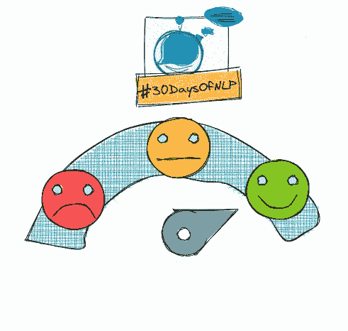

# NLP-第五天:感觉很重要。基本的情感分析

> 原文：<https://medium.com/mlearning-ai/nlp-day-5-feelings-are-important-a-basic-sentiment-analysis-c09cb01a6bf8?source=collection_archive---------1----------------------->

## # 30 日

## 情感分析有两种方式:基于规则和数据驱动

Basic Sentiment Analysis #30DaysOfNLP [Image by Author]

[**在上一篇**](/mlearning-ai/nlp-day-4-normalizing-your-vocabulary-might-be-a-bad-idea-ffdf8aaecc72) 中，我们完成了词汇的构建。

我们不仅学习了如何提取有意义的记号，还学习了如何规范化它们。现在，是时候应用我们的新技能了。