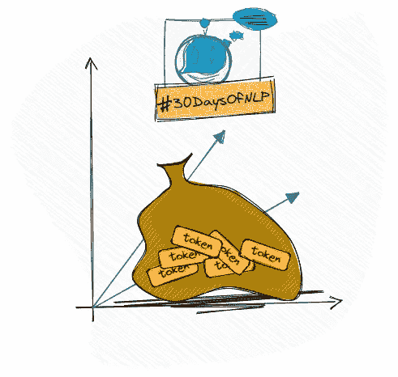

# NLP-第六天:不要忘记你的单词袋

> 原文：<https://medium.com/mlearning-ai/nlp-day-6-dont-forget-your-bag-of-words-80286c12e26e?source=collection_archive---------1----------------------->

## # 30 日

## 术语频率、向量化和向量空间

Bag-Of-Words #30DaysOfNLP [Image by Author]

[**在上一篇文章**](/mlearning-ai/nlp-day-5-feelings-are-important-a-basic-sentiment-analysis-c09cb01a6bf8) 中，我们使用了我们的预处理知识来从文本中提取有意义的标记。我们保留了这些标记，并以两种方式进行了简单的情感分析。