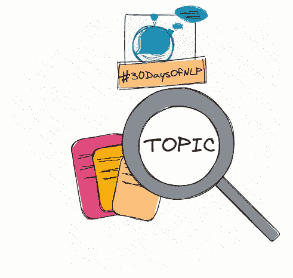

# NLP-第 7 天:使用 TF-IDF 进行主题建模

> 原文：<https://medium.com/mlearning-ai/nlp-day-7-your-story-your-topic-your-tf-idf-7c06c9c1196a?source=collection_archive---------0----------------------->

## # 30 日

## 从头开始实现一个术语频率反向文档频率矢量器。

Topic Modelling #30DaysOfNLP [Image by Author]

[**昨天**](/mlearning-ai/nlp-day-6-dont-forget-your-bag-of-words-80286c12e26e) ，我们通过创建一个包含标准化术语频率的词包来改进文本的数字表示。我们还对我们的频率字典进行了矢量化，允许我们执行更多的…