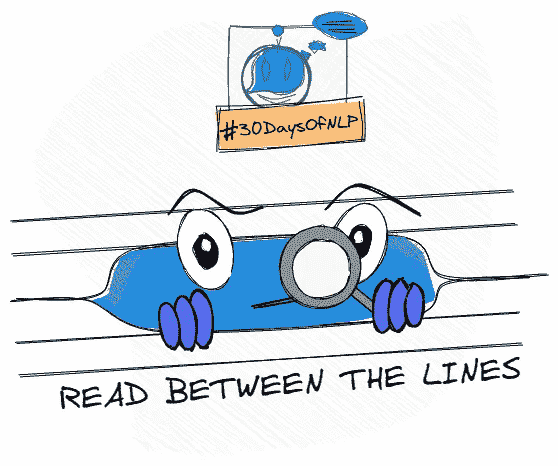

# NLP-第 8 天:如何理解字里行间的含义——LSA 主题建模。

> 原文：<https://medium.com/mlearning-ai/nlp-day-8-how-to-read-between-the-lines-topic-modeling-with-lsa-bded99c53be1?source=collection_archive---------1----------------------->

## # 30 日

## 潜在语义分析导论

Read between the lines #30DaysOfNLP [Image by Author]

[**在上一篇文章**](/mlearning-ai/nlp-day-7-your-story-your-topic-your-tf-idf-7c06c9c1196a) 中，我们谈到了术语频率-逆文档频率(TF-IDF)的主题。我们甚至从头开始实现了一个 TD-IDF 矢量器。我们了解了 TF-IDF 向量或矩阵如何帮助我们估计…