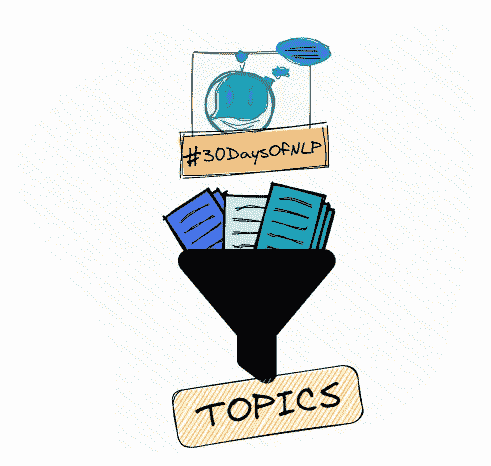

# NLP-第 9 天:用 PCA 进行潜在语义分析

> 原文：<https://medium.com/mlearning-ai/nlp-day-9-performing-latent-semantic-analysis-with-pca-4d360621e5cd?source=collection_archive---------2----------------------->

## # 30 日

## 如何创建和理解主题向量？

LSA with PCA #30DaysOfNLP [Image by Author]

[**在上一篇**](/@marvinlanhenke/nlp-day-8-how-to-read-between-the-lines-topic-modeling-with-lsa-bded99c53be1) 中，我们介绍了潜在语义分析的理论概念，并快速了解了它的亲戚。LDA 和 LDiA。

现在，我们实际一点。