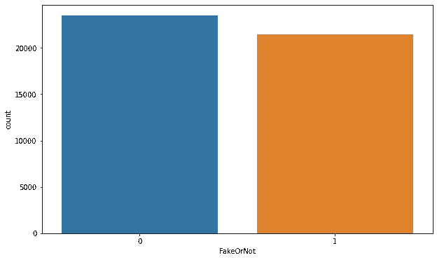

# NLP——检测社交媒体上的假新闻

> 原文：<https://medium.com/mlearning-ai/nlp-detecting-fake-news-on-social-media-aa53ff74f2ff?source=collection_archive---------0----------------------->

## 实现和比较单词袋和 TF IDF 以建立检测假新闻的模型

Photo by [Matthew Guay](https://unsplash.com/@maguay?utm_source=medium&utm_medium=referral) on [Unsplash](https://unsplash.com?utm_source=medium&utm_medium=referral)

万维网的出现和社交媒体平台(如脸书和推特)的迅速采用为人类历史上前所未有的信息传播铺平了道路。随着当前社交媒体平台的使用，消费者正在创造和分享比以往任何时候都多的信息，其中一些信息具有误导性，与现实无关。

下面的程序有助于以编程方式识别此类新闻文章是否是假的。让我们首先了解我用来建立模型的两种特征提取技术——

*   单词包(BOW)
    **简单来说，它是一个单词的集合，用单词数来表示一个句子，并且大多不考虑它们出现的顺序。**这可以通过一个例子得到更好的解释。请按照下面的样子更好地理解这一点。

 [## 单词包的介绍以及如何用 Python 为 NLP 编写单词包

### 作者 Praveen Dubey 介绍了单词包以及如何用 Python 为 NLPWhite 和 black scrabble tiles 编写单词包…

www.freecodecamp.org](https://www.freecodecamp.org/news/an-introduction-to-bag-of-words-and-how-to-code-it-in-python-for-nlp-282e87a9da04/) 

*   TF - IDF
    TF-IDF 是一种统计度量，用于评估一个单词与文档集合中的一个文档的相关程度。这是通过将两个度量相乘来实现的:一个单词在一个文档中出现的次数，以及该单词在一组文档中的逆文档频率。你可以在这里了解更多

 [## 什么是 TF-IDF？

### TF-IDF 是一种统计度量，用于评估单词与文档集合中的文档的相关程度。这个…

monkeylearn.com](https://monkeylearn.com/blog/what-is-tf-idf/#:~:text=TF%2DIDF%20is%20a%20statistical,across%20a%20set%20of%20documents) 

# 目录

1.  [关于数据集](#d7e7)
2.  [数据预处理](#2778)
3.  [探索数据分析](#ad2d)
4.  [自然语言处理](#a0ec)
5.  [培训和验证(文字袋& TF IDF)](#e6ca)
6.  [总结](#9644)
7.  [未来工作](#5250)
8.  [参考文献](#f2ab)

# №1:关于数据集

训练和测试集中的每个样本都有以下信息:

*   新文章的标题。
*   每个标题下的新文章的正文。
*   新闻文章的主题。
*   新文章的日期

我预测一个给定的新闻是否是一个真实的新闻。如果是，预测一个 1。如果没有，预测 0。

数据集可以从 [Kaggle](https://www.kaggle.com/clmentbisaillon/fake-and-real-news-dataset) 访问。

# №2:数据预处理

导入所有必需的库

从 Kaggle 下载数据集

访问少量样本记录

# №3:探索数据分析

因此，现在我们将通过探索性数据分析，从新闻文章中获得见解。我们的目的是将本次会议分成几个主题，以便我们可以探索每个主题的图形。

## 标签分发

下载的数据集的大小

我们在两个数据集中各添加一列，以识别真假新文章。我们用 1 表示真实新闻，用 0 表示虚假新闻

现在，我们将两个单独的数据集结合起来，这样我们就可以分析完整的数据集

由于我们正在运行新闻标题的分析，因此不需要剩余的列。

标签似乎分布均匀。这是一个好迹象，证实了数据集没有偏差。

# №4:自然语言处理

## 清理、格式化和词汇化

在处理文本之前，让我们检查是否有任何行/列有空值

让我们现在删除所有的字符串标点符号(如！"#$%&'()*+,-./:;<=>？@[\]^_`{|}~)，我们可以通过简单地保留[A-Z]和[a-z]中的工作，并用空格替换其余的单词来实现这一点。

此外，让我们降低所有的文本，以便在应用词干化/词尾化时，大写拼写的单词与小写字母拼写的单词不会被区别对待。

我们应用停用词来安全地忽略无意义的词，而不牺牲句子的意义。

最后，我们实现了将单词转换为其基本形式的词汇化。

# №5:培训和验证(词汇袋和 TF IDF)

我们将数据分为训练集和验证集

## 使用 Sklearn(单词袋)应用 ML 模型

多项式模型更适合于处理使用单词包提取的文本相关特征

## 评估结果(单词袋)

我们编写下面的函数来构建混淆矩阵可视化。

## 实现超参数化(文字袋)

超参数多项式分类器

使用单词包，我们达到了 81%的最高准确率

## 实施 TF-IDF

在先前提取的语料库中实现 TFIDF

## 使用 SKlearn 应用 ML 模型并评估结果(TF IDF)

## 实现超参数化(Tf IDF)

超参数多项式分类器

使用 TF IDF，我们能够达到 93 %的准确率..太好了！！！

# №6:摘要

*   我们从 Kaggle 下载了假新闻数据集。
*   我们执行了 NLP 预处理和 EDA 来理解标签分布。
*   我们使用单词袋和 TF IDF 来训练模型。
*   实现超参数以获得最大精度。
*   我们分析了准确率，对于 TFIDF 我们达到了 **93%** 的准确率，对于词袋是 **80%** 的准确率，结论是 TF IDF 比词袋表现得更好。

# №7:未来的工作

虽然我们是从笔记本开始的，但我们的分析还有许多进一步发展的可能性。

*   尝试实现 Word2Vec 以进一步提高准确性。
*   实施技术，如 LSTM，并评估结果。
*   建立一个神经网络并检查性能

# 8 号:参考文献

*   [https://www.youtube.com/watch?v=MO5n5JaRotc&list = plzotaelrmxvmdj 5 sqbck 2 lim 0 hhqvwnzm&index = 13&ab _ channel = KrishNaikKrishNaikVerified](https://jovian.ai/outlink?url=https%3A%2F%2Fwww.youtube.com%2Fwatch%3Fv%3DMO5n5JaRotc%26list%3DPLZoTAELRMXVMdJ5sqbCK2LiM0HhQVWNzm%26index%3D13%26ab_channel%3DKrishNaikKrishNaikVerified)
*   https://www.youtube.com/watch?v=E9gVleivB6M&list = plzotaelrmxvmdj 5 sqbck 2 lim 0 hhqvwnzm&index = 14&ab _ channel = KrishNaikKrishNaikVerified
*   [https://github . com/krishnaik 06/Fake-News-Classifier/blob/master/Fake News Classifier tfi df . ipynb](https://jovian.ai/outlink?url=https%3A%2F%2Fgithub.com%2Fkrishnaik06%2FFake-News-Classifier%2Fblob%2Fmaster%2FFakeNewsClassifier%2520TFIDF.ipynb)
*   [https://github . com/krishnaik 06/Fake-News-Classifier/blob/master/FakeNewsCount _ vectorizer . ipynb](https://jovian.ai/outlink?url=https%3A%2F%2Fgithub.com%2Fkrishnaik06%2FFake-News-Classifier%2Fblob%2Fmaster%2FFakeNewsCount_vectorizer.ipynb)
*   [https://www . ka ggle . com/clmentbisaillon/fake-and-real-news-dataset](https://www.kaggle.com/clmentbisaillon/fake-and-real-news-dataset)

我真的希望你们能从这篇文章中学到一些东西。随意👏如果你喜欢你所学的。如果有什么需要我帮忙的，请告诉我。

快乐学习😃