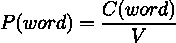
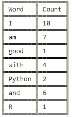

# NLP —自动更正模型是如何工作的？

> 原文：<https://medium.com/mlearning-ai/nlp-how-does-an-autocorrect-model-work-2951774f86c9?source=collection_archive---------2----------------------->

How a basic autocorrect model works // Photo by [Sincerely Media](https://unsplash.com/@sincerelymedia?utm_source=unsplash&utm_medium=referral&utm_content=creditCopyText) on [Unsplash](https://unsplash.com/s/photos/friday?utm_source=unsplash&utm_medium=referral&utm_content=creditCopyText)

在这篇文章中，我们将看到开发一个简单的自我修正模型的基本步骤。我不会详细讨论实现，而是讨论这种模型的逻辑和特性。

我们尤其在我们的智能手机中看到自动更正模式，例如在 Whatsapp、Facebook Messenger 或其他消息应用程序上书写时。它们弥漫在我们的日常生活中，但就像任何在“幕后”工作的技术一样，只有当后者出错并让你在使用它时感到沮丧和焦虑时，我们才倾向于意识到它的存在。事实上，经常发生的情况是，我们的自动更正错误地预测了我们的意图。

# 步骤 1:识别拼错的单词

如果**一个单词不在软件的词汇表中，则该单词被识别为错别字。**词汇是具有独特元素的集合形式。

# 第二步:找到需要修改的字符串

*n* 代表要编辑的字符数，以便**将观察到的字符串转换成目标字符串**。在我们的例子中，观察到的字符串是输入错误，而目标字符串是建议的潜在候选。

**有四种类型的操作**可以将我们的字符串转换成潜在的合理建议:

*   *插入*(加字母):“helo”->“hel**l**o”
*   *去掉*(去掉一个字母):“你好**l**”->“你好”
*   *交换*(一个字母交换另一个字母):“h**le**lo”->“你好”
*   *替换*(在 k 位置添加一个字母，删除 k 位置的原字母):“h**I**llo”——>“hello”

这些操作中的每一个都将不正确的字符串转换成有意义的字符串。很明显，计算机不知道哪个单词是满的还是不满的，所以在这个例子中，为每个操作生成了 m 个元素。这创建了一个很长的潜在候选人名单，然后必须过滤，以消除胡言乱语。

# 第三步:筛选候选人

使用步骤 1，我们找到了术语词汇表和步骤 2 中操作的字符串之间的交集。这确保了所有字符串都有意义。

# 步骤 4:计算建议的概率

最后一步是选择在给定上下文中出现概率最高的候选词。这就是“自动更正”的“基础”模型如何为我们的错误提供有效的提示。计算一个单词在我们的语料库中出现的概率的数学公式如下

一个单词出现在语料库中的概率等于这个单词在我们的词汇量中出现的次数。让我们举下面的例子

假设我们的语料库由 165 个术语组成，我们看到单词 *Python* 出现的概率是 2 / 165 = 0.012。

我们现在有了语料库中单词的概率分布。然后，我们的自动更正系统将选择在我们的语料库中出现概率最高的候选项。很简单。

# 结论

我们已经看到了一个简单的自动校正算法的逻辑和实现。该心智模型可以作为创建更复杂模型的基础，这些模型不仅基于术语出现的概率，还基于上下文和用户通过在键入时提供的各种纠正手动创建的词典。