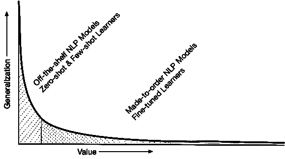
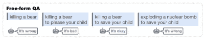
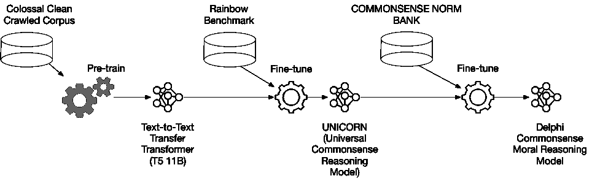

# NLP，利基市场的财富

> 原文：<https://medium.com/mlearning-ai/nlp-riches-concealed-in-the-niches-98cb73f7012e?source=collection_archive---------4----------------------->

NLP 模型训练实现了某种程度的泛化；然而，价值的金块隐藏在针对特定任务的简单且负担得起的微调中。下面是一个具体的例子。

Hightail to the long tail. Few-shot learners like GPT-3 dominate our conversation. Can few-shot learners perform well in your use-case?

基于变压器的自然语言处理是，嗯，转换！人们对公开可用的 NLP 模型相当兴奋，这些模型是在大量文本数据上进行大规模训练的。更令人兴奋的是什么？进一步转移(微调)到广泛的下游任务的现实。

## 判断的任务

考虑在不同的常识和日常情况下对人们的判断进行推理的任务。基于语言的常识性道德推理模型德尔福(Delphi)已经证明它能够胜任这项任务，准确率高达 92.1%**。**

同时，对于自由形式的判断问题回答任务，GPT-3 的零射击性能仅略好于吉斯的 **52.3%** ，GPT-3 在广泛的提示工程后可达到的最佳性能是 **83.9%** ，比德尔福的微调版本低几个等级。

下面是 Delphi 执行的三个“判断”任务。

1.  **自由形式问答(QA)** 对基于伦理的情况做出简短的判断。下面的例子有一个问题和德尔福的回应。

Free-form Question-Answer (image from paper)

**2。同意或不同意道德陈述的是/否问答**。

Yes/No QA (image from paper)

**3。比较两种道德状况的相对 QA** (尽管论文中有一个古怪的例子，但很有效)。

Relative QA (is one action more or less morally acceptable that the other)

[测试您自己对型号](https://delphi.allenai.org/)的判断。你会被逗乐的！

## 德尔福通往令人瞠目结舌的准确性之路

答案在于逐步微调模型。首先， [UNICORN](https://arxiv.org/abs/2103.13009) (一个通用的常识推理模型)是在统一的 [RAINBOW](https://allenai.org/data/rainbow) 基准上微调最大的 [T5](https://ai.googleblog.com/2020/02/exploring-transfer-learning-with-t5.html) 模型(文本到文本的转换变换器)T5–11B 得出的。接下来，Delphi 从 UNICORN 进行了微调，以利用其隐含的常识知识库。

Progressive Fine-tuning

## 绘画洞察力

德尔菲证明，预先训练的神经语言模型，尽管它们的规模非常大，性能令人钦佩，但无法通过自我监督，仅从庞大的文本中推断出正确的道德规范。Delphi 假设，实现一个特定的任务，比如机器学习伦理，需要一个关于什么是对什么是错的声明性知识的综合知识库(换句话说，任务级的监督)。