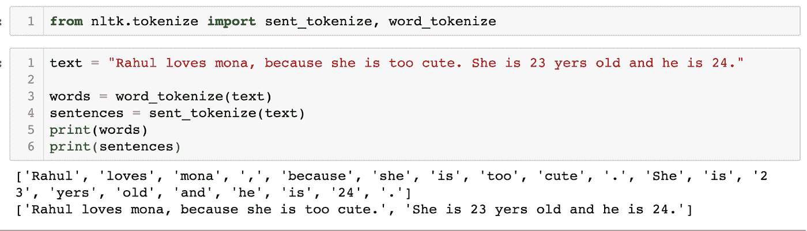

# 自然语言处理-文本处理(第一部分)

> 原文：<https://medium.com/mlearning-ai/nlp-text-processing-part-1-c3bce154d9ba?source=collection_archive---------7----------------------->

## 标记化

我们看到了机器学习用例，其中我们有数据(由特征或一个目标组成)，但在 NLP 中，数据将只是文本。所以我们需要把它转换成一些数字结构，我们称之为向量。例如

*   在亚马逊，人们写关于产品的评论，因此分类将是一个用例。
*   Gmail 垃圾邮件分类器

在深入之前，我们需要了解一些单词及其含义:

**语料库**:正文(单数)，语料库(复数)

**令牌**:每个“实体”都是根据规则分割出来的东西的一部分。如果我们把段落分成单词，记号就是单词；如果我们把段落分成句子，记号就是句子。

**停用词**:停用词是一个常用词(如“the”、“A”、“an”、“in”)，搜索引擎在为搜索条目编制索引时和作为查询结果检索它们时都会将其忽略。

# 文本处理

文本处理是自然语言处理的第一步，我们在把它交给模型之前做一些预处理。文本内处理流程如下

*   **标记化:**标记化基本上就是把文本拆分成单词或者句子。用普通的话来说，我们可以说它将把大文本转换成称为标记的小文本或单词。这些将是独特的单词/句子。

word_tokenize 将有助于将文本标记为单词。这需要“.”或任何其他字符作为不同的单词
sent_tokenize 将有助于将文本标记成句子。

两者都将返回单词/句子列表

例如

 [## Mlearning.ai 提交建议

### 如何成为 Mlearning.ai 上的作家

medium.com](/mlearning-ai/mlearning-ai-submission-suggestions-b51e2b130bfb)