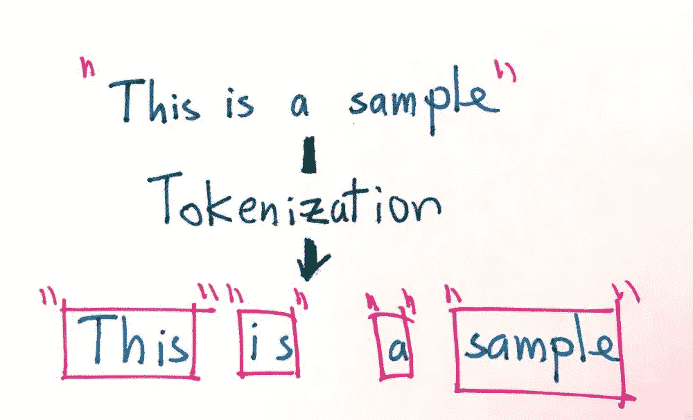
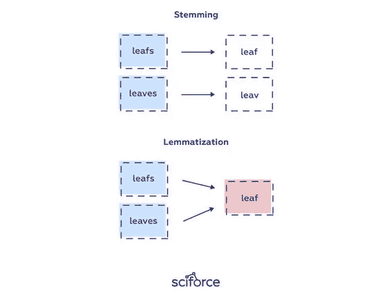
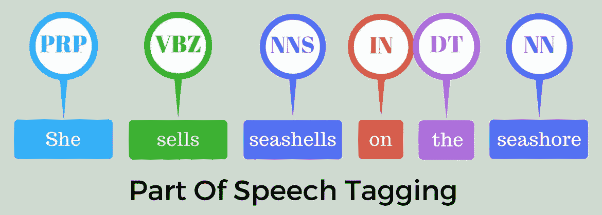

# 自然语言处理:标记化、词干化、词条化和词性标注

> 原文：<https://medium.com/mlearning-ai/nlp-tokenization-stemming-lemmatization-and-part-of-speech-tagging-9088ac068768?source=collection_archive---------0----------------------->

在这篇博文中，我将讨论自然语言处理过程中经常使用的标记化、词干化、词汇化和词性标注。我们将通过应用程序来强化它们，从而了解如何使用它们。令人愉快的读物。

Resource: [https://www.asksid.ai/resources/what-is-natural-language-processing/](https://www.asksid.ai/resources/what-is-natural-language-processing/)

## 标记化

`Tokenization`是将自然语言处理中给定的文本分解成一个句子中最小单位称为记号的过程。标点符号、单词和数字可以被认为是记号。那么我们为什么需要`Tokenization`？我们可能希望通过将给定的文本划分为记号来找到单词在整个文本中的出现频率。然后，可以在这些频率上制作模型。或者，我们可能希望按单词类型标记标记。我将在解释词性标注时提到这一点。

Resource: [https://medium.com/data-science-in-your-pocket/tokenization-algorithms-in-natural-language-processing-nlp-1fceab8454af](/data-science-in-your-pocket/tokenization-algorithms-in-natural-language-processing-nlp-1fceab8454af)

我们来做一个令牌化的应用。我们将通过将它应用于两个不同的库来研究标记化过程。首先，让我们以`TextBlob`图书馆为例。首先，我们需要下载库。

下载完库并导入后，我们来定义一个文本。

为了进行标记化，我们可以通过从 TextBlob 对象调用单词来访问标记。结果，你会看到我们的文本被分配给了如下的标记。

正如你所看到的，我们能够很简单地把它分成令牌。让我们用`NLTK (Natural Language Toolkit)`库来做这件事。

如您所见，我们已经从 NLTK 库中调用了 word_tokenize 和 sent_tokenize 对象。有了`sent_tokenize`，我们就能把文本分成句子。我们用`word_tokenize`把它拆分成相同的文本单词。

> `sent_tokenize` 函数使用来自`nltk.tokenize.punkt module`的一个`PunktSentenceTokenizer`实例，它已经被训练过，因此非常清楚地知道在什么字符和标点符号处标记句子的结束和开始。

> `word_tokenize()`函数是一个包装函数，在`TreebankWordTokenizer class`的实例上调用 tokenize()。

因此，我们可以用两个不同的库，以一种非常实用的方式来拆分成令牌。

Resource: [https://tr.pinterest.com/pin/706854104005417976/](https://tr.pinterest.com/pin/706854104005417976/)

## 堵塞物

***词干化*** 就是寻找词根的过程。让我们检查一下关于这一点的定义。

> 词干处理无疑是这两种方法中较简单的一种。有了词干，单词就简化成了词干。词干不必与基于词典的词根是同一个词根，它只是等于或小于单词的形式。

当你用词干分解单词时，你有时会发现寻找词根是错误和荒谬的。因为词干处理是基于规则的，它根据一定的规则来删除单词中的后缀。这揭示了词干的不一致性。转向过度和转向不足。

***过度截断*** 发生在单词被过度截断的时候。在这种情况下，这个词的意思可能被扭曲或没有意义。

***理解错误*** 发生在两个单词源于同一个词根而不是不同词干的时候。

我们将使用两种不同的算法来检查词干提取示例。

*   波特·斯特梅尔(算法详情在此[链接](https://vijinimallawaarachchi.com/2017/05/09/porter-stemming-algorithm/)。)
*   雪球斯特梅尔(算法详情在此[链接](https://snowballstem.org/algorithms/porter/stemmer.html)。)

首先，让我们导入`PorterStemmer`。

然后，让我们定义一个`ps`对象，它将实现 PorterStemmer。将单词定义为词干后，剩下的工作就是运行代码。

让我们用 SnowballStemmer 做一个类似的过程。为此，我们确实进口了雪球去茎机。

然后，我们定义词干分析器对象。在这里，除了 PorterStemmer，我们还可以选择在 SnowballStemmer 中使用哪种语言。

## 词汇化

词汇化是在字典中找到相关单词的形式的过程。它不同于词干。它需要比词干提取更长的计算过程。让我们检查一下关于这一点的定义。

> 像词干化一样，词干化的目的是将屈折形式简化为一个共同的基本形式。与词干化相反，词汇化并不简单地砍掉词形变化。相反，它使用词汇知识库来获得单词的正确基本形式。
> 
> `NLTK`提供了`WordNetLemmatizer`类，它是`wordnet`语料库的一个薄薄的包装。这个类使用`morphy()`函数对`WordNet CorpusReader`类查找一个`lemma`。

首先，让我们导入 NLTK 和 WordNetLemmatizer。

让我们看看 lemmatizer 在一个单词中是如何工作的。

然后我们有一个文本。让我们先把这段文字分解成记号。然后让我们对这些令牌逐个应用 lemmatizer。

在 Lemmatizer 的第一个例子中，我们使用了 NLTK 库中的 WordNet Lemmatizer。让我们用 TextBlob 做类似的操作。结果，我们会达到相似的结果。

当我们对单词 ***【条纹】*** 应用***【lemmatize】***过程时，它删除了***【s】***后缀，到达单词 ***【条纹】*** ，这是该单词的字典形式。现在让我们在一个句子上做同样的事情。

因此，我们研究了“词汇化”过程是如何用两个不同的库在两个句子和一个单词上实现的。

## 词性标注

词性标注是根据词类(名词、形容词、副词、动词等)对文本中的词进行标注。).让我们看看它在一个定义中是如何解释的。

Resource: [https://blog.aaronccwong.com/2019/building-a-bigram-hidden-markov-model-for-part-of-speech-tagging/](https://blog.aaronccwong.com/2019/building-a-bigram-hidden-markov-model-for-part-of-speech-tagging/)

> 这是一个将句子转换成形式的过程——单词列表、元组列表(其中每个元组都有一个形式*(单词，标签)*)。的标记是词性标记，表示这个词是名词、形容词还是动词等等。

让我们用例子来检查一下最常用的标签。

*   丹尼尔，伦敦，桌子，狗，老师，钢笔，城市，幸福，希望
*   动词(V)-去，说，跑，吃，玩，生活，走路，有，喜欢，是，是
*   形容词(ADJ)-大，快乐，绿色，年轻，有趣，疯狂，三
*   副词(ADV)-慢慢地，悄悄地，非常，总是，从不，太，嗯，明天
*   介词(P)-在，在，在，从，与，近，之间，大约，在
*   连词(CON)- and，or，but，因为，所以，然而，除非，既然，如果
*   代词(亲)-我，你，我们，他们，他，她，它，我，我们，他们，他，她，这个
*   感叹词(INT)-哎哟！哇！太好了！救命啊！哦！嘿！嗨！

***那么，词性标注是如何工作的呢？***

> 词性标注是一种监督学习解决方案，它使用的功能包括上一个单词、下一个单词、首字母大写等。NLTK 有一个获取 pos 标签的函数，它在标记化过程之后工作。

让我们用一个应用来理解词性标注。让我们导入 NLTK 库和 word_tokenize 对象。在应用这个的时候，我们首先需要把一个句子拆分成记号。标记在拆分为令牌后生效。

在将句子中的单词分成标记之后，我们应用了词性标注过程。例如，单词“the”的标签是“DT”。“feet”一词已被标为“NNS”。您可以查看这个[链接](https://www.ling.upenn.edu/courses/Fall_2003/ling001/penn_treebank_pos.html)来详细研究这些标签是什么。

谢谢你看我的博客。您对内容的建议和反馈对我来说非常重要。你可以通过评论来表明你的想法。祝大家快乐！

 [## Mlearning.ai 提交建议

### 如何成为 Mlearning.ai 上的作家

medium.com](/mlearning-ai/mlearning-ai-submission-suggestions-b51e2b130bfb) 

## 资源

1.  [https://www . geeks forgeeks . org/NLP-词性-默认-标记/](https://www.geeksforgeeks.org/nlp-part-of-speech-default-tagging/)
2.  [https://pythonexamples.org/nltk-tokenization/](https://pythonexamples.org/nltk-tokenization/)
3.  [https://towards data science . com/初学者词性标注-3a0754b2ebba](https://towardsdatascience.com/part-of-speech-tagging-for-beginners-3a0754b2ebba)
4.  [https://www . machine learning plus . com/NLP/lemma tization-examples-python/](https://www.machinelearningplus.com/nlp/lemmatization-examples-python/)
5.  [https://www.geeksforgeeks.org/introduction-to-stemming/](https://www.geeksforgeeks.org/introduction-to-stemming/)
6.  [https://www . geeks forgeeks . org/python-nltk-nltk-token izer-word _ token ize/](https://www.geeksforgeeks.org/python-nltk-nltk-tokenizer-word_tokenize/)
7.  [https://medium . com/@ gian Paul . r/token ization-and-part-of-speech-pos-tagging-in-python-nltk-library-2d 30 f 70 af 13b](/@gianpaul.r/tokenization-and-parts-of-speech-pos-tagging-in-pythons-nltk-library-2d30f70af13b)
8.  [https://www . geeks forgeeks . org/NLP-how-tokenizing-text-sentence-words-works/](https://www.geeksforgeeks.org/nlp-how-tokenizing-text-sentence-words-works/)
9.  [https://www.geeksforgeeks.org/introduction-to-stemming/](https://www.geeksforgeeks.org/introduction-to-stemming/)
10.  [https://towards data science . com/stemming-lemma tization-what-ba 782 b 7 c 0 BD 8](https://towardsdatascience.com/stemming-lemmatization-what-ba782b7c0bd8)
11.  [https://medium . com/@ data monsters/text-preprocessing-in-python-steps-tools-and-examples-BF 025 f 872908](/@datamonsters/text-preprocessing-in-python-steps-tools-and-examples-bf025f872908)
12.  [https://www . tutorialspoint . com/natural _ language _ toolkit/natural _ language _ toolkit _ stemming _ lemma tization . htm](https://www.tutorialspoint.com/natural_language_toolkit/natural_language_toolkit_stemming_lemmatization.htm)
13.  [https://www . geeks forgeeks . org/NLP-词性-默认-标记/](https://www.geeksforgeeks.org/nlp-part-of-speech-default-tagging/)
14.  [https://medium . com/grey atom/learning-pos-tagging-chunking-in-NLP-85 F7 f 811 A8 CB](/greyatom/learning-pos-tagging-chunking-in-nlp-85f7f811a8cb)