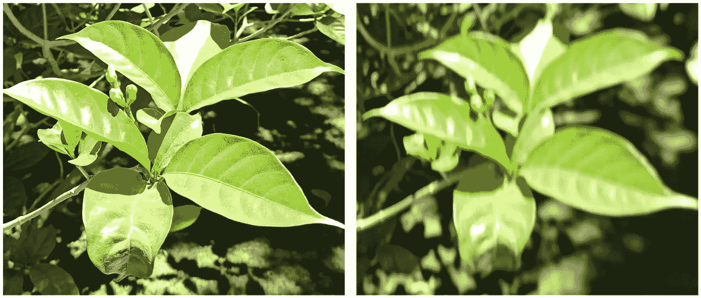

# 无参考图像质量评估

> 原文：<https://medium.com/mlearning-ai/no-reference-image-quality-assessment-d793afee8fb4?source=collection_archive---------7----------------------->

图像质量评估(IQA)是对图像质量进行测量的任务。在许多情况下，IQA 可以提供一个重要的工具，例如从任何数据集中筛选低质量的图像，获得一个度量来比较压缩和重建任务或预处理等等。数据集规模的增长使得 IQA 变得越来越重要，因为手动质量评估变得更加不可能。

# **IQA 的注解**

在深入研究 IQA 方法之前，要讨论的一个重要前提是图像质量的注释。这里有两类:主观和客观。

**主观**测量是基于真实的人的主观意见。它们天生就具有高度可变性。考虑到这一点，通常的做法是获得多个注释者，并对他们的决策进行平均。这里最常见的衡量方法分为评级和排名。**评级**要求注释者在 1 到 5 的范围内对图像进行评级，而**排名**是相对进行的，这意味着注释者被要求对一组图像进行排序，例如，从最好到最差。要获得这样的注释，可以使用 AWS sage maker Mechanical Turk tools 和 workforce 等工具。

客观测量是 IQA 的目标(而主观测量是创造客观测量的工具)。对 NR-IQA 的客观测量是以各种方法获得的，但是总的管道是非常相似的，包括特征提取和由 AI\ML 提供的分数。

# **IQA 子类**

IQA 通常被细分为:
全参照 IQA (FR-IQA)、简化参照 IQA (RR-IQA)和无参照 IQA (NR-IQA)。

对于 **FR-IQA** 用户必须拥有原始的“全质量”图像和经过压缩或篡改的图像版本。这使得能够在两者之间进行比较，以获得相对分数。

在 **RR-IQA** 中，只有原始图像的一些表示是可用的，例如特征向量。这种表示用于与图像的降级版本进行比较。FR 和 RR IQA 的示例用例包括检查压缩如何影响图像质量、重建管道的表现如何等等。这几类方法的优秀奖有 [PSNR](https://www.ni.com/en-il/innovations/white-papers/11/peak-signal-to-noise-ratio-as-an-image-quality-metric.html#:~:text=The%20term%20peak%20signal%2Dto,the%20quality%20of%20its%20representation.) 和 [SSIM](/srm-mic/all-about-structural-similarity-index-ssim-theory-code-in-pytorch-6551b455541e) 。

本文重点讨论 **NR-IQA** ，这是没有原始图像信息的情况，在某些情况下甚至没有这样的图像。例如，如果我们想要筛选非常模糊的图像，而模糊是在获取图像时发生的，比如相机本身或照片中的对象在拍照时正在移动。

Image in focus (on the left) and a blurred image due to movement of the camera during the time the image was taken (on the right)

对 NR-IQA 的客观测量是以各种方法获得的，但是总的管道是非常相似的，包括特征提取和由 AI\ML 提供的分数。“分数”可以是分成*好*或*差*的二元分类，分成 1 到 5 ( *不可用、差、可接受、好、好*)的更大范围的分类，或者是在一定范围内的连续分数。这种管道既适用于简单的单一特征质量评估，也适用于更复杂的大量特征。在简单的情况下——假设我们只想检查图像的模糊程度，我们使用一种算法来提供图像模糊程度的信息，例如 [**Var-Lap**](https://pyimagesearch.com/2015/09/07/blur-detection-with-opencv/#:~:text=We%20implemented%20the%20variance%20of,operator%20and%20compute%20the%20variance.) 作为度量。在这种情况下，我们仍然需要为 Var-Lap 输出确定一个阈值来对我们的图像进行分类。该阈值必须针对每个特定任务进行调整，因为结果会因图像类型而异。深度学习(DL)模型也被应用于这项任务，包括模型本身的特征提取。通常，DL 模型适用于 FR-IQA 任务。DeepQA 是这种模型的一个很好的例子。

# **实际 NR-IQA 方法和工具:**

**BRISQUE** 是 NR-IQA 最常用的方法之一。它只使用空间特征(没有任何频域特征)。这种方法以更全面的方式来看待图像质量，这意味着它为整个图像质量提供了一个单一的分数，而不是每个图像质量类别的子分数。关于 BRISQUE 和 OpenCV 植入的深入解释可以在[这里](https://learnopencv.com/image-quality-assessment-brisque/)找到。和 BRISQUE 类似的方法还有 **PIQE** 和 **NIQE** 。三者的 MathWorks 比较可以在[这里](https://www.mathworks.com/help/images/compare-no-reference-image-quality-metrics.html)找到。每一个都可以提供一个相对快速&简单的“现成”解决方案，只需要调整一个阈值。

其他方法收集特征，每个特征专门用于图像质量方面的特定区分，例如模糊、噪声、块状\像素化等。这些然后被收集并提供给 ML 模型来学习，而不是每个图像的图像质量的注释。这个过程需要更多的发展和思考，但它可以适合任何特定的子任务。例如，如果在一个特定的项目中，只有模糊和块状是重要的，而噪声是不重要的。与“现成的”一般 IQA 方法(如 BRISQUE)相比，具有手工挑选特征的定制 ML 模型有望获得更好的结果。

 [## Mlearning.ai 提交建议

### 如何成为 Mlearning.ai 上的作家

medium.com](/mlearning-ai/mlearning-ai-submission-suggestions-b51e2b130bfb)