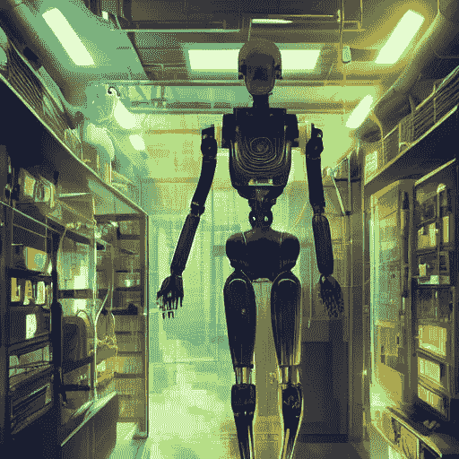
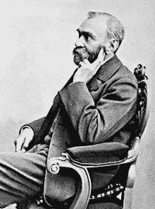
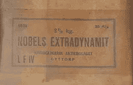
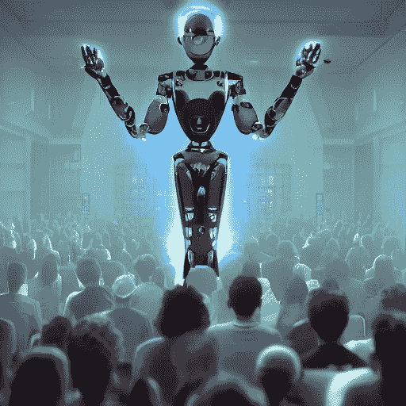
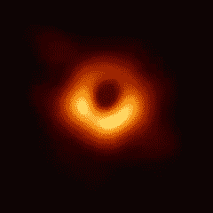
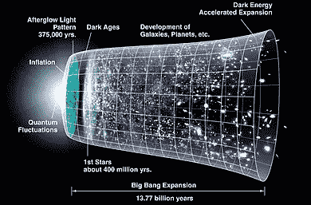
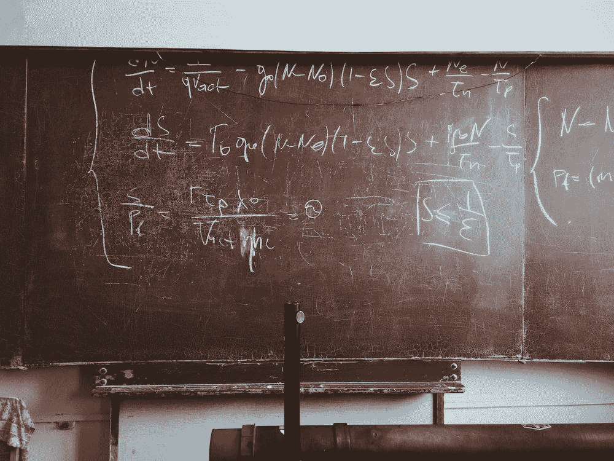
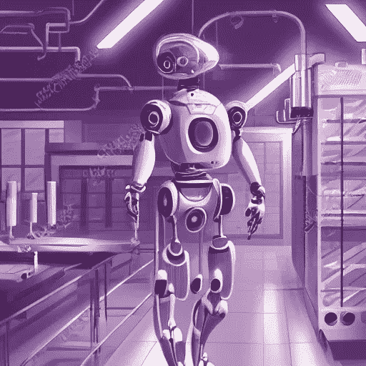
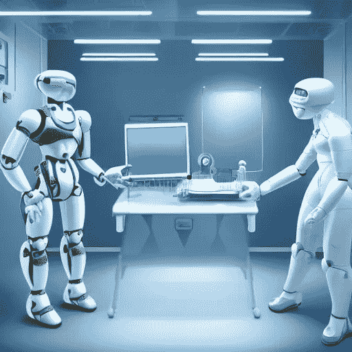
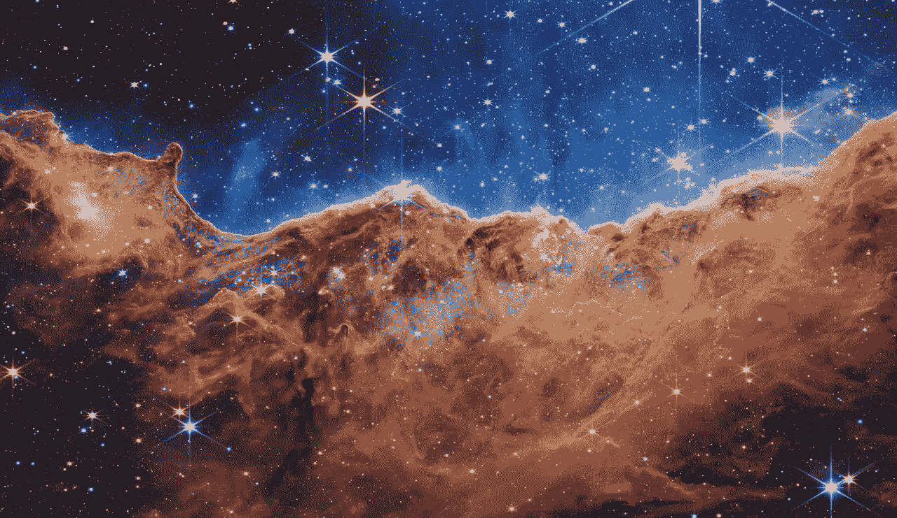

# 诺贝尔奖赛博朋克

> 原文：<https://medium.com/mlearning-ai/nobel-prize-cyberpunk-e1803aa0e087?source=collection_archive---------1----------------------->

## 科学发现中人工智能最重要奖项的计算视角

image by the author using [stable diffusion](https://arxiv.org/abs/2112.10752)

在这一百年里，世界和科学发生了变化，创新和进步加速。如果说诺贝尔奖设立时最快的交通工具是马的话，那么今天我们已经将火箭送入太空，并对太阳系以外的地方进行了探测。诺贝尔奖奖励了科学家作为人类最重要的成就，而今天人工智能及其应用正在快速增长。计算机在导致诺贝尔奖的发现中有多重要？而未来呢？

# **一个奖项的爆炸性诞生**

[阿尔弗雷德·诺贝尔](https://en.wikipedia.org/wiki/Alfred_Nobel)出生于 1833 年，一个瑞典建筑承包商的儿子。阿尔弗雷德在家接受教育，发现他擅长两样东西:外语和化学。这两个主题使他前往法国，在法国他遇到了教授[阿斯卡尼奥·索伯雷罗](https://en.wikipedia.org/wiki/Ascanio_Sobrero)。

Alfred Nobel. image source: [Wikipedia](https://it.wikipedia.org/wiki/Alfred_Nobel)

在阿斯卡尼乌斯和阿尔弗雷德之前，炸药的世界仅限于火药。阿斯卡尼欧教授发明了硝化甘油，然而，它非常不稳定，因此在使用前就爆炸了。阿尔弗雷德用硅藻土稳定了它，并称之为炸药。多亏了那项专利，他变得比以前富有多了，让世界进入了一个炸药的新时代。

“Nobels extradynamit” manufactured by Nobel’s old company. Image source: Wikipedia

事实上，尽管阿尔弗雷德在实验室的一次爆炸中失去了他的兄弟，他还是非常喜欢炸药。事实上，他的 360 项专利中有许多是炸药或者至少是与炸药相关的发明(例如 [ballistite](https://en.wikipedia.org/wiki/Ballistite) ，这是今天许多火炮武器中使用的 [cordite](https://en.wikipedia.org/wiki/Cordite) 的前身)。

1888 年，他的哥哥拉德维格死于一场爆炸。法国报纸认为这是阿尔弗雷德，并写了非常不讨好的评论:

> 死亡商人死了！阿尔弗雷德·诺贝尔博士，他以前所未有的速度找到杀死尽可能多的人的方法，并以此致富，于昨天去世

阿尔弗雷德没有很好地接受他过早的讣告，并决定在他死后将他 94%的财产捐赠给设立一个奖项，奖励那些在各个领域(文学、物理、化学、医学和和平)为人类做出最大贡献的人。

诺贝尔奖的历史充满了伟大的发现、激烈的争论和令人难以置信的拒绝，但需要一篇单独的文章。无论如何，一百年来，诺贝尔奖一方面是科学家的最高奖项，但也是指向最重要发现的指南针。

# **未获奖的机器**

image by the author using [stable diffusion](https://arxiv.org/abs/2112.10752)

[图灵的](https://en.wikipedia.org/wiki/Alan_Turing)工作让盟军破解了纳粹的加密代码，并帮助赢得了战争。从那时起，计算机的成功就没有停止过，它们已经成为任何领域研究中不可或缺的元素。

计算机科学界每年都会授予那些在计算机科学领域最杰出的人图灵奖(这个奖项被许多人称为计算机科学的诺贝尔奖)。另一方面，数学家每四年颁发一次菲尔兹奖，它也被称为“数学的诺贝尔奖”

诺贝尔经济学奖从 1969 年才开始存在，证明了在奖项中加入学科是可能的。如果阿尔弗雷德·诺贝尔本人因为对实用科学更感兴趣而没有设立数学奖是真的，人们可能会问为什么不为计算机科学增设一个诺贝尔奖。

然而，近年来的情况表明，这种划分越来越不明确。希格斯玻色子在 2012 年被欧洲粒子物理研究所的实验发现之前，是彼得·希格斯在 1964 年写的一系列公式。此外， [CERN 实验](https://en.wikipedia.org/wiki/CERN)不仅是一个工程奇迹，而且它们产生了大量的数据，需要复杂的算法才能成功地分析这些数据(LHC 实验每年产生超过 30pb 的数据，这只是一个想法)。

The stunning image of the super-massive black hole [M87](https://en.wikipedia.org/wiki/Black_hole) was obtained by the [Event Horizon Telescope](https://en.wikipedia.org/wiki/Event_Horizon_Telescope), which required a sophisticated algorithm to analyze all the produced data. image source: [here](https://en.wikipedia.org/wiki/Black_hole)

也有其他例子表明计算机的使用是决定性的。例如，马蒂纳斯·维尔特曼使用汇编语言编写代数方程，这使他能够解决量子场论领域的复杂问题。索尔·珀尔马特是超级计算机的先驱之一，并用它们来分析宇宙数据，以验证宇宙的膨胀正在加速(这一发现为他赢得了诺贝尔物理学奖)。

expansion of the universe. image source: [here](https://en.wikipedia.org/wiki/Expansion_of_the_universe#/media/File:CMB_Timeline300_no_WMAP.jpg)

另一个有趣的例子是 2013 年诺贝尔化学奖授予马丁·卡普拉斯、迈克尔·莱维特和亚利耶·瓦谢尔，以表彰他们“对复杂化学系统多尺度模型的发展”他们的工作为开发所有用于模拟复杂化学反应(酶、受体、光合作用)的计算工具奠定了基础。模拟分子间的相互作用在数学上很复杂，通常需要很高的计算能力。这些研究为计算结构生物学的新领域铺平了道路。

在其他情况下，计算机的作用似乎不那么明显。2020 年，Emmanuelle Charpentier 和 Jennifer Doudna 因发现了 [CRISPR-cas9](https://www.broadinstitute.org/what-broad/areas-focus/project-spotlight/questions-and-answers-about-crispr) 基因组编辑方法而获得诺贝尔化学奖。事实上，计算分析使他们能够识别这些生物机制的作用。毕竟，近年来基因组学的爆炸带来了生物学中大数据的产生和对计算方法的需求。

# **multi vac 会解决研究人员最后的疑问吗？**

Image by [Roman Mager](https://unsplash.com/@roman_lazygeek) at [unsplash.com](https://unsplash.com/)

> 男人说:“AC，就这样结束了吗？这种混乱不能再次逆转进入宇宙吗？那能不做吗？”
> 
> AC 说，“还没有足够的数据来给出有意义的答案。”[…]
> 
> AC 的意识包含了所有曾经是宇宙的东西，并沉思着现在的混乱。一步一步来，一定要做到。
> 
> 而 AC 说:“要有光！”
> 
> 还有光——([最后一个问题——艾萨克·阿西莫夫](https://en.wikipedia.org/wiki/The_Last_Question))

有一个很精彩的阿西莫夫的故事，最后一个问题，男人问巨型计算机如何逆熵，很长一段时间，计算机回答说它没有足够的数据。目前，即使是最强大的算法也只能在训练数据中找到模式。

另一方面，彼得·希格斯等了 50 年才被授予诺贝尔奖，因为需要实验验证来证实他的粒子。同样，斯蒂芬·霍金自己关于黑洞热力学的优雅理论也没有被诺贝尔委员会考虑。

Peter Higgs declared he had the idea of his theory after a failed weekend camping trip to the Highlands. image by the author using [stable diffusion](https://arxiv.org/abs/2112.10752)

AlphaFold2 的预测需要实验验证，但它们仍然开辟了几种可能性和新的研究方向(更多信息请点击[这里](https://towardsdatascience.com/alphafold2-year-1-did-it-change-the-world-499a5a38130a))。也许在未来，他们可以带领算法的作者和使用算法的人获得诺贝尔奖。在这种情况下，算法对发现有多重要？算法应该获得图灵奖还是诺贝尔奖？

> 在一个科学探索的前沿已经超越人类理解能力的时代，人类科学家的角色是什么？——[姜峯楠从桌子上抓面包屑](https://www.nature.com/articles/35014679)

在一个简短但引人入胜的故事中，姜峯楠想象了一个世界，在那里超能力者(由于基因治疗而拥有卓越智力的人类)发明了人类不再能够理解的物体和理论。也许基因疗法不会如此先进太久，但另一方面，如果我们最终发明了通用人工智能(AGI)会怎样？

计算机视觉的最新进展表明，在处理生物和临床来源的图像时，算法变得越来越精确。一些算法在识别黑色素瘤方面已经达到了与临床医生相同的准确性，可以想象，在未来，病理学家将通过人工智能辅助诊断。但是我们能想象一个算法做出发现的未来吗？

2019 年，[一种算法](https://www.nature.com/articles/d41586-019-03332-7)能够利用哥白尼时代的观测数据发现地球围绕太阳旋转。最近， [Google Minerva](https://towardsdatascience.com/googles-minerva-solving-math-problems-with-ai-4f0a6aaabaf1) 被证明能够解决数学和其他科学中的一些问题。显然，这些模型中没有一个能够独自做出科学发现，但是它们将会有巨大的帮助。

事实上，科学实验往往非常昂贵，算法将能够帮助选择、选择参数和消除一些假设。在复杂而精密的实验中，人的因素往往是一个瓶颈，既因为时间，也因为它引入了可变性和误差。

另一方面，机器学习算法可以[与机器人系统](https://pub.towardsai.net/robotics-join-machine-learning-for-an-electric-future-420067527337?source=your_stories_page-------------------------------------)结合，优化和标准化条件。因此，人工智能将使减少实验成本和时间成为可能。

image by the author using [stable diffusion](https://arxiv.org/abs/2112.10752)

今天，不仅仅是计算机计算能力的提高，还有技术和算法的进步。尽管量子计算机今天还处于萌芽状态，但它们预示着一场新的革命。寻找新材料也将有助于量子计算机(也许还有分子计算机)的发展。这些进步将使研究人员能够解决人类无法独自解决的复杂问题。

事实上，科学进步的稳步增长也是由于学者的[数量、计算机能力和数据量](https://www.science.org/doi/10.1126/science.1259439)的增长。到目前为止，算法和人工智能被用于提取信息或验证假设的想法。在未来，人工智能可以帮助提出数据驱动的假设，或者设计实验和数据收集来检验假设。

在不远的将来，我们可以想象“临床医生人工智能助理”，他们会考虑症状，向医生提出潜在的诊断建议。类似地，“科学人工智能助理”可以向研究人员建议分析当前的数据假设或实验。

robot clinician and robot surgeon discussing a case. image by the author using [stable diffusion](https://arxiv.org/abs/2112.10752)

[赫伯特·西蒙(Hebert Simon)认为科学是解决问题的](https://www.routledge.com/Complex-Information-Processing-The-Impact-of-Herbert-A-Simon/Klahr-Kotovsky/p/book/9780805801781)，在这里，科学家设定要解决的问题的任务。事实上，选择一个问题往往涉及到找到优化解决方案的方法。至于优化，如果能定义假设空间，我们有几个非常好的优化算法。

此外，一些研究人员建议从价值驱动的方法转移到探索驱动的方法，在价值驱动的方法中，我们试图最大化发现将为[带来重大价值的可能性。在后者中，目标是试图在假设空间中最大化发现的数量，并连续地评估它们。第二种可能更容易与算法和组学数据兼容。](https://www.nature.com/articles/s41540-021-00189-3)

然而，也有对这些方法持批评态度的声音:如果这些蛮力方法很适合象棋和围棋，那么它们就不太适合被认为是无限的发现假设空间。另一方面，详尽的研究在某些情况下可能是有用的，例如在寻找一种生物现象的机制时。

# **离别的思念**

Image from the James Webb Telescope. image source: [Wikipedia](https://it.wikipedia.org/wiki/Telescopio_spaziale_James_Webb#/media/File:NASA%E2%80%99s_Webb_Reveals_Cosmic_Cliffs,_Glittering_Landscape_of_Star_Birth.png)

十月的第一周是宣布诺贝尔奖得主的时间。近年来，我们已经看到新的、越来越强大的人工智能模型问世。因此，当伟大研究人员的成就受到称赞时，人们自然会想知道计算科学做出了什么贡献以及未来会怎样。

> 目前，人工智能还远远不能做出一项可以获得诺贝尔奖的发现，但很快，如果没有算法的帮助，就不会有诺贝尔奖的发现。

LHC 实验和新的空间天文台(如韦伯或其他星球的探测器)发送了大量的数据，如果不使用复杂的算法，人类分析这些数据是不可想象的。即使在生物学和医学领域，随着组学革命的到来，不使用分析数据的算法就能有所发现也是不可想象的。

当测试大量的实验条件时，人是可变性的来源和瓶颈。例如，在未来，自动化的方法将会在测试成百上千种化合物时提供更大的灵活性和速度。另一方面，正如几项研究显示的那样，可以包含分析结果和闭环的算法。

未来，科学家不会被 AI 取代，而是在假设和实验的设计、解释以及整体研究方面得到 AI 助手的支持。

# 如果你觉得有趣:

你可以寻找我的其他文章，你也可以 [**订阅**](https://salvatore-raieli.medium.com/subscribe) 在我发表文章时得到通知，你也可以在**[**LinkedIn**](https://www.linkedin.com/in/salvatore-raieli/)**上连接或联系我。**感谢您的支持！**

**这是我的 GitHub 知识库的链接，我计划在这里收集代码和许多与机器学习、人工智能等相关的资源。**

** [## GitHub - SalvatoreRa/tutorial:关于机器学习、人工智能、数据科学的教程…

### 关于机器学习、人工智能、数据科学的教程，包括数学解释和可重复使用的代码(python…

github.com](https://github.com/SalvatoreRa/tutorial) 

或者随意查看我在 Medium 上的其他文章:

 [## AlphaFold2 第一年:它改变了世界吗？

### DeepMind 向我们承诺了一场革命，它发生了吗？

towardsdatascience.com](https://towardsdatascience.com/alphafold2-year-1-did-it-change-the-world-499a5a38130a)  [## 机器学习应对气候变化

### 人工智能如何帮助对抗全球变暖并从人类手中拯救世界

towardsdatascience.com](https://towardsdatascience.com/machine-learning-to-tackle-climate-change-7911e004c3a2)  [## 科学贡献如何变成一个有毒的环境

### 计算机科学是如何继承了其他学科同样的错误的

towardsdatascience.com](https://towardsdatascience.com/how-science-contribution-has-become-a-toxic-environment-6beb382cebcd)  [## 机器学习:科学的朋友还是敌人？

### 机器学习如何影响科学再现性以及如何解决它

towardsdatascience.com](https://towardsdatascience.com/machine-learning-a-friend-or-a-foe-for-science-9c0b421eabd8)  [## Mlearning.ai 提交建议

### 如何成为 Mlearning.ai 上的作家

medium.com](/mlearning-ai/mlearning-ai-submission-suggestions-b51e2b130bfb)**