# 视觉中的噪声和滤波

> 原文：<https://medium.com/mlearning-ai/noise-and-filtering-in-vision-3bebe42ff00b?source=collection_archive---------5----------------------->

噪声、去噪和滤波是图像处理中非常重要的概念。随着机器学习作为一种新的编程范式变得无处不在，人们需要知道视觉的基础知识。

噪声是添加到数据中的任何不需要的东西。例如，下图显示了干净信号和嘈杂信号的概念。

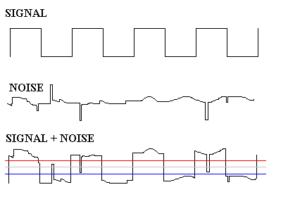

[[reference](https://reviseomatic.org/help/2-radio/Regenerator%20-%20Noise%20Removal.php)]

# 噪音

噪声是实际数据中不需要的附加值。例如，对图像的像素值进行任何不想要的改变。视觉中有三种常见的噪声:

1.  **椒盐噪声**:随机出现的白色和黑色像素
2.  **脉冲噪声**:白色像素随机出现
3.  **高斯(加性)噪声**:高斯正态分布的强度变化
4.  **均匀噪声**:一个恒定值被加到一幅图像的所有像素上

如前所述，在下面的图片中显示了噪声。

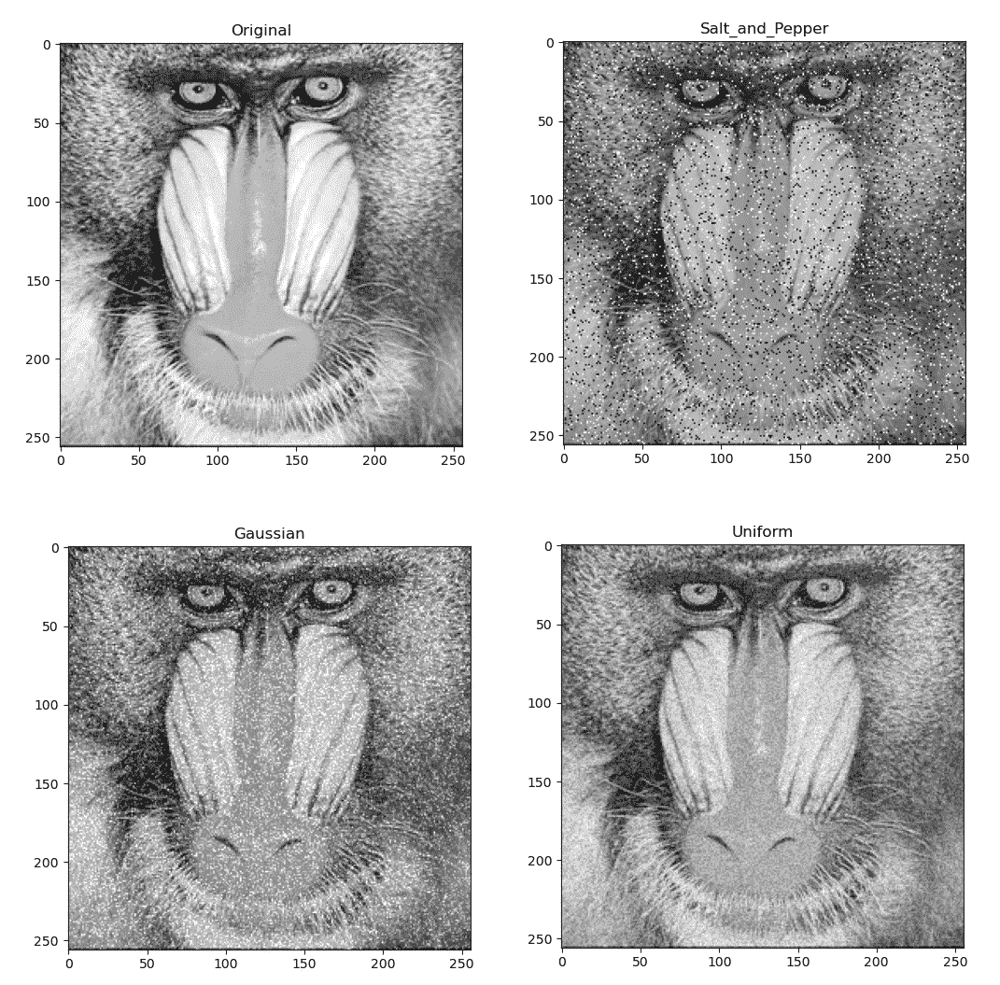

Salt and pepper, Gaussian, Uniform noises

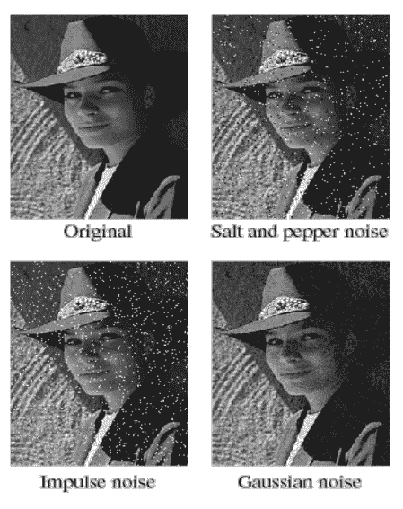

Salt and pepper, Impulse, and Gaussian noises

高斯加性噪声可以考虑如下:

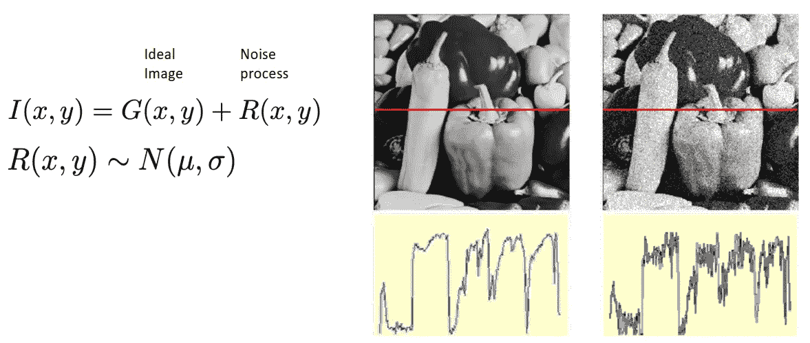

# 去噪

**未加权平均**。最简单和第一次尝试是用其邻域中所有值的平均值替换每个像素。采用这种方法的两个假设是:

1.  邻域中的像素彼此相似(像素的熵低)，并且邻域中的所有像素具有相同的重要性
2.  噪声以彼此独立的方式分散(例如，它们聚集在邻近区域)

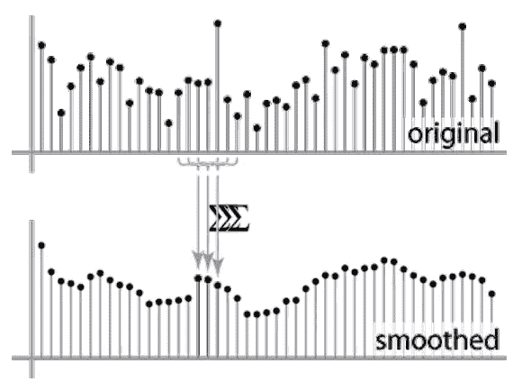

Unweighted Average Denoising

**加权平均**。在这种方法中，一些像素被认为比其他像素更重要。未加权平均方法类似于定义的邻域中的所有像素都具有等于 1 的权重。

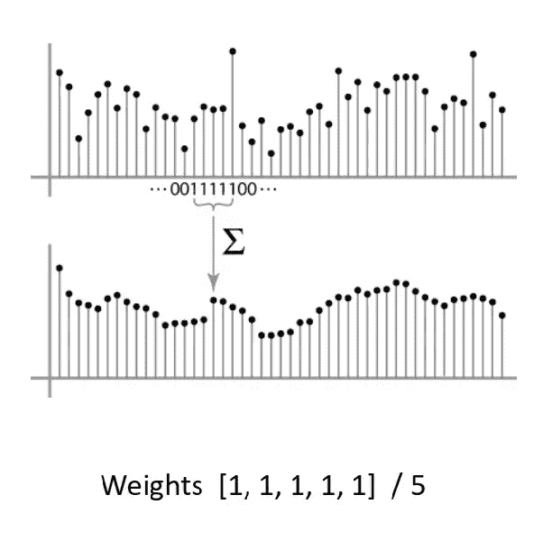

Unweighted average denoising method

然而，当我们给予更靠近中心像素的像素更大的重要性时，我们得到更平滑的结果。

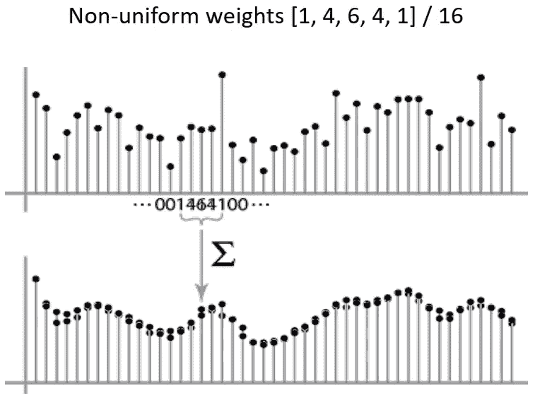

Weighted average denoising results in smoother output

计算过程如下图所示。带有权重的移动窗口在图像上移动，并改变每个像素的值。以下示例显示了一个 9 像素窗口的未加权平均。

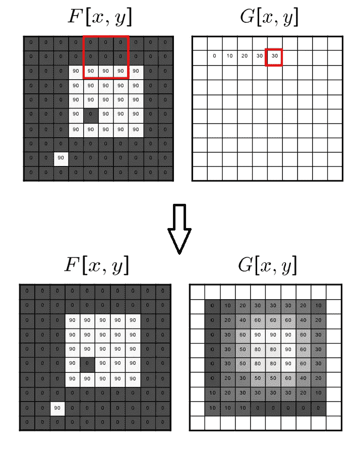

## 互相关滤波

在这种过滤中，每个像素被替换为其相邻像素的线性组合。通常，内核总和为 1。

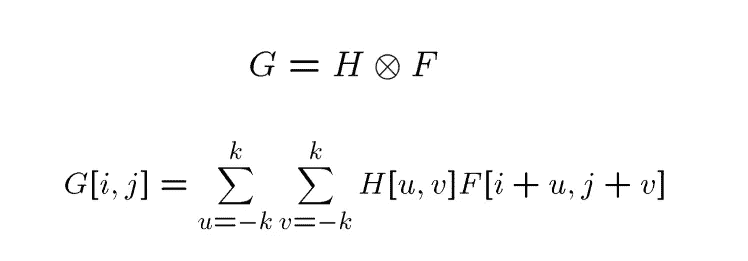

Correlation Filtering

在 **OpenCV** 中，名为 **filter2D** 的函数用于该操作。考虑下面的例子，通过构建适当大小的内核将图像向右移动 n 个像素。

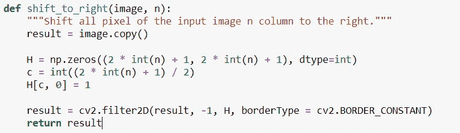

在上面的例子中，可以使用模糊核或边缘检测核来代替移位器核。

## 高斯滤波

在这种过滤中，最近的相邻像素对输出影响最大。

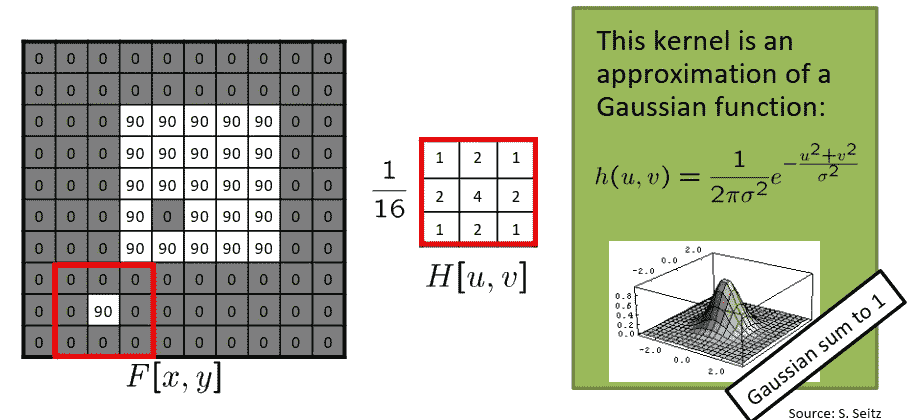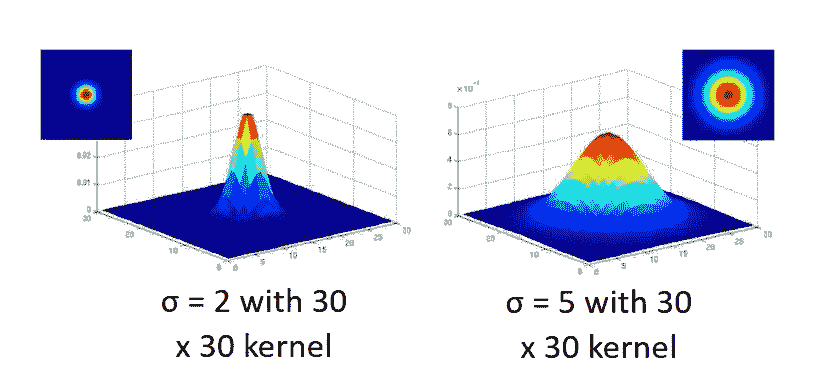

为高斯滤波器的均值和方差选择正确的值对于获得可接受的结果至关重要。在某些情况下，大核(超过更多像素)可能会使去噪效果失效。然而，其他策略会有所帮助。下图显示了使用高斯核的过滤比均值过滤器更平滑。

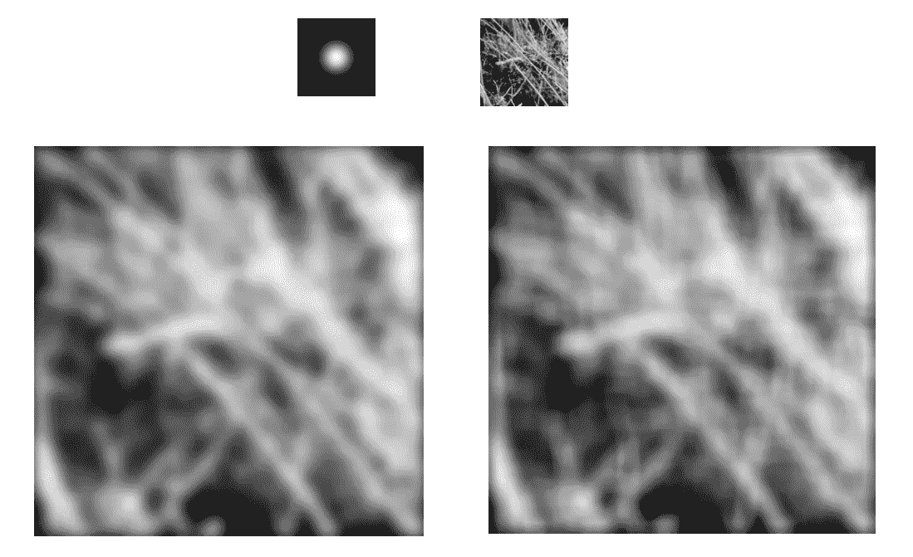

## 盘旋

因为这是一个计算机科学人士经常处理的概念，所以我决定在下面的另一个帖子中以更深刻和详细的方式来写它。

 [## 计算机科学人士的卷积

### 了解卷积的概念变得至关重要的计算机科学的人，特别是数据科学家，当…

ehsanyousefzadehasl.medium.com](https://ehsanyousefzadehasl.medium.com/convolution-for-computer-science-people-2da7482272be) 

在卷积中，内核在 x 和 y 轴上翻转(先翻转一个，再翻转另一个)。公式显示出来了。然后，我们进行相关滤波。翻转是因为移动核在其独立变量后面的卷积公式中的负号。

请注意，我们在图像的离散数字领域，所以我们有总和，而不是积分。

# 图像渐变

图像在每个像素的梯度显示了快速变化的方向。

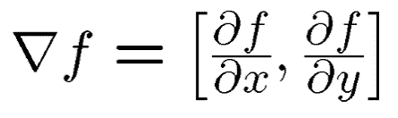

以下示例显示了它所显示的内容:

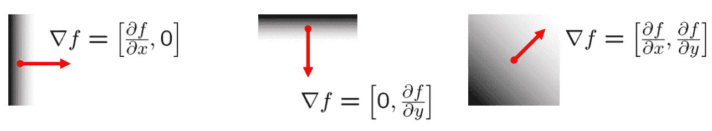

方向由下式给出

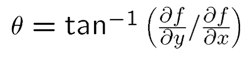

梯度幅度给出了边缘强度。

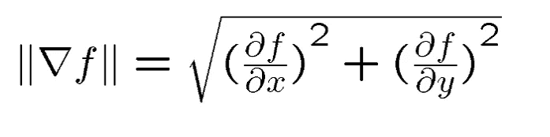

下图显示了眼睛的点渐变图像。

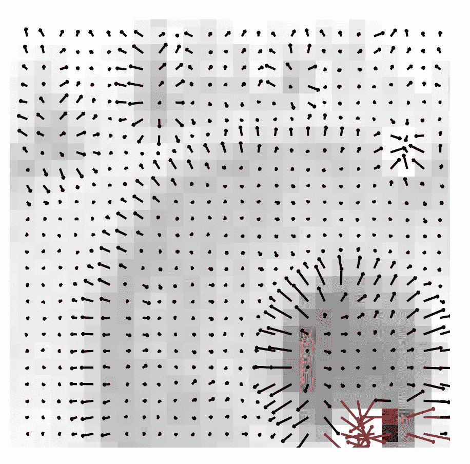

下图显示了卷积如何帮助发现特定数据点后信号值的增加。还有，卷积的导数定理有多大帮助。

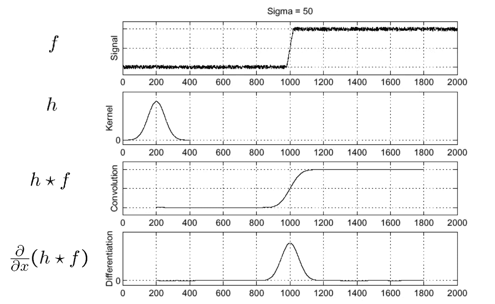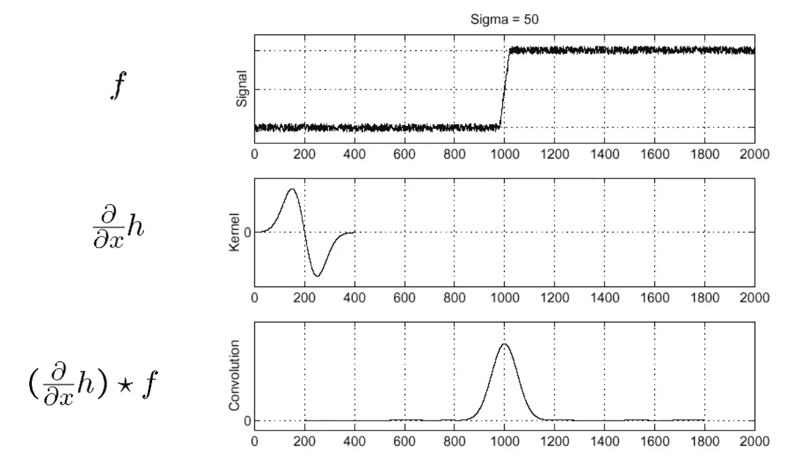

# 模板匹配

这个任务的目的是在一个更大的图像中找到一个模板或内核(比如一只眼睛)。主要的挑战是确定两个补片之间良好的相似性或距离。

可能的措施包括:

1.  **相关性**
2.  **零均值相关**
3.  **平方差总和(SSD)**
4.  **归一化互相关**

考虑下面的例子，内核是一只眼睛:

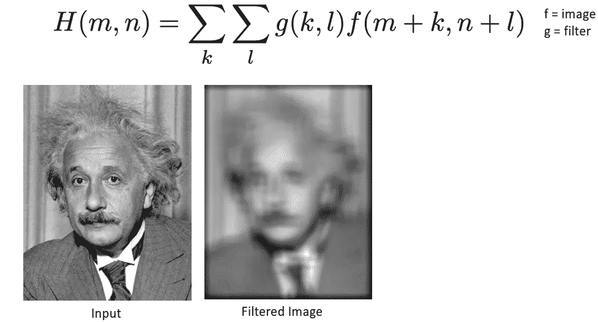

Matching with Correlation

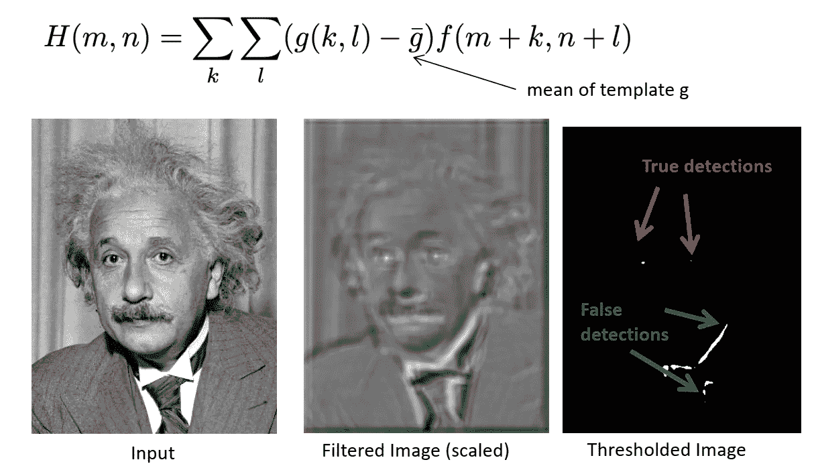

Matching with Zero-Mean Correlation

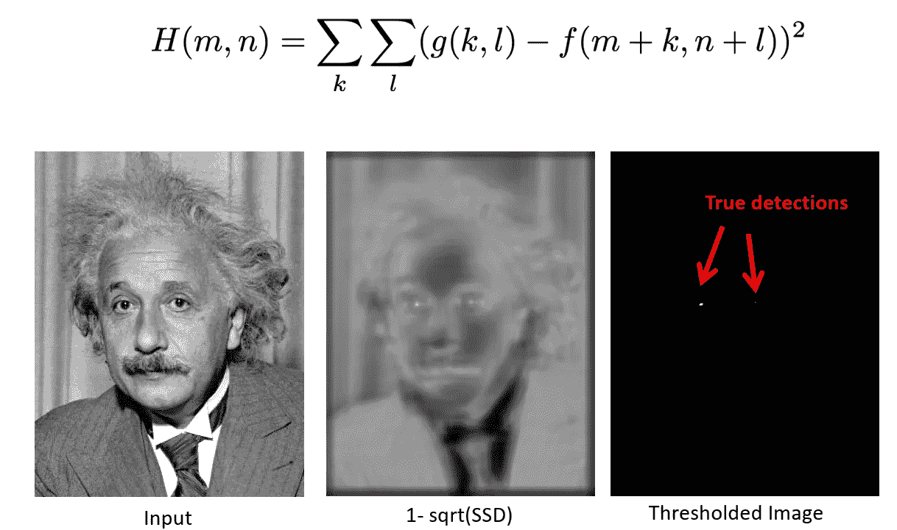

Matching with SSD

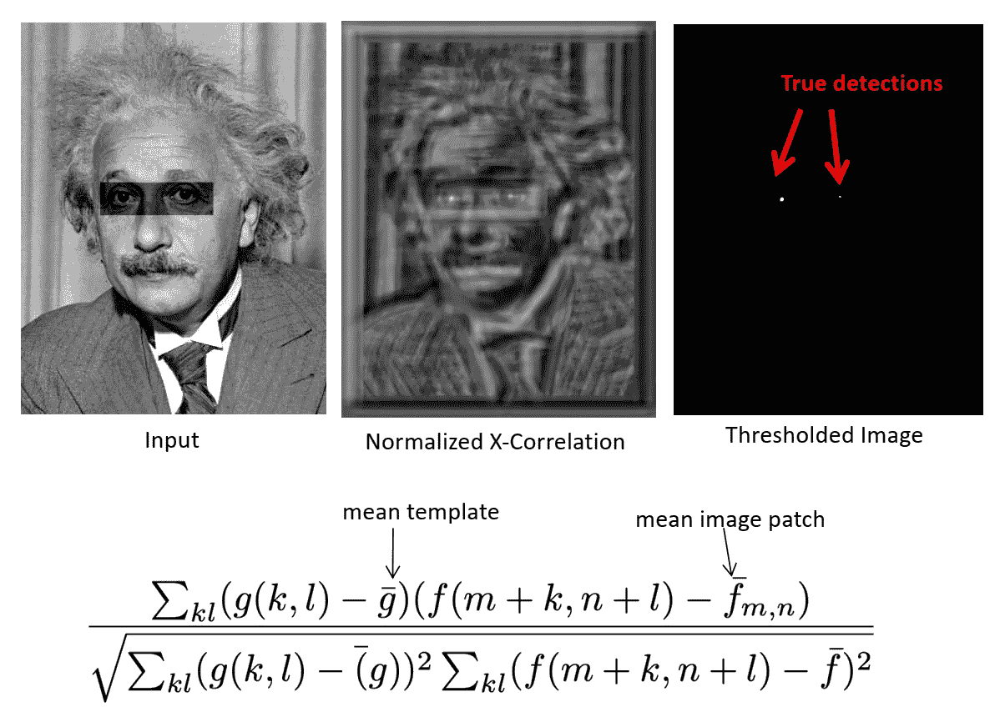

随着时间的推移，我会尝试编辑和添加更多的概念到这篇文章中。欢迎建设性的意见。

 [## Mlearning.ai 提交建议

### 如何成为 Mlearning.ai 上的作家

medium.com](/mlearning-ai/mlearning-ai-submission-suggestions-b51e2b130bfb)