# R 中的非线性混合模型

> 原文：<https://medium.com/mlearning-ai/non-linear-mixed-model-in-r-a6fc054c3f82?source=collection_archive---------0----------------------->

这篇文章是关于我如何在 2016 年使用非线性混合模型(NLMIXED)处理数据集的。我对 NLMIXED 既爱又恨，因为他们高度的自由，以及建模和统计的完美结合。这些模型不适合胆小的人，因为它们需要干净的数据集和足够的粒度来估计方差分量。

数据集本身处理的是牛胃里草的降解。在多个时间点，对几个试验和奶牛进行评估，得到一个包含多个水平的嵌套数据集——试验、奶牛、重复。该数据集不是“完整的”数据集，这意味着不是每头奶牛都有相同数量的重复，或者每个试验都有相同数量的奶牛。

下面的代码并不是 NLMIXED 的完美方法。它只强调了我在 2016 年如何处理数据集，如果我必须重做，我肯定会选择不同的选择。尽管如此，下面显示的代码和示例应该为您提供了一个入门的工具箱。因此，我试图尽可能多地保留当时的原始代码。

最终，建模更多的是基于生物学理解做出科学选择，而不是让统计数据做出所有选择。

我希望这篇文章能让这一点更加清晰。

因此，让我们开始吧，如果你对我为什么和如何做有任何疑问，你知道在哪里可以找到我！

First line cleans the environment. The rest are the libraries loaded.

Simple import, unique ID creation, and scatterplot made.

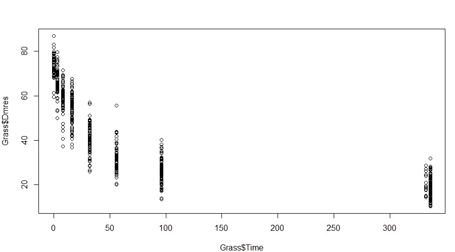

Scatterplot of Time by DMres shows the decline in values over time. Data such as this can be approximated by polynomials or spline, but the will have difficulties with the almost full horizontal part at the end of the curve.

Some data wrangling to create additional columns, clean data, create factors etc. The end shows way to plot the data, diving a bit deeper inside its nested structure.

下面的代码结果显示了测量的时间点、每个时间点的观察次数、试验次数、试验中的奶牛数量以及每次试验中每头奶牛的观察次数。最后一个表显示了重复。

如果不小心的话，嵌套的数据结构会变得难以处理。如果您希望在以后的阶段解释结果，创建唯一的标识符和声音标签结构是关键。

```
> unique(Grass$x)
[1]   0   3   8  16  32  56  96 332 336> table(Grass$x)
 0   3   8   16  32  56  96  332 336 
 56  84  84  87  87  90  96  18  117> table(Grass$Trial, Grass$Cow)

               1  2  3
  RRC032_09   19 15 15
  RRC032_19   19 15 15
  RRC03201_21 19 15 15
  RRC03201_32 19 15 15
  RRC050_01   19 15 15
  RRCGrass_1  28 24 24
  RRCGrass_2  21 17 17
  RRCGrass_3  19 15 15
  RRCGrass_4  19 15 15
  RRCGrass_5  19 15 15
  RRCGrass_6  38 30 30
  RRCGrass_7  19 15 15
  RRCGrass_8  19 15 15> table(Grass$Trial, Grass$Replicate)

               1  2  3  4  5  6
  RRC032_09   22 22  4  1  0  0
  RRC032_19   22 22  4  1  0  0
  RRC03201_21 22 22  4  1  0  0
  RRC03201_32 22 22  4  1  0  0
  RRC050_01   22 22  4  1  0  0
  RRCGrass_1  22 22 13 10  6  3
  RRCGrass_2  22 22 10  1  0  0
  RRCGrass_3  22 22  4  1  0  0
  RRCGrass_4  22 22  4  1  0  0
  RRCGrass_5  22 22  4  1  0  0
  RRCGrass_6  44 44  8  2  0  0
  RRCGrass_7  22 22  4  1  0  0
  RRCGrass_8  22 22  4  1  0  0> table(Grass$Cow, Grass$Replicate)

      1   2   3   4   5   6
  1 112 112  33  17   2   1
  2  98  98  19   3   2   1
  3  98  98  19   3   2   1
```

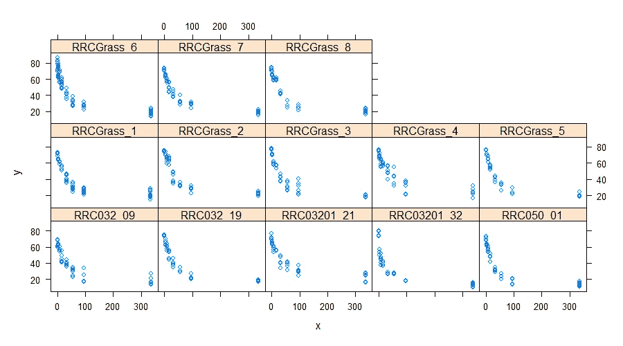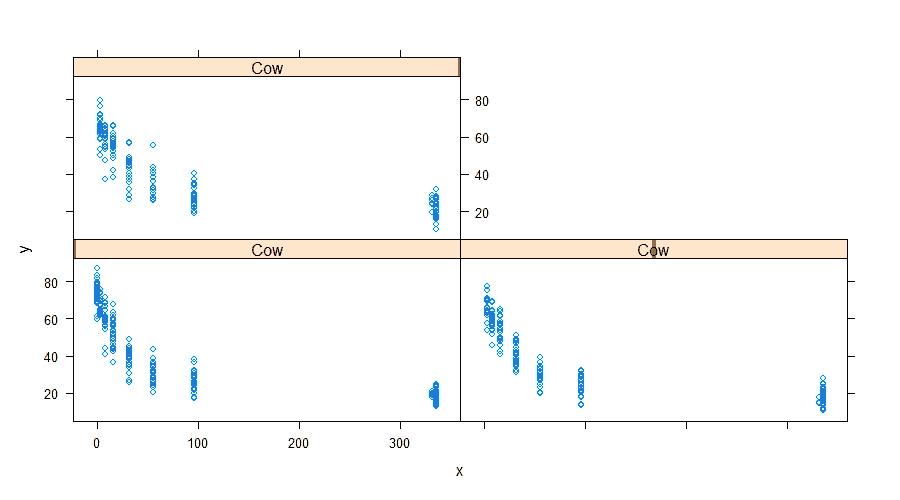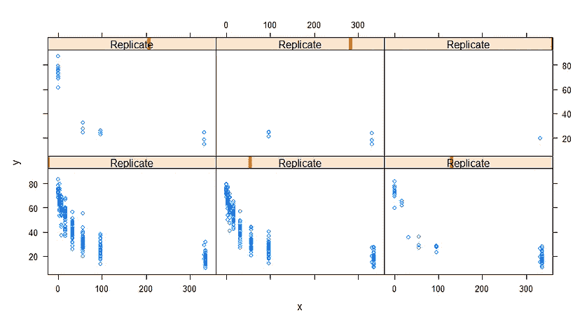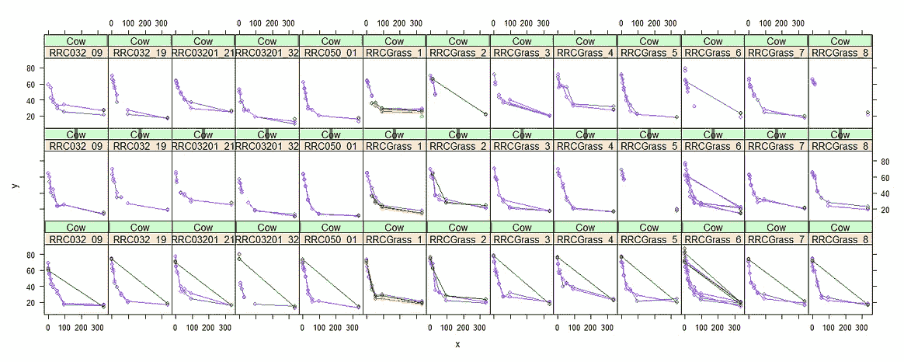

Several plots trying to make sense of the data I received, at various levels (Trial, Cow, Replicate).

在对数据进行初步探索之后，就是开始建模的时候了。在 NLMIXED 或 NLIN(非线性回归)中，方法非常简单，特别是如果你已经知道要使用的公式。那时候，我从一开始就拿到了配方，这让我的生活轻松了许多。

下面的代码显示了该公式在数据集上的适用性。

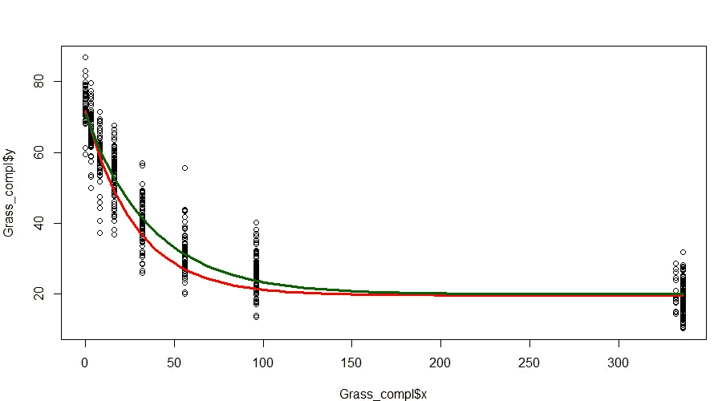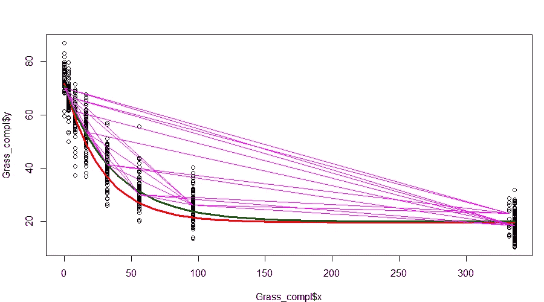

The plots shows that the formulae definitely makes sense, and that changing some of the values for the coefficients can change the curve quite a bit. The purple lines hint at a common problem in line-plots — if you do not have enough observations within a curve, the lines will not be smooth. Hence, to apply the formula, we cannot venture on a level to deep, otherwise we cannot model the curve due to an absence of observations.

下面的代码显示了一个 NLIN 的输出。每个参数的重要性并不有趣。更有趣的是与标准误差相比的值。标准误差最好比估计值小一两个数量级。

相关矩阵非常重要。高度相关的值很容易阻止算法收敛。如果相关性很高，一个更简单的公式可能也足够了。你可以看到在 U 和 d。

最后，但同样重要的是，我应用了折叠刀来迭代地删除观察结果，以评估它们的重要性。这是在最低水平上完成的，并且似乎许多数据点对参数估计有一些影响。

由于我们没有查看这个嵌套数据集中每个级别的重要性，所以我不会根据下面的输出做出任何决定。还没有。

```
>nlstools::overview(try)------
Formula: y ~ U + D * exp(-(Kd * x))Parameters:
    Estimate Std. Error t value Pr(>|t|)    
U  2.000e+01  4.738e-01   42.21   <2e-16 ***
D  5.088e+01  6.223e-01   81.77   <2e-16 ***
Kd 2.698e-02  9.069e-04   29.75   <2e-16 ***
---
Signif. codes:  0 ‘***’ 0.001 ‘**’ 0.01 ‘*’ 0.05 ‘.’ 0.1 ‘ ’ 1Residual standard error: 5.793 on 634 degrees of freedomNumber of iterations to convergence: 5 
Achieved convergence tolerance: 3.259e-06------
Residual sum of squares: 21300------
t-based confidence interval:
          2.5%       97.5%
U  19.07080923 20.93167944
D  49.66065888 52.10463568
Kd  0.02520037  0.02876208------
Correlation matrix:
            U           D          Kd
U   1.0000000 -0.62690611  0.63539027
D  -0.6269061  1.00000000 -0.04101318
Kd  0.6353903 -0.04101318  1.00000000>confint(try)
Waiting for profiling to be done...
          2.5%      97.5%
U  19.03739598 20.9534555
D  49.66056255 52.1048493
Kd  0.02514392  0.0289665> summary(try.jack)
------
Jackknife statistics
     Estimates          Bias
U  20.02060949 -1.936516e-02
D  50.87891113  3.736147e-03
Kd  0.02701635 -3.512655e-05------
Jackknife confidence intervals
           Low          Up
U  19.20385608 20.83736290
D  49.75286614 52.00495612
Kd  0.02500967  0.02902303
```

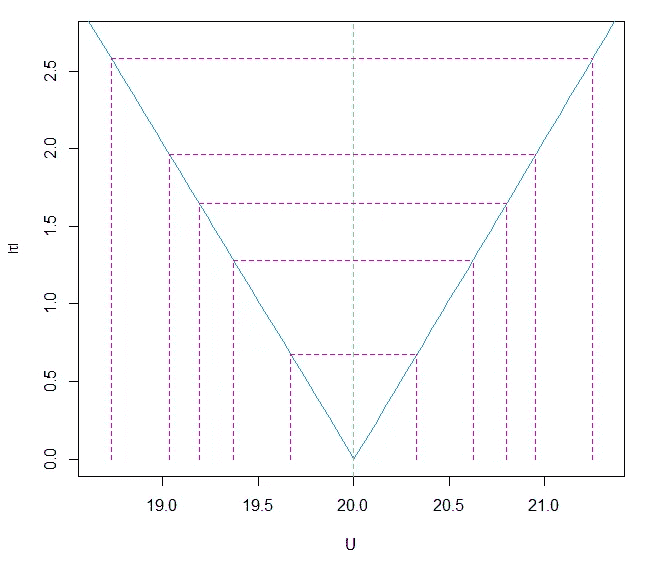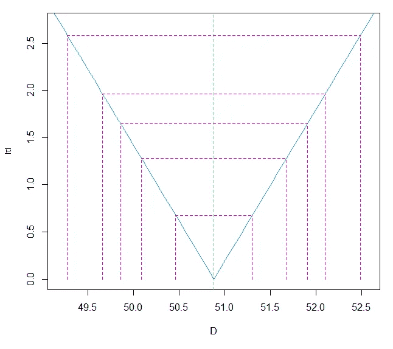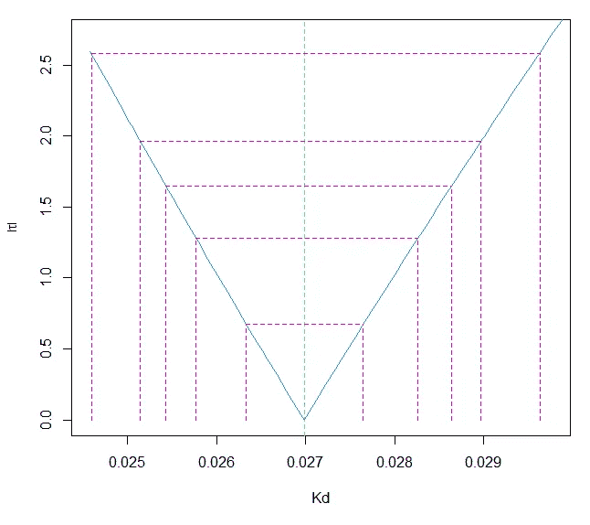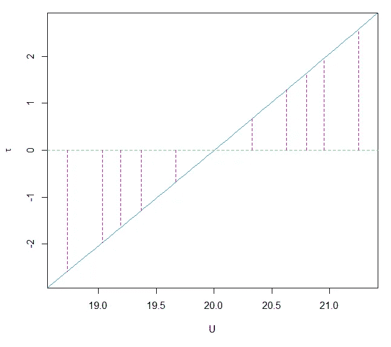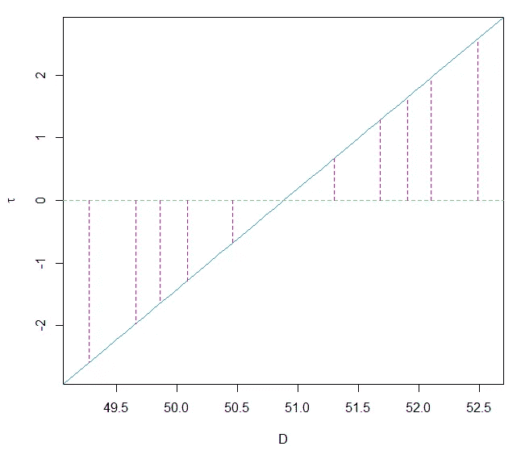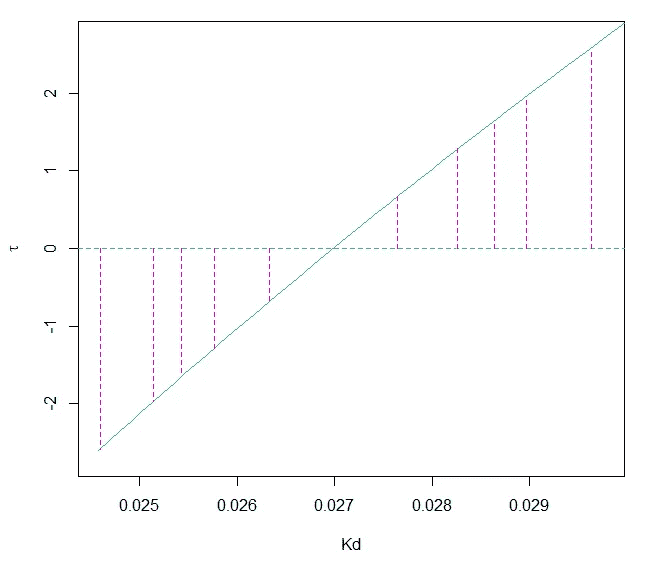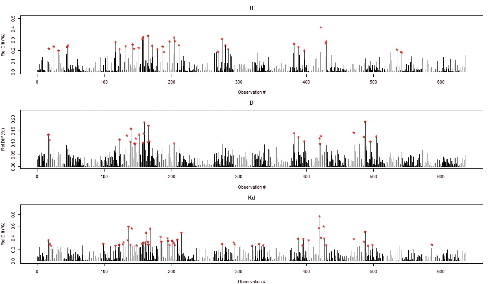

从发给我代码的研究员那里，我知道有一个标识变量，我可能需要用它来分割参数估计。这个变量叫做‘标准’。“样本”被包括在后来的模型中，并与一个更简单的模型进行比较，以查看其对解释方差的潜在影响。

```
> F.value; P.value # For sure indication to use grouping functions
[1] 52.7006
[1] 2.088696e-30
```

毫无疑问，上面的输出表明，添加标识变量确实可以解释方差。多少和在哪里我还不知道，但我需要把它考虑进去。我将在下面的代码中探索更多。

A model with no identification variable, a second model which will split all three parameters by use of the identification variable, and a third model which will try two provide two estimates for K and D, and a single estimate for Kd. After that, code follows to compare the models by lookin at residuals.

下面的输出来自第三个模型——分别是 K 和 D 的两个参数，以及 Kd 的一个估计值。估计值和标准误差显示了首选的数量级，U (U1 对 U2)和 D (D1 对 D2)的不同估计值确实暗示了必要的拆分。置信区间和相关矩阵看起来不错。

```
> nlstools::overview(try3) # shows t-based confidence intervals------
Formula: y ~ f1(x, U[Standard.sample2], D[Standard.sample2], Kd)Parameters:
    Estimate Std. Error t value Pr(>|t|)    
U1 21.795971   0.550592   39.59   <2e-16 ***
U2 18.400811   0.522118   35.24   <2e-16 ***
D1 53.177046   0.833959   63.77   <2e-16 ***
D2 49.618981   0.751888   65.99   <2e-16 ***
Kd  0.027218   0.000815   33.40   <2e-16 ***
---
Signif. codes:  0 ‘***’ 0.001 ‘**’ 0.01 ‘*’ 0.05 ‘.’ 0.1 ‘ ’ 1Residual standard error: 5.195 on 632 degrees of freedomNumber of iterations to convergence: 5 
Achieved convergence tolerance: 3.143e-06------
Residual sum of squares: 17100------
t-based confidence interval:
          2.5%       97.5%
U1 20.71476007 22.87718125
U2 17.37551456 19.42610814
D1 51.53937899 54.81471275
D2 48.14247924 51.09548309
Kd  0.02561791  0.02881864------
Correlation matrix:
            U1          U2           D1           D2          Kd
U1  1.00000000  0.25297211 -0.667137685 -0.019617333  0.50571390
U2  0.25297211  1.00000000 -0.005825520 -0.700438348  0.50022772
D1 -0.66713769 -0.00582552  1.000000000  0.000451754 -0.01164574
D2 -0.01961733 -0.70043835  0.000451754  1.000000000 -0.03879137
Kd  0.50571390  0.50022772 -0.011645737 -0.038791366  1.00000000
```

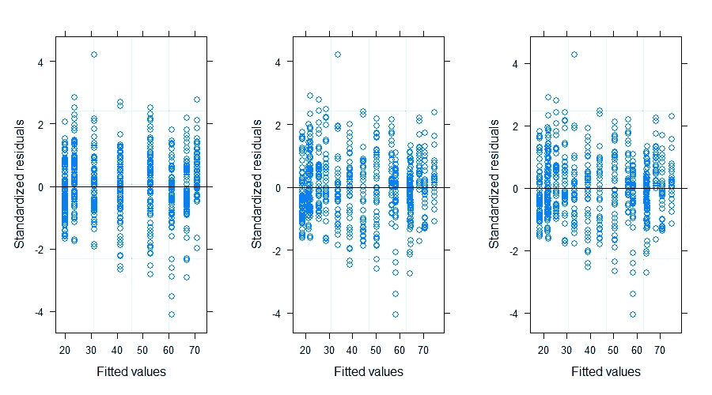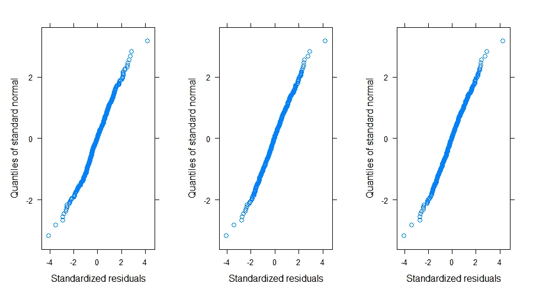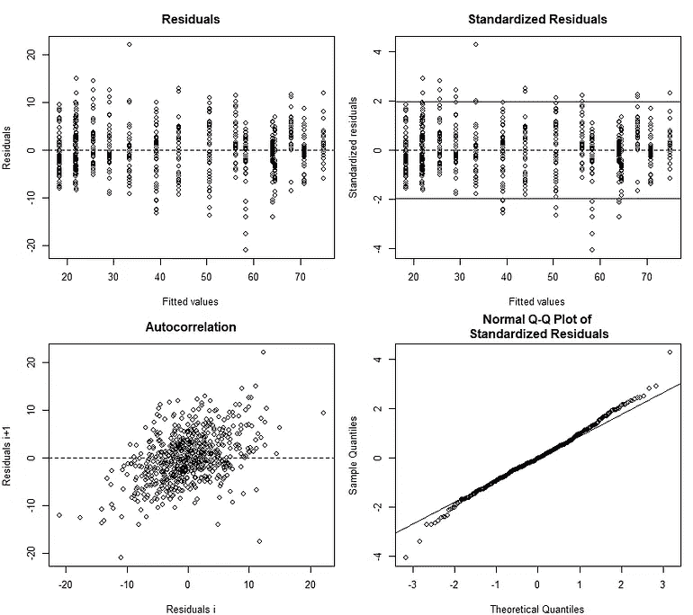

Residuals of all three models look good. The plot bottom right also shows the autocorrelation of the residuals coming from model 3\. Do remember that models looking into time have correlated errors, since part of their future values can be predicted by their past values. The slight diagonal slope does seem to hint at autocorrelation.

尽管残差图可以很好地观察模型的假设是否得到满足，包括方差分量是独立同分布的随机变量，但更严格的比较必须来自测试，如方差分析或似然比测试(LRT)。这些测试只适用于嵌套模型——新模型需要是以前模型的简化。

模型 2 是最大的模型，参数最多。然后遵循模型 3，最简单的模型是模型 1。

下面的结果表明模型 2 比模型 1 好，但是模型 3 并不比模型 2 好。因此，我们应该坚持使用 2，除非有其他事情鼓励我们使用不同的模型。此时此刻，我没有任何理由去假设，所以我坚持模型 2。

```
 > anova(try1,try3,try2) 
Analysis of Variance TableModel 1: y ~ f1(x, U, D, Kd)
Model 2: y ~ f1(x, U[Standard.sample2], D[Standard.sample2], Kd)
Model 3: y ~ f1(x, U[Standard.sample2], D[Standard.sample2], Kd[Standard.sample2])
  Res.Df Res.Sum Sq Df Sum Sq F value Pr(>F)    
1    634      21275                             
2    632      17054  2 4220.8 78.2079 <2e-16 ***
3    631      17013  1   41.8  1.5498 0.2136    
---
Signif. codes:  0 ‘***’ 0.001 ‘**’ 0.01 ‘*’ 0.05 ‘.’ 0.1 ‘ ’ 1> Q<-(-2)*(logLik(try3)-logLik(try2))
> df.Q<-df.residual(try3)-df.residual(try2)
> 1-pchisq(Q,df.Q)
'log Lik.' 0.2112772 (df=6)
```

到目前为止，我们已经使用了“原始”数据文件，并进行了一些小的调整。这个 [nlme](https://cran.r-project.org/web/packages/nlme/nlme.pdf) 包有一段很棒的代码可以让你开始，你可以在下面看到它。

By using the groupedData code, I specify a dataset and the levels I want. Here, I just used the ID level to provide me with a dataset structured by the ID variable. If I plot the data, as requested here, I expect to see all the data points per ID.

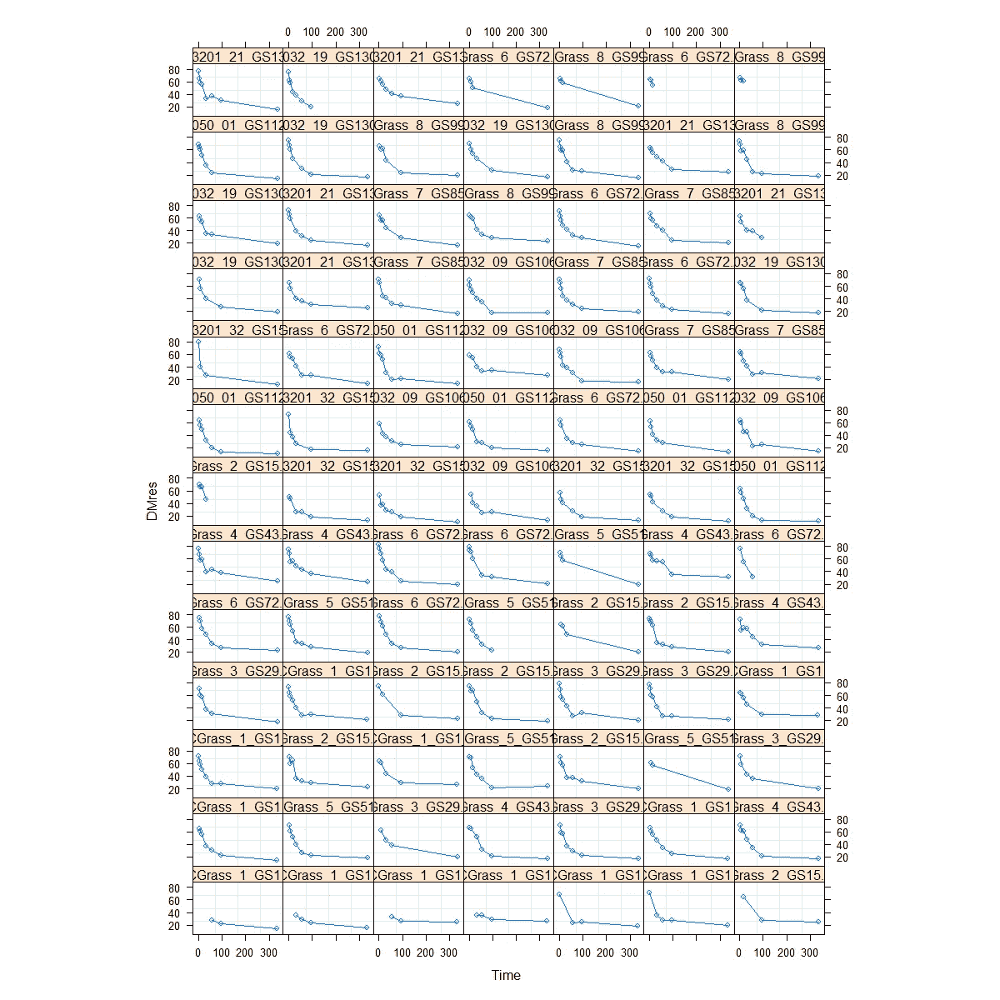

As I expected, a plot showing curved for each ID. Not all of them have complete data. Hence, should I want to create a NLMIXED model at this level, I am not too sure the algorithm would converge.

在我们使用完整的 NLMIXED 模型之前，nlme 包有一个中间步骤，您不必采取这个步骤。这可能会让你的生活更轻松，因为为一个生物公式找到正确的系数并不总是那么简单。

该函数名为 nlsList，正如您在下面看到的，它将使用 U1、U2、D1、D2 和 Kd 的初始值，尝试在刚刚创建的嵌套数据集上拟合非线性模型。代码的其余部分将让你深入了解固定的和随机的效果。请记住，每个试验或试验中嵌套的每头奶牛的参数估计值不同，这是需要包含在 NLMIXED 模型中的随机成分的提示。

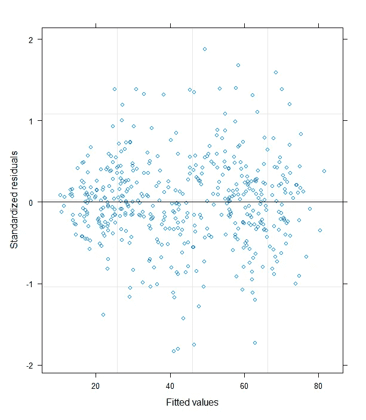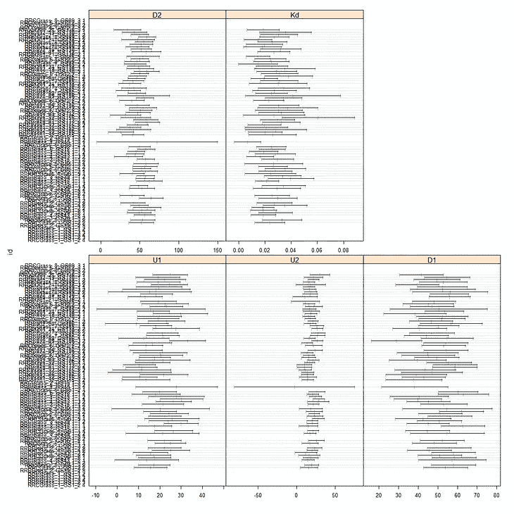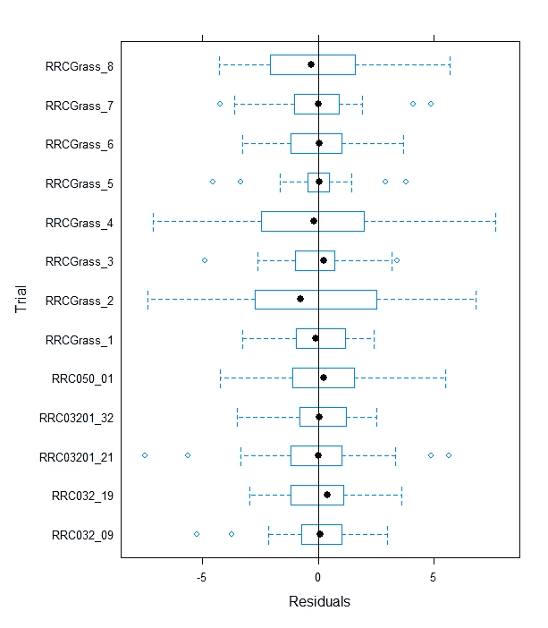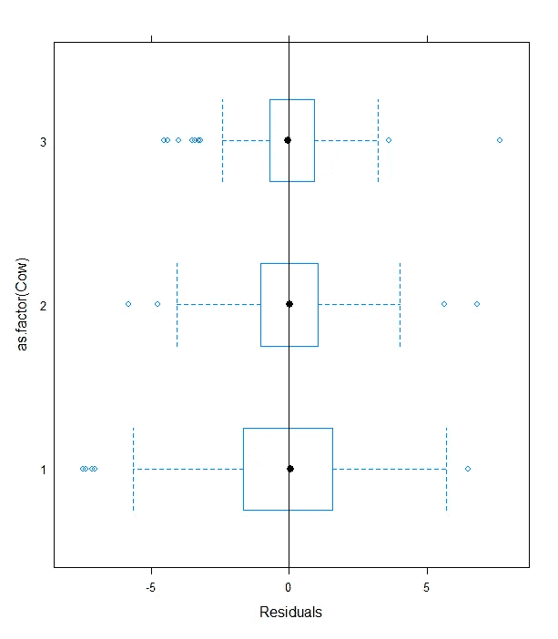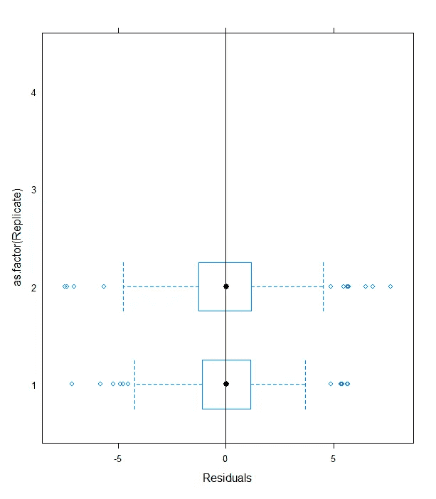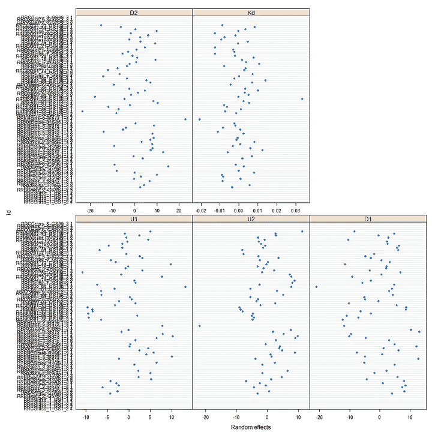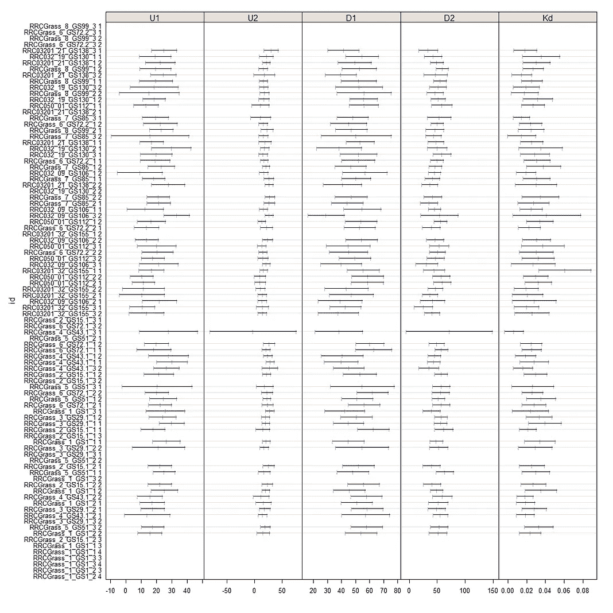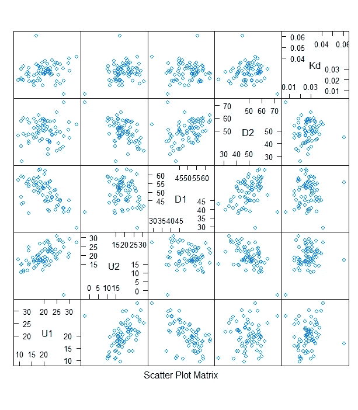

The nlme package is a powerhouse when it comes to output, but it is not just to please you visually. Most of the time, you really need it to see if the parameter estimates make sense, if they vary per level and if they are correlated.

现在，让我们开始真正的东西，并应用一个 NLMIXED。为此，我们创建了一个完全嵌套的数据集，使用 Trial、Cow 和 Id 作为级别标识符。我们还包含了 Standard.sample2 标识符变量来分割 K、D 和/或 Kd 的估计值。

nlme 公式看起来很复杂，但是很简单。在代码中，我指定了以下内容:

1.  应用于数据的公式。
2.  U 基于标准样本 2 +试验标识符的固定效果。对于 D 和 Kd，我估计单个参数。
3.  我估计了 U 和 d 的一个随机分量，这意味着我希望在各个级别上有足够的粒度来构建 U 和 d 的方差分量。

下面的代码很难理解。首先也是最重要的是我收到的警告，模型没有收敛，这意味着我获得的所有结果都不可信——模型对数据来说太多了。尽管如此，输出如下，在这里您可以确切地看到我上面指定的内容就是我收到的内容:

1.  Standard.sample2 +试验的独立 U 参数及其相关性。请记住，这些是虚拟变量——标准样品 2[1]和试验 13 是参照方。
2.  全局 D 和 Kd 参数。
3.  U 和 D 的方差分量及其相关性。

```
Warning message:
In nlme.formula(y ~ U + D * exp(-(Kd * x)), data = Grass_new, fixed = list(U ~  :
  Iteration 1, LME step: nlminb() did not converge (code = 1). Do increase 'msMaxIter'!
> summary(fit)
Nonlinear mixed-effects model fit by maximum likelihood
  Model: y ~ U + D * exp(-(Kd * x)) 
  Data: Grass_new 
      AIC      BIC   logLik
  3196.82 3309.578 -1572.41Random effects:
 Formula: list(U ~ 1, D ~ 1)
 Level: Trial
 Structure: General positive-definite, Log-Cholesky parametrization
              StdDev   Corr  
U.(Intercept) 1.892197 U.(In)
D             3.004500 -1Formula: list(U ~ 1, D ~ 1)
 Level: Code %in% Trial
 Structure: General positive-definite, Log-Cholesky parametrization
              StdDev   Corr  
U.(Intercept) 3.164850 U.(In)
D             4.601667 -1Formula: list(U ~ 1, D ~ 1)
 Level: id %in% Code %in% Trial
 Structure: General positive-definite, Log-Cholesky parametrization
              StdDev        Corr  
U.(Intercept) 3.102183e-100 U.(In)
D             4.042386e-101 0     
Residual       3.674515e+00Fixed effects:  list(U ~ Standard.sample2 + Trial, D + Kd ~ 1) 
                       Value Std.Error  DF  t-value p-value
U.(Intercept)       25.22320 1.0079186 459 25.02503  0.0000
U.Standard.sample22 -8.93781 1.0017410 459 -8.92227  0.0000
U.Trial1             0.16555 0.7802254 459  0.21219  0.8321
U.Trial2             3.42710 0.7671317 459  4.46742  0.0000
U.Trial3             4.70411 0.7683217 459  6.12258  0.0000
U.Trial4            -6.54268 0.8033764 459 -8.14397  0.0000
U.Trial5            -1.06034 0.7508373 459 -1.41220  0.1586
U.Trial6            -5.23902 0.8173058 459 -6.41010  0.0000
U.Trial7             0.01426 0.8494760 459  0.01679  0.9866
U.Trial8            -3.05043 0.8723032 459 -3.49698  0.0005
U.Trial9            -0.38279 0.8536689 459 -0.44841  0.6541
U.Trial10           -2.57297 0.8854630 459 -2.90579  0.0038
U.Trial11            1.92660 0.4964003 459  3.88114  0.0001
U.Trial12            2.99829 0.7576033 459  3.95760  0.0001
D                   49.94279 1.2116216 459 41.21979  0.0000
Kd                   0.02701 0.0006590 459 40.99312  0.0000
 Correlation: 
                    U.(In) U.S.22 U.Trl1 U.Trl2 U.Trl3 U.Trl4 U.Trl5 U.Trl6 U.Trl7 U.Trl8 U.Trl9 U.Tr10 U.Tr11 U.Tr12 D     
U.Standard.sample22 -0.581                                                                                                  
U.Trial1             0.308 -0.540                                                                                           
U.Trial2             0.324 -0.549  0.234                                                                                    
U.Trial3             0.308 -0.547  0.232  0.239                                                                             
U.Trial4             0.298 -0.523  0.214  0.221  0.221                                                                      
U.Trial5             0.335 -0.562  0.243  0.251  0.248  0.229                                                               
U.Trial6            -0.422  0.710 -0.431 -0.436 -0.434 -0.423 -0.442                                                        
U.Trial7            -0.388  0.682 -0.422 -0.426 -0.426 -0.414 -0.431  0.447                                                 
U.Trial8            -0.380  0.665 -0.416 -0.420 -0.420 -0.409 -0.426  0.431  0.407                                          
U.Trial9            -0.402  0.681 -0.421 -0.426 -0.423 -0.412 -0.433  0.446  0.420  0.405                                   
U.Trial10           -0.370  0.655 -0.413 -0.417 -0.417 -0.406 -0.422  0.421  0.399  0.384  0.396                            
U.Trial11           -0.071  0.093 -0.108 -0.105 -0.106 -0.114 -0.100  0.033  0.020  0.011  0.018  0.007                     
U.Trial12            0.317 -0.555  0.239  0.246  0.245  0.226  0.255 -0.438 -0.429 -0.423 -0.428 -0.420 -0.103              
D                   -0.760 -0.004  0.013 -0.002  0.006  0.010  0.000 -0.002 -0.007  0.000 -0.001 -0.003 -0.010  0.005       
Kd                   0.262 -0.036  0.014  0.021 -0.018 -0.016  0.057 -0.031  0.006 -0.002 -0.046  0.000  0.011  0.003 -0.025Standardized Within-Group Residuals:
        Min          Q1         Med          Q3         Max 
-3.23305944 -0.61215325 -0.04371685  0.59392080  5.44906014Number of Observations: 565
Number of Groups: 
                  Trial         Code %in% Trial id %in% Code %in% Trial 
                     13                      42                      91
```

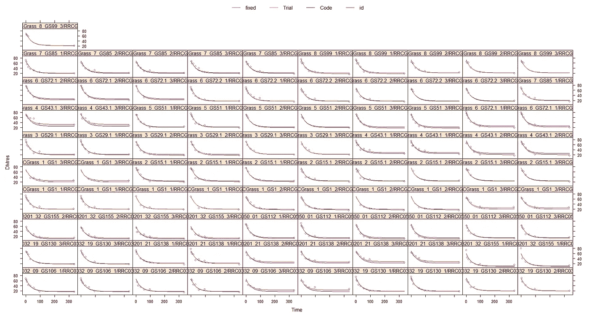

The beautiful graph showing you if the model predictions for the various levels actually make sense. You can clearly see that predicting for all three levels — Trial, Code, ID — is simply too much based on the granularity and hierarchy of the data.

上面的输出显示，基于数据的粒度和层次结构对所有三个级别进行估计太多了。因此，我们需要创建额外的模型，看看我们能做什么，不能做什么。这就是事情变得非常混乱的地方，因为 NLMIXED 允许您做出如此多的选择。

例如，您可以更改数据集的层次结构。你可以改变生物配方。固定效果。随机效应。它们之间的相互关系。估算方法。协变量。你说吧。

因此，下面的例子肯定不是应该如何做的完美例子，但如果它们给你一个复杂性的暗示，我就非常满意了。

Above, you see several models with changing levels of structures.

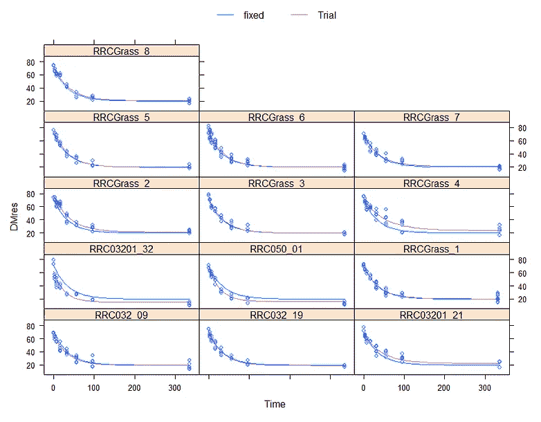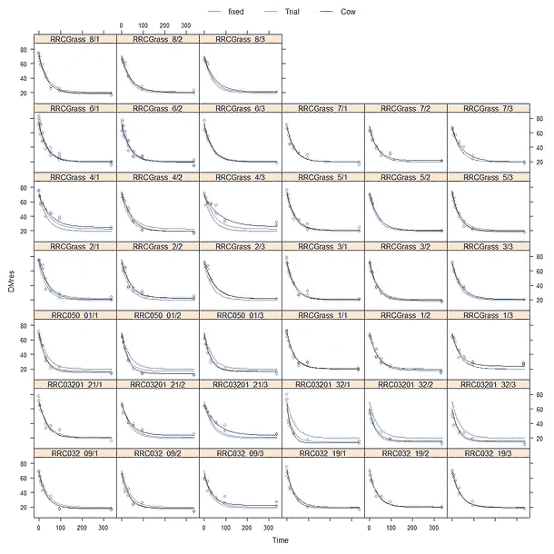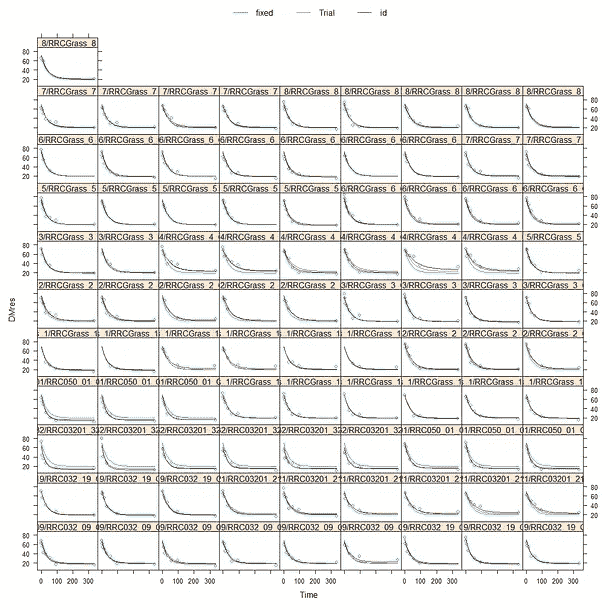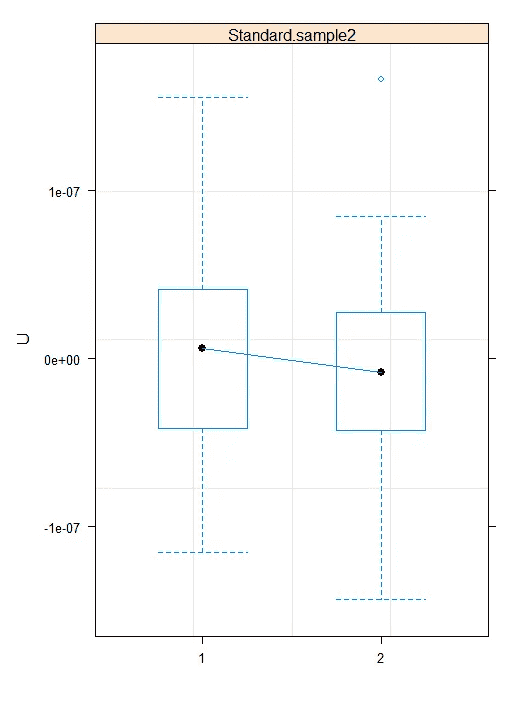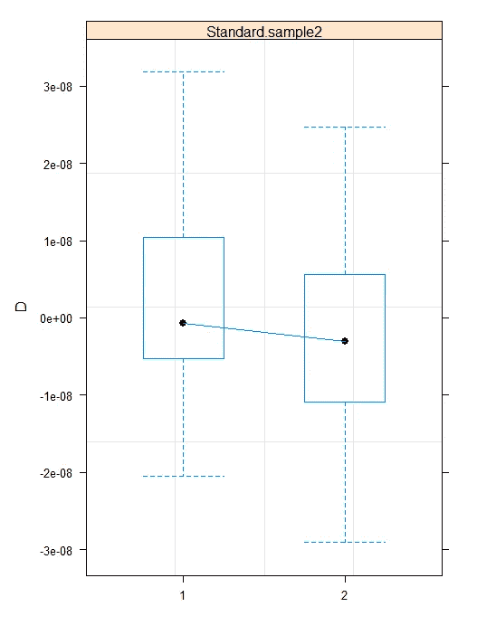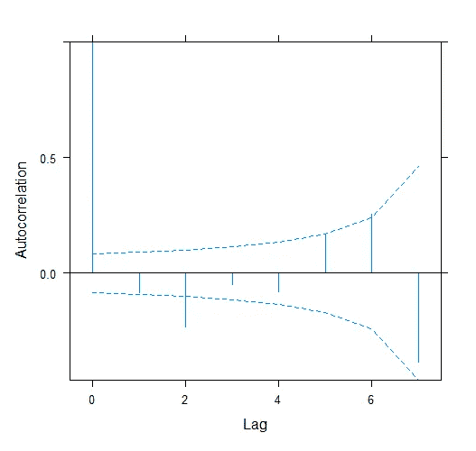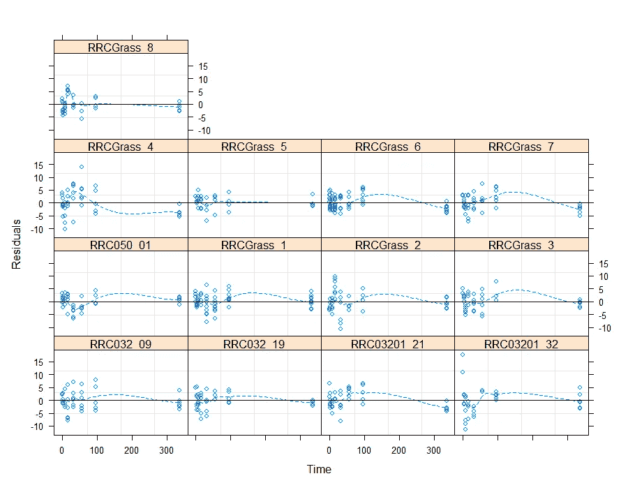

The output from the codes above showing you if it makes sense to limit predictions at a certain levels, make distinctions between levels, estimate parameters separately, and how the predictions hold up in terms of autocorrelation and level.

现在，如果我一直都是错的，并且不需要混合呢？没有人从一开始就说试验中的奶牛真的表现出那么大的方差，它保证了方差分量的估计。也许，使用一个 NLIN 就足够了。此外，NLIN 模型也可以在不同的水平上提供不同的估计。

Code to create a dataframe with a single hierarchy — trial — and to provide estimates from both a NLIN and NLMIXED model.

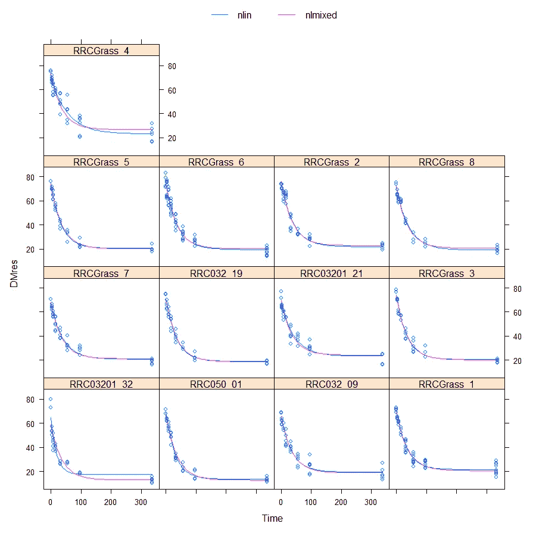

I can’t say that a NLMIXED is really that much better than a NLIN model on the trial level.

下面的代码显示了 U、D 和 Kd 在试验水平上的系数。我们期望 Kd 有相同的估计，因为我们没有指定随机成分。虽然输出似乎暗示了每次试验 U 和 D 的不同估计值，以及方差分量的存在，但我们也需要看看置信水平。

```
> coef(nlmixed, level=1)
                   U        D         Kd
RRC03201_32 12.93202 45.52694 0.02690547
RRC050_01   12.79088 53.59955 0.02690547
RRC032_09   18.86513 46.48913 0.02690547
RRCGrass_1  20.67794 48.87412 0.02690547
RRCGrass_7  21.24971 47.01689 0.02690547
RRC032_19   18.74008 51.44783 0.02690547
RRC03201_21 24.14823 45.37416 0.02690547
RRCGrass_3  20.27294 52.69700 0.02690547
RRCGrass_5  20.16830 53.51800 0.02690547
RRCGrass_6  20.17919 53.24526 0.02690547
RRCGrass_2  22.79165 53.48099 0.02690547
RRCGrass_8  20.62042 51.72504 0.02690547
RRCGrass_4  26.84359 46.74550 0.02690547
```

因此，在试验水平上似乎有足够的差异。现在，让我们也包括代码(Cow)级别，向数据帧的层次结构添加第二个级别。然后我们来看看标准的影响。样本 2 标识符也是模型 7 中的协变量，但不是模型 6 中的协变量。

这两个模型通过图表和方差分析进行比较。

方差分析表明，模型 7 比模型 6 更适合，这与我们在以前的模型中看到的一致——标准。样本 2 为 U 和 d 的单独估计提供了良好的分割。

```
anova(fit6, fit7)
     Model df      AIC      BIC    logLik   Test L.Ratio p-value
fit6     1  8 3271.749 3306.401 -1627.874                       
fit7     2 11 3267.777 3315.365 -1622.889 1 vs 2 9.97115  0.0188
```

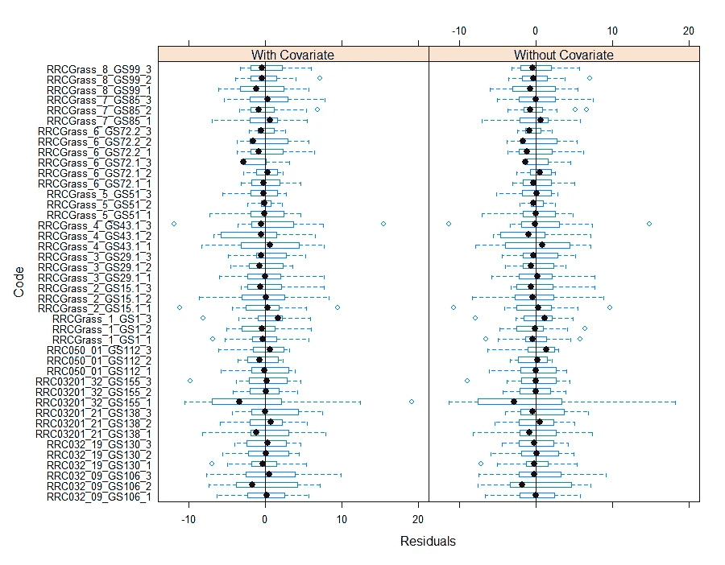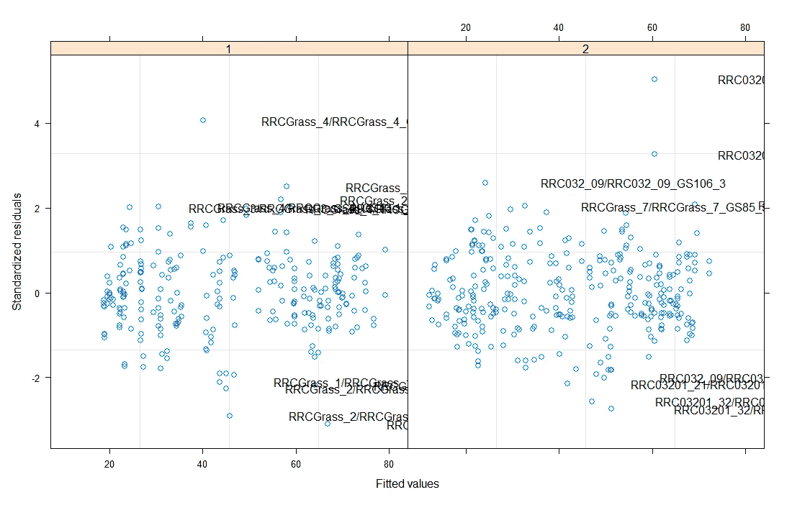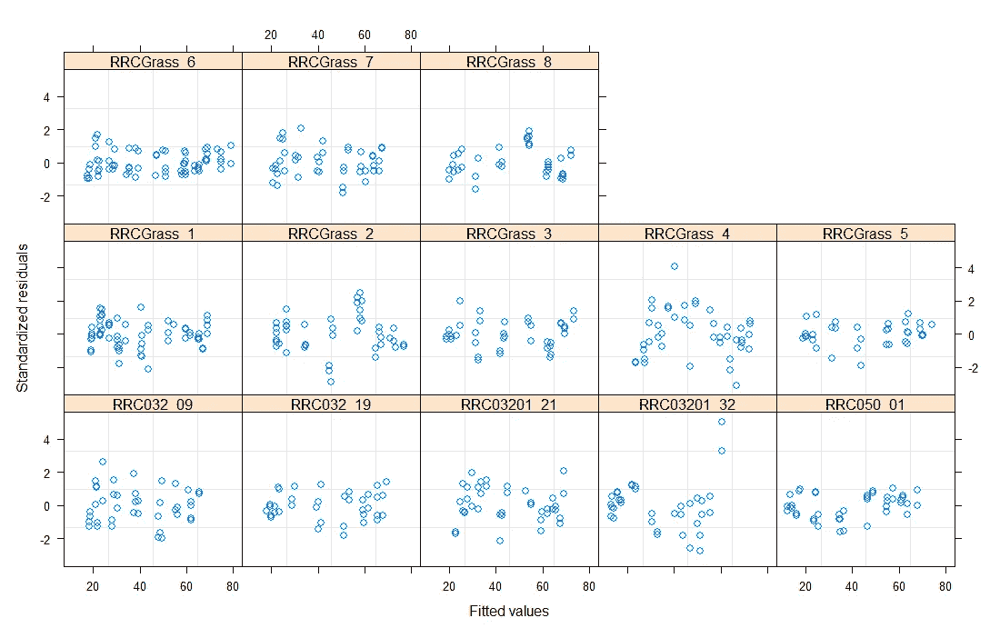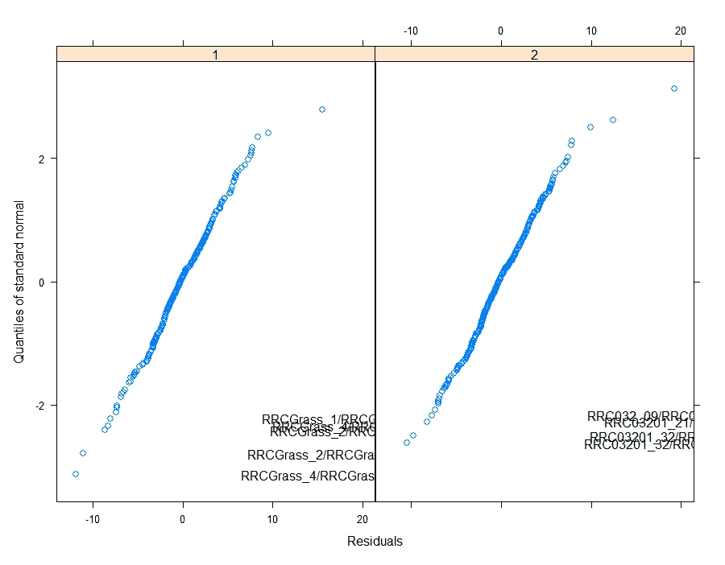

Plots to compare random effect estimates and residuals for each of the two models.

如我所说，在 nlme 中可以实现的建模选择非常广泛。例如，如果我们知道标准。样本 2 对固定参数估计有如此大的影响，也许它们也可以用来分离随机效应。

下面的结果是模型结果与方差分析比较结果不一致的一个很好的例子。在这里，模型 8 似乎同意基于标准的独立的固定和随机效应。Samppl2，但是 ANOVA 比较不同意。模型 8 中增加的系数不足以取代模型 7。

这是你的选择。记住:生物学应该压倒统计学。

```
> summary(fit8)
Nonlinear mixed-effects model fit by REML
  Model: y ~ U + D * exp(-(Kd * x)) 
  Data: Grass_new 
       AIC      BIC    logLik
  3269.692 3321.606 -1622.846Random effects:
 Formula: list(U ~ 1, D ~ 1)
 Level: Trial
 Structure: Diagonal
        U.(Intercept) D.(Intercept)
StdDev:      3.279933      3.411419Formula: list(U ~ 1, D ~ 1)
 Level: Code %in% Trial
 Structure: Diagonal
        U.(Intercept) D.(Intercept) Residual
StdDev:      1.735127      1.932955 3.849455Variance function:
 Structure: Different standard deviations per stratum
 Formula: ~1 | Standard.sample2 
 Parameter estimates:
        2         1 
1.0000000 0.9811761 
Fixed effects:  list(U + D + Kd ~ Standard.sample2) 
                        Value Std.Error  DF  t-value p-value
U.(Intercept)        22.14817 1.3570340 518 16.32101  0.0000
U.Standard.sample22  -3.53108 1.5599922 518 -2.26353  0.0240
D.(Intercept)        52.85253 1.5240713 518 34.67851  0.0000
D.Standard.sample22  -5.03140 1.8385784 518 -2.73657  0.0064
Kd.(Intercept)        0.02619 0.0009255 518 28.30060  0.0000
Kd.Standard.sample22  0.00147 0.0013496 518  1.08627  0.2779
 Correlation: 
                     U.(In) U.S.22 D.(In) D.S.22 Kd.(I)
U.Standard.sample22  -0.658                            
D.(Intercept)        -0.190  0.208                     
D.Standard.sample22   0.200 -0.307 -0.691              
Kd.(Intercept)        0.284 -0.255 -0.031  0.031       
Kd.Standard.sample22 -0.195  0.335  0.022 -0.038 -0.686Standardized Within-Group Residuals:
        Min          Q1         Med          Q3         Max 
-3.13244980 -0.56706124 -0.07313164  0.60639687  4.99330842Number of Observations: 565
Number of Groups: 
          Trial Code %in% Trial 
             13              42> intervals(fit8)
Approximate 95% confidence intervalsFixed effects:
                            lower        est.        upper
U.(Intercept)        19.482200208 22.14816698 24.814133760
U.Standard.sample22  -6.595773437 -3.53108429 -0.466395152
D.(Intercept)        49.858406050 52.85252669 55.846647332
D.Standard.sample22  -8.643391412 -5.03140445 -1.419417491
Kd.(Intercept)        0.024374038  0.02619223  0.028010432
Kd.Standard.sample22 -0.001185351  0.00146604  0.004117431
attr(,"label")
[1] "Fixed effects:"Random Effects:
  Level: Trial 
                     lower     est.    upper
sd(U.(Intercept)) 2.067949 3.279933 5.202236
sd(D.(Intercept)) 1.928149 3.411419 6.035728
  Level: Code 
                      lower     est.    upper
sd(U.(Intercept)) 0.9792957 1.735127 3.074316
sd(D.(Intercept)) 0.6644724 1.932955 5.622983Variance function:
      lower      est.   upper
1 0.8673578 0.9811761 1.10993
attr(,"label")
[1] "Variance function:"Within-group standard error:
   lower     est.    upper 
3.513017 3.849455 4.218114> anova(fit7, fit8)
Model df      AIC      BIC    logLik   Test    L.Ratio p-value
fit7     1 11 3267.777 3315.365 -1622.889                          
fit8     2 12 3269.692 3321.606 -1622.846 1 vs 2 0.08556909  0.7699
```

到目前为止，模型诊断在混合模型中的重要性应该变得非常清楚了。以下是一些关于如何使用新数据框架和新模型进行诊断的附加代码。

```
> fixed.effects((try.nlm1))
          U           D          Kd 
20.00529999 49.90397194  0.02673931> random.effects(try.nlm1)[1] 
$Trial
                     U          D
RRC032_09   -1.6493250 -2.3858655
RRC032_19   -0.8960877  0.8824592
RRC03201_21  2.7903606 -2.7772807
RRC03201_32 -7.0503852 -3.2073010
RRC050_01   -5.6763221  1.5427231
RRCGrass_1   0.4484500 -0.5504275
RRCGrass_2   3.1739196  2.1773564
RRCGrass_3   0.7271474  1.6375856
RRCGrass_4   5.3659893 -1.3561530
RRCGrass_5   0.6897547  2.2731617
RRCGrass_6   0.4170218  2.5908224
RRCGrass_7   0.5737690 -1.7102218
RRCGrass_8   1.0857076  0.8831412> random.effects(try.nlm1)[2] 
$Code
                                          U          D
RRC032_09/RRC032_09_GS106_1     -1.10425606  1.4702397
RRC032_09/RRC032_09_GS106_2     -1.57153189  1.0192723
RRC032_09/RRC032_09_GS106_3      4.60458821 -7.4116499
RRC032_19/RRC032_19_GS130_1     -2.45883690  2.4955908
RRC032_19/RRC032_19_GS130_2      0.80465687 -1.8950342
RRC032_19/RRC032_19_GS130_3     -0.07696925  2.2397417
RRC03201_21/RRC03201_21_GS138_1 -2.48592971  2.9886320
RRC03201_21/RRC03201_21_GS138_2  2.75677370 -6.0731752
RRC03201_21/RRC03201_21_GS138_3  5.15729386 -5.8342753
RRC03201_32/RRC03201_32_GS155_1 -2.52723529  4.9529592
RRC03201_32/RRC03201_32_GS155_2  1.22063630 -2.3650206
RRC03201_32/RRC03201_32_GS155_3  0.63348664 -5.9323153
RRC050_01/RRC050_01_GS112_1     -1.45661716  4.0358327
RRC050_01/RRC050_01_GS112_2     -4.07692455  5.2180634
RRC050_01/RRC050_01_GS112_3     -0.26999920 -1.5058615
RRCGrass_1/RRCGrass_1_GS1_1     -0.90101393  0.3028745
RRCGrass_1/RRCGrass_1_GS1_2     -2.39299384  3.3087425
RRCGrass_1/RRCGrass_1_GS1_3      4.29914514 -5.3084310
RRCGrass_2/RRCGrass_2_GS15.1_1  -1.28926032  3.2797061
RRCGrass_2/RRCGrass_2_GS15.1_2   0.12781739 -1.2630349
RRCGrass_2/RRCGrass_2_GS15.1_3   0.52883498  1.3454552
RRCGrass_3/RRCGrass_3_GS29.1_1  -0.48599678  1.7132460
RRCGrass_3/RRCGrass_3_GS29.1_2  -2.52273836  2.9726927
RRCGrass_3/RRCGrass_3_GS29.1_3   1.41125955 -1.0333884
RRCGrass_4/RRCGrass_4_GS43.1_1   3.11806239 -5.2087166
RRCGrass_4/RRCGrass_4_GS43.1_2  -4.78566177  5.7951964
RRCGrass_4/RRCGrass_4_GS43.1_3   7.02345554 -7.6521718
RRCGrass_5/RRCGrass_5_GS51_1     0.31579910  0.7231365
RRCGrass_5/RRCGrass_5_GS51_2    -0.33800420  1.2415489
RRCGrass_5/RRCGrass_5_GS51_3    -2.41125298  3.3218839
RRCGrass_6/RRCGrass_6_GS72.1_1   1.28923174  4.5542984
RRCGrass_6/RRCGrass_6_GS72.1_2   1.78072012  3.8145485
RRCGrass_6/RRCGrass_6_GS72.1_3  -0.69812186  3.4100002
RRCGrass_6/RRCGrass_6_GS72.2_1  -1.81333179 -1.6694444
RRCGrass_6/RRCGrass_6_GS72.2_2  -2.52345731 -2.1911771
RRCGrass_6/RRCGrass_6_GS72.2_3  -1.05798988 -1.6429690
RRCGrass_7/RRCGrass_7_GS85_1    -0.90088378 -0.1855209
RRCGrass_7/RRCGrass_7_GS85_2     1.64915908 -3.6659136
RRCGrass_7/RRCGrass_7_GS85_3     1.82093084 -0.8657749
RRCGrass_8/RRCGrass_8_GS99_1    -2.51347082  3.4343488
RRCGrass_8/RRCGrass_8_GS99_2     0.99367907 -1.0729189
RRCGrass_8/RRCGrass_8_GS99_3     1.12694715 -0.8612175
```

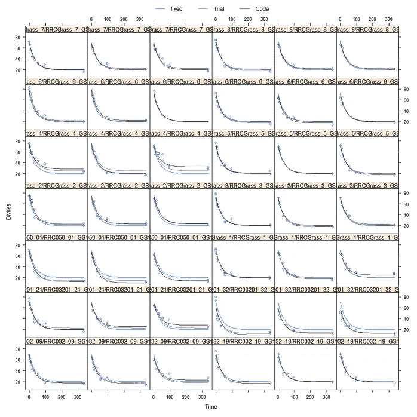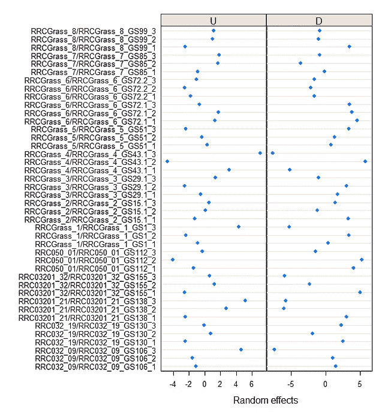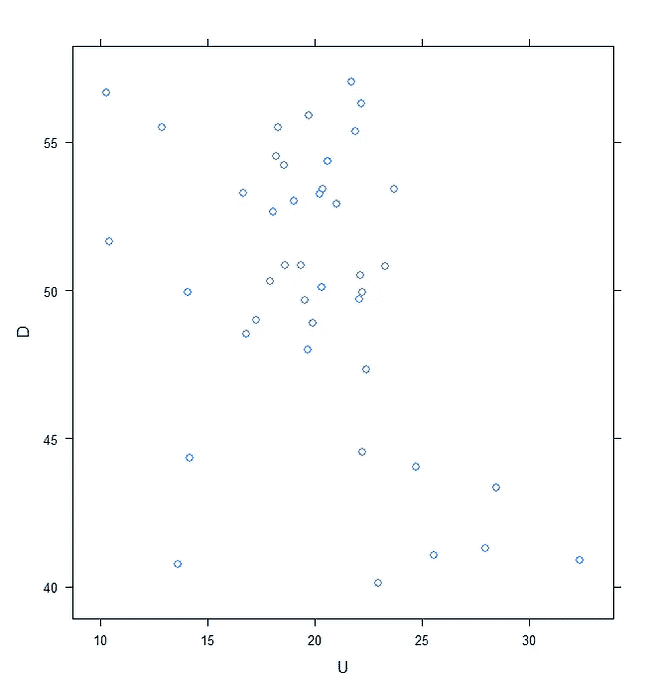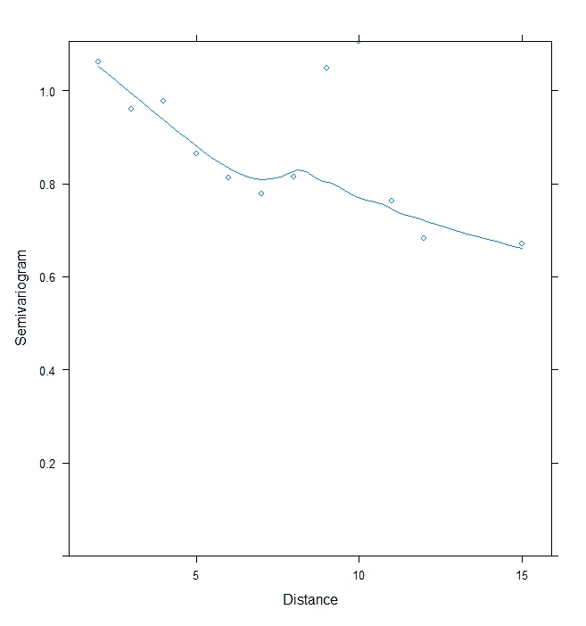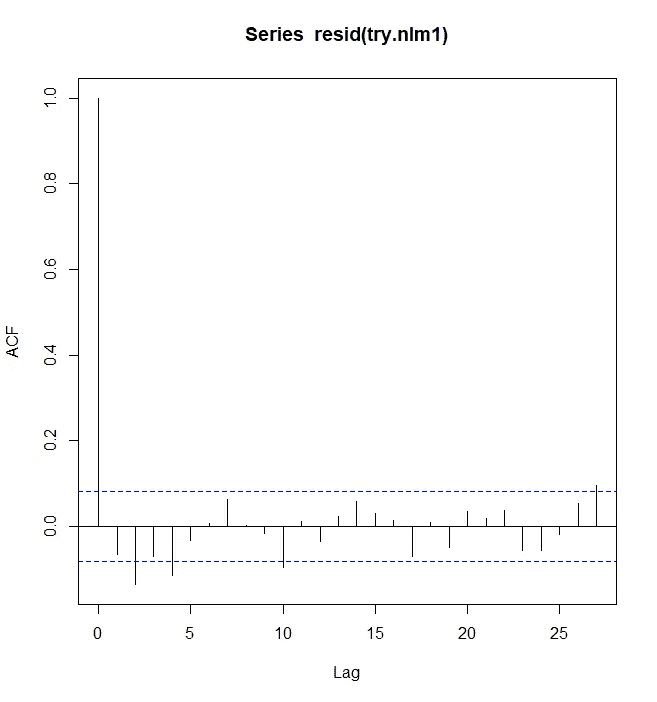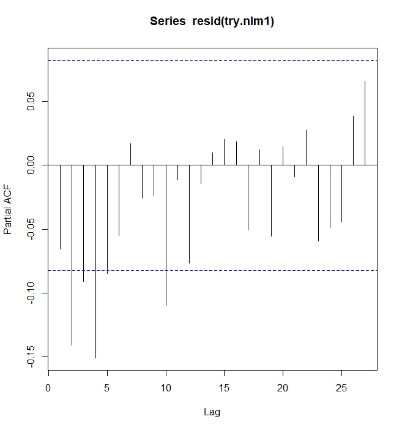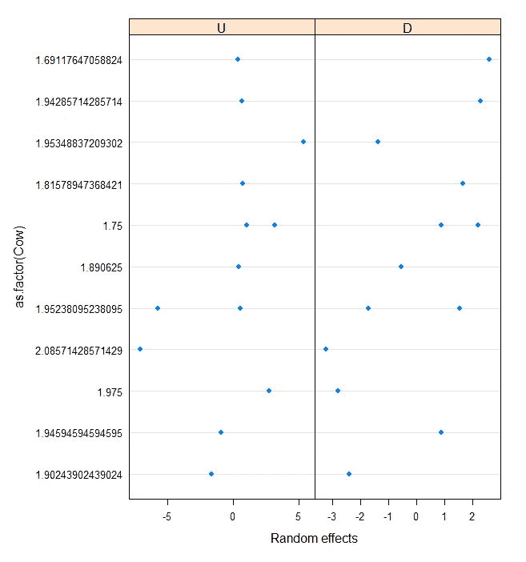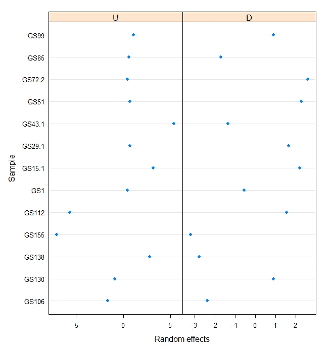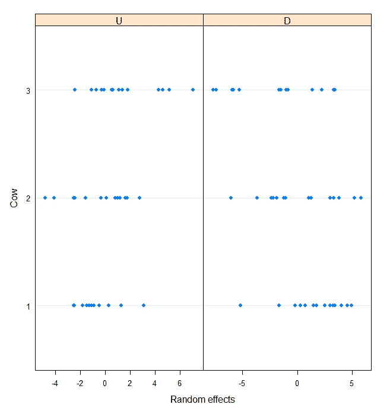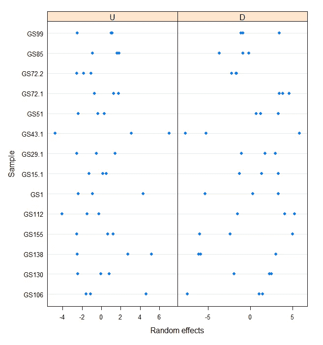

人们甚至可以通过对模型的误差部分建模来更深入地研究随机效应。这是 nlme 中的“关联”线，有几个选项可用。

我不得不说，每当有更多的东西被添加到模型中时，如果你幸运的话，以前的选择很容易就过时了。然而，大多数情况下，模型不会收敛或发出警告。这里发生的是后者，但无论如何它提供了输出。

使用 ARMA 技术建模相关性时(AR =自相关，MA =移动平均)，P 和 Q 分别定义 AR 和 MA 的参数。不适合胆小的人。

不能说下面描述的输出和图表说服了我在模型内部实现一个关联结构。话又说回来，我没有包括标准。此处固定效果中的 Sample2 标识符。这肯定会发挥作用。

```
> summary(nlm_auto)Nonlinear mixed-effects model fit by maximum likelihood
  Model: y ~ U + D * exp(-(Kd * x)) 
  Data: Grass_new 
     AIC      BIC   logLik
  3368.7 3429.415 -1670.35Random effects:
 Formula: list(U ~ 1, D ~ 1, Kd ~ 1)
 Level: id
 Structure: General positive-definite, Log-Cholesky parametrization
         StdDev      Corr         
U        2.540932294 U      D     
D        3.475426888 -0.214       
Kd       0.004192809 -0.953  0.498
Residual 4.064917201Correlation Structure: ARMA(1,3)
 Formula: ~1 | id 
 Parameter estimate(s):
      Phi1     Theta1     Theta2     Theta3 
0.07421349 0.14024498 0.14024498 1.00000000Fixed effects:  U + D + Kd ~ 1 
      Value Std.Error  DF  t-value p-value
U  19.58990 0.4965723 472 39.45025       0
D  50.43286 0.6703818 472 75.23006       0
Kd  0.02578 0.0008117 472 31.76226       0Correlation: 
   U       D     
D  -0.521       
Kd  0.120  0.128Standardized Within-Group Residuals:
        Min          Q1         Med          Q3         Max 
-3.50473556 -0.54586130 -0.03989232  0.54272121  2.70816333Number of Observations: 565
Number of Groups: 91
```

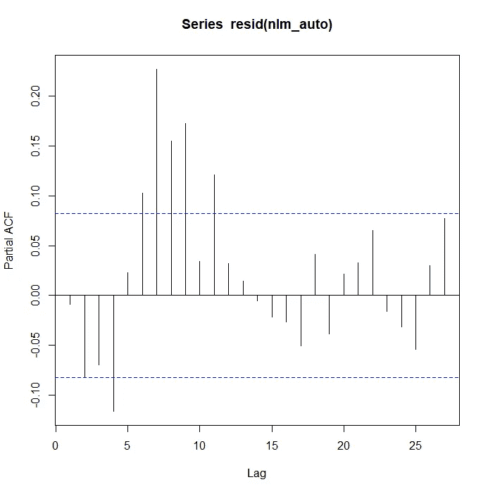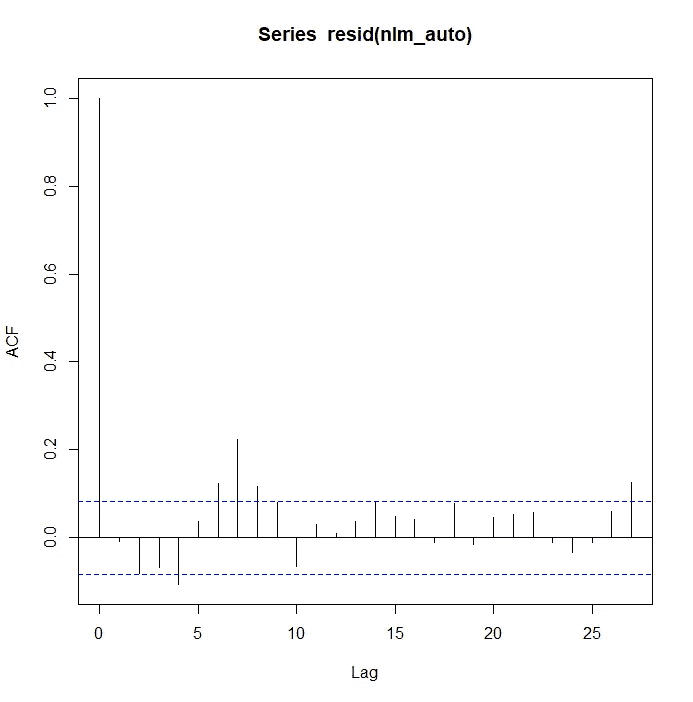

现在，到了最后一部分——预测！虽然我们展示了很多预测输出(原始预测和残差)，但下一行代码将很好地展示 NLMIXED 模型可以做什么以及它的用途。如果它能运行。

Code to create a new dataframe with a Trial and Cow-in-Trial hierarchy. Fixed and Random effect estimates are not split. After running the model, we create a new dataset and ask the model to provide predictions for each of the values of x. The plot below shows the results.

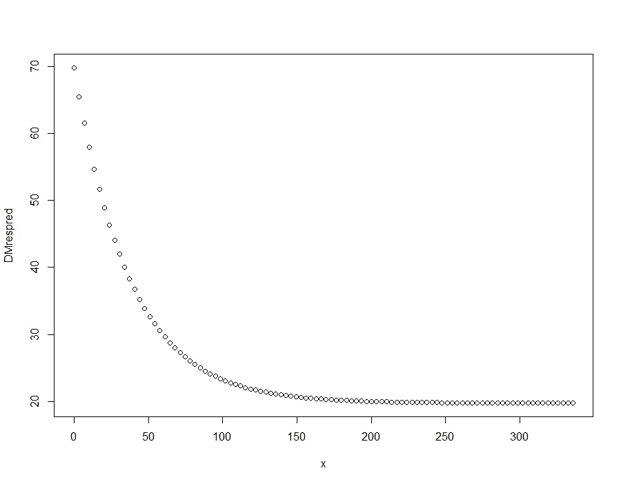

Looks like the models captures the biological part of the data. However, this pot is nothing fancy. Nested structures are not shown.

下面的代码使用了一种不同的方法，在原始数据集上应用了带有试验和试验中的母牛随机效应的模型。标准。没有应用 Sample2 变量，但肯定可以使用。

同样在这里，必须创建一个新的数据集，这次使用模型的嵌套结构。

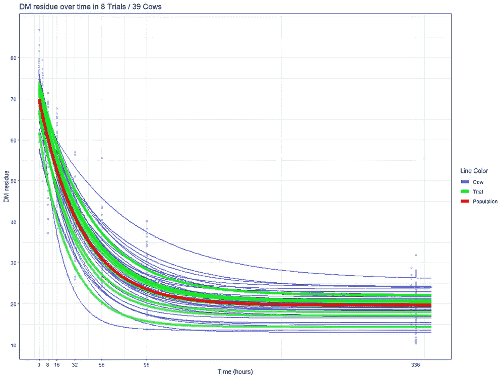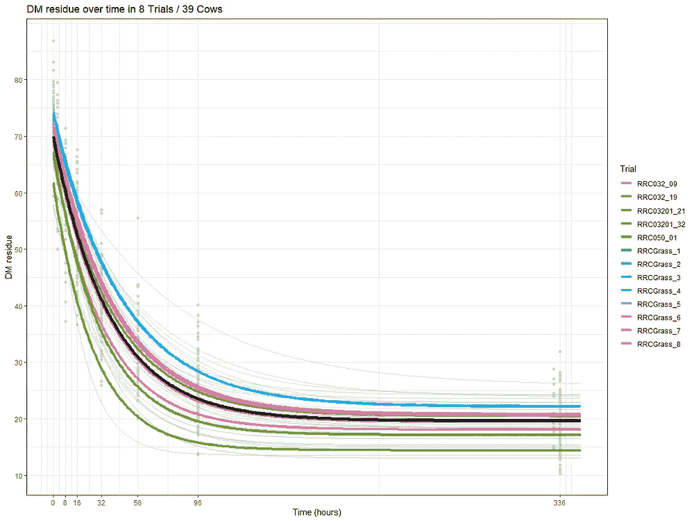

The results are beautiful, showing the population mean, trial means, and cow means in the plot to the left. The pot right shows the population mean and trial means, colored differently.

这最后两个情节把我带到了这篇文章的结尾。这是一个相当长的旅程，尽管帖子中充满了大量代码和图片，但它仍然只提供了 NLMIXED 所能做的有限视图。

那么，你还在等什么？抓住一个数据集，开始自己应用这些知识！我等不及要向你学习了！

[](/mlearning-ai/mlearning-ai-submission-suggestions-b51e2b130bfb) [## Mlearning.ai 提交建议

### 如何成为 Mlearning.ai 上的作家

medium.com](/mlearning-ai/mlearning-ai-submission-suggestions-b51e2b130bfb)