# 正态分布

> 原文：<https://medium.com/mlearning-ai/normal-distribution-e4252934dc3d?source=collection_archive---------5----------------------->

## 使用 R 和 Python

正态分布、高斯分布或钟形曲线是一种关于平均值对称的概率分布。它表明，与远离平均值的数据相比，接近平均值的数据更频繁。曲线下的面积是一。这在数据科学中非常重要，因为假设检验需要数据采用标准格式。线性和非线性回归都假设残差服从正态分布。在本文中，我们将学习以下主题

*   生成并可视化随机法向量
*   计算不同情况下的正态和标准正态曲线的 PDF 和 CDF。
*   计算 CDF 的逆的不同情况

Photo by [Naser Tamimi](https://unsplash.com/@tamiminaser?utm_source=medium&utm_medium=referral) on [Unsplash](https://unsplash.com?utm_source=medium&utm_medium=referral)

# 创建一个随机数向量

*   r 使用`rnorm(n, mean = 0, sd = 1)`生成`n`个平均值`0`和标准差`1`的随机数
*   Python 使用`np.random.normal(loc = 0, scale = 1, size = n)`生成平均值`0`和标准差`1`的`n`个正常数的向量。

## 稀有

可视化以 R 为底的大小为`100000`点的向量

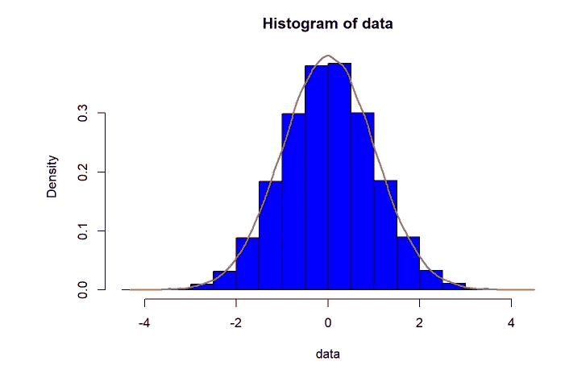

## 计算机编程语言

用 seaborn 可视化一个大小为`100000`点的向量

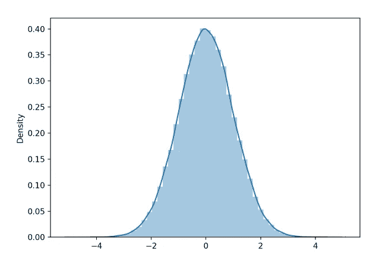

# 正态分布函数

*   r 有`dnorm(x, mean = 40, sd = 5)`功能，计算`mean = 40`的正常曲线值和`x`点的立架偏差`sd = 5`
*   Python 有`norm.pdf(42, loc=40, scale = 5)`函数，计算`mean = 40`的法向曲线值和`x`点的立位偏差`sd = 5`
*   我们还将在 R 和 Python 编程语言中实现以下公式来解决问题

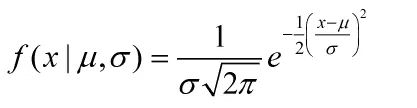

## 问题

如果 X 是一个带有`μ = 40`和`σ = 5.`的正态随机变量，在`x = 42`处找到其正态曲线的纵坐标。

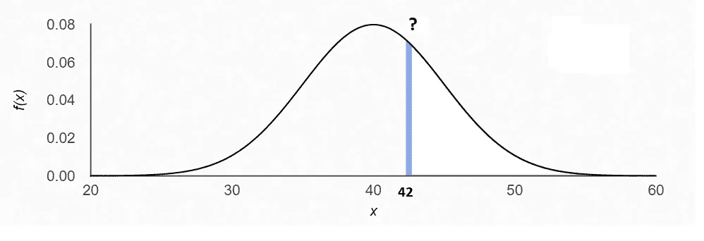

## 稀有

`x = 42, μ = 40, σ = 5`

**由用户定义的功能**

**通过基数-R 函数**

## 计算机编程语言

`x = 42, μ = 40, σ = 5`

**由用户定义的功能**

**由** `**scipy**` **功能**组成

# 标准正态分布

标准正态分布是正态分布函数的特例，其中`μ = 0`和`σ = 1`

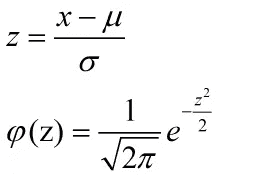

## 问题

如果`z`是一个带有`μ = 0`和`σ = 1.`的标准正态随机变量，求其在`z = 0.4`处的正态曲线的纵坐标。

## 解决办法

## 稀有

`z = 0.4, μ = 0, σ = 1`

## 计算机编程语言

`z = 0.4, μ = 0, σ = 1`

# 累积分布函数

## 案例 1

计算阴影曲线下的面积。

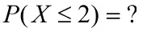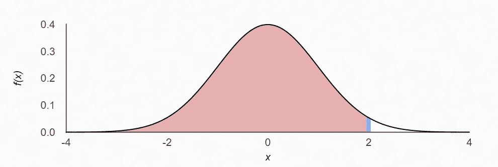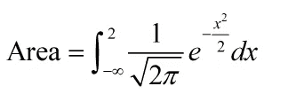

## 稀有

## 计算机编程语言

## 案例 2

计算阴影曲线下的面积。

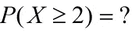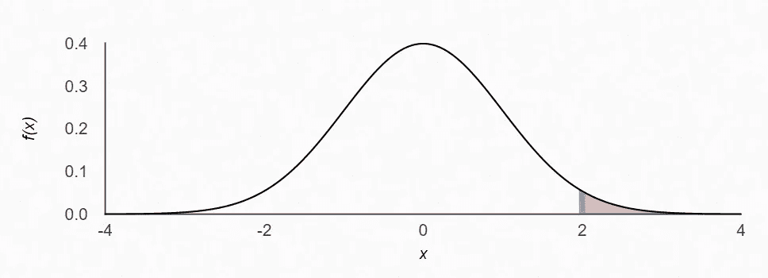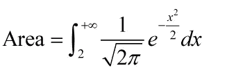

## 稀有

## 计算机编程语言

## 案例 3

计算阴影曲线下的面积。

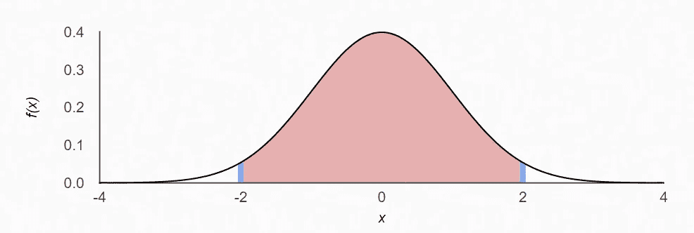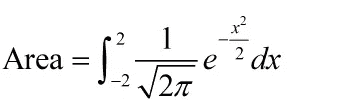

## 稀有

## 计算机编程语言

## 案例 4

计算阴影曲线下的面积。

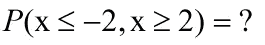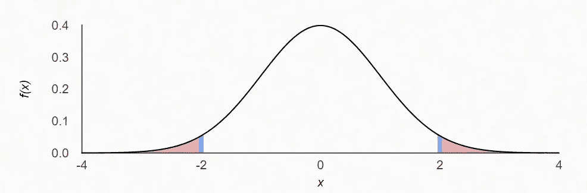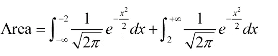

## 稀有

## 计算机编程语言

# 计算要点

## 案例 1

给定概率`p`，我们需要计算点`x`

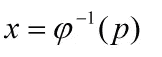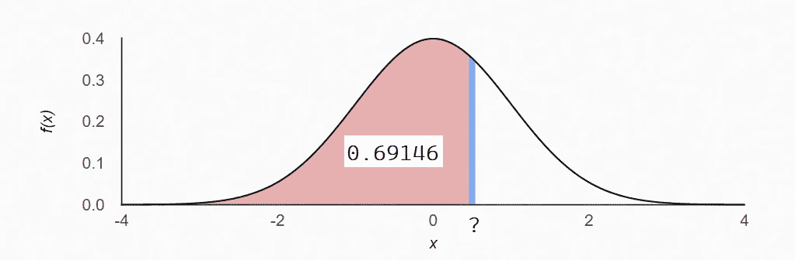

## 稀有

## 计算机编程语言

## 案例 2

给定概率`p`，我们需要计算点`x`

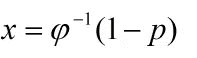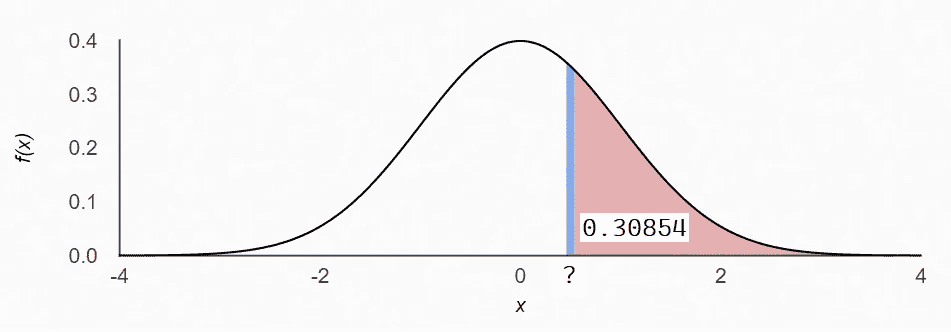

## 稀有

## 计算机编程语言

# 结论

在本文中，我们将学习如何生成一个随机标准数的向量，以及如何在 base-R 和 Python 的 seaborn 中可视化它们。我们还将学习如何计算正态曲线的 PDF 和 CDF，以及标准正态曲线和 CDF 的倒数。

 [## Mlearning.ai 提交建议

### 如何成为 Mlearning.ai 上的作家

medium.com](/mlearning-ai/mlearning-ai-submission-suggestions-b51e2b130bfb)