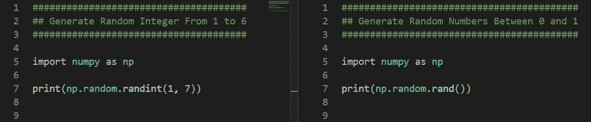

# NumPy 随机数

> 原文：<https://medium.com/mlearning-ai/numpy-random-numbers-75b42907e9c4?source=collection_archive---------1----------------------->

## 在 NumPy 中生成随机数

随机数在逻辑上是无法预测的，对于计算机加密、彩票、科学建模和赌博来说是必不可少的。随机数是机器学习的基石，因为它们被用作准备数据和学习算法的工具或功能，这些算法将输入数据映射到输出数据，以便进行预测。在本文中，我们将使用 NumPy 生成随机数，NumPy 是一个著名的用于数值计算的 python 库。在本文中，我们将学习以下主题

*   投掷硬币
*   滚动骰子
*   生成一个随机数向量
*   生成一个随机数矩阵
*   生成一个随机整数矩阵
*   从数字列表中随机选择一个数字
*   从数字列表中选择一个数字矩阵
*   打乱列表的元素

Photo by [Edge2Edge Media](https://unsplash.com/@edge2edgemedia?utm_source=medium&utm_medium=referral) on [Unsplash](https://unsplash.com?utm_source=medium&utm_medium=referral)

# 随机整数和随机数

*   `np.random.randint(1, 7)`生成一个从`1`到`6`的随机整数
*   `np.random.rand()`在`0`和`1`之间产生一个随机数

# 扔硬币三次

`np.random.randint(2)`接受参数`2`，因为它从`[0, 1]`生成一个随机整数。

*   `0`代表`tail`
*   `1`代表`head`

# 投掷两枚硬币三次

第一次抛硬币的结果产生结果`[1, 0]`，这意味着头在第一枚硬币上，尾在第二枚硬币上。

# 掷骰子两次

我们有一个骰子，掷两次，第一次产生随机数`3`，第二次产生结果`4`。

`np.random.randint(1, 7)`从`1`到`6`的产量结果。

# 掷两个骰子三次

`np.random.randint(1, 7, size = 2)`表示生成大小为`2`的从`1`到`6`的随机数。

*   第一次掷骰的结果是`[1, 6]`表示第一次掷骰的结果为`1`，第二次掷骰的结果为`6.`
*   第二次掷骰的结果是`[4, 4]`意味着第一次掷骰产生`4`，第二次掷骰也产生`4.`
*   第三次掷骰子的结果是`[5, 6]`表示第一次掷骰子的收益`1`和第二次掷骰子的收益`6.`

# 生成一个随机数

`np.random.rand()`产生一个从`0`到`1`的随机数

# 生成一个随机数向量

`np.random.rand(5)`生成一个`5`随机数的向量

# 生成随机数矩阵

*   `np.random.rand(4, 5)`生成顺序为`4-by-5`的随机数矩阵

# 生成随机整数矩阵

*   `np.random.randint(1, 9, size = (5, 3))`从编号`1`到`8`生成一个大小为`5-by-3`的矩阵。

# 从数字列表中选择一个数字

*   `np.random.choice([1, 2, 3, 4, 5, 6])`从参数给定的列表中返回一个数字。

# 从列表中选择一个随机数矩阵

`np.random.choice([1,2,3,4,5,6], size = (2, 5))`从列表`[1,2,3,4,5,6]`中生成一个顺序为`2-by-5`的矩阵。

# 打乱列表的元素

*   `shuffle()`就地改变元素的排列，从而改变原始数组。
*   `permutation()``permutation()`方法*返回*一个重新排列的数组，使得原来的数组不变。

# `shuffle()`

# `permutation()`

# 结论

在本文中，我们学习如何生成随机数和随机整数。我们学习如何从一个数字列表中选择一个数字和一个矩阵，并打乱列表中的元素。

 [## Mlearning.ai 提交建议

### 如何成为 Mlearning.ai 上的作家

medium.com](/mlearning-ai/mlearning-ai-submission-suggestions-b51e2b130bfb)