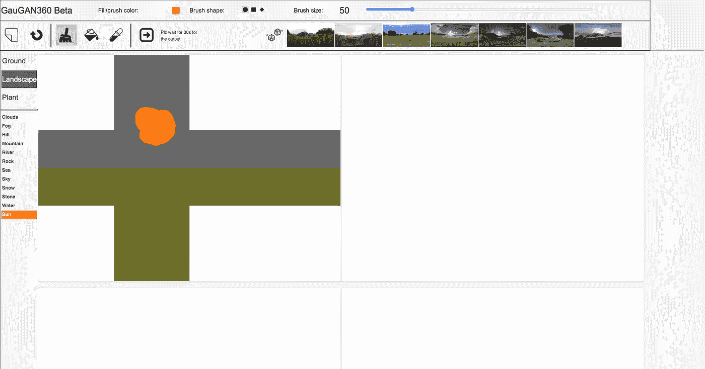

# NVIDIA GauGAN360:只需轻轻一点就能生成 HDRI

> 原文：<https://medium.com/mlearning-ai/nvidia-gaugan360-generate-hdri-with-a-single-click-2afb47b9a449?source=collection_archive---------4----------------------->

Photo by [Alina Grubnyak](https://unsplash.com/@alinnnaaaa?utm_source=medium&utm_medium=referral) on [Unsplash](https://unsplash.com?utm_source=medium&utm_medium=referral)

NVIDIA 的新人工智能模型 GauGAN360 可以被训练从粗糙的涂鸦中创建 8K 全景图，这对于任何 Omniverse 场景都是完美的！现在，3D 艺术家可以通过简单的网络界面为背景定制人工智能艺术。

[NVIDIA GauGAN360 Demo screenshot](http://imaginaire.cc/gaugan360/)

这对于任何正在寻找新 HDRIs 的 3D 艺术家来说都非常方便。你可以用几笔从你的想象中创造出 HDRI。

NVIDIA GauGAN360 是数十个 3D 内容创作程序之一，包括刚刚发布的 NeuralVDB 和 Kaolin Wisp，使生活变得更加轻松。这些新工具使数百万创意人员能够轻松创建高质量的 3D 设计。

## 前导页

> "使用 250 多个转换优化模板和一个无代码拖放构建器来提升您的销售线索和销售额."

[***在 Leadpages 的网站上了解更多信息*👈**](https://try.leadpages.com/cny71ysfm9h0)

因为除了产品设计之外，虚拟世界中还会有更多的内容出现在各种行业中，如交通、医疗保健、电信和娱乐。为了简化和缩短这一过程，NVIDIA 今天发布了新的研究和一套广泛的工具，为创作者使用神经图形的力量。

神经图形学是一个新的领域，它将人工智能和图形学结合起来，创建从数据中学习的图形。利用人工智能有助于艺术家和创作者自动化设计选择。这将重新定义虚拟世界是如何创建和模拟的。

*披露:本文中的一些链接可能是附属链接，如果您决定购买付费计划，可以免费向我提供补偿。*

 [## NVIDIA Neural Graphics 使内容创作对所有人开放| NVIDIA 博客

### 为游戏、包括元宇宙在内的虚拟世界、产品设计或…创建 3D 对象

blogs.nvidia.com](https://blogs.nvidia.com/blog/2022/08/09/neural-graphics-sdk-metaverse-content/)  [## Mlearning.ai 提交建议

### 如何成为 Mlearning.ai 上的作家

medium.com](/mlearning-ai/mlearning-ai-submission-suggestions-b51e2b130bfb)