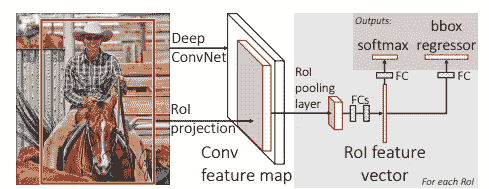
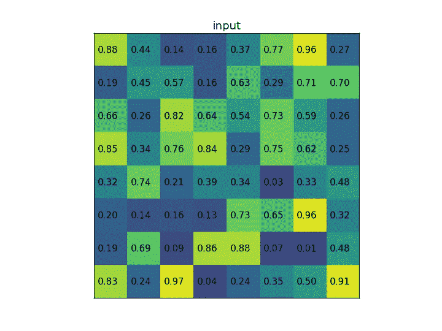
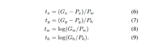
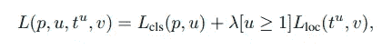
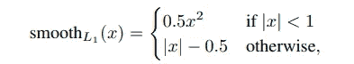

# 物体检测解释:快速 R-CNN

> 原文：<https://medium.com/mlearning-ai/object-detection-explained-fast-r-cnn-bc11e607411f?source=collection_archive---------1----------------------->

[Sharon McCutcheon](https://unsplash.com/@sharonmccutcheon) via [Unsplash](https://unsplash.com/photos/56m4k0pYz3s)

目标检测包括两个独立的任务，即分类和定位。R-CNN 代表基于区域的卷积神经网络。R-CNN 系列背后的关键概念是地区提案。区域建议用于定位图像中的对象。在接下来的博客中，我决定写一些在物体检测中使用的不同方法和架构。在这篇文章中，我将通过简要提及它与 R-CNN 的不同之处来展示更快的 R-CNN。

**先前:**

美国有线电视新闻网:

 [## 物体探测解释:R-CNN

### 基于区域的卷积神经网络

towardsdatascience.com](https://towardsdatascience.com/object-detection-explained-r-cnn-a6c813937a76) 

# RCNN 的问题

先前引入的 RCNN 的问题是它的计算成本。就我们所记得的，我们通过一种算法获得我们的建议区域，例如选择性搜索，之后我们必须调整所有东西的大小并通过一个网络。因此，调整和传递每一个作物是 RCNN 的一个瓶颈。

# 工作细节

Fast RCNN: Working Details. Source: [https://arxiv.org/pdf/1311.2524.pdf](https://arxiv.org/pdf/1504.08083.pdf).

快速 R-CNN 网络将整个图像和一组对象提议作为输入。然而，我们仍然需要通过我们的算法传递图像；引入 ROI 池层是为了克服上述问题。

首先，我们通过缩放我们的建议来获得 ROI 窗口，以便它与特征图的大小相匹配。为此，我们应该将原始值乘以*特征图尺寸/原始尺寸*。例如，假设图像尺寸为 1056x640，特征地图尺寸缩小到 66x40。在这种情况下，我们可以将建议的所有维度乘以 1/16 (66/1056=1/16 或 40/640=1/16)。因此，在这种情况下，空间比例将为 1/16。

因此，RoI max pooling 将 h × w ROI 窗口划分为 h × w(例如 7×7)的子窗口网格，每个子窗口的大小大约为 h/H × w/W。最后，执行 max-pooling 以获得每个子窗口的最大值。与标准最大池化一样，池化独立应用于每个要素地图通道。

ROI max pooling. Credits: [https://deepsense.ai/region-of-interest-pooling-explained/](https://deepsense.ai/region-of-interest-pooling-explained/)

当我们从我们的特征地图中裁剪 ROI 时，我们通过我们的网络传递它们来预测我们的类并调整预测的边界框。

# 正面和反面的例子

在我们提取我们的区域提案之后，我们还必须为它们添加标签以便进行培训。因此，作者将 IOU 至少为 0.5 的所有提案标上任何基本事实边界框及其相应的类别。但是，IOU 低于 0.3 的所有其他区域提案都被标记为背景。因此，其余的都被忽略了。

# 包围盒回归

Bounding-box regression. Source: [https://arxiv.org/pdf/1311.2524.pdf.](https://arxiv.org/pdf/1311.2524.pdf)

上图显示了 CNN 预测的三角洲。所以，x，y 是中心坐标。而 w、h 分别是宽度和高度。最后，G 和 P 分别代表地面实况包围盒和区域提议。值得注意的是，边界框丢失仅针对正样本进行计算。

# 多任务损失

Multi-task loss. Source: [https://arxiv.org/pdf/1311.2524.pdf](https://arxiv.org/pdf/1504.08083.pdf).

可以看出，回归损失仅针对阳性样本进行计算。本文中介绍的局域化损耗是平滑 L1 损耗，其形式如下:

Smooth L1 loss. Source: [https://arxiv.org/pdf/1311.2524.pdf](https://arxiv.org/pdf/1504.08083.pdf).

其中 x 是{x，y，w，h}的基本真实值和我们的预测值之间的差值之和。

然而，分类损失是众所周知的交叉熵损失。

# 一些遗言

可以看出，快速 RCNN 克服了与 RCNN 相关的一些问题。但是，它不再被使用的原因还有几个缺点。最大的缺点仍然是用于提议提取的选择性搜索算法。考虑到算法是在 cpu 上执行的，推理时间变得很慢。因此，我将写一些克服这些问题的其他算法，比如更快的 RCNN。

# 原文：<https://arxiv.org/pdf/1504.08083.pdf>