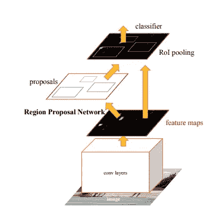
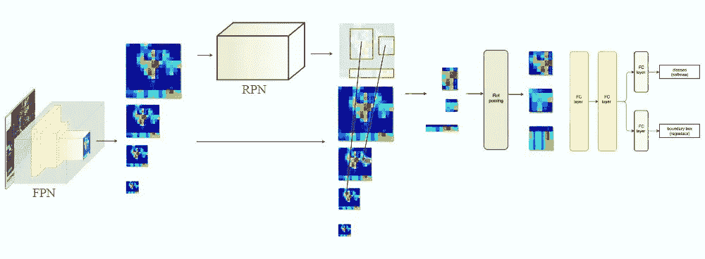
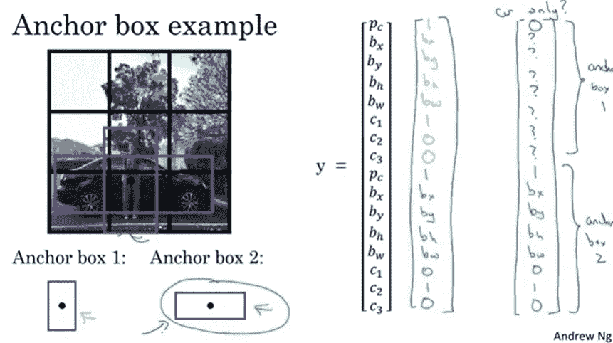
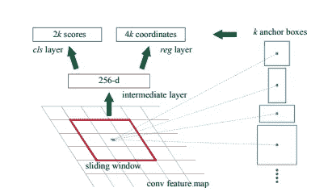
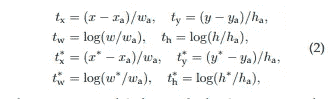
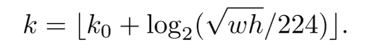

# 物体检测解释:更快的 R-CNN

> 原文：<https://medium.com/mlearning-ai/object-detection-explained-faster-r-cnn-23e7ab57991d?source=collection_archive---------2----------------------->

[Jo Coenen](https://unsplash.com/@jo_coenen) via [Unsplash](https://unsplash.com/photos/5UNYknY0MTA)

用简单的语言表达难懂的概念。

目标检测包括两个独立的任务，即分类和定位。R-CNN 代表基于区域的卷积神经网络。R-CNN 系列背后的关键概念是地区提案。区域建议用于定位图像中的对象。在接下来的博客中，我决定写一些在物体检测中使用的不同方法和架构。在本文中，我最终用更快的 R-CNN 结束了这个 R-CNN 系列。

**之前的**:

[RCNN](https://towardsdatascience.com/object-detection-explained-r-cnn-a6c813937a76)

[快速 RCNN](/mlearning-ai/object-detection-explained-fast-r-cnn-bc11e607411f)

[FPN](/mlearning-ai/object-detection-explained-feature-pyramid-networks-cf2621c8f7cc)

# 快速 RCNN 的问题

虽然快速 RCNN 克服了 RCNN 的一些问题，但建议区域仍然是通过运行在 CPU 上的选择性搜索算法来计算的，而网络通常运行在 GPU 上。所以推断时间变得相当慢。因此，更快的 RCNN 通过引入区域建议网络(rpn)克服了这个问题。

# 工作细节

Faster R-CNN is a single, unified network for object detection. Source:[https://arxiv.org/pdf/1506.01497.pdf](https://arxiv.org/pdf/1506.01497.pdf)

正如所看到的，当我们从主干网络获得我们的特征地图时，我们现在通过单独的网络传递它们，该网络是区域提议网络，其生成我们的提议。因此，我们现在训练一个单独的网络，而不是使用选择性搜索算法，这解决了与快速 RCNN 相关的问题。现在，我想一步一步地描述整个架构。

FPN based Faster RCNN

# 中枢网络

虽然作者利用传统的卷积网络进行特征提取，但我想详细阐述我以前的文章，并解释 RCNN 如何更快地利用 FPN。正如我们所记得的，FPN 制作了 P2-P5 专题地图，因此这些专题地图随后被输入到我们的区域提案网络中。这种修改大大改进了对象检测，因为它有助于检测各种规模的对象。因此，假设主干是我在上一篇文章中介绍的网络。

# 区域提案网络

## 锚箱

Anchor box example. source:[https://www.youtube.com/watch?v=RTlwl2bv0Tg](https://www.youtube.com/watch?v=RTlwl2bv0Tg)

在每个滑动窗口位置，我们同时进行 k 个不同的预测。上图是一个简单的例子，其中 k 等于 2。所以，有 k 个参考框被称为锚。每个锚点负责一个特定的比例和纵横比。该论文的作者使用了 3 个比例和 3 个长宽比，结果 k 为 9。对于一个 W × H 大小的卷积特征图，总共有 W *H*k 个锚。因此，对于特征图中的每个位置，RPN 产生 9 * 2(不是对象/对象)对象性分数和 9 * 4 锚增量。值得注意的是，每个锚点只能分配给 1 个对象。

## RPN 头

RPN head. source: [https://arxiv.org/pdf/1506.01497.pdf](https://arxiv.org/pdf/1506.01497.pdf)

在 FPN 框架中，从 FPN 获得的每个特征图在用于目标预测和边界盒回归的单独的 1 × 1 卷积滤波器被应用之前经过 3 × 3 卷积。这些 3 × 3 和 1 × 1 的卷积层被称为 RPN **头**。

对于训练 rpn，给每个锚点分配一个二进制类别标签(是否为对象)。两种锚的标签为正:(I)具有最大交叉联合(IoU)的锚与地面实况框重叠，或(ii)IoU 与任何地面实况框重叠至少 0.7 的锚。重要的是要注意，对于给定的基础事实框，可能有多个正锚。

如果对于所有地面实况框，锚的 IoU 比率低于 0.3，则将负标签分配给锚。所以，其他的就干脆丢弃了。

最后，使用我在以前的文章中介绍的公式来计算基本事实增量。

Delta calculation. source: [https://arxiv.org/pdf/1506.01497.pdf](https://arxiv.org/pdf/1506.01497.pdf)

其中 x_a 和 x*分别代表正锚和地面真值箱。

## 一些训练细节

RPN 可以通过反向传播和随机梯度下降进行端到端的训练。为了避免网络偏向负样本，作者试图保持正负锚的比例为 1:1。但是，如果没有足够的正面锚，他们会用负面锚填充一批。

## 投资回报池

通过应用 FPN，我们最终得到了不同比例(P2-P5)的多个特征图，因此我们需要一种策略来给特征图分配给定的 ROI。

ROI pooling strategy. Source:[https://arxiv.org/pdf/1612.03144v2.pdf](https://arxiv.org/pdf/1612.03144v2.pdf)

，其中 224 是原始输入图像尺寸，k_0 是 4。总的来说，k 是 FPN 的 P_k 层。因此，如果 k 是 5，我们选择 P5 并应用 ROI 池，然后通过快速 RCNN 传递它。

# 快速 RCNN

如上图所示，快速 RCNN 没有修改。因此，在我们从 ROI pooling 中获取作物后，我们只需将它传递给我们的快速 RCNN 分支。因此，该分支机构的所有培训细节保持不变。

# 一些遗言

由于 RPN，我们设法在我们的网络中生成一个提议区域，这使我们有机会在 GPU 上处理整个过程。因此，它大大加快了这一进程。此外，该方法给出了统一的、基于深度学习的对象检测系统。学习后的 RPN 还提高了区域提议质量和总体目标检测精度。我希望你喜欢学习 RCNN 系列，并期待看看其他有趣的算法。