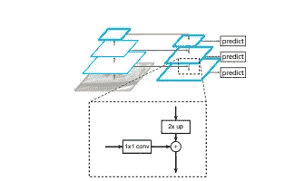
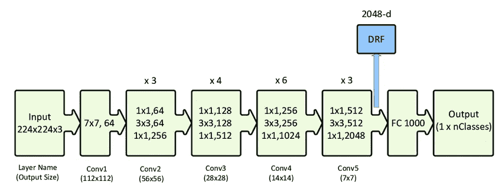
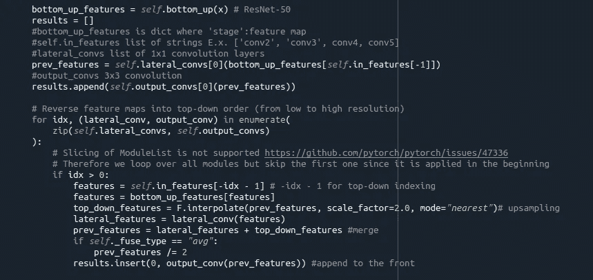
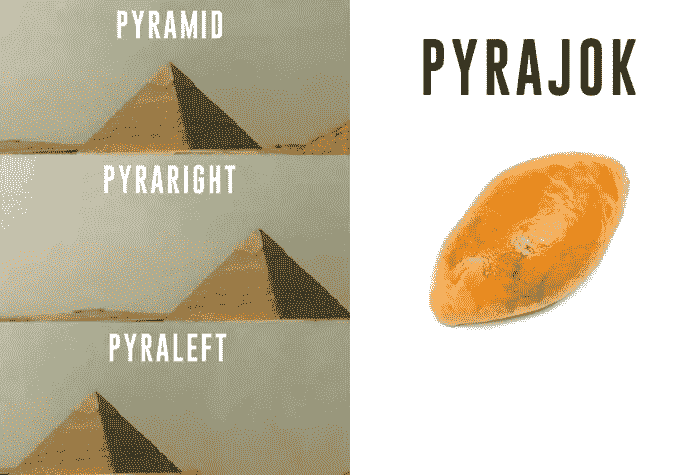

# 物体检测解释:特征金字塔网络

> 原文：<https://medium.com/mlearning-ai/object-detection-explained-feature-pyramid-networks-cf2621c8f7cc?source=collection_archive---------1----------------------->

[Sergey Pesterev](https://unsplash.com/@sickle) via [Unsplash](https://unsplash.com/photos/dnLmApcmNHg)

用简单的语言表达难懂的概念。

目标检测包括两个独立的任务，即分类和定位。R-CNN 代表基于区域的卷积神经网络。R-CNN 系列背后的关键概念是地区提案。区域建议用于定位图像中的对象。在接下来的博客中，我决定写一些在物体检测中使用的不同方法和架构。在本文中，我想在介绍更快的 R-CNN 之前先介绍特征金字塔网络。

# 上一个:

[RCNN](https://towardsdatascience.com/object-detection-explained-r-cnn-a6c813937a76)

[快速 RCNN](/mlearning-ai/object-detection-explained-fast-r-cnn-bc11e607411f)

# 介绍

The top-down pathway, merged by addition. Source: [https://arxiv.org/pdf/1612.03144.pdf](https://arxiv.org/pdf/1612.03144.pdf).

特征金字塔网络(FPN)的目标是改进具有不同级别语义的 ConvNet 的金字塔特征层次，并构建一个具有高级语义的特征金字塔。FPN 是通用的，进程独立于主干网，但它是使用 ResNet 引入的。该结构由自下而上的路径、自上而下的路径和横向连接组成。

# 自下而上途径

自底向上路径是主干网络的传统前馈计算，例如 ResNet。值得注意的是，我们特别关注比例步长为 2 的多个比例的特征地图，因为具有相同比例的特征地图被视为处于相同的**阶段。**众所周知，更深的架构能够捕捉更复杂的模式，因此每个**阶段**的最深层应该具有最强的特征。

ResNet 50 Architecture taken from [this paper.](https://www.researchgate.net/publication/338603223_Automatic_Hierarchical_Classification_of_Kelps_Using_Deep_Residual_Features)

作者使用上图中表示为 conv2、conv3、conv4 和 conv5 的残差块输出，在本文中称为 C2—C5。如图所示，步幅分别为 4、8、16 和 32。它们不使用 conv1 的输出，因为它的存储器空间很大。

# **自上而下路径**

自上而下路径采用从更深阶段获得的更高分辨率特征，并使用最近邻方法对空间上更粗糙但语义上更强的特征图进行上采样。随后，它们通过使用横向连接的自下而上路径的特征得到增强。横向连接添加(元素方式)上采样的特征图和来自自底向上路径的对应特征图，其大小相同。然而，重要的是要注意，后一个特征图首先经历 1x1 卷积，因为它通过减少维数(D x H x W)来帮助减少计算成本。最后，在合并之后，输出特征图经历 3×3 卷积以减少上采样的混叠效应。这些最终的特征地图在本文中被称为 P2-P5。

Commented piece of code of Top-down pathway. Source:[https://github.com/facebookresearch/detectron2](https://github.com/facebookresearch/detectron2)

# **一些遗言**

[Funny](https://9gag.com/funny?ref=post-section) via [9GAG](https://9gag.com/gag/aj8nD2q)

特征金字塔网络显著提高了对象检测问题的性能，因此它经常与两阶段检测器一起使用，例如我将很快介绍的 fast-RCNN。我想先介绍 FPN，这样更容易逐渐积累知识。不管怎样，我很快会更详细地谈论 FPN，所以在我深入细节之前，这只是一个必要的介绍。谢谢你。

**原文:** [**用于物体检测的特征金字塔网络**](https://arxiv.org/pdf/1612.03144.pdf)