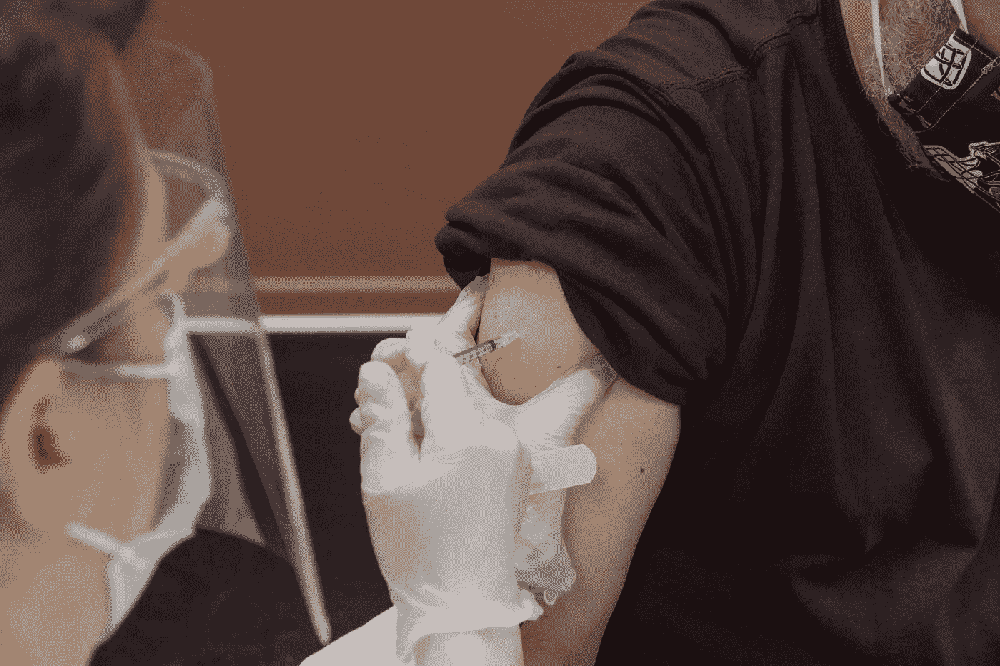
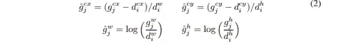
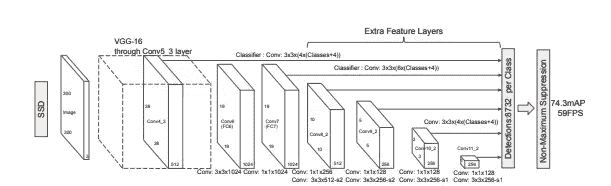
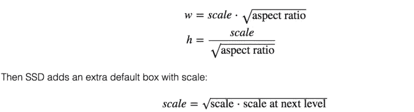
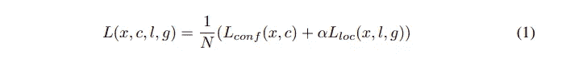
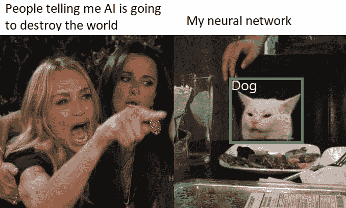

# 解释的对象检测:单次发射多盒检测器

> 原文：<https://medium.com/mlearning-ai/object-detection-explained-single-shot-multibox-detector-c45e6a7af40?source=collection_archive---------0----------------------->

[Steven Cornfield](https://unsplash.com/@stevencornfield) via [Unsplash](https://unsplash.com/photos/jWPNYZdGz78)

简单语言中的硬概念。

目标检测由两个独立的任务组成，即分类和定位。上次我报道了 R-CNN 系列的物体探测器。R-CNN 系列目标检测器由两个阶段组成，即区域建议网络和分类与盒细化头。然而，现在我们正在转向单级物体探测器。在本文中，我将介绍单次发射多盒探测器(SSD)。

**上一次**:

[RCNN](https://towardsdatascience.com/object-detection-explained-r-cnn-a6c813937a76)

[快速 RCNN](/mlearning-ai/object-detection-explained-fast-r-cnn-bc11e607411f)

[FPN](/mlearning-ai/object-detection-explained-feature-pyramid-networks-cf2621c8f7cc)

[更快的 RCNN](/mlearning-ai/object-detection-explained-faster-r-cnn-23e7ab57991d)

# **包围盒回归**

与 fast R-CNN 一样，作者回归到默认边界框(d)的中心(cx，cy)及其宽度(w)和高度(h)的偏移。因此，公式如下所示:

Bounding box regression. Paper: [https://arxiv.org/pdf/1512.02325.pdf](https://arxiv.org/pdf/1512.02325.pdf)

# 体系结构

SSD Architecture. Paper: [https://arxiv.org/pdf/1512.02325.pdf](https://arxiv.org/pdf/1512.02325.pdf)

上图显示了以 VGG-16 为中枢的架构。我将通过将其分解为 3 个部分来解释该体系结构:主干、辅助卷积和预测卷积。为了您的方便，我还将提供一些代码。

# 基础网络

我想*强调一下*下面的例子是在假设输入图像的尺寸是 300×300 的情况下提供的，就像原纸一样。

由此可见，我们正在利用一个简单而著名的 VGG-16 网络来提取 ***conv4_3*** *和***T21【conv 7】**的特征。此外，我们可以注意到特征尺寸分别是(N，512，38，38)和(N，1024，19，19)。我希望这一部分简单明了，足以让我们继续讨论阿克苏利亚回旋

# 辅助卷积

辅助卷积使我们能够在 VGG-16 基础网络上获得额外的功能。这些层的大小逐渐减小，允许以多种比例预测检测结果。因此，我们传递到网络中的输入是从 VGG-16 网络获得的 **conv7** 特征。由此可见，在应用卷积和 ReLU 激活函数时，应保留中间特征，即 **conv8_2、conv9_2、conv10_2 和 conv11_2** 。请慢慢看代码和特征图的**尺寸**

# 选择默认边界框

这听起来可能有点吓人，但不要担心，它仍然很容易掌握。默认边界框是手动选择的。每个要素地图图层都分配有一个比例值。例如， **Conv4_3** 以最小比例 0.2(或有时 0.1)检测对象，然后线性增加到比例 0.9，用于 **conv11_2** (从辅助卷积获得)。此外，我们可以注意到，在每个特征图中，每个位置都有一定数量的先验框。对于做 4 个预测的图层，SSD 使用 4 个不同的纵横比，分别是 1，2，0.5 和 *sqrt(s_k * s_(k+1))* ，其中 *s_k* 是 *kth* 特征图的一个比例值。通常，它被定义为纵横比为 1 时计算的附加比例。那么默认框的宽度和高度计算如下:

现在，让我们用下面这段代码来总结一下。

其中它返回由 SSD 做出的 8732 个预测的 8732 个先前框。

# 预测卷积

这可能看起来很复杂，但它基本上获得了我们从基本 VGG-16 和辅助卷积中获得的所有特征图，并应用卷积层来预测每个特征图的类别和边界框。花点时间去理解它，并通过注意特征图的尺寸来确保你能跟上。

# 包裹

现在让我们把它们放在一起，看看最终的架构，如下所示。

请注意，较低级别的特征(conv4_3_feats)具有相当大的比例，因此我们采用 L2 范数并重新调整其比例。重新缩放因子最初设定为 20，但在反向推进过程中会对每个通道进行学习。

# **损失**

Loss. Paper: [https://arxiv.org/pdf/1512.02325.pdf](https://arxiv.org/pdf/1512.02325.pdf)

正如所看到的，我们已经从 R-CNN 系列的前几篇文章中熟悉了它。定位损失是 L1 平滑损失，而分类损失是众所周知的交叉熵损失。

# 匹配策略

在训练期间，我们需要确定哪个生成的先验盒应该对应于我们的基础事实盒，以包括在损失计算中。因此，我们将每个基础事实框与具有最高 Jaccard 重叠的在先框进行匹配。此外，我们还挑选具有至少 0.5 的重叠的在先框，以允许网络预测多个重叠框的高分。

# 硬负开采

在匹配步骤之后，大多数先前/默认框被用作负样本。然而，为了避免正样本和负样本之间的不平衡，我们将比率保持在最多 3:1，因为这将导致更快的优化和稳定的学习。同样，定位损失仅在正(非背景)先验上计算。

# 下一步是什么？

虽然我已经讨论了本文的技术细节，但我想分享一篇文章，从中您可以找到更多关于各种对象检测算法(包括 SSD)的具体限制、缺点和优点。它还提供了关于何时使用特定算法的深刻见解。请通过以下方式阅读更多信息:

 [## 对象检测算法和库- neptune.ai

### 对象检测在图像中找到并识别事物，这是深度学习的最大成就之一…

海王星. ai](https://neptune.ai/blog/object-detection-algorithms-and-libraries) 

# 一些遗言

我希望我设法让 SSD 易于理解和掌握。我试着用代码，这样你就能想象这个过程。慢慢理解吧。还有，如果你试着自己用就更好了。下一次我将写关于 YOLO 系列的物体探测器。

原文：<https://arxiv.org/pdf/1512.02325.pdf>