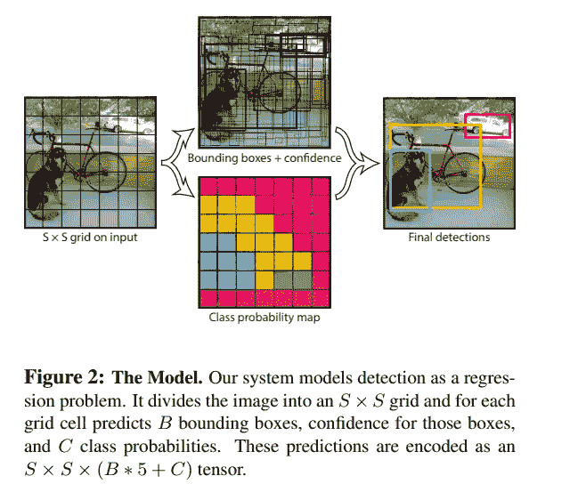

# 物体探测解释:YOLO v1。

> 原文：<https://medium.com/mlearning-ai/object-detection-explained-yolo-v1-fb4bcd3d87a1?source=collection_archive---------0----------------------->

[Marten Newhall](https://unsplash.com/@laughayette) via [Unsplash](https://unsplash.com/photos/uAFjFsMS3YY)

用简单的语言表达难懂的概念。

目标检测包括两个独立的任务，即分类和定位。这次你正在阅读另一系列的物体探测器，代表你只看一次。作为 SSD，YOLO 是一个单一的神经网络，直接从输入图像预测边界框和类概率。有许多文章简要解释了 YOLO 的每个版本；然而，我想提供更多的技术细节，所以我把它分成几篇文章。

**之前的**:

[RCNN](https://towardsdatascience.com/object-detection-explained-r-cnn-a6c813937a76)

[快速 RCNN](/mlearning-ai/object-detection-explained-fast-r-cnn-bc11e607411f)

[FPN](/mlearning-ai/object-detection-explained-feature-pyramid-networks-cf2621c8f7cc)

[更快的 RCNN](/mlearning-ai/object-detection-explained-faster-r-cnn-23e7ab57991d)

[固态硬盘](/mlearning-ai/object-detection-explained-single-shot-multibox-detector-c45e6a7af40)

# 统一检测

paper: [https://arxiv.org/pdf/1506.02640.pdf](https://arxiv.org/pdf/1506.02640.pdf)

YOLO 系统将输入图像分解成 SxS 网格。如果对象的中心落在网格单元中，则分配该单元用于检测它。此外，YOLO 预测每个网格单元的 B 边界框和置信度得分。置信度得分表示边界框包含对象(不是类别)的可能性。因此，每个边界框有 5 个预测:x，y，w，h 和置信度得分，其中(x，y)相对于网格单元而(w，h)相对于整个图像。

作者将置信分数定义为概率(目标)*真实情况。所以，如果单元格不包含对象，置信度得分应该为零；否则，它应该等于预测的和地面真相框之间的 IOU。此外，YOLO 预测每个格网像元的 C 类概率(不考虑边界框的数量)。所以有 S * S * (B * 5 + C)预测。

为了在 Pascal VOC 上评估 YOLO，参数设置如下:S = 7，B = 2，C = 20，意味着每个图像有 7 * 7 * (2 * 5 + 20)个预测。

# 电力网设计

该网络由 24 个卷积层和 2 个全连接层组成。此外，泄漏 ReLU 被用作激活功能。

## 建筑:

上面的代码演示了架构的 Pytorch 实现。CNN 的简要描述可以从*arc titure _ CFG，*其中显示了伴随着 Maxpooling 层的 24 个卷积块。请注意，一些块对重复了 4 或 2 次。最后， *_create_fcs* 方法显示了 2 个完全连接的层和漏 ReLU 激活函数。如上所述，该架构应该输出 S * S * (C + B * 5)预测。

# 培养

Loss function. Paper: [https://arxiv.org/pdf/1506.02640.pdf](https://arxiv.org/pdf/1506.02640.pdf)

上图显示了作者提出的损失函数。如图所示，有两个超参数 lambda_coord 和 lambda_noobj，分别设置为 5 和. 5。由于 lambda_noobj，作者克服了大量单元不包含任何对象的问题，这可能导致模型不稳定。此外，采用平方根，以便大盒子中的小偏差没有小盒子中的小偏差重要。

# 一些遗言

YOLO v1 是一种简单快速的物体探测器，适用于依赖实时预测的应用。然而，这种体系结构有几个限制。例如，每个网格单元只能有一个类。还有，有一些泛化的问题。因此，我们现在要研究整个 YOLO 系列，看看它是如何改进的。花点时间理解代码，我留下了注释，这样更容易理解。还有，看一下原论文，确保自己理解清楚。谢谢大家！

原文：<https://arxiv.org/pdf/1506.02640.pdf>