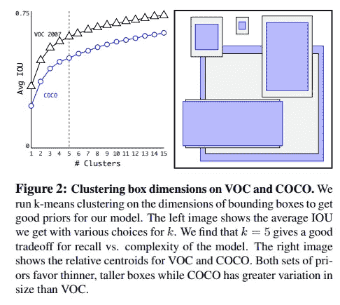
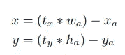
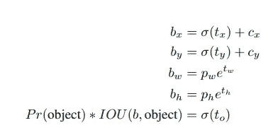
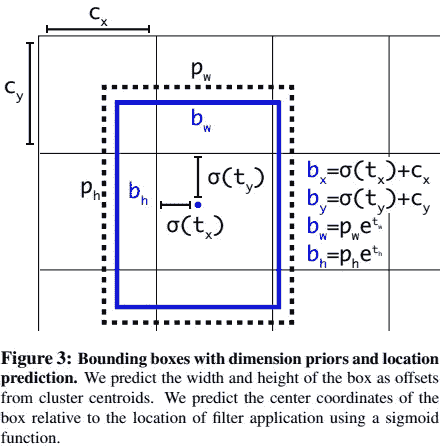
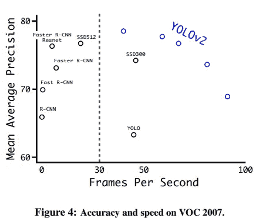
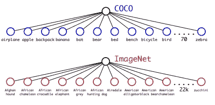
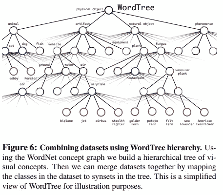
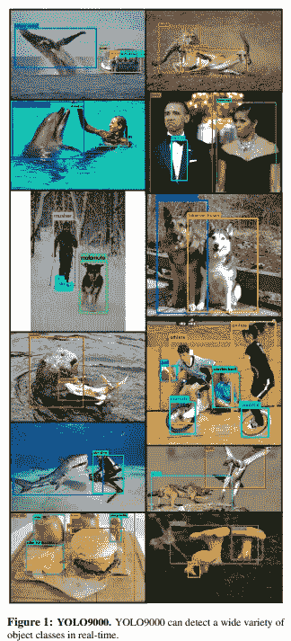

# 物体探测解释:YOLO v2。

> 原文：<https://medium.com/mlearning-ai/object-detection-explained-yolo-v2-3e3086789ffb?source=collection_archive---------1----------------------->

YOLO v2-更好、更快、更强

在我的目标检测系列之前，我讨论并介绍了 YOLO v1 架构。对于 YOLO v2，我总结了作者添加的修改的所有要点。作者引入了许多修改，但我希望你非常熟悉 YOLO v1，因为它将帮助你更快、更好、更强地理解 YOLO v2。

原文:YOLO9000:更好更快更强:【https://arxiv.org/pdf/1612.08242v1.pdf

**上一个**:

[RCNN](https://towardsdatascience.com/object-detection-explained-r-cnn-a6c813937a76)

[快速 RCNN](/mlearning-ai/object-detection-explained-fast-r-cnn-bc11e607411f)

[FPN](/mlearning-ai/object-detection-explained-feature-pyramid-networks-cf2621c8f7cc)

[更快的 RCNN](/mlearning-ai/object-detection-explained-faster-r-cnn-23e7ab57991d)

[固态硬盘](/mlearning-ai/object-detection-explained-single-shot-multibox-detector-c45e6a7af40)

[YOLO v1](/mlearning-ai/object-detection-explained-yolo-v1-fb4bcd3d87a1)

# 较好的

作者表示，与 Fast-RCNN 相比，YOLO v1 会产生更多的定位错误，并且它的召回率也相对较低。因此，为了解决上述问题，他们引入了以下修改:

## 1.批量标准化(BN)

BN 层是在 YOLO v1 中的每个卷积层之后引入的，因此作者在 mAP 方面获得了大约 2%的改进。

## 2.高分辨率分类器

YOLO v1 用 224 × 224 的图像分辨率训练分类器，并提高到 448 用于检测。然而，在开始训练网络进行检测之前，YOLO v2 首先在 ImageNet 上将它的分类器直接微调为 448 × 448 分辨率 10 个时期。这使得平均动脉压提高了 4%。

## 3.带锚盒的卷积

作者从 YOLO v1 中移除了完全连接的层(你可以参考我之前关于 YOLO v1 的文章)，并使用锚框来预测边界框。此外，他们删除了一个池层，并将输入分辨率从 448×448 更改为 416 输入图像。这样做是因为他们需要在我们的特征地图上有奇数个位置，所以只有一个中心单元。结果，他们在 mAP 方面的性能略有下降，但在召回率方面有很大提高，大约为 7%。

## 4.维度群

锚箱在 YOLO 使用时有两个问题。首先，我们需要为网络选择好的先验，即锚盒，这样网络就更容易学习。因此，作者在训练集包围盒上采用 K-Means 聚类。

**事情是这样的:**

Image from the paper: [https://arxiv.org/pdf/1612.08242v1.pdf](https://arxiv.org/pdf/1612.08242v1.pdf)

a)他们选择的距离函数如下:d(框，形心)= 1iou(框，形心)。

b)他们使用不同的 *k* 值运行 K-Means，并发现 k=5 在模型复杂性和高召回率之间的*T5 之间给出了一个很好的折衷。*

**5。直接位置预测**

遇到的第二个问题是模型不稳定。因此，在过去，区域建议网络 *t_x* 和 *t_y* ，而中心坐标 *(x，y)* 计算如下:

Image from the paper: [https://arxiv.org/pdf/1612.08242v1.pdf](https://arxiv.org/pdf/1612.08242v1.pdf)

然而，这个公式是不受约束的，因此它导致不稳定性。因此，作者使用以下公式:

Image from the paper: [https://arxiv.org/pdf/1612.08242v1.pdf](https://arxiv.org/pdf/1612.08242v1.pdf)

其中网络预测 *t_x，t_y，t_w，t_h，t_o* (对象性)。同时，(c_x，c_y)从图像的左上角偏移，并且 *p_w* 和 *p_h* 是先前的边界框的宽度和高度。可以看到，地面真值是以[0，1]的范围为界的(sigmoid 激活)。

由于维度聚类以及直接预测包围盒*中心位置，*作者获得了大约 5%的改进。

Image from the paper: [https://arxiv.org/pdf/1612.08242v1.pdf](https://arxiv.org/pdf/1612.08242v1.pdf)

## 6.多尺度训练

网络不是固定输入图像大小，而是每 10 个时期从以下 32 的倍数中随机选择不同的输入分辨率:{320，352，…，608}。这种制度鼓励网络在各种输入维度下表现良好。此外，它在速度和准确性之间提供了一个简单的折衷。

Image from the paper: [https://arxiv.org/pdf/1612.08242v1.pdf](https://arxiv.org/pdf/1612.08242v1.pdf)

# 更快的

## 1.暗网-19

作者提出了一种新的主干网 Darknet-19，它有 19 个卷积层和 5 个最大池层。处理一张图像需要 55.8 亿次运算；然而，在 ImageNet 上，最高准确率达到 72.9%，最高准确率达到 91.2%。

## 2.分类培训

作者利用标准的扩充。首先，他们以 224 × 224 的输入分辨率训练他们提出的主干，并在 10 个时期内以更大的尺寸 448 对其进行微调。更多细节请参考原论文。

# 更强壮的

有多个数据集用于分类和检测。他们能结合在一起吗？请注意，作者提出 YOLO9000，而不是 YOLO v2，只是出于这个原因。他们合并了两个数据集，获得了 9000 多个类，因此这一部分是关于 YOLO9000 如何被训练的。

## 1.结合

Image from the paper: [https://arxiv.org/pdf/1612.08242v1.pdf](https://arxiv.org/pdf/1612.08242v1.pdf)

*   **微软 COCO** 包含100k 的图片，有 80 个类，检测标签，类比较通用，比如“狗”或者“船”。
*   **ImageNet** 有**1300 万张图片，有 22k 个类别，分类标签，类别更具体像“诺福克梗”、“约克夏梗”，或者“贝德灵顿梗”。**

**然而，有些种类如“狗”和“诺福克梗”是相互排斥的。**

**为了合并，使用了单词树:**

****

**Image from the paper: [https://arxiv.org/pdf/1612.08242v1.pdf](https://arxiv.org/pdf/1612.08242v1.pdf)**

**如上所示，作者使用 WordTree 构建了一个视觉概念的层次树。所以，“诺福克梗”也被贴上“狗”和“哺乳动物”的标签。总共有 9418 个班级。**

## **2.联合分类和检测**

*   **作者使用 3 个先验，而不是 5 个，来限制输出大小。**
*   **对于检测图像，损失通常反向传播。**
*   **对于分类图像，只有分类损失在标签的相应级别或以上被反向传播。**

## **3.结果**

*   **实现了 19.7%的 mAP。**

****

**Image from the paper: [https://arxiv.org/pdf/1612.08242v1.pdf](https://arxiv.org/pdf/1612.08242v1.pdf)**