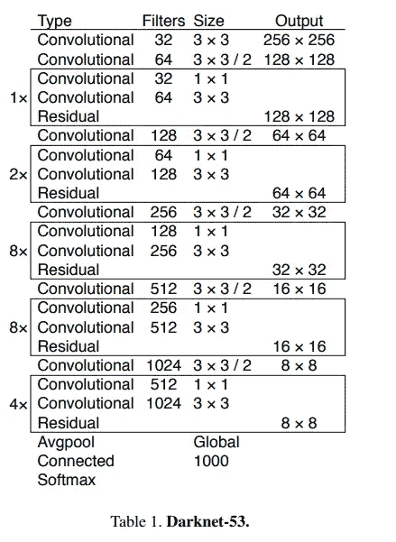
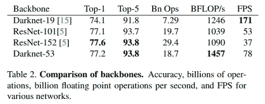
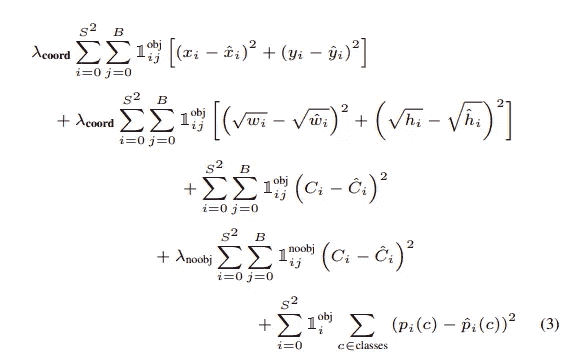

# 物体探测解释:YOLO v3。

> 原文：<https://medium.com/mlearning-ai/object-detection-explained-yolo-v3-fdf83cc78d25?source=collection_archive---------0----------------------->

我终于在 YOLO v3 上写了这篇文章。YOLO v2 有一些重要的改进。总的来说，它更大更准确。然而，它仍然很快，因为在 320 x 320 时，它能够在 28.2 mAP 下在 22 毫秒内运行，这与 SSD 一样准确，但速度快三倍。这里我只关注 YOLO v2 的不同和改进。

原文:YOLOv3:一个增量的改进[https://arxiv.org/pdf/1804.02767.pdf](https://arxiv.org/pdf/1804.02767.pdf)

**先前的**:

[RCNN](https://towardsdatascience.com/object-detection-explained-r-cnn-a6c813937a76)

[快速 RCNN](/mlearning-ai/object-detection-explained-fast-r-cnn-bc11e607411f)

[FPN](/mlearning-ai/object-detection-explained-feature-pyramid-networks-cf2621c8f7cc)

[更快的 RCNN](/mlearning-ai/object-detection-explained-faster-r-cnn-23e7ab57991d)

[固态硬盘](/mlearning-ai/object-detection-explained-single-shot-multibox-detector-c45e6a7af40)

[YOLO v1](/mlearning-ai/object-detection-explained-yolo-v1-fb4bcd3d87a1)

[YOLO v2](/mlearning-ai/object-detection-explained-yolo-v2-3e3086789ffb)

# 暗网-53

YOLO v2 推出了 darknet-19，这是一个 19 层的网络，补充了 11 层用于对象检测。然而，由于拥有 30 层架构，YOLO v2 常常难以检测到小物体。因此，作者引入了连续的 3 × 3 和 1 × 1 卷积层，之后是一些允许网络更深的快捷连接。因此，作者介绍了他们的 Darknet-53，如下所示。

Source: [https://arxiv.org/pdf/1804.02767.pdf](https://arxiv.org/pdf/1804.02767.pdf)

暗网-53 比暗网-19 强大得多。此外，它比 ResNet-101 或 ResNet-152 更有效。

Results on ImageNet. Source: [https://arxiv.org/pdf/1804.02767.pdf](https://arxiv.org/pdf/1804.02767.pdf)

他们得出结论，Darknet-53 更好地利用了 GPU，使其评估更有效，从而更快。这可以通过观察来解释，ResNets 有太多的层，并且不是很有效。

# 跨尺度预测

YOLOv3 预测了 3 种不同比例的方框，在这些比例下，使用与特征金字塔网络(FPN)相似的概念提取特征。在 COCO 的实验中，YOLOv3 在每个尺度上预测 3 个框，因此张量是 N×N×[3∫(4+1+80)]，其中 4 是边界框偏移，1 是对象预测，80 是类预测。

和在 FPN 一样，作者采用了 2 张先前的特征地图，并将它们向上采样了 2 倍。同时，它们还从网络的早期获取特征图，并将其与向上采样的特征图连接，之后我们从向上采样的特征中获得更有意义的语义信息，并从早期的特征图中获得更细粒度的信息。最后，它们通过更多的卷积层，最终预测出一个相似的张量，尽管现在是原来的两倍。

接下来，再次执行相同的过程，以预测最终比例的盒子。因此，第三规模受益于网络早期的所有先前计算和细粒度特征。

we use

上面的 pytorch 代码显示了 YOLO v3 修改后的架构。通过*配置*对象*可以看到概览。*如我们所见，在我们对特征地图进行上采样后，我们将它与我们在早期阶段获得的地图连接起来，后者存储在 *route_connections* 列表中。因此，我们总共执行 3 次规模预测，并返回 3 个预测张量来计算损失。

# 损失函数的变化

Loss function. Paper: [https://arxiv.org/pdf/1506.02640.pdf](https://arxiv.org/pdf/1506.02640.pdf)

上图描述了 YOLO 版本 1 中引入的损失函数。YOLO v3 用交叉熵误差项代替最后三个平方误差项。因此，通过逻辑回归来预测对象置信度和类别预测。

<script src=”

以上要点显示了 Pytorch 对 YOLO v3 使用的 loss 的实现。注意，我假设你已经知道 YOLO v1 和 YOLO v2 的细节。

# 类别预测

作者通过移除 softmax 来允许多类分类，因为它对于良好的性能是不必要的。所以他们简单地使用独立的逻辑分类器。在训练期间，作者利用众所周知的二元交叉熵损失进行分类预测。

该公式在更复杂的领域中是有效的，如开放图像数据集，其具有许多重叠的标签(即，女人和人)。多标记方法可以更好地模拟数据。

# 一些遗言

您可能注意到了，作者对 YOLO v2 做了最小的修改。然而，YOLO v3 仍然是强大的，准确的，比 YOLO v2 更好。此外，作者讨论了他们试图引入的一些方法，但这些方法对性能增益没有贡献。如果您有兴趣阅读它们，我鼓励您阅读原始文档，因为它提供了更详细的见解。然而，我希望我能让你熟悉 YOLO v3。

**Joseph Redmon 一直致力于 YOLO v1、v2 和 v3 的研究，由于伦理问题，他在 CV 研究中名列前茅。他在推特上说，他已经停止了他的计算机视觉研究，以避免这项技术被滥用。然而，对 YOLO 的研究并没有停止，我期待着引入 YOLO v4 和 YOLO v5。考虑到我在中型上的生产力，也许当我到达 YOLO v5 的时候，已经有 YOLO v6 了…**

谢谢你。