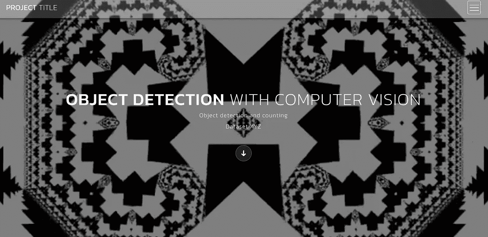
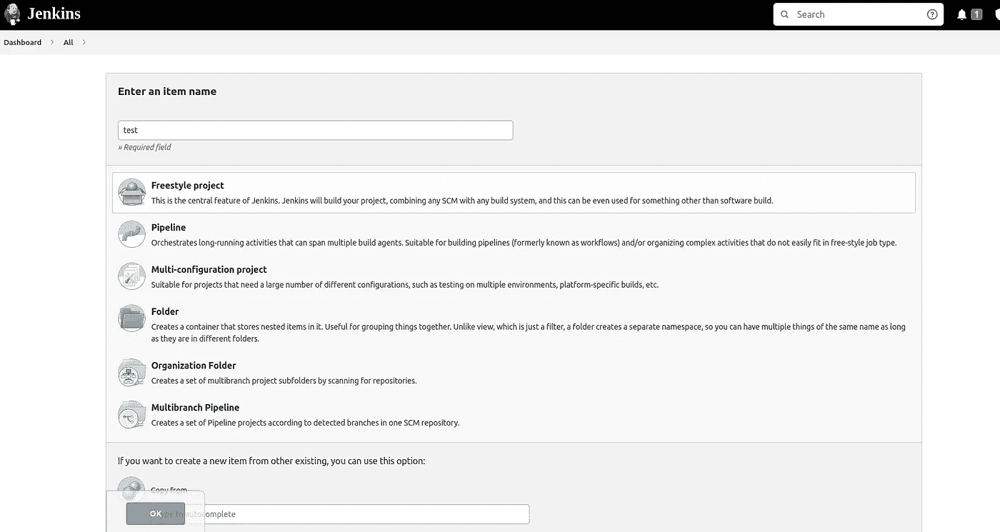
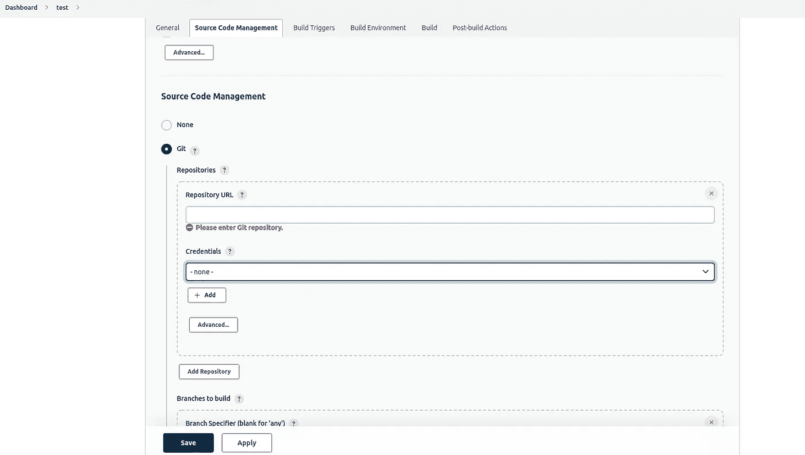
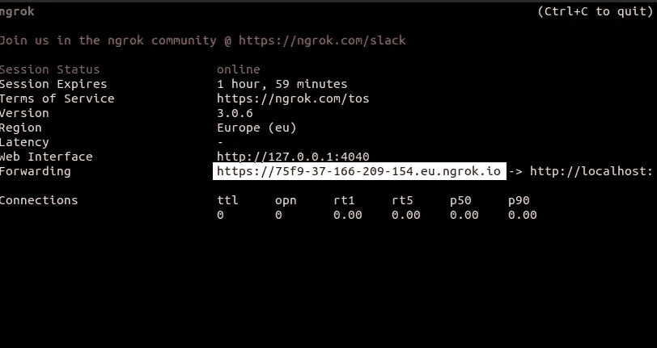
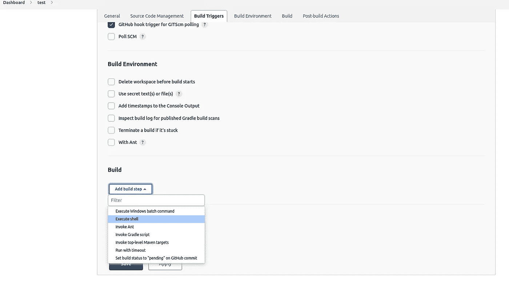
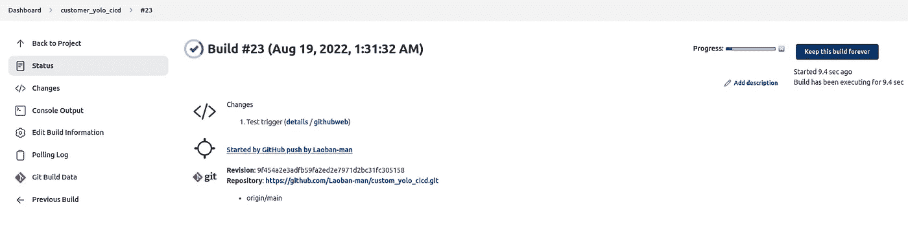

# 带有 YoloV5、Jenkins、Docker 和 Flask 的对象检测 ML 流水线

> 原文：<https://medium.com/mlearning-ai/object-detection-ml-pipeline-with-yolov5-jenkins-docker-and-flask-98b46eb17f71?source=collection_archive---------1----------------------->



关于部署 ML 管道的持续工作，从仅仅训练和优化算法开始，使我分享了另一个基于以前数据集所做工作的设置。

这里的对象检测挑战是识别和计数包含大量或多组非常相似的实例的图片中的实例数量。

第二个挑战是提供一个可以交互使用机器学习算法的平台。这可能意味着要么安装受操作系统限制的用户界面，要么提供可在线访问的 web 框架。

最后，在 ML 管道的环境中，代码的迭代，无论是机器学习优化还是模板格式化，都必须在部署的解决方案上定期更新。这意味着管理更新已部署服务的持续过程。

该项目分为 4 个部分，涵盖了 ML 管道的不同功能:

*   物体检测:机器学习算法，
*   交互式用户界面:支持使用对象检测算法的框架，
*   部署:部署算法和接口的方法，
*   CICD:管道根据对存储库的更新改变部署。

那些想要继续前进的人可以访问这个[库](https://github.com/Laoban-man/custom_yolo_cicd)上的 GitHub 代码。

# 堆栈要求

该项目中使用了两个 GCP 计算引擎实例:

*   模型训练和编辑:Ubuntu 20.04，带 1 个 NVDIA T4 GPU，2vCPU，16GB RAM，带有 custom_yolo_coco 库的克隆，其上安装了 CUDA 软件的兼容版本(老实说，你是这一个中的一个，有太多的例外…)
*   部署:Ubuntu 20.04 不带 GPU，4vCPU 和 32GB RAM，上面安装了 Docker 和 Jenkins

# 设置堆栈

主要编辑是在计算引擎实例上用 GPU 完成的，这大大加快了训练。迭代完成后，它们被提交并推送到 GitHub，GitHub 随后触发 Jenkins 在第二个计算引擎实例上重建并运行 Docker 容器，在第二个计算引擎实例中，GPU 卡并不那么重要。第二个实例将托管 Jenkins 和 Flask 应用程序。

## 目标检测

训练主要是在 GCP 实例上用 GPU 完成的。

尽管最近发表的 [Yolov7](https://arxiv.org/abs/2207.02696) 结果的结果提供了诱惑，但当不是深度学习的研究专家时，文档和支持是选择框架的一个重要因素。Yolov5 已经被尝试了又尝试，以论坛等形式的支持是重要的。这里的安装说明是。我还特别喜欢脸书的 Detectron2，它有更多的记录，覆盖了图像处理的大多数领域，但它需要相当多的资源来训练我正在处理的全分辨率数据集的模型。可靠的安装说明可在[这里](/@chengweizhang2012/how-to-train-detectron2-with-custom-coco-datasets-4d5170c9f389)获得。

正在讨论的数据集用彩色点标注，表示没有边界框的对象实例。因此，有一个完整的预处理步骤，首先创建边界框注释，然后将这些注释转换成与 YOLOv5 框架兼容的 YOLO 格式。尽管转换注释需要有趣的编码，但它不是这篇 MLOps 文章的核心部分，可以在基于这个 [Kaggler](https://www.kaggle.com/code/yuchunchien/parse-file-with-annotation) 所做工作的主存储库中找到。对于那些在本地计算机和/或功能较弱的实例上工作的人来说，有一些代码可以对图像进行下采样。虽然这大大加快了处理和训练的速度，但结果却差得多，因为每个实例的信息减少了，而且下采样改变了点的颜色。后一个问题可以通过在下采样之前运行点颜色识别来缓解。

一旦数据集的格式正确，第一步就是用自定义数据 Yolov5 训练模型。下载的 Yolov5 存储库通过运行它包含的 train.py 文件使它变得非常简单:

```
python train.py --data standard.yaml --weights best.pt --batch-size 32 --img 1408 --rect
```

关于这个命令的一些细节:

*   data: standard.yaml 是一个指定不同参数的文件，例如定位点大小(尽管 Yolov5 建议使用其自动定位点特性来确定这一点)、用于训练、验证和测试的数据源或数字类:
*   weights: best.pt 包含在下采样图像上运行 500 个时期的训练脚本后可用的最佳权重
*   批量大小:参数指示每批训练多少图像，这是一个有用的参数，可以根据您的 CPU 或 GPU RAM 进行调整，但越大性能越好
*   img:指示训练数据的最大和预期图像大小，这也应该是测试和后续数据集的最大和预期图像大小
*   rec:表示图像是矩形的。

```
train: ../datasets/images/train/  
val: ../datasets/images/val/  
test: # optional# Classes
nc: 6 # number of classes
names: [ 'None', 'category_1', 'category_2', 'category_3', 'category_4','category_5']anchors:
  - [10,13, 16,30, 33,23] # adapted because of small instance size
```

运行 train.py 脚本启动培训，这将设置 torch 深度学习架构以及其他服务，如 W&B(用于培训监控)和 ClearML(用于记录、编排 MLops)，并在指定数量的时期上培训网络，直到完成或挂钩停止培训。在全分辨率 5MB 图像上运行 Yolov5(甚至 Detectron2)会占用大量资源，因此存储库中的 best.pt 是在下采样图像上训练的。

得到的训练模型可以用整个数据集来测试:

```
python detect.py --source relative-path-to-folder --weights best.pt
```

或者在特定的图像上:

```
python detect.py --source relative-path-to-file --weights best.pt
```

code 文件夹中开发并提供的类还包含一个方法，用于预测单个图像并保存包括边界框在内的输出。如果您手动运行它:

```
test=custom_class("./code/data/Downsampled/")
result=test.predict("./test.jpg")
```

预测方法将在本地保存一个 test.jpg，您可以打开它查看结果(如果有)

## 交互式用户界面

微型网络框架 Flask 仍然是我的最爱，因为它提供了大量功能齐全的模板，并且可以轻松集成网站模板。

以下代码是 Python 中的完整 Flask 脚本:

```
import pickle
from flask import Flask, render_template, request, flash, redirect, url_for
from werkzeug.utils import secure_filename
import os
import time
import matplotlib.pyplot as plt
import pandas as pd
import numpy as np
from PIL import Image
from PIL.Image import Image as PilImage
import random
import json
import matplotlib.patches as patches
import math
from skimage import io
import skimage.feature
import cv2
from custom_class import custom_classapp = Flask(__name__)
upload_folder = "./static/img"
allowed_extensions = {"jpg"}app = Flask(__name__)
app.config["UPLOAD_FOLDER"] = upload_folder[@app](http://twitter.com/app).route("/", methods=["GET"])
def index():
    """
    Render the main landing page on arrival
    """
    return render_template("index.html")[@app](http://twitter.com/app).route("/index.html", methods=["GET"])
def main_index():
    """
    Render the main landing page from other pages
    """
    return render_template("index.html")[@app](http://twitter.com/app).route("/single-post.html", methods=["GET"])
def single_post():
    """
    Simple page explaining model choice, mostly empty
    """
    return render_template("single-post.html")[@app](http://twitter.com/app).route("/data_exploration.html", methods=["GET"])
def data_exploration():
    """
    Simple page going through data exploration, mostly empty
    """
    return render_template("data_exploration.html")def allowed_file(filename):
    """
    Function verifying the file extension is within allowed list
    """
    return "." in filename and filename.rsplit(".", 1)[1].lower() in allowed_extensions[@app](http://twitter.com/app).route("/new_test.html", methods=["GET", "POST"])
def upload_file():
    """
    Render page which allows the user to upload a test file
    """
    if request.method == "POST":
        # check if the post request has the file part
        if "file" not in request.files:
            flash("No file part")
            return redirect(request.url)
        file = request.files["file"]
        # If the user does not select a file, the browser submits an
        # empty file without a filename.
        if file.filename == "":
            flash("No selected file")
            return redirect(request.url)
        if file and allowed_file(file.filename):
            filename = secure_filename(file.filename)
            file.save(os.path.join(app.config["UPLOAD_FOLDER"], "test_image.jpg"))
    return render_template("new_test.html")[@app](http://twitter.com/app).route("/prediction.html", methods=["GET"])
def prediction():
    """
    Function verifying the file extension is within allowed list.
    """
    model = noaa_class()
    result = model.predict()
    return render_template("prediction.html")if __name__ == "__main__":
    app.run(host="0.0.0.0", port=5000, debug=True)
```

注意:重要的边栏在这里，不要使用 flask 服务器进行生产。

运行 web 应用程序所需的其余文件，主要是 HTML 和 CSS 文件，可以在存储库中找到。除非您特别关注模板化和格式化，否则在 MLOps 的上下文中浏览这些文件是没有帮助的。

在运行下一步之前，您可以测试 web 应用程序:

```
python main.py
```

由于 debug=True 参数，您应该能够访问 localhost:5000 上的 web 应用程序，并看到更新和变化。

## 部署

确保在不同的服务器/计算机上快速可靠地部署一个设置的最简单的方法之一是将其装箱。构建一个满足运行脚本、包和依赖项的最低要求的映像，只要有合适的引擎运行该映像，它就可以在任何操作系统上运行。很明显，我正在接近 [Docker](https://docs.docker.com/) ，它在实践中很好地提供了这些功能。

构建映像的过程非常简单:

*   编写一个说明如何构建映像的 dockerfile 文件:

```
# syntax=docker/dockerfile:1
FROM ubuntu:20.04
WORKDIR /code
RUN apt update
RUN apt-get install -y \
    libpng-dev \
    freetype* \
    libblas-dev \
    liblapack-dev \
    libatlas-base-dev \
    gfortran
RUN apt-get install -y gcc musl-dev python3-pip libgl1
COPY requirements.txt requirements.txt
RUN pip install -r requirements.txt
RUN pip install -U torch torchvision scikit-learn wandb
RUN apt-get install git -y
RUN git clone [https://github.com/ultralytics/yolov5](https://github.com/ultralytics/yolov5)  # clone
RUN cd yolov5
RUN pip install -r requirements.txt  # install
COPY ./code /code
ENTRYPOINT [ "python3" ]
CMD [ "main.py" ]
```

无需深入细节，这里的[和](https://docs.docker.com/get-started/02_our_app/)[这里的](https://luis-sena.medium.com/creating-the-perfect-python-dockerfile-51bdec41f1c8)和可以被破译，dockerfile 被分成一个接一个的步骤执行的命令。在这里，我们从 ubuntu:20.04 的基础映像创建一个映像，设置工作目录，安装许多 linux 包和 python 库，复制 code 文件夹中包含的文件，然后运行 main.py 文件来启动 Flask 应用程序。

*   建立形象:

```
docker image build -t custom_yolo_cicd .
```

*   测试图像

```
docker run -p 5000:5000 custom_yolo_cicd
```

由于 5000:5000 端口映射，您还可以看到 localhost:5000 上的输出，并且如果出现问题，可以很容易地识别运行映像时的潜在问题。如果您希望在运行时看不到终端的输出，请在 run 命令中添加-d 标志，并关闭终端窗口。

## CICD

典型的学术项目会在前面三个步骤中的一个停止。这些文章的目标是展示将它们组合成可复制的设置的方法，其他人可以部署和使用这些设置。因此，最后一步是确保在进行更新和预期部署更新时，设置不需要重复的手动干预。Jenkins 促进了 ML 管道的这一方面。

[Jenkins](https://www.jenkins.io/) 是一个自动化服务器，我们将通过提交 GitHub 服务器来触发它。对于 GitHub 存储库的每一次更新，Jenkins 都会关闭当前运行 Flask web 应用程序的 Docker 容器，重新构建映像(这样会更快，除非对库/包进行了重大更改)。另一种方法是，如果不仅仅更新容器参数，而仅仅更新诸如序列化模型或模型权重之类的文件，则确保文件在主机和容器之间共享，即通过绑定安装卷。

为了设置 Jenkins，我们将它安装在启动 docker 容器的同一个卷上。

我们创建了一个关于詹金斯的新项目。



Jenkins project creation page

在源代码管理中，选择 Git 并输入一个存储库，然后选择您第一次使用时最有可能需要创建的凭证。



Project configuration page

清空分支说明符

选择 GitHub hook trigger for Git SCM polling 来触发带有 Git 提交的构建。

在 GitHub 上，我们需要创建一个 webhook 来触发 Jenkins。我们可以暴露一个端口。另一种方法是使用 NGROK，一个反向代理，这是测试 webhooks 的理想方法。

安装 ngrok:

```
sudo snap install ngrok
```

启动 ngrok:

```
ngrok http 8080
```



Terminal output of running ngrok

复制提供给 GitHub webhook 页面的链接，它位于您的存储库(不是用户)的设置中。

回到 Jenkins，我们可以在 Jenkins 项目配置页面的最后部分对构建进行编程，这需要选择“执行 shell 命令”。



在出现的文本框中添加以下 bash 代码。

```
docker stop $(docker ps | grep "custom_yolo_cicd" | cut -d " " -f 1)
cd /var/lib/jenkins/workspace/customer_yolo_cicd 
docker image build -t custom_yolo_cicd .
docker run -dp 5000:5000 custom_yolo_cicd
```

对于那些不太了解 bash Shell 脚本的人，我们首先识别并停止任何名为 custom_yolo_cicd 的 Docker 容器，然后进入 Jenkins 克隆 custom_yolo_cicd 的工作区和存储库，最后构建并运行 Docker 映像。

注意:Jenkins 使用 Docker 时可能存在权限问题，修复方法是在终端中使用以下命令:

```
sudo usermod -a -G docker jenkins # requires a restart afterwards
```

Flask 应用程序现在应该可以在您的主机实例地址的端口 5000 上访问:http:// <external-ip-address>:5000</external-ip-address>


Landing page of the Flask app

如果在启动 Jenkins 项目之前没有构建和运行 Docker 容器，那么最初的构建可能不起作用。

# 在实践中

假设我们将数据添加到训练计算引擎实例，并重新训练 Yolov5 模型或迭代 Flask 应用程序，新的权重将被保存并推送到存储库。新的提交将通过 webhook 触发 Jenkins。这将关闭容器的当前版本，获取 GitHub 项目的最新版本，在本地构建最新的映像，然后运行新版本。

具体来说，在这种设置中，这采取以下形式:

*   访问培训 GCP 实例中克隆的 Yolov5 存储库
*   为模型提供一个包含数据位置和其他参数的 standard.yaml(如果需要的话)
*   使用新参数或新数据运行训练脚本
*   收集位于 Yolov5 存储库的 runs 文件夹中的跑步的 best.pt 权重
*   替换位于 custom_yolo_cicd/code 的部署中使用的现有 best.pt 版本
*   提交并推送 custom_yolo_cicd 的更改
*   Jenkins 将用这些新数据重建并重新启动 Docker 容器。



The final validation of all this work (Git-triggered build)

# 结论

尽管训练和超参数优化有限，Yolov5 可以快速识别人群中甚至非常小的物体，但良好的性能需要大量的数据和大量的时期。

# 丰富

显然，在野生动物保护的背景下，用户界面不如 API 有用，API 可以提交多个图像，而不必麻烦地选择单个文件。我相当偏爱[拥抱](/@bedjango/what-is-hug-da579ae15aad)框架，尽管它的使用并不广泛，但它标榜高性能。

Jenkins 是确保自动化的一种方便的开源方式，但 Heroku 也可以托管 Docker 容器，而不必管理 Jenkins 的烦人的安装和管理。我还没有调查 Heroku 是否提供显卡。

最后，当模型可能需要特别长的时间来优化时，跟进和记录在机器学习中尤为重要。本文中没有明确使用的两个工具是 MLFlow 和 W&B，它们记录训练运行并记录超参数、工件和性能。它们极大地帮助监控模型的进展情况，并建议如何改进它们。

注意:这个设置是一个使用大量开源软件和框架实现的例子，可能不适合您的生产应用程序。

注意:欢迎在评论中提出与此堆栈改进相关的想法和建议。

[](/mlearning-ai/mlearning-ai-submission-suggestions-b51e2b130bfb) [## Mlearning.ai 提交建议

### 如何成为 Mlearning.ai 上的作家

medium.com](/mlearning-ai/mlearning-ai-submission-suggestions-b51e2b130bfb)