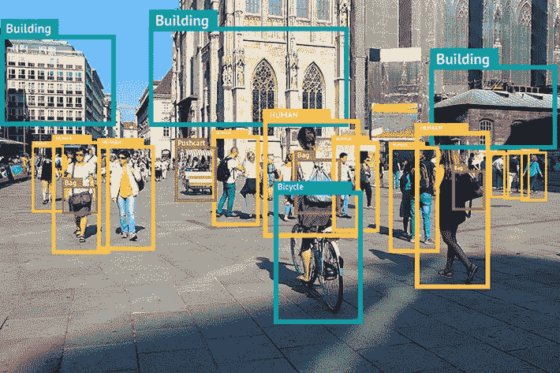
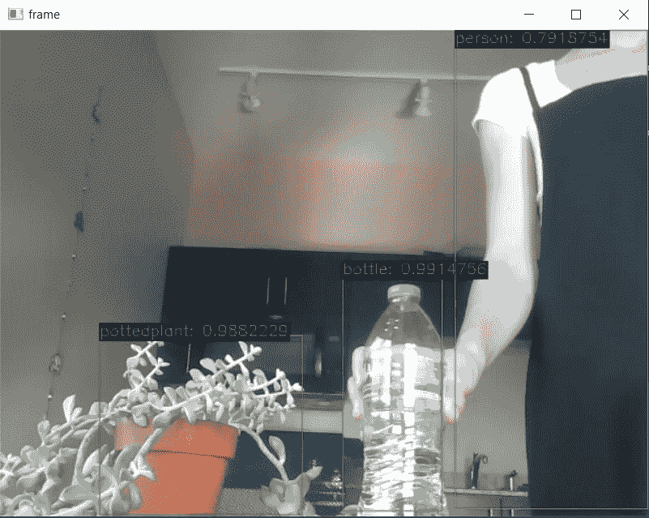

# 使用 mobilenet SSD 进行对象检测

> 原文：<https://medium.com/mlearning-ai/object-detection-using-mobilenet-ssd-e75b177567ee?source=collection_archive---------4----------------------->

在本文中，我将分享一种分步方法，使用 mobilenet SSD 模型和来自笔记本电脑的网络摄像头来构建一个简单的对象检测器，以识别特定的对象。



**什么是 mobilenet？**

Mobilenet 是一种卷积神经网络，专为移动和嵌入式视觉应用而设计。它们不使用标准的卷积层，而是基于使用深度方向可分离卷积的流线型架构。使用这种架构，我们可以构建轻量级深度神经网络，这些网络对于移动和嵌入式设备具有低延迟(例如:jetson nano)。你可以在谷歌研究人员 2017 年的原始[论文](https://arxiv.org/abs/1704.04861v1)中了解更多关于网络架构的信息。对于深度方向可分卷积的更深入的解释，我也发现池-汪锋的这个[博客](https://towardsdatascience.com/a-basic-introduction-to-separable-convolutions-b99ec3102728)很有帮助。

如上所述，mobilenet 的理想应用包括移动和嵌入式设备。但是，为了演示使用该网络进行物体检测，我们将使用一台笔记本电脑和内置摄像头。

**初始要求**

对于这个项目，我们不会从头开始训练 mobilenet 模型，而是使用预先训练的模型权重和模型定义。为此，我们需要先下载以下文件:

*   [Caffe prototxt 文件](https://github.com/djmv/MobilNet_SSD_opencv/blob/master/MobileNetSSD_deploy.prototxt):模型定义存储在该文件中
*   [Caffe 模型文件](https://github.com/djmv/MobilNet_SSD_opencv/blob/master/MobileNetSSD_deploy.caffemodel):预训练模型权重

*什么是 Caffe？*

> Caffe(用于快速特征嵌入的卷积架构)是一个深度学习框架，用于创建图像分类和图像分割模型。最初，用户可以创建并保存他们的模型为纯文本 PROTOTXT 文件。在使用 Caffe 对模型进行训练和优化之后，程序将训练好的模型保存为 CAFFEMODEL 文件。

Initial set up

将上述文件下载到我们的工作目录后，我们需要使用 OpenCV DNN 函数`cv2.dnn.readNetFromCaffe`加载 Caffe 模型。然后，我们定义训练网络的类别标签(即 COCO 标签)。我们的模型在 21 个对象类上训练，这些对象类作为字典传递，其中每个键代表类 ID，相应的值是标签的名称。

**设置摄像机**

因为在这个例子中，我们使用一个摄像机 feed 进行对象检测，所以我们从 OpenCV 库中实例化了一个`VideoCapture`类的对象。作为输入，`VideoCapture`类接收我们想要使用的设备的索引。如果我们有一个连接到计算机的摄像机，我们传递一个值 0。

**格式化输入**

然后，我们从相机帧中获取图像的高度和宽度，稍后将使用这些高度和宽度在检测到的对象周围绘制边界框。现在，我们需要使用`cv2.dnn.blobFromImage`函数将图像转换成一个斑点(这是一个 4D NumPy 数组对象——图像，通道，宽度，高度)。这是为模型输入准备所需格式的输入图像所必需的。要了解 blob 是什么以及`cv2.dnn.blobFromImage`函数如何工作的更多信息，请参考这个[博客](https://pyimagesearch.com/2017/11/06/deep-learning-opencvs-blobfromimage-works/)。该函数的输入参数取决于正在使用的模型。关于`cv2.dnn.blobFromImage`函数的 mobilenet 输入参数，请参考来自 [OpenVINO](https://docs.openvino.ai/latest/index.html) (一个用于部署 AI 推理的开源工具包)的这个[链接](https://docs.openvino.ai/latest/omz_models_model_mobilenet_ssd.html?highlight=mobilenet)。

Format input

**物体检测和可视化**

然后，blob 对象被设置为`net`网络的输入，随后通过 mobilenet 网络向前传递。现在，我们循环检测——检测摘要是一个 1，1，N，7 格式的数组，其中 N 是检测到的边界框的数量。每个检测具有格式[ `image_id`、`label`、`conf`、`x_min`、`y_min`、`x_max`、`y_max` ]

```
**image_id**: ID of the image in the batch
**label**: predicted class ID
**conf**: confidence score of the predicted class
**x_min****,** **y_min:** coordinates of the top left bounding box corner
**x_max****,** **y_max:** coordinates of the bottom right bounding box corner

Note: Coordinates are in normalized format, in range [0, 1])
```

接下来，我们从检测数组中的第三个元素`detections[0, 0, i, 2]`中提取被检测对象的置信度得分。如果检测到的类的置信度得分大于阈值置信度水平(以过滤掉弱预测)，我们从检测数组中的第二个元素`detections[0, 0, i, 1]`获得检测到的类的类 id。

Object detection and visualization

一旦检测到对象，我们现在尝试通过绘制一个边界框并添加该对象的标签来可视化它。检测阵列返回归一化的左上角和右下角坐标，这些坐标通过乘以从照相机捕获的帧的宽度和高度而被缩放到帧尺寸。然后，我们使用`cv2.rectangle`函数在检测到的对象周围绘制一个边界框。如果检测到的类 id 与`classNames`字典中提到的 21 个标签中的一个匹配，我们添加一个带有标签名称的文本，并在文本周围添加一个框。

Display image and close camera feed

现在，我们可以从 python 终端运行我们的代码，它将打开一个相机提要，其中包含一个边界框和检测到的对象的文本标签，以及帧中的置信度得分。



Camera feed

如果我们想关闭摄像头，只需按键盘上的任意键。

参考资料:

1.  [https://pyimagesearch . com/2018/05/14/a-gentle-guide-to-deep-learning-object-detection/](https://pyimagesearch.com/2018/05/14/a-gentle-guide-to-deep-learning-object-detection/)
2.  【https://opencv-tutorial.readthedocs.io/en/latest/index.html 
3.  [https://ebenezer techs . com/mobilenet-SSD-using-opencv-3-4-1-deep-learning-module-python/](https://ebenezertechs.com/mobilenet-ssd-using-opencv-3-4-1-deep-learning-module-python/)
4.  [https://github.com/djmv/MobilNet_SSD_opencv](https://github.com/djmv/MobilNet_SSD_opencv)

[](/mlearning-ai/mlearning-ai-submission-suggestions-b51e2b130bfb) [## Mlearning.ai 提交建议

### 如何成为 Mlearning.ai 上的作家

medium.com](/mlearning-ai/mlearning-ai-submission-suggestions-b51e2b130bfb)