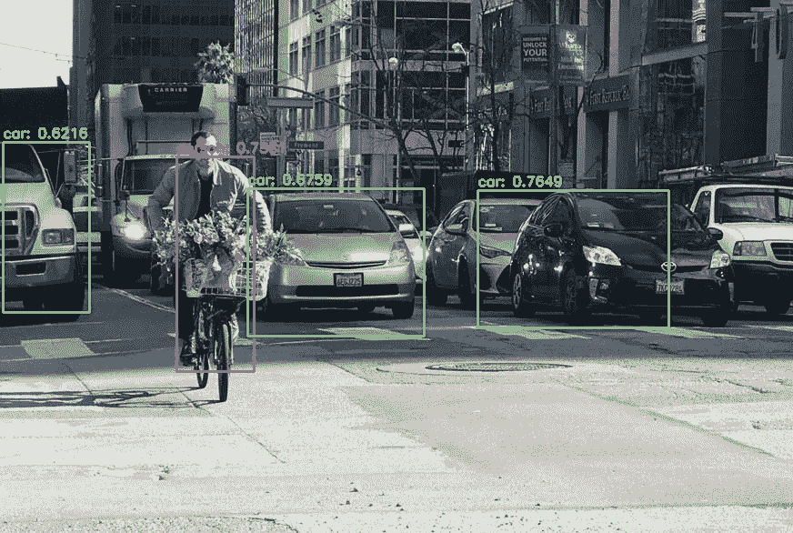
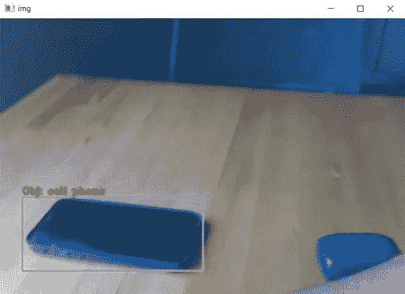

# 使用 YOLO 的目标检测

> 原文：<https://medium.com/mlearning-ai/object-detection-using-yolo-3f7399b652a8?source=collection_archive---------3----------------------->

在这篇文章中，我分享了一个一步一步的方法来建立一个简单的对象检测器使用 YOLO 和网络摄像头从您的笔记本电脑来识别一个特定的对象。



Photo by [dagshub](https://dagshub.com/blog/yolov6/)

> 注意:拥有 YOLO 模型的基础知识将有助于更好地理解本文。还有，代码是用 Python 写的。

**什么是 YOLO？**

> YOLO，是“你只看一次”的首字母缩写(灵感来自名言“你只活一次”)

YOLO 是一种对象检测算法，它使用卷积神经网络(CNN)来实时检测对象。顾名思义，它是一个单级对象检测模型，只需要通过神经网络进行一次前向传播来检测对象。为了更多地了解 YOLO 及其历史，我发现来自 pyimagesearch 的这篇[文章](https://pyimagesearch.com/2022/04/04/introduction-to-the-yolo-family/)非常有帮助，但是你也可以参考许多其他有用的在线资源。

**初始要求**

对于这个项目，我们将**而不是**从头开始训练模型，而是使用 YOLOv4 的预训练配置和权重。为此，需要首先下载以下文件:

*   [配置文件](https://raw.githubusercontent.com/AlexeyAB/darknet/master/cfg/yolov4-tiny.cfg):模型架构存储在该文件中。
*   [权重文件](https://github.com/AlexeyAB/darknet/releases/download/darknet_yolo_v4_pre/yolov4-tiny.weights):预先训练好的模型权重。这些是使用 MS COCO 数据集上的 DarkNet 代码库训练的。
*   [类文件](https://raw.githubusercontent.com/pjreddie/darknet/master/data/coco.names):包含 COCO 数据集中 80 个对象类别的名称。

现在，我们通过使用 OpenCV DNN 函数`cv2.dnn.readNetFromDarknet`加载 YOLO 模型来完成初始设置。然后，我们读取类文件`coco.names`,它包含 80 个不同对象类的列表，YOLO 模型在这些对象类上进行训练，并将它们存储在一个 python 列表中。接下来，我们定义需要检测的对象。在这种特殊情况下，我们希望从摄像头馈送中检测手机。

Initial configuration and set-up

**物体检测功能**

这就是“奇迹”发生的地方。接下来，我们定义一个对象检测函数。此功能从您的相机获取图像帧，然后检测目标对象。摄像机提要的代码片段将在后面解释。但是现在，让我们假设这个函数接收单个图像作为输入。

首先，我们得到输入图像的高度和宽度。然后，我们需要使用`cv2.dnn.blobFromImage`函数将图像转换成一个斑点(这是一个 4D NumPy 数组对象——图像、通道、宽度、高度)。这是为模型输入准备所需格式的输入图像所必需的。要了解 blob 是什么以及`cv2.dnn.blobFromImage`函数如何工作的更多信息，请参考这个[博客](https://pyimagesearch.com/2017/11/06/deep-learning-opencvs-blobfromimage-works/)。该函数的输入参数取决于正在使用的模型。对于 [YOLO](https://opencv-tutorial.readthedocs.io/en/latest/yolo/yolo.html#create-a-blob) ，使用以下参数:

```
the **image** to transform
the **scale factor** (1/255 to scale the pixel values to [0..1])
the **size**, here a 416x416 square image
the **mean** value (default=0)
the option **swapBR**=True (since OpenCV uses BGR)
```

然后将斑点对象设置为网络的输入，并且在从 YOLO 模型确定输出层之后，通过 YOLO 网络执行正向传递。

Object detection function

我们还需要在检测到物体后将结果可视化。但是首先，让我们初始化几个列表来存储所需的信息，以便:

*   `boxes`:对象周围的边框。
*   `confidences`:YOLO 模型赋予对象的置信度得分。我们设置最小概率分数`0.5`来过滤掉弱检测。较低的置信度值表明对象可能不是网络认为的那样。
*   `class_ids`:被检测对象类别的标签。

接下来，我们遍历每个`layeroutput`，然后遍历`output`中的每个`detection`。然后从`detection`列表的第 5 个元素中提取所有对象类别的[置信度得分，并选择具有最大置信度得分的对象的类别 id。如果检测到的类别 id 等于所需对象(即本例中的手机)的类别 id，并且置信度得分大于阈值(以滤除弱检测)，则我们尝试通过绘制边界框并添加该对象的标签来可视化所需的检测到的对象。](https://pyimagesearch.com/2022/04/11/understanding-a-real-time-object-detection-network-you-only-look-once-yolov1/#h3E2E)

YOLO 模型返回边界框的中心(x，y)坐标，后跟框的宽度和高度。但是在我们实际使用它们之前，我们需要首先相对于图像的大小来缩放这些值。缩放后，我们使用边界框的中心坐标、宽度和高度来导出边界框的左上角坐标。然后更新`boxes`、`confidences`和`class_ids`列表。

默认情况下，YOLO 不应用[非最大值抑制](https://pyimagesearch.com/2014/11/17/non-maximum-suppression-object-detection-python/)，因此我们需要使用`cv2.dnn.NMSBoxes`函数显式应用它。该函数简单地抑制明显重叠的边界框，只保留有把握的边界框，而排除任何多余的边界框。输入参数是盒子、置信度、置信度阈值(即`0.5`)和 NMS 阈值。

假设已经检测到预期的对象(即本例中的手机)，我们循环通过由非最大值抑制确定的`indexes`,以使用随机类别颜色在图像上绘制边界框和文本。然后，最后，我们显示我们的结果图像。

**从摄像机中捕捉视频并识别目标物体**

由于这个项目的目标是从摄像机的饲料中识别一个特定的对象，我们首先需要用摄像机(网络摄像头)捕捉直播流。为此，我们需要从 OpenCV 库中创建一个`VideoCapture`类的对象。作为输入，`VideoCapture`类接收我们想要使用的设备的索引。如果我们有一个连接到计算机的摄像机，我们可以传递一个值 0。

在这之后，在 while 循环中，我们可以开始一帧一帧地从摄像机中读取视频。我们在`VideoCapture`对象上使用`[read](https://docs.opencv.org/2.4/modules/highgui/doc/reading_and_writing_images_and_video.html#videocapture-read)`方法来读取每一帧。这个方法没有参数，返回一个元组。第一个返回的值是一个布尔值，指示一个帧是否被正确读取(True 或 False ),第二个值是来自摄像机的帧。接下来，我们将每一帧传递给我们的对象检测函数`imgRead`。如果预期的对象(例如，本例中的手机)出现在相机馈送中，那么一个带有对象标签的边界框将围绕在它的周围(如下图所示)。`cv2.imshow()`方法在窗口中显示视频或图像。



现在，如果我们想关闭摄像头，我们可以简单地按下键盘上的`q`键。

参考资料:

1.  [https://pyimagesearch . com/2018/11/12/yolo-object-detection-with-opencv/](https://pyimagesearch.com/2018/11/12/yolo-object-detection-with-opencv/)
2.  [https://opencv-tutorial . readthedocs . io/en/latest/yolo/yolo . html](https://opencv-tutorial.readthedocs.io/en/latest/yolo/yolo.html)

[](/mlearning-ai/mlearning-ai-submission-suggestions-b51e2b130bfb) [## Mlearning.ai 提交建议

### 如何成为 Mlearning.ai 上的作家

medium.com](/mlearning-ai/mlearning-ai-submission-suggestions-b51e2b130bfb)