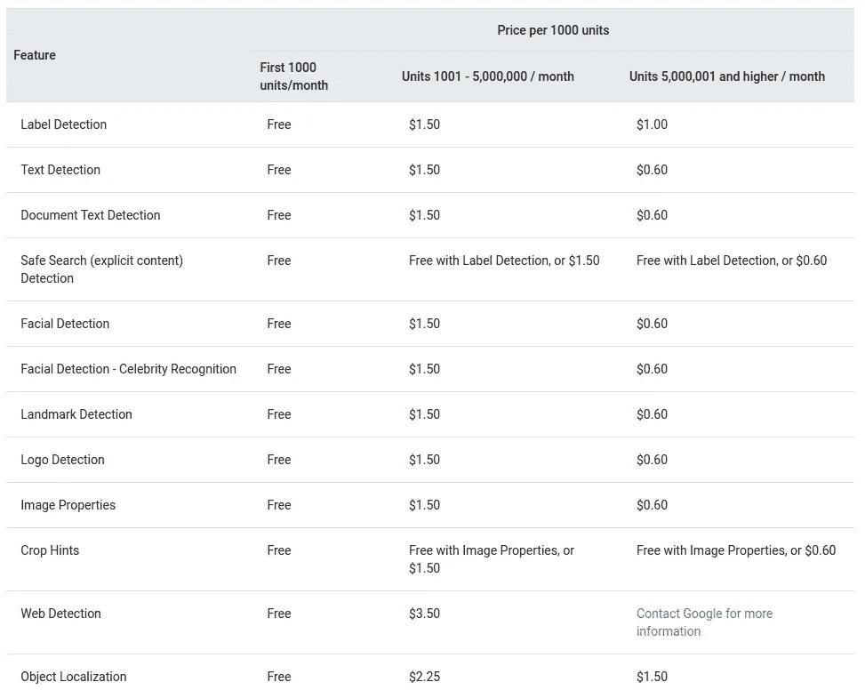
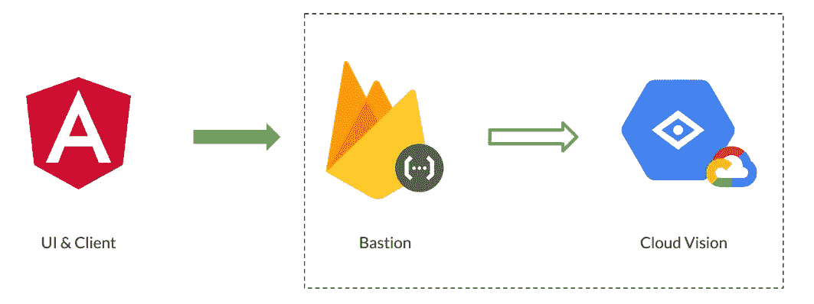
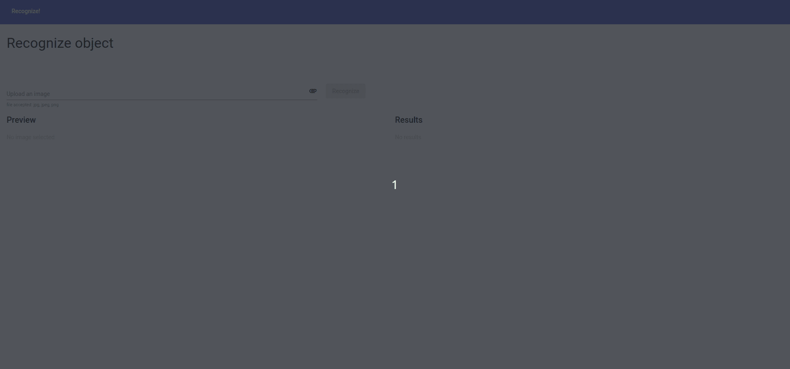

# 使用 Angular、Firebase 和谷歌云视觉进行物体检测

> 原文：<https://medium.com/mlearning-ai/object-detection-with-angular-firebase-and-google-cloud-vision-acb69bc5f07?source=collection_archive---------4----------------------->

## 使用 Angular、Firebase 和 Google Cloud Vision 创建一个无缝的对象检测应用程序。没有痛苦，只有收获。


今天机器视觉真的很强大，它的趋势很高。但并不是所有的 IT 公司都雇佣数据科学家，或者能够持续努力从零开始创建机器学习应用程序，因此创建执行对象检测的应用程序和软件可能非常困难。

我想向大家展示一个简单易用的应用程序，它是作为 2022 年 11 月 [GDG 帕勒莫社区展第二部分](https://gdg.community.dev/events/details/google-gdg-palermo-presents-community-showcase-november-2022-part-2/)的用例创建的，它使用以下工具执行对象检测:

*   **棱角分明；**
*   **火基功能；**
*   **谷歌云视界**(GCP)；

Google Cloud Vision 是一个非常强大的工具，它能做的事情之多令人印象深刻。例如，您可以执行对象检测(以及我们稍后将看到的)，或者 OCR，甚至人脸识别。它有很多功能，每个功能都有自己的定价，令人惊讶的是:它非常便宜。



Google Cloud Vision pricing table

通常我们认为云是一个昂贵的解决方案，事实并非如此(见[谷歌云视觉定价](https://cloud.google.com/vision/pricing))。正如你所看到的，你每月只需为 5k 的请求支付约 1.5 美元(外加 1000 个免费请求)，想象一下，你想从零开始自己实现这个特性，成本要大得多。

云视觉中的对象检测有几个特征。当您对图像执行预测时，此工具会响应以下信息:

*   *对象描述*；
*   *置信度得分*；
*   *…其他信息*；

对于这个应用程序，我们将使用 Firebase 函数作为堡垒，以保持对请求的控制。通过这种方式，我们可以检查**用户是否通过了认证**(例如:Firebase 功能支持 Firebase 认证)或者他的每月请求配额是否已用尽，此外，Cloud Vision 将保持私有，只有 Firebase 功能可以使用服务帐户访问它。



Architectural Schema

为了实现这个应用程序，我们将使用:

*   Firebase CLI；
*   [Firebase 函数 SDK](https://www.npmjs.com/package/firebase)；
*   [角火](https://github.com/angular/angularfire)；
*   [云视界 for NodeJS](https://github.com/googleapis/nodejs-vision#readme)；

# 我们来编码吧！

## 云

对于云，我们必须:

*   **通过[控制台](https://console.firebase.google.com/)创建**一个 firebase **项目**并且**升级到火焰平原**，这样它也会创建 GCP 项目并且让我们可以访问 ML 工具。
*   进入 GCP [控制台](https://console.cloud.google.com/welcome)并选择创建的项目。
*   搜索产品**云视觉**和**启用 API**
*   转到 IAM > Service Account，为用户 firebase-adminsdk 创建一个 json 密钥并下载它。

完成了:**我们的云已经准备好了**。现在转到代码。

## 燃烧基函数

现在我们要创建我们的 Firebase 函数。首先，我们需要 Firebase CLI ( [官方文档](https://firebase.google.com/docs/cli))，所以我们可以使用 Firebase 模拟器并使用 CLI 创建代码库。

```
firebase init
```

然后让 cli 指导我们准备代码，安装云函数和仿真器；然后将“service-account.json”放入`functions`文件夹并进行认证:

```
export GOOGLE_APPLICATION_CREDENTIALS="service-account.json"
```

然后打开文件`functions/src/index.ts`并创建应用程序:

Firebase Functions

并且功能完成。这里不需要更多的代码，所以我们可以使用仿真器开始我们的功能:

```
npm --prefix "functions" run serve
```

通过这种方式，函数将在 localhost:5001(或者您为模拟器选择的任何端口)上可达，函数的名称是`annotateImage`。

## Angular 应用

让我们看看最后一步:棱角分明。为了帮助我们，我们将使用`@angular/fire`，所以我们需要将其添加到 angular 项目中，并让原理图指导我们配置云功能(可调用)，此外，cli 将为我们创建一个新的应用程序到 firebase 项目中(我们也可以使用现有的一个)。

```
✔ Packages installed successfully.
? What features would you like to setup? Cloud Functions (callable)
Using firebase-tools version 11.16.0
? Which Firebase account would you like to use? myemailtoaccess@email.com
✔ Preparing the list of your Firebase projects
? Please select a project: GDG-Object-Detection
✔ Preparing the list of your Firebase WEB apps
? Please select an app: object-detection
✔ Downloading configuration data of your Firebase WEB app
UPDATE src/app/app.module.ts (1715 bytes)
UPDATE src/environments/environment.ts (977 bytes)
UPDATE src/environments/environment.prod.ts (370 bytes)
```

原理图默认配置`environment.ts`和`app.module.ts`。我遇到了 Angular 15 的一个问题，所以要修复它，导入模块，而不是使用工厂并添加`USE_EMULATOR`提供者:

然后创建一个服务来与 Firebase 函数通信:

然后将服务与组件连接起来:

创建一个转换管道，按分数对结果进行排序:

最后将结果打印成 html:

仅此而已！现在我们可以运行我们的应用程序了:

```
ng serve
```



# 结论

在几行代码中，我们创建了一个简单的应用程序，它使用一些强大的工具识别用户提供的图像中的对象。

您可以在以下存储库中找到代码的完整版本:

*   [https://github . com/MTS 88/object-recognition-angular-GCP-Function/tree/object-detection](https://github.com/mts88/object-recognition-angular-gcp-function/tree/object-detection)(Firebase 函数)
*   [https://github . com/MTS 88/object-recognition-Angular-GCP/tree/object-detection](https://github.com/mts88/object-recognition-angular-gcp/tree/object-detection)(Angular App)

*那都是乡亲们！*

[](/mlearning-ai/mlearning-ai-submission-suggestions-b51e2b130bfb) [## Mlearning.ai 提交建议

### 如何成为 Mlearning.ai 上的作家

medium.com](/mlearning-ai/mlearning-ai-submission-suggestions-b51e2b130bfb)