# 用于人口统计分析的街景图像的对象检测

> 原文：<https://medium.com/mlearning-ai/object-detection-with-street-view-images-for-demographic-analysis-e6230cac1af9?source=collection_archive---------1----------------------->

根据斯坦福大学的一项研究[1]，谷歌街景(GSV)图像通过人工智能模型进行分析，以了解美国人民的政治倾向。根据这个模型，通过分析一个街区的汽车来决定这个街区是否可能在总统选举中投票给共和党或民主党。这些汽车根据型号、年份和颜色被分成几类。美国社区调查(ACS)每年花费 2 . 5 亿美元进行这样一项人口调查。这项研究表明，人工智能模型可以用于人口统计分析，成本非常低。

我们从这项研究中受到启发，复制了我们自己的模型，通过观察社区内的不同因素来预测社区的福利水平。我们的项目得到了支持，并在 [inzva 的](https://inzva.com/ai/projects/2021/ai-projects-6-for-social-good-showcase-register)人工智能项目#6 展柜中展示。项目参与人是[阿拉拉·赫尔根](https://alarahergun.medium.com/)、巴萨克·埃金奇、埃费汉·丹曼和[塞法·库尔提佩克](/@sefakurtipek)。

## **数据集**

斯坦福的研究是基于从 ACS 获得的关于政治倾向的社会经济数据，然而在我们的案例中没有这样的数据集。然而，在伊斯坦堡发现了两个不同的人口统计分析数据集:马哈利姆·i̇stanbul(2016 年)和 i̇lçelerin·索索-埃科诺米克·杰利什米利克·萨拉马斯(2017 年)。第一个是 IBB 发布的数据集:这是一项通过观察人口、健康和教育接入以及经济水平等几个特征，为 i̇stanbul 的每个街区指定一个从 A+到 f 的分数(SEGE:社会经济福利水平指数)的研究。在我们第一次使用 Mahallem Istanbul 的时候，然而获得每个街区的均匀分布的照片和找到一个街区的开始和结束坐标对我们来说是一项艰巨的任务，在更大的范围内工作会更加详细和专业，所以我们切换到我们的第二个数据集:i̇lçelerin sosyo-ekonomik Geli milik sralamas。该数据集通过观察或多或少相同的要素来关注一个区而不是一个邻域，并为土耳其的每个区分配一个点，这些点的值从 7.73 到-1.74 不等。你可以从这个[链接](https://www.kalkinmakutuphanesi.gov.tr/dokuman/ilcelerin-sosyo-ekonomik-gelismislik-siralamasi-arastirmasi-sege-2017/1969)进一步阅读。在我们的研究中，我们使用了伊斯坦布尔的照片和数据，但是将来我们可以(很可能会)与土耳其的其他城市进一步合作，重新制作这样一个人口统计搜索。

伊斯坦布尔各区的人口状况非常复杂和混杂，因此我们计划主要根据从伊斯坦布尔拍摄的 GSV 图像来训练我们的模型，然后我们将扩展到土耳其的其他城市。在阅读了一些相关的研究[1，2]后，我们寻找从不同人口统计结果的不同地区拍摄均匀分布的照片的方法，以训练我们的模型和在哪里拍摄照片。为了拍摄照片，我们使用了谷歌准备的谷歌街景 API [3]。在这个 API 中，您可以通过精确化航向和俯仰值来拍摄照片，从而在您的相机所在的纬度和经度上移动相机。然而，我们最大的问题是拍摄不重叠的照片，所以我们需要将该地区分成等分的网格区域，并在每个正方形的角落拍摄照片。为了找到区域的边界，使用了 Google 地理编码 API。我们进行了反向地理编码，以找到边界的左上和右下坐标。

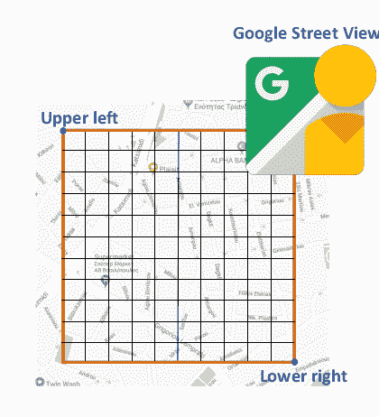

Image source : [2]

这些坐标是在 geojson.io 中观察到的，因为一些离散点可能具有非矩形形状；通过观察这些异常离散体在 geojson.io 中的外观，将其划分为多个矩形网格。

为了将我们的区域划分成网格，使用了来自[2]的公式:

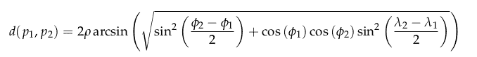

Image source : [2]

在这个公式中，我们计算一个哈弗线距离。地球不是平的，所以每次计算距离或面积时，我们都应该用弧距来计算。这个公式接受地球是一个误差率很小的平面，以简化我们的计算，并旨在找到两个坐标之间的距离，以将它们平均分成一个网格。

为了可视化和操纵一个地区的坐标，使用 geojson.io。可以手动使用，也可以使用包含 geojson 格式的文件来可视化输入。

下面，你可以看到谷歌地图和 geojson.io 中可视化的区别。

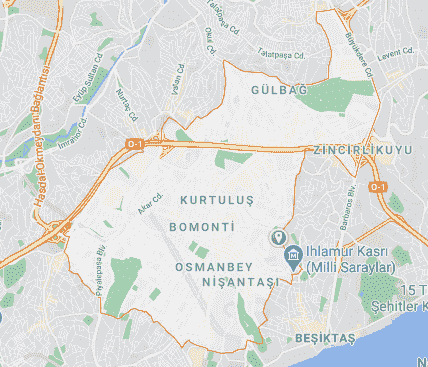

Google Maps visualization of a district

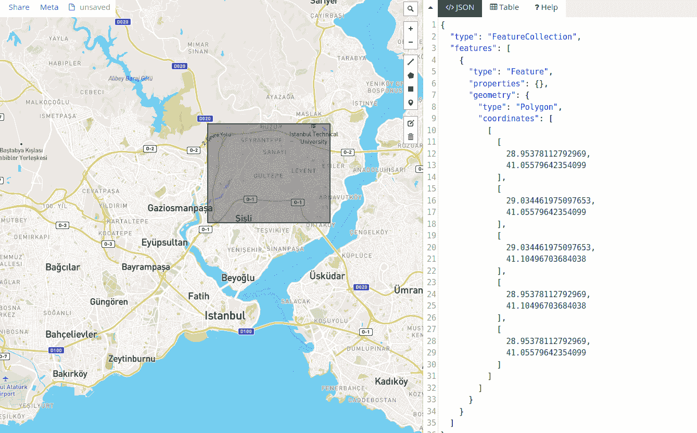

Squaring a district in geojson.io

## **模型**

在 COCO 数据集上预训练的 YOLO v3 模型用于来自 imageAi 库的检测。

**YOLO 物体探测**

YOLO 是一种使用卷积神经网络检测物体的实时算法。它代表“你只看一次”。之所以叫“你只看一次”，是因为算法通过物体检测非常快，整个画面通过神经网络一步到位。YOLO 把输入图像分成 n×n 个网格。这些网格的大小可能因图片而异。每个网格在认为自身有无物体的情况下，决定中心点是否在自己的区域内。网格确定对象有一个中心点，找到该对象的类别、高度和宽度，并在该对象周围创建一个边界框。所创建的这个边界框给出了 YOLO 算法的对象检测结果。

使用 YOLO v3 模型，我们能够检测日常物体，如人、汽车、交通物体、动物等等。从这个数据集中，我们主要使用了摩托车、汽车和人。有了这些特征，并以此为标签分格；我们获得了大约 27–29%的相关性，我们的主要目标是通过更复杂的功能来增加相关性，如树木检测、建筑物检测和用模型检测建筑物的年龄。由于这些特征在数据集中并不常见，我们按照教程来做。建筑教程似乎不是很有前途，所以它仍在开发中。至于树木检测部分，我们的模型工作得很好，但我们无法在伊斯坦布尔检测到这样的绿色区域，因为它是一个非常拥挤的城市。然而，我们仍然试图在我们的项目中更好地使用它们。

## **结果**

我们从伊斯坦布尔的 10 个不同地区获取了大约 200-250 张谷歌街景图片，这些地区的面积相似，但 SEGE 水平不同。结果，我们用 YOLO v3 检测到了各种各样的对象，但是只有少数几个具有有意义的对象数量。因此，我们决定将他们分为两组，一组是机动车辆(如摩托车、汽车、公共汽车、卡车)，另一组是人。汇总每个地区的对象数量后，我们将它们绘制在散点图上，并检查 SEGE 得分和对象数量之间是否存在任何相关性。下面你可以看到居民区的人口、机动车辆和所有物体的数量与社会经济发展分数。

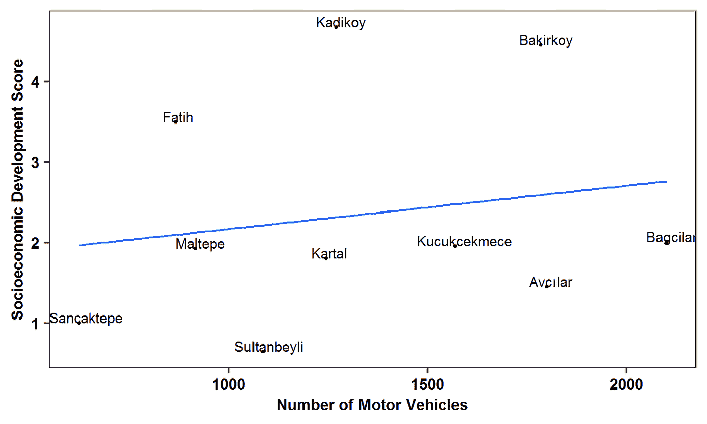

**SEGE vs Number of Motor Vehicles**

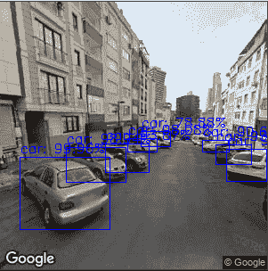

在第一张图中，我们可以观察到 SEGE 与机动车数量的关系。根据我们的 10 个区有 0.18 的弱相关性。

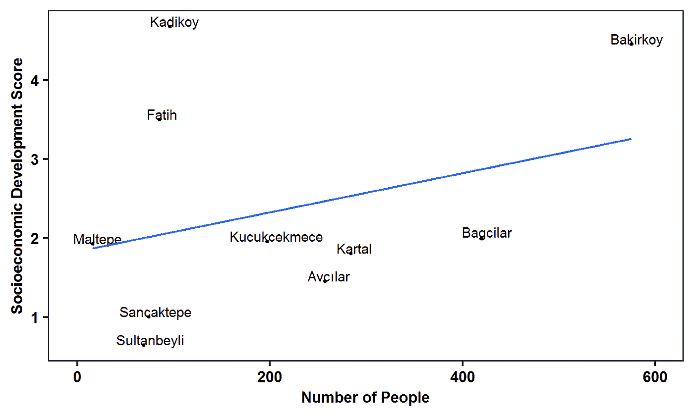

**SEGE vs Number of Humans**

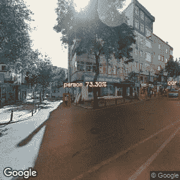

作为第二个观察，我们寻找 SEGE 和人类数量之间的关系。存在 0.24 的弱相关性，这看起来更有希望，但作为定义我们模型的唯一因素仍然不稳健。

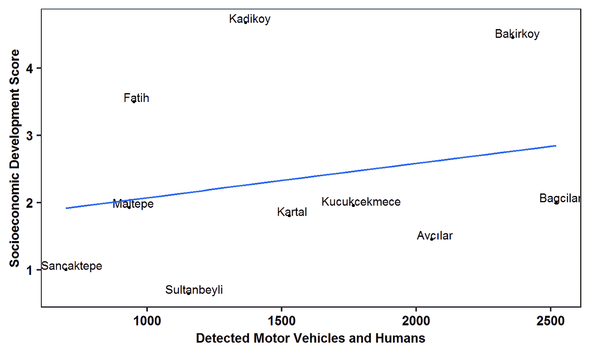

**SEGE vs Number of Motor Vehicles and Humans**

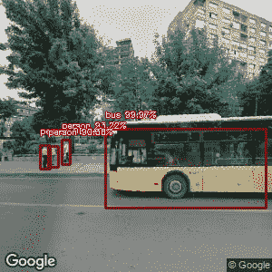

在第三张图中，我们综合了这些因素，观察到了更好的相关性。然而，这种组合也没有完全改变我们的结论。SEGE 与人和机动车数量之间的相关性很弱，为 0.23。

因此，我们只能在对象的数量和分数之间达到弱相关，这可以从下面的图中看出。然而这并不阻止我们对这个话题进行更多的探索。我们的项目将继续检测更多的物体(如建筑年代，树木等。)并获取不同街区的更多 GSV 图像，以提取 SEGE 分数和对象数量之间的某种关系。

## 结论

最后，我们的研究主要是通过谷歌街景 API 和 Geojson.io 从伊斯坦布尔的不同地区提取等距照片，将这些照片输入 YOLO v3 模型，以找到不同特征的数量(如人类和机动车辆)，并将我们的结果与工业和技术部发布的数据集可视化，以找到相关性。

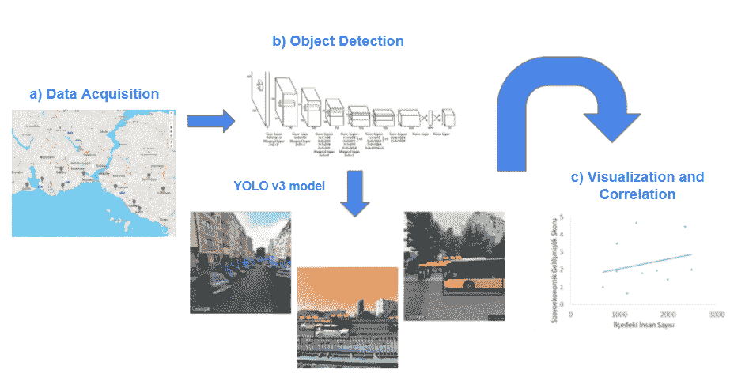

Our Project Pipeline

通过传统的调查方法，从一个社区和地区获取信息的成本很高。到目前为止，我们遇到的所有工作在财政和人力资源方面都很昂贵。通过使用对象检测方法，我们希望从 GSV 图像中提取类似的洞察力。虽然我们到目前为止还没有找到我们一直在寻找的关系，但这是一个正在进行的项目，我们的目标是扩大这个项目的范围。

代码:[https://github.com/inzva/object-detection-with-street-view](https://github.com/inzva/object-detection-with-street-view)

## **参考文献**

[1] Gebru，Timnit & Krause，Jonathan & Wang，Yilun & Chen，Duyun & Deng，Jia & Aiden，Erez &，Li .(2017).使用深度学习和谷歌街景来估计美国各地社区的人口构成。美国国家科学院院刊。114.201700035.10.1073/pnas

[2]欧弟，c；勒勒卡斯，p。使用深度多示例学习的城市社区中基于图像的社会经济地位替代物。j .成像 2018，4，125

[3][https://developers . Google . com/maps/documentation/street view/overview](https://developers.google.com/maps/documentation/streetview/overview)

[https://kisi.deu.edu.tr/yunusemre.ozer/lce_sege-2017.pdf](https://kisi.deu.edu.tr/yunusemre.ozer/lce_sege-2017.pdf)