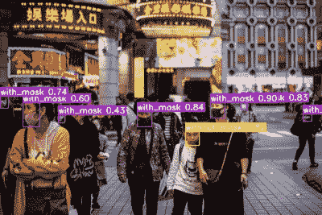

# 使用 YOLOv7 创建自定义对象检测模型

> 原文：<https://medium.com/mlearning-ai/object-detection-with-yolov7-a74fa1f03c7e?source=collection_archive---------1----------------------->

## 使用最强大的实时算法 YOLOv7 训练模型以实时检测面具

Image from [Face Mask Detection dataset](https://www.kaggle.com/datasets/andrewmvd/face-mask-detection), overlayed with predictions from custom YOLOv7 trained model

对象检测是一种强大的深度学习技术，允许检测图像中的对象。每当在图像中检测到对象时，会在该对象周围绘制一个矩形边界框。