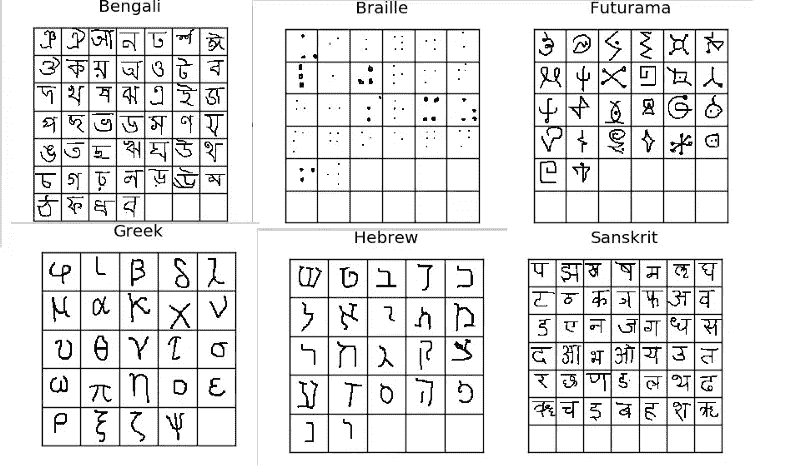
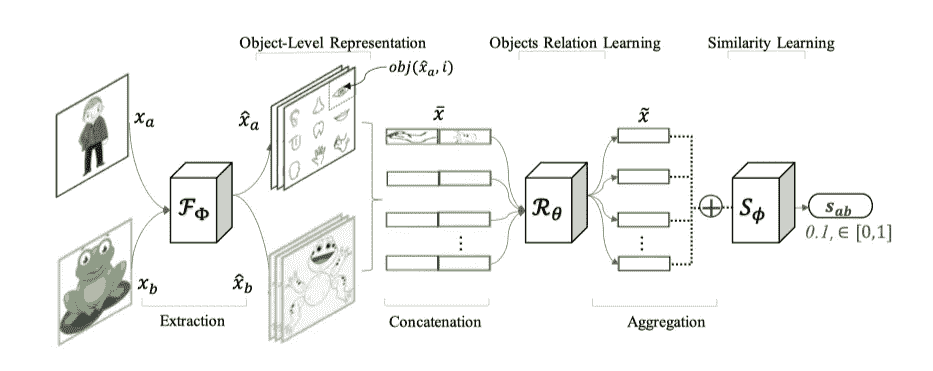
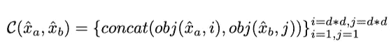
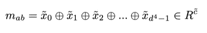
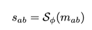
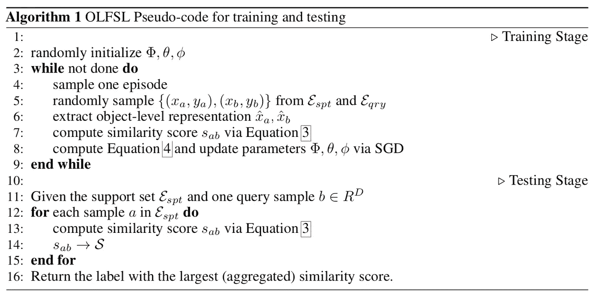
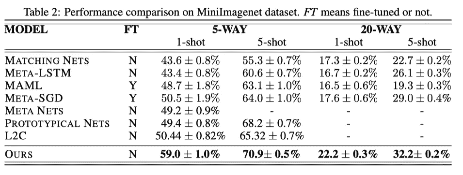

# 用于少镜头图像分类的对象级表示学习

> 原文：<https://medium.com/mlearning-ai/object-level-representation-learning-for-few-shot-image-classification-8ed397a2085c?source=collection_archive---------8----------------------->

# **简介**

人类在现实生活中表现出很强的快速理解概念的能力。基于先验知识和演绎推理，我们可以很容易地感知和识别物体的变化。因此，我们正在尝试转移这种想法，并在机器学习系统上实现它们。然而，传统的机器学习系统通常需要大量的数据和庞大的标注类来训练。因此，设计了少量学习的想法——使用少量可能类别的示例来训练模型以完成分类任务。

# **方法论**

提出了一种基于对象层次关系学习图像相似度的新方法。它被称为 OLFSL，是目标级少量学习的缩写。来自两个图像的对象被比较以学习对象级别关系，从而推断对象的相似性。这个模型包括三个主要部分:**表示学习** 𝔉ϕ(x】、**对象关系学习** ℜθ(a,b)和**相似性学习** 𝔖ϕ(r).

**表示学习**从每个输入图像中提取物体的特征。这些特征随后将被输入到**对象关系学习模块**中，并生成图像级**相似性得分**。最近邻搜索随后应用于目标数据集以进行少量拍摄分类。

它利用从已知类别中学习到的对象级关系来推断未知类别中样本的相似性。在 Omniglot 和 MiniImagenet 两个数据集上对该方法进行了评估。

**Omniglot 数据集**

它使用 Omniglot 数据集，该数据集由来自 50 个不同字母的 1623 个手绘字符组成(每个字符由不同的人绘制)。每个图像都是 105×105 尺寸的灰度图像。

为了澄清字符和字母表之间的区别，以英语为例，从 A-Z 被认为是字母表，而字母 A、B … Z 中的每一个都被认为是字符。因此，一个英语字母表有 26 个字符。

Image source: [https://sorenbouma.github.io/blog/oneshot/](https://sorenbouma.github.io/blog/oneshot/)

Omniglot 数据集可以从[这里](https://github.com/brendenlake/omniglot)下载。

**迷你图像网络数据集**

这个数据集是由 Ravi & Larochelle 提出的[1]。它由 100 个类组成，每个类有 600 个 84x84 彩色图像样本。点击[此处](https://drive.google.com/file/d/1rV3aj_hgfNTfCakffpPm7Vhpr1in87CR/view)可下载 MiniImageNet 数据集。

# **模型架构**

在少镜头学习过程中，模型被输入一组带标签的图像 *𝔖 = {(x1，y1)，(x2，y2)，…，(xn，yn)}* ，其中 ***x*** 表示图像的特征， ***y*** 表示类别标签。很常见的是看到术语 ***N 路 K 拍学习*** ，其中 N 表示每类的图像实例数，K 表示类标签数。

Image source : [https://arxiv.org/pdf/1805.10777](https://arxiv.org/pdf/1805.10777)

从上图可以看出，xα表示原始图像的特征，yα表示原始图像的标签。将它们送入卷积神经网络，从高维空间中提取有用的特征。随后，对象级关系学习通过成对连接对象来比较这两个输入的矢量表示。

然后，将每个连接的向量提供给完全连接的神经网络，以学习对象级关系。所有对象关系向量被聚集以形成图像级关系。

然后将图像层次关系特征向量输入全连接神经网络计算相似性得分。它用于计算向量α和向量β之间的相似性，并最终归一化为[0，1]，其中 0 表示它们都属于不同的类，1 表示相同的类。

对象级少数镜头学习的算法如下所示。

Algorithm 1: Pseudocode for OLFSL

# **实验和结果**

在 Omniglot 数据集上的实验设置是用 5 路 1 射、5 路 5 射、20 路 1 射和 20 路 5 射来完成的。结果是 600 个测试集的平均值，并以 95%的置信区间报告。可以看出，对于 4 个任务中的 3 个，该方法优于现有方法。

MiniImageNet 上的实验设置也是类似的。可以看出，该模型也实现了比现有方法更好的改进。

# **参考文献**

a.[https://arxiv.org/pdf/1805.10777](https://arxiv.org/pdf/1805.10777)

b.[https://www.cs.cmu.edu/~rsalakhu/papers/oneshot1.pdf](https://www.cs.cmu.edu/~rsalakhu/papers/oneshot1.pdf)

[1]拉维、萨钦和拉罗歇尔，雨果。作为少量学习模型的最优化。在*2017 年国际学习代表大会(ICLR)*

[2]MiniImageNet:[https://drive.google.com/uc?id=0B3Irx3uQNoBMQ1FlNXJsZUdYWEE&导出=下载](https://drive.google.com/uc?id=0B3Irx3uQNoBMQ1FlNXJsZUdYWEE&export=download)