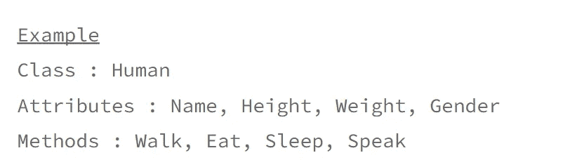
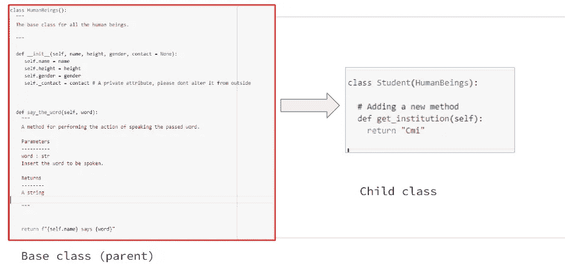
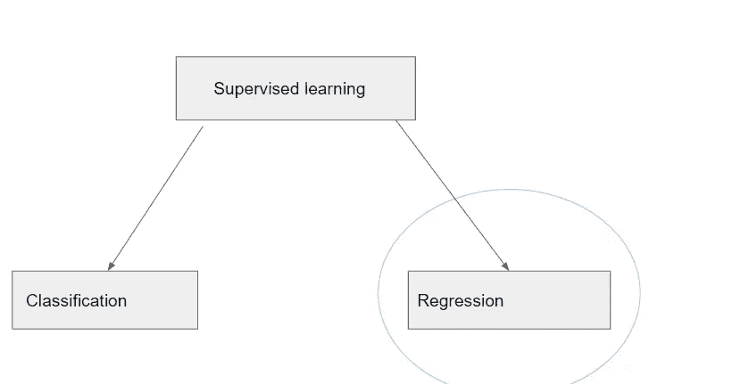
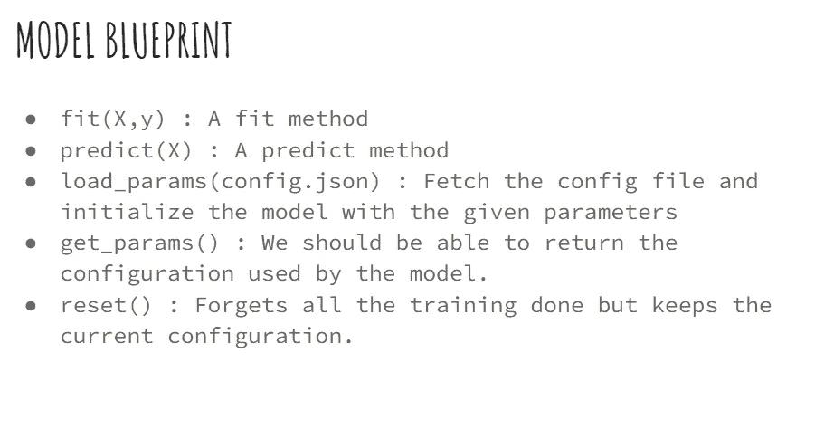
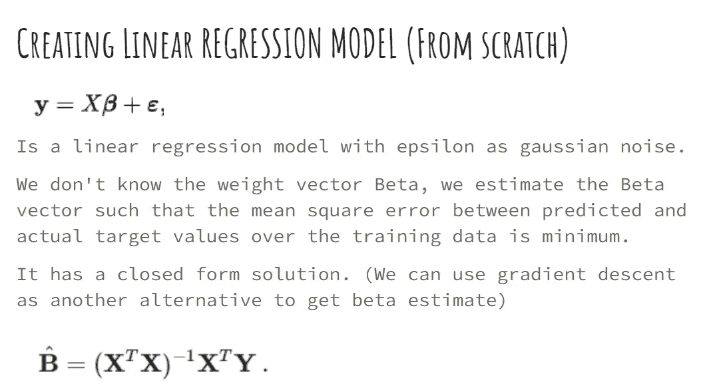
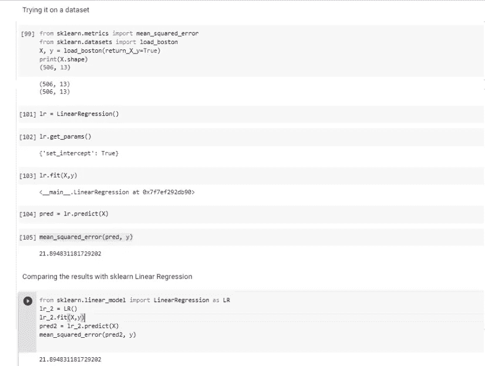

# Python 中面向对象编程和 ML 模型开发

> 原文：<https://medium.com/mlearning-ai/object-oriented-programming-and-ml-model-development-in-python-ada4bf76529b?source=collection_archive---------1----------------------->

本文的目标是利用面向对象的编程方法，在 python 中构建可靠的机器学习模型。在详细讨论之前，我们应该先了解一些基础知识。

## 基础

在 oop 范例下，一切都被认为是一个对象。该对象属于特定的类(类的实例)。

例如，一个人是人类类的一个实例。

所有的类都是由属性和方法定义的。

python 实现。

## 一些糟糕的概念

在这一节中，我们将介绍 python 中一些重要的 oops 概念。

1.  遗产

继承是通过继承父类的所有方法和属性来创建子类的能力。例如，学生可以是人类类的子类。

Class Student is created from the parent class human beings. Note that the student class inherited all the methods, and attributes of the parent class and also has an additional method defined.

创建子类非常简单，只需将父类名作为输入放入类定义括号中。

2.方法重载

如果父类和子类共享一个公共的方法名，那么子对象执行只在子类下定义的方法，而不是在父类下定义的方法。这有助于从父类中重新定义一些方法。

3.抽象类和方法

*   一个抽象类可以被认为是其他类的蓝图。
*   它充当基类。
*   我们无法创建它的任何实例(对象)。
*   它有抽象方法，子类必须覆盖这些方法。(否则，会引发错误)

好处:-

1.  *我们可以粗略地定义这个结构。(只是蓝图)*
2.  *我们可以检查子类是否保留了某种结构(抽象方法)*

我们将在下一节更详细地研究抽象类。

## ML 模型

Supervised learning can be broadly described into two categories. We will look at how to leverage OOPS concepts to create a regression model.

在创建基本模型类之前。让我们写下模型应该具备的基本方法。

A typical model blueprint.

现在让我们为回归模型创建一个基础(抽象)类。

注意，不需要定义抽象函数。它们应该被子类重载。我已经添加了来自 sklearn 基本模型类的 get_params()方法。抽象函数是使用抽象方法 decorator 定义的。

抽象类是通过从标准库中的 abc 模块继承基类 ABC 来创建的。

**线性回归模型**

我们将继承基类，并在它的基础上创建模型类。它将为该类提供一些基本的功能，并确保我们定义了 fit 和 predict 等方法(抽象的)。

Comparing our model with sklearn linear regression. Both the models give similar mse.

**前馈神经网络**

我们将使用 TensorFlow、Keras 和我们的抽象类来定义模型类。

 [## Mlearning.ai 提交建议

### 如何成为 Mlearning.ai 上的作家

medium.com](/mlearning-ai/mlearning-ai-submission-suggestions-b51e2b130bfb)