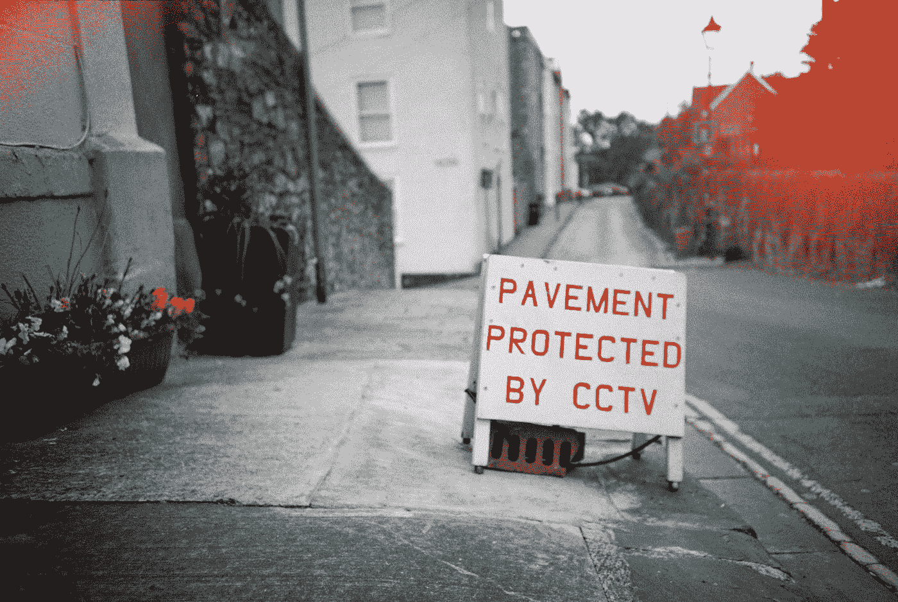
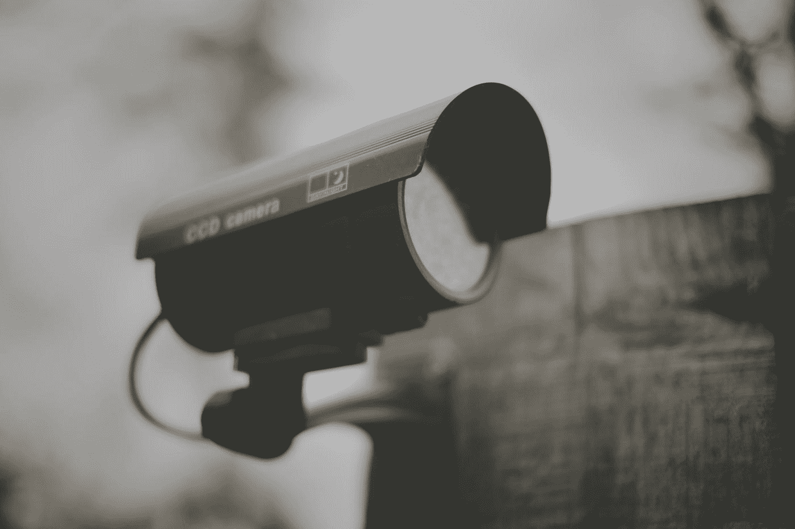
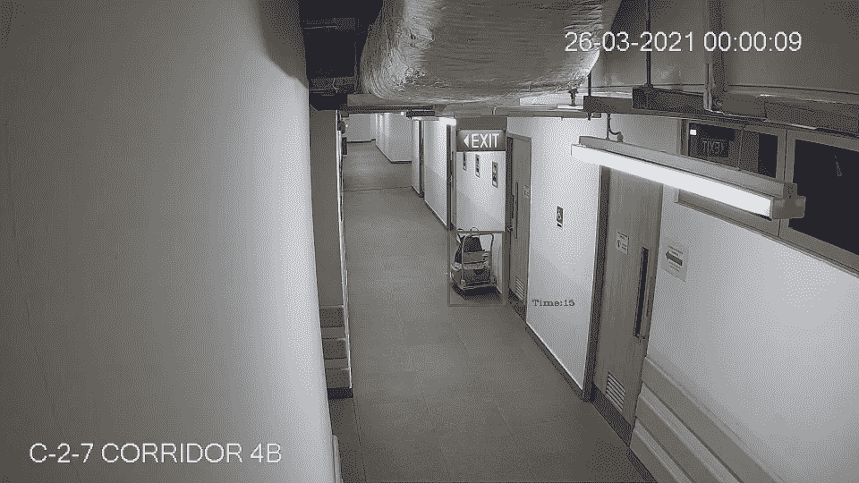

# 使用 OpenCV-Python 进行障碍物检测和跟踪

> 原文：<https://medium.com/mlearning-ai/obstruction-detection-and-tracking-using-opencv-python-ea5838822945?source=collection_archive---------1----------------------->

本文将讨论一个用例，在这个用例中，我们尝试使用 OpenCV-Python，使用对象检测和跟踪算法来检查视频馈送中指定区域内的障碍物。所描述的概念类似于遗弃物体检测的概念，其中我们检测物体并跟踪物体以在延长的时间段内确定静态物体。

Photo by [Gemma Evans](https://unsplash.com/@stayandroam?utm_source=medium&utm_medium=referral) on [Unsplash](https://unsplash.com?utm_source=medium&utm_medium=referral)

## 问题陈述

对于此用例，需要使用视频分析来监控受控空间，并检测通道(如走廊、电梯大厅、紧急出口等)是否有障碍物。在这个用例中，障碍物的定义是相当通用的，它被定义为用于阻塞通路的物体。这些障碍物中的一些在本质上可能是暂时的，因此障碍物必须从空间中移除是有时间限制的。

视频的主要来源被定义为前提闭路电视。

Photo by [Joe Gadd](https://unsplash.com/@sharp_shutter?utm_source=medium&utm_medium=referral) on [Unsplash](https://unsplash.com?utm_source=medium&utm_medium=referral)

## 输出量的希望值

该解决方案的预期输出是在检测到潜在堵塞时发出警报。

# 目标跟踪

在这个项目中，我们将质心跟踪算法应用于我们的输入视频流，以跟踪检测到的对象。本质上，该方法依赖于(1) *现有的*对象质心(即，质心跟踪器之前已经看到的对象)和(2)视频中后续帧之间的新对象质心之间的欧几里德距离。

这是使用 openCV 库实现的。要进一步了解这个算法，可以参考这个[网站](https://www.pyimagesearch.com/2018/07/23/simple-object-tracking-with-opencv/)。在本文中，我们将使用来自这个 [github](https://github.com/mailrocketsystems/AIComputerVision) 的脚本。

# **入门**

在我们开始之前，必须安装以下库。这可以通过 pip 或 conda 完成。

我们将从为这个用例导入必要的依赖项开始

接下来的几个步骤包括构造参数解析器、解析参数和初始化算法中使用的变量。

[obstruct _ initialize _ var . py](https://gist.github.com/xictus77/8f879d7b1b6c096bf33f02eae976b315)的第 16 行定义了警报产生前检测到的静态障碍物的最大允许持续时间。

注意在[的第 26–43 行中，有一个坐标列表，它在创建的视频中形成了一个多边形或感兴趣的区域。使用](https://gist.github.com/xictus77/8f879d7b1b6c096bf33f02eae976b315) [LabelMe 注释工具](https://github.com/CSAILVision/LabelMeAnnotationTool)可以很容易地获得这个多边形或点，其中多边形在屏幕截图上绘制，然后点以 json 格式保存。

在第 41 行中，需要将这些点重新缩放到较小的分辨率，如第 59 和 60 行中的输出视频所定义的。

我们还定义了一个名为 NMS.py 的函数。本质上，这个非最大值抑制函数能够忽略较小的重叠边界框，只返回图像或视频中检测到的对象的较大边界框。即使它们*与*重叠，重叠率也不会超过提供的阈值 *0.3* ，该阈值可在下面主代码的*行 72* 中修改。

现在对于[主代码](https://gist.github.com/xictus77/9fd7592764c8b999371ba5bf7ca3dd24)。当我们抓取视频输入的第一帧作为基础图像并与视频中的其余帧进行比较时，理想情况下，第一帧应该没有障碍物。感兴趣区域(ROI)也将从初始化阶段的坐标列表中绘制。当我们比较这些帧时，将只显示 ROI 内的边界矩形，我们还将通过解析最小面积参数来定义对象的最小尺寸。默认大小为 500 像素。

在 [main_code_on_detect.py](https://gist.github.com/xictus77/9fd7592764c8b999371ba5bf7ca3dd24) 的第 122 到 131 行，如果停留时间超过初始化阶段设定的允许时间，将会出现障碍物检测。我们还将保存包含检测到的对象的帧的快照。对象跟踪跟踪对象的质心，只要质心停留在绘制的 ROI 内，它就会被标记为障碍物。

下面显示了代码输出的快照。蓝色细线表示 ROI，红色边框表示检测到的障碍物。

A snapshot from the sample output showing the obstruction and its dwell time — Source: Author

# 限制

我们在此使用案例中使用启发式方法，因为没有明确指示哪些对象可能是障碍物。因此，我们只能设定一条规则，一旦物体达到一定的尺寸，我们就认为它是一个相当大的障碍物。

如果我们能够获得关于检测到的对象类型的数据，并使用它来训练模型，则在检测后使用对象识别或标识的潜力将会很高。

这种方法的另一个限制是使用第一帧作为基础图像。在视频监控中，我们可能无法确定第一帧，因此需要修改算法以捕捉“空”帧作为基础图像。这种方法也受限于一致的照明，因为它将帧与基础图像进行比较。可以进行进一步的改进，以使用较长时间段内的平均帧，或者使用更高级的帧差分算法来解决这种光照限制。

你可以在这里下载我的完整代码

[https://github.com/xictus77/obj_detection](https://github.com/xictus77/obj_detection)

# 参考

 [## 用 Python 和 OpenCV - PyImageSearch 实现基本的运动检测和跟踪

### 最后更新于 2021 年 7 月 8 日。那个狗娘养的。我知道他拿走了我最后一瓶啤酒。这些话是一个男人永远不应该说的…

www.pyimagesearch.com](https://www.pyimagesearch.com/2015/05/25/basic-motion-detection-and-tracking-with-python-and-opencv/)  [## 使用 OpenCV - PyImageSearch 进行简单的对象跟踪

### 最后更新于 2021 年 7 月 8 日。今天的教程开始了一个新的关于物体跟踪的博客系列，可以说是…

www.pyimagesearch.com](https://www.pyimagesearch.com/2018/07/23/simple-object-tracking-with-opencv/)  [## GitHub-mail rocket systems/AI computer vision:这个项目包含各种计算机视觉和 AI…

### 这个项目包含各种计算机视觉和人工智能相关的 python 脚本链接到完整的播放列表…

github.com](https://github.com/mailrocketsystems/AIComputerVision)  [## GitHub-CSAILVision/LabelMeAnnotationTool:label me 注释工具的源代码。

### 在这里，您可以找到在服务器上安装 LabelMe 注释工具的源代码。LabelMe 是一个注释工具…

github.com](https://github.com/CSAILVision/LabelMeAnnotationTool)  [## Mlearning.ai 提交建议

### 如何成为 Mlearning.ai 上的作家

medium.com](/mlearning-ai/mlearning-ai-submission-suggestions-b51e2b130bfb)