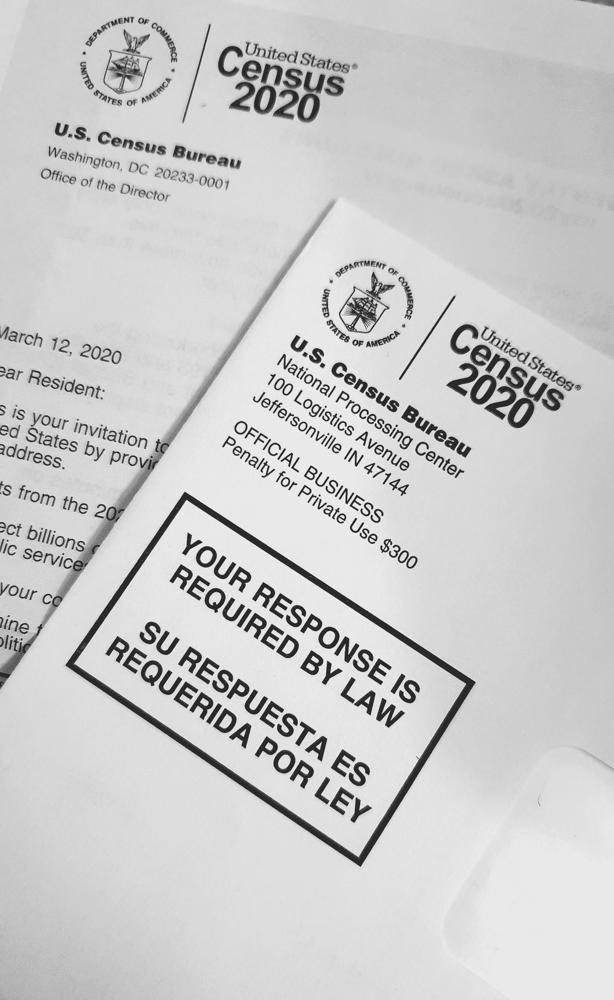

# 使用 R & TidyCensus 在五分钟内获得普查数据

> 原文：<https://medium.com/mlearning-ai/obtain-census-data-in-under-five-minutes-using-r-tidycensus-f6c87ac47561?source=collection_archive---------5----------------------->

Photo by [Enayet Raheem](https://unsplash.com/@raheemsphoto?utm_source=medium&utm_medium=referral) on [Unsplash](https://unsplash.com?utm_source=medium&utm_medium=referral)

你是否经常厌倦直接从 census.data.gov 获取数据？还是 Census API 在你的代码中抛出了错误？也许你就像我们其他人一样，想要尽可能地简化你的工作流程。

嗯，[凯尔·沃克博士](https://github.com/walkerke) r 在开发 [TidyCensus](https://github.com/walkerke/tidycensus) 时考虑到了所有美国人口普查数据用户，这是一个 R 包，使获得人口普查…