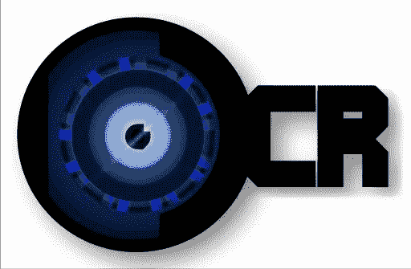
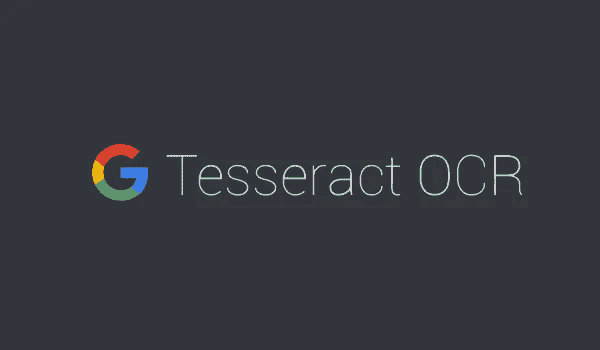
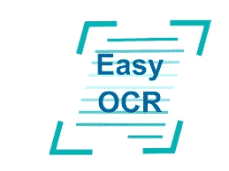
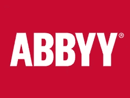
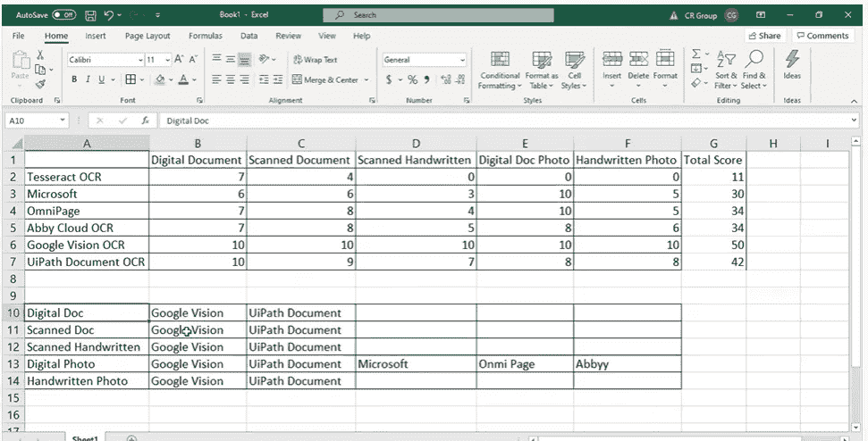

# 光学字符识别:机器令人难以置信的阅读能力

> 原文：<https://medium.com/mlearning-ai/ocr-the-incredible-reading-capability-of-machine-1bc120280ea9?source=collection_archive---------4----------------------->



[Image Source](https://geekgirljoy.wordpress.com/2017/06/02/lets-teach-ai-how-to-read-using-php-iv/)

如果您有成千上万的纸质文档和表格，并且您想以数字方式存储它们，该怎么办！键入每个单词都有帮助，对吗？但是手动键入每一项内容将是非常乏味、忙乱和耗时的任务。OCR 可以在这方面有所帮助。OCR 代表“**光学字符识别”**。OCR 是计算机视觉的一个领域，它处理文本图像并将文本转换成机器可读的形式。这是一种**识别数字图像中文本**的技术。OCR 用于将不可编辑的软拷贝转换为可编辑的文本文档。正因如此，它可以被称为“机器的[神奇的](https://www.urbandictionary.com/define.php?term=wizardous)阅读能力。”


[Image source](https://www.shutterstock.com/image-vector/concept-optical-character-recognition-software-pile-625251020)

基本上所有的 **O** 光学 **C** 字符 **R** 识别引擎都遵循以下基本步骤:

1.  **噪声消除**

a.它可以去除灰尘、图形

b.它对齐文本

c.将任何类型的颜色组合转换为黑白

**2)字符识别**

a.逐个像素地比较每个扫描的字母

b.致力于了解可能的字体

c.决定最接近的匹配

3)更复杂的算法在最精细的层面上工作。他们将每个字符分成不同的片段，然后识别其曲线、亮度、拐角，并寻找与字符实际形状的物理匹配。

4)在提取的特征和匹配的基础上，OCR 引擎决定这可以是哪个字符。

5)在不可分割地识别字符之后，它将它们排列成单词序列。

6)很多时候，OCR 引擎有数据或字典用于映射引擎怀疑的单词，或者如果从字符形成的单词没有意义。

OCR 工具的基本工作步骤非常相似。但是根据产品及其组织，在高级处理中有许多变化。我不会在这个博客中描述所有的方法，因为每个方法都需要单独的博客来描述。但是我将提供名称和参考资料来更详细地理解 OCR 工具。

可以参考 [**详细 OCR 概述**](https://unstats.un.org/unsd/demographic/sources/census/wphc/dataCapture/docs/Data-Capture_ch06-ABS.pdf) 了解更多声音。

最著名的 OCR 工具有:

# 1)宇宙立方体或宇宙立方体



[**文档**](https://github.com/tesseract-ocr/tessdoc)

[**视频**](https://youtu.be/6DjFscX4I_c)

— — — — — — — — — — — — — — — — — — — — — — — — — — — — — —

# 2) Keras OCR


[**文档**](https://keras-ocr.readthedocs.io/en/latest/)

[**视频**](https://youtu.be/OPg_YuX6ThY)

— — — — — — — — — — — — — — — — — — — — — — — — — — — — — —

# 3)微软光学字符识别应用编程接口


[**文档**](https://docs.uipath.com/activities/docs/microsoft-ocr)

[**视频**](https://youtu.be/11MG-RJ-L04)

— — — — — — — — — — — — — — — — — — — — — — — — — — — — — —

# 4)全向页面


[**文档**](https://docs.uipath.com/activities/docs/omnipage-ocr)

[**视频**](https://youtu.be/x6pHrumtHVw)

— — — — — — — — — — — — — — — — — — — — — — — — — — — — — —

# 5)简单的光学字符识别



[**文档**](https://www.jaided.ai/easyocr/documentation/)

[**视频**](https://youtu.be/owiqdzha_DE)

— — — — — — — — — — — — — — — — — — — — — — — — — — — — — —

# 6)艾比云 OCR



[**文档**](https://www.abbyy.com/cloud-ocr-sdk/documentation/)

[**视频**](https://youtu.be/k9lOAQzTJjc)

— — — — — — — — — — — — — — — — — — — — — — — — — — — — — —

# 7)谷歌视觉光学字符识别


[**文档**](https://cloud.google.com/vision/docs/apis)

[**视频**](https://youtu.be/xKvffLRSyPk)

— — — — — — — — — — — — — — — — — — — — — — — — — — — — — —

# 8) UI 路径文档 OCR


[**文档**](https://docs.uipath.com/activities/docs/ui-path-document-ocr)

[**视频**](https://youtu.be/oFHPMZehoiU)

— — — — — — — — — — — — — — — — — — — — — — — — — — — — — —

# 那么我们应该使用哪种 OCR 技术呢？

对所有著名的文本抽取模型进行了全面的比较

在他的 YouTube 视频中。我将展示他最后的结论，



Text extraction comparison [[Image source](https://www.youtube.com/watch?v=y3G4RAY2alU)]

> 在这个特定的视频系列中，他比较了考虑到数字文档、扫描文档、手写扫描文档、数字照片和手写照片的所有模型。 **Google Vision** 和 **UiPath** 文档似乎在所有类型的文档中都能很好地工作。但是大部分事情仍然依赖于问题陈述。

Nisarg Kadam 的视频链接:

**part 1:** [**哪个 OCR 最好？**](https://youtu.be/5sMVA9GHziU)

**part2:** [**哪个 OCR 最好？**](https://youtu.be/y3G4RAY2alU)

# 如果我们应用了 OCR 模型，没有得到好的结果怎么办？

提高文本提取性能的原因有很多，方法也不多。

**提高 OCR 模型准确度的方法:**

> 1) **仅选择源文档中存在语言**

这减少了对字符和图案的错误解释，并有助于减少噪声。像在宇宙魔方中一样，你可以选择语言包。

> **2)文本旋转**

大多数 OCR 引擎在水平和垂直对齐时都能很好地工作。当文本出现倾斜或旋转角度时，它会变得更加困难。一些 OCR 引擎有 **PSM** (页面分割模式)，我们可以在其中选择扫描方向。

> **3)图像照明**

亮度和对比度是增强文本提取特征的可读性和清晰度的两个因素。有许多应用程序可以帮助调整图像的对比度和亮度。适当的光照条件可以提高 OCR 的结果。

> **4)图像扩展**

压缩、调整大小和其他图像操作往往会丢失图像信息。。JPG 格式倾向于丢失更多的数据。巴新和。TIFF 不要在这种程度上丢失数据。明智地选择图像格式可以提高 OCR 的效率。下面提到的 python 代码可用于将图像转换为所需的 DPI。

```
from PIL import Image
img = Image.open("IMAGE.png")
img.save("Converted_IMAGE-600.png", dpi=(300,300))
```

> **5)图像质量**

每英寸点数或 DPI 是考虑图像质量的主要因素。低于 300 DPI 的分辨率会使图像不清晰。网上有很多 DPI 转换工具可以帮你得到你需要的 DPI。所以尽量用更高 DPI 的图像。

了解更多概念，如 DPI，分辨率，PNG，JPG 和其他图像格式，PPI，无损格式等。可以参考我之前的 [**博客。**](/@BH_Chinmay/calibration-in-image-processing-c4c164870f21)

# |有用的材料|

1.  我发现了一个很好的系列，通过 [**Python 数字人文教程**](https://www.youtube.com/channel/UC5vr5PwcXiKX_-6NTteAlXw) 来理解 OCR。这是 OCR 上视频系列的 [**链接**](https://youtu.be/tQGgGY8mTP0) 。
2.  我发现的一个有趣的 GitHub 账户是 OCR 的 Kba 账户。下面是链接:[**kba/awesome OCR**](https://github.com/kba/awesome-ocr)**。从这个账户你将会了解很多事情以及有趣的项目源代码。**
3.  我找到了一本由 Adrian Rosebrock 博士写的非常好的书“ **OCR 与 Tesseract、OpenCV 和 Python”。** [**图书链接**](https://pyimagesearch.mykajabi.com/offers/WQyUdVtT/checkout)

**Adrian rose Brock 博士**PyImageSearch.com 公司前创始人兼首席执行官，攻读计算机视觉博士学位。

所以这些都可以帮助你在基础层面解决 OCR 相关的问题陈述。

4.一个项目为“OCR 模型读取验证码”你可以参考 [**这个**](https://youtu.be/OS5GDGU-jvc) 视频。

— — — — — — — — — — — — — — — — — — — — — — — — — — — — — — —

|| **看我以前的故事** ||

[**物体检测精简版:模板匹配**](/@BH_Chinmay/object-detection-lite-template-matching-c9af77517f6c)

[**图像处理中的校准**](/@BH_Chinmay/calibration-in-image-processing-c4c164870f21)

[**边缘检测算法的种类**](/@BH_Chinmay/types-of-edge-detection-algorithms-365122d799bf)

关注我更多此类内容在[**LinkedIn**](https://www.linkedin.com/in/chinmay-bhalerao-6b5284137/)&[**Medium**](/@BH_Chinmay)。

— — — — — — — — — — — — — — — — — — — — — — — — — — — — — — — -

**谢谢你！！**

[](/mlearning-ai/mlearning-ai-submission-suggestions-b51e2b130bfb) [## Mlearning.ai 提交建议

### 如何成为 Mlearning.ai 上的作家

medium.com](/mlearning-ai/mlearning-ai-submission-suggestions-b51e2b130bfb)