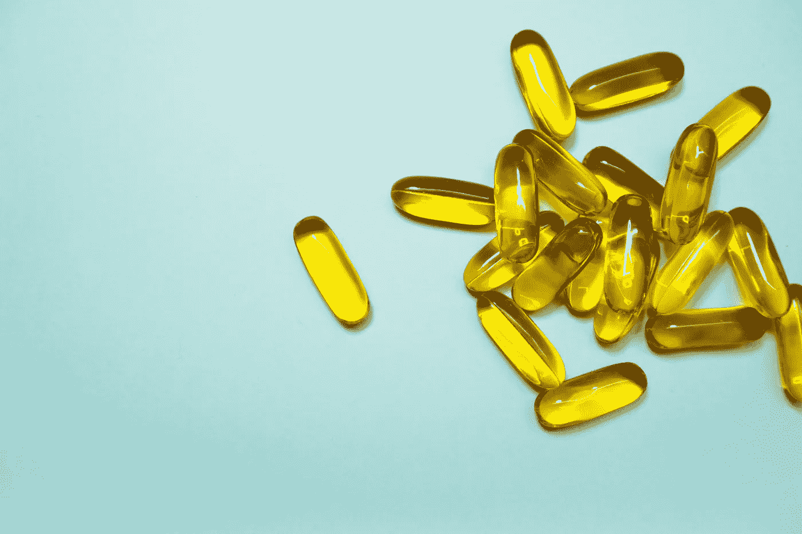
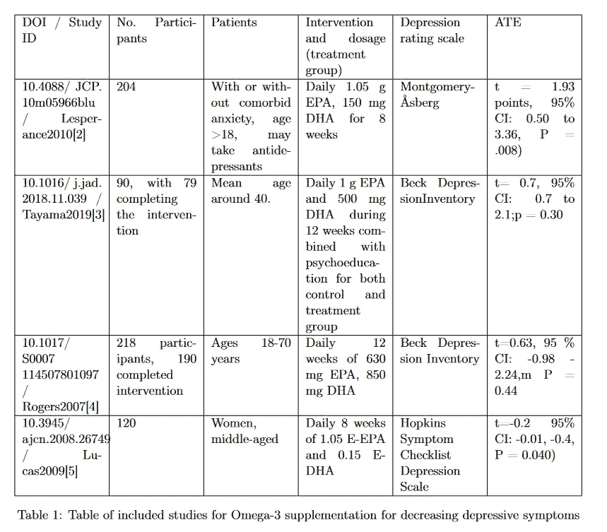
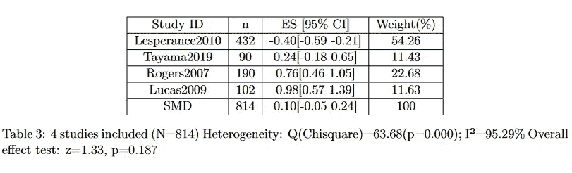
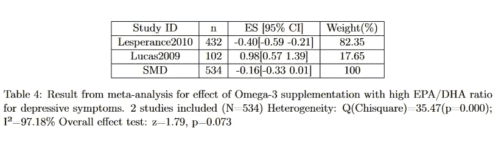
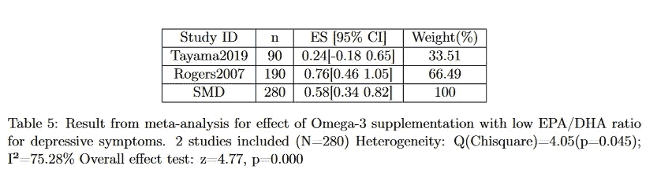
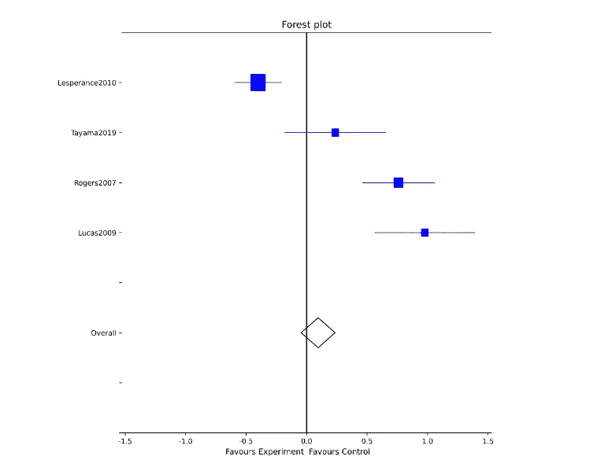

# Omega-3 治疗抑郁症——一项荟萃分析

> 原文：<https://medium.com/mlearning-ai/omega-3-for-depression-a-meta-analysis-102a210daae3?source=collection_archive---------2----------------------->

## 在过去的十年里，心理健康问题，尤其是抑郁症，已经引起了越来越多的关注。有一个共识是，社会措施以及高质量的治疗是必要的。对于个人本身来说，另一个问题也非常重要。我能做些什么来提高我的幸福感？在这里，我们研究ω-3 补充剂对减少抑郁症状的作用。

## 介绍

从主要的健康和科学流行媒体上，人们很容易有这样的印象:补充剂可以是抗抑郁药的天然替代品。在某些情况下，显示积极结果的小规模研究得到了广泛传播，但科学共识可能会显示其他结果。这方面的一个例子是主要的播客胡伯尔曼实验室，它表明有科学证据表明补充欧米伽-3 可以有抗抑郁的效果。参考一项研究，其中与仅服用普通抗抑郁药物以及抗抑郁药物和 Omega-3 的组合的组相比，评估了 Omega-3 (EPA)补充。他们的结果表明，补充欧米伽-3 和抗抑郁药只对分成三组的总共 60 名参与者有类似的效果。然而，人们可以很容易地发现，后来发表的随机安慰剂对照试验显示，相同的补充剂根本没有显著效果。我们进行了一项荟萃分析，研究了补充 Omega-3 减少抑郁症症状的科学证据。

## 方法

我们将对关于减少抑郁症症状的补充剂的现有研究进行荟萃分析。具体来说，我们将考虑随机对照试验，根据完善的抑郁等级量表比较试验前后的症状。对于每个 RCT，我们假设一致性和可交换性适用于所研究的人群。此外，我们将确定一个可以比较结果的群体或一组条件变量。我们还将考虑结合不同研究的不确定性测量的方法。

我们将治疗结果定义为干预前后所研究的抑郁等级量表上的相对差异，每个量表上较低的值对应较不严重的抑郁症状。然后我们用上述方法进行荟萃分析。进一步表明 EPA 和 DHA 之间的比例会影响补充的结果。为了检验这一假设，我们定义了 EPA/DHA 比率，计算了条件性预期治疗结果，并通过进行仅包括具有特定比率的研究的荟萃分析，从数据中对这些结果进行了估计。

## 数据

我们回顾了补充剂 Omega-3 对抑郁症状影响的科学文献。研究的入选标准是:

*   随机对照试验。
*   对于已建立的抑郁评定量表，如 Montgomery-OS Berg 或 Beck 抑郁量表，平均治疗效果表示为对照组和治疗组之间的差异，具有不确定性测量。
*   没有身体共病。

此外，我们在评估研究时使用以下排除标准。

*   产后抑郁症患者
*   患有严重心理共病(如精神病风险)的患者
*   涉及治疗组联合疗法的随机对照试验。

对于 Omega-3，PubMed 上有 116 项与补充和抑郁相关的随机对照试验。其中约有 20 人符合无共病的标准，并使用已建立的抑郁等级量表进行了深入研究。下表列出了最终选择的纳入研究。

## 结果和分析

当汇总分析中包含的所有数据时，我们没有获得 Omega-3 在减少抑郁症状方面的任何显著结果。这可以从下表中看出，加权抑郁量表的综合效应为 1.33，p 值为 0.187，这意味着结果不显著。结论是，我们的荟萃分析无法发现 Omega-3 补充剂和安慰剂在抑郁等级量表上的显著差异。

应该注意的是，欧米伽-3 的研究是针对完全不同的人群进行的。例如，Lucas 等人仅对 120 名受试者的中年妇女进行了补充剂的效果研究，其中他们发现了 supplementation⁵.的显著效果同样，在 Lesperancé等人的研究中，没有共病焦虑的患者的结果显示，与有共病焦虑的患者相比，抑郁症状改善更大。这表明，对于抑郁症状，ω-3 可能有效果，但正如 Lesperancé等人所写的那样，它可能没有减轻焦虑的能力。

同样有趣的是，EPA/DHA 的比例也有影响。当将研究分成高与低 EPA/DHA 比率组时，我们得到以下结果。

High EPA/DHA ratio

Low EPA/DHA ratio

我们观察到，不同 EPA/DHA 比例的条件 SMD 表明，更高的比例可能是有益的。从这些为数不多的研究中，并考虑到低与高 EPA/DHA 比率的两个研究组的参与者之间的差异，不可能得出任何与此相关的确切结论。然而，从下面的森林图中可以看出，EPA/DHA 比率较高的研究似乎具有较高的效果。

Forest plot of meta-analysis results

总结结果，我们发现没有普遍支持补充 Omega-3 来减少抑郁症状，但是对于女性和剂量中较高的 EPA/DHA 比率，可以发现积极的效果。

这个项目的一个普遍反映是，主要的挑战是找到可以比较的数据，并与因果问题陈述的定义相一致。Omega-3 是一种非常常见的补充剂，但很难找到大量的随机对照试验进行比较。对于不太常见的补充剂，甚至更难找到其效果的证据，人们往往只能依靠轶事证据和单一的非安慰剂对照试验。

## 结论

如果你正在考虑服用欧米伽-3 来治疗抑郁症状，因为你听说它在胡伯尔曼实验室效果很好。再想想！补充欧米伽-3 还有其他可能的好处，但在做出这样的决定之前，最好检查一下证据。

本文基于查默斯理工大学因果关系和因果推理课程中的一个项目。

[1] Shima Jazayeri 等，“Omega-3 脂肪酸二十碳五烯酸和氟西汀单独和联合治疗重度抑郁症的疗效比较”。网址:【http://journals.sagepub.com/doi/10.1080/00048670701827275 

[2]Fran ois lespérance 等人，“补充 omega-3 对重度抑郁症的疗效:一项随机对照试验”。英语。载于:《临床精神病学杂志》72.8 期(2011 年 8 月)，第 1054-1062 页。刊号:1555–2101。doi: 10.4088/JCP.10m05966blu。

[3] J. Tayama 等人，“Omega-3 多不饱和脂肪酸和轻度至中度抑郁症工作者的心理干预:双盲随机对照试验”。网址:[https://linking hub . Elsevier . com/retrieve/pii/s 0165032718312400](https://linkinghub.elsevier.com/retrieve/pii/S0165032718312400)

[4] Peter J. Rogers 等人，“补充 n -3 长链多不饱和脂肪酸(EPA 和 DHA)对抑郁情绪和认知功能没有影响:一项随机对照试验”。网址:[https://www . Cambridge . org/core/product/identifier/s 0007114507801097/type/journal _ article](https://www.cambridge.org/core/product/identifier/S0007114507801097/type/journal_article)

[5] Michel Lucas 等人，“乙基二十碳五烯酸治疗中年妇女的心理压力和抑郁症状:一项双盲、安慰剂对照、随机临床试验”。网址:[https://academic.oup.com/ajcn/article/89/2/641/4596741](https://academic.oup.com/ ajcn/article/89/2/641/4596741)

 [## Mlearning.ai 提交建议

### 如何成为 Mlearning.ai 上的作家

medium.com](/mlearning-ai/mlearning-ai-submission-suggestions-b51e2b130bfb)