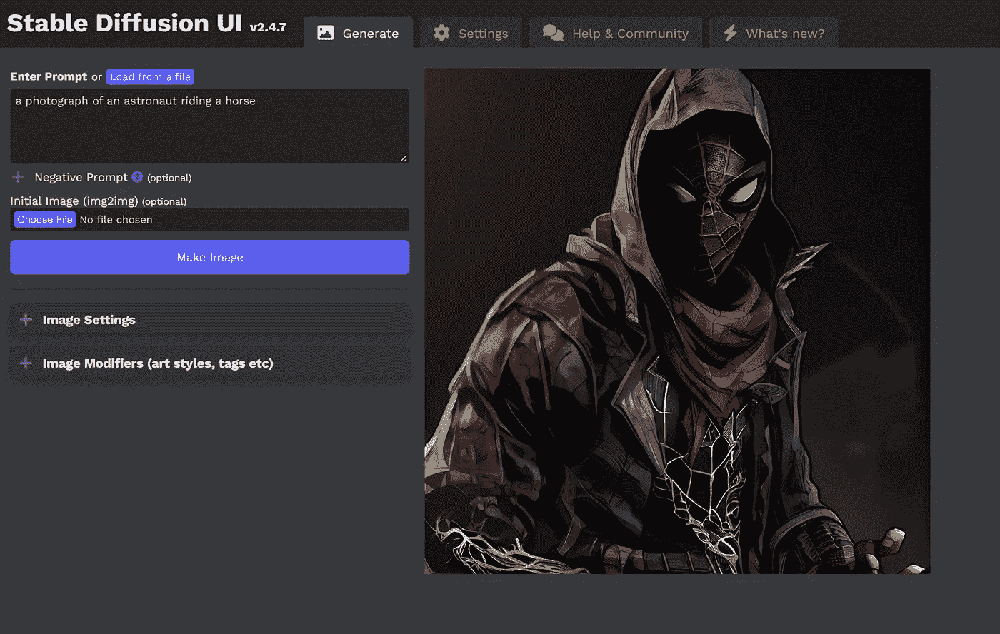

# 一键安装稳定扩散 UI 2.0 —本地运行

> 原文：<https://medium.com/mlearning-ai/one-click-install-for-stable-diffusion-ui-2-0-run-locally-3c38bfbd30cd?source=collection_archive---------0----------------------->

Image by [Jim Clyde Monge](https://medium.com/u/819323b399ac?source=post_page-----3c38bfbd30cd--------------------------------)

随着生成式人工智能的流行，许多人想在不花一分钱的情况下得到这些图像生成器模型中的一个。你现在可以通过[稳定 AI](https://stability.ai/) 的[稳定扩散](https://stability.ai/blog/stable-diffusion-public-release)的公开发布来做到这一点。

因为它是开源的，并且该模型是公开可用的，所以您可以在本地 PC 上运行该工具。它是免费的，实验起来非常方便…