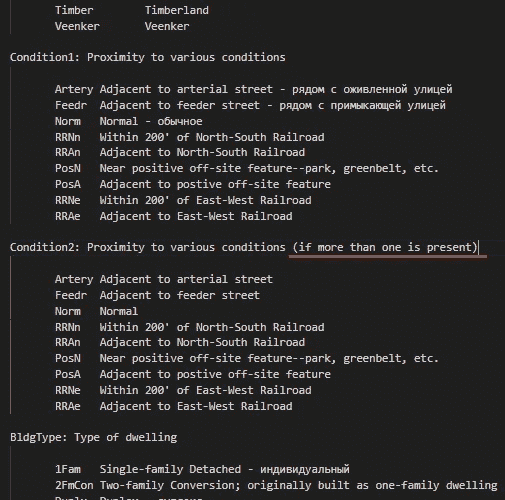
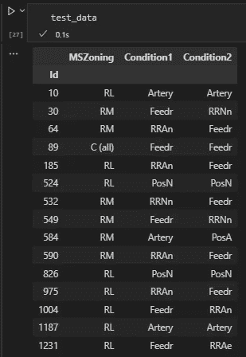
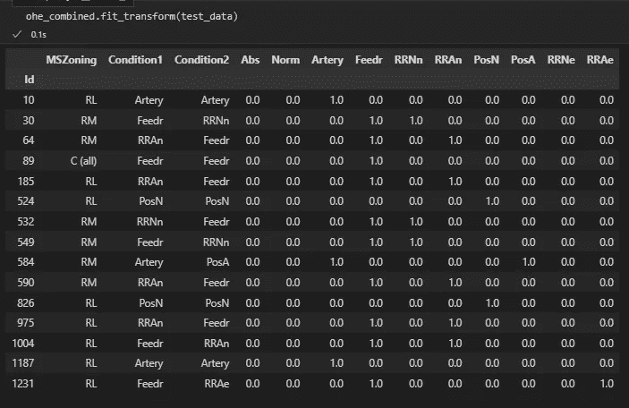

# 共享类别空间的一键编码

> 原文：<https://medium.com/mlearning-ai/one-hot-encoding-with-shared-categories-space-a6c55782c706?source=collection_archive---------4----------------------->

**创建自定义类，对共享相同类别空间的特征进行编码，同时使结果可重复使用且可读**

*前言:这是我作为 DS/ML 爱好者的第一个故事，我非常兴奋地分享我在解决我最近面临的一个问题方面的经验。我知道这里描述的解决方案可能不太有效，但我没有找到任何其他替代方案。希望我的解决方案能对有同样任务的人有所帮助。*

当我使用 Kaggle 的[房价-高级回归技术](https://www.kaggle.com/competitions/house-prices-advanced-regression-techniques/)数据集时，我想创建一个管道来处理和转换数据。其中一个步骤是将无序的分类数据(即没有可应用的距离度量)编码成独一无二的形式。在简单的情况下，你需要做的就是用一些参数应用 *OneHotEncoder()* 并玩得开心。但是这次的任务有一些特殊之处:

*   编码必须在管道中间完成，我需要得到熊猫数据帧格式的结果；
*   训练数据集可能不包含 data_description 文件中提到的所有类别。因此，解决方案必须能够处理所有必要的类别，因为相同的管道将应用于测试数据集；
*   数据集包含具有相同类别的要素对，如“条件 1:接近各种条件”和“条件 2:接近各种条件(如果存在多个条件)”(在“条件 1/2”的情况下，有 9 个条件)。



Screenshot from data_description.txt

如果直接应用 OneHotEncoder() 我们将得到 18(！)新功能。但是有必要吗？

一键编码是一种将数据转换为包含某个特性存在(1)或不存在(0)信息的形式的方法。因此，对于这个任务来说，9 列就足够了，因为它足以对实例可能具有的 1 个或多个特征的任意组合进行编码。

Scikit-learn 库被许多 DS/ML 从业者广泛使用，有时对于所有这类任务来说它就像一把瑞士军刀。但是这一次我确实需要一个定制的解决方案。

我选择这个帖子作为起点。让我们看看结果如何。

为了与 sklearn *管道*兼容，自定义转换器应该(1)从 *BaseEstimator* 继承 *TransformerMixin* 从 *sklearn.base* 继承，并且(2)实现两个主要方法: *fit()* 和 *transform()* 。让我们看看这个类的初始化方法:

```
class DFOneHotCategoriesCombined(BaseEstimator, TransformerMixin):
    def __init(self, features_kits=None, drop_originals=True, return_full_df=True):
        self.features_kits = features_kits
        self.drop_originals = drop_originals
        self.return_full_df = return_full_df
```

这里没什么特别的。“features_kits”参数应为元组列表。其格式应该如下:

```
features_kits = [
    (["columnA", "columnB",...], ["category1", "category2",...]),
    (["columnC", "columnD",...], ["category3", "category4",...])
]
```

每个元组描述了连接几个列的编码结果的一种情况，并给出了可用类别的完整列表。例如，对于我的任务，它看起来像:

```
features_kits=[
    (['Condition1', 'Condition2'], ['Abs', 'Norm',...,'RRAe']),
]
```

“drop_originals”参数用于调试目的，因为在编码后，我们更喜欢没有原始列的数据帧。

' return_full_df '保留了对是返回具有附加一个热码编码的所有列还是只返回一个热码编码的所有列的控制。

sklearn 最初的 *OneHotEncoder()* 中的 *fit()* 方法的目的是从列值中收集数据，并创建所用类别的列表。但是在我的例子中，我将在管道中传递所有需要的类别，所以 *fit()* 方法应该只返回 *self* :

```
def fit(self, X, y=None):
    return self
```

*transform()* 方法实现了非常简单的主要逻辑:我们只需为传递的每个类别创建列，并将自定义函数(同一类的成员)应用于指定的列。下面给出了 *transform()* 和 *get_onehot_encoding_()* 方法的代码:

```
def transform(self, X, y=None):
    if self.features_kits is None:
        return X
    onehot_features = None
    drop_columns = []
    for kit in self.feature_kits:
        if self.drop_originals:
            drop_columns += kit[0]
        for category in kit[1]:
            serie = X.apply(self.get_onehot_encoding_, args=[kit[0], category], axis=1)
            serie.rename(category, inplace=True)
            if onehot_features is None:
                onehot_features = serie
            else:
                onehot_features = pd.concat([onehot_features, serie], axis=1)

    if self.return_full_df:
        return pd.concat([X.drop(columns=drop_columns), onehot_features], axis=1)
    else:
        return onehot_features def get_onehot_encoding_(self, sample, col_names, target_value):
    """
    Function should return 1.0 if the 'target_value' has been found in sample at least in 1 column from 'col_names'
    Otherwise return 0.0
    """ onehot_value = False
    for column in col_names:
        onehot_value = onehot_value or (sample[column] == target_value)

    return float(onehot_value)
```

让我们来测试一下:



Initial test data

```
ohe_combined = DFOneHotCategoriesCombined(
    features_kits=[
        (['Condition1', 'Condition2'], ['Abs', 'Norm', 'Artery', 'Feedr', 'RRNn', 'RRAn', 'PosN', 'PosA', 'RRNe', 'RRAe'])
    ],
    return_full_df=True,
    drop_originals=False
)ohe_combined.fit_transform(test_data)
```



Test data after transformation

就是这样！这里我留下了‘drop _ originals = False ’,以清楚地表明‘condition 1’和‘condition 2’特性的值在相应的类别中都正确地编码为 1.0。

现在，我们不仅能够在一个共享的分类空间中编码 2 个或更多的特性，还可以在管道中使用这个自定义类来提高性能。

我希望这篇文章是有帮助的。感谢您阅读本文！

[](/mlearning-ai/mlearning-ai-submission-suggestions-b51e2b130bfb) [## Mlearning.ai 提交建议

### 如何成为 Mlearning.ai 上的作家

medium.com](/mlearning-ai/mlearning-ai-submission-suggestions-b51e2b130bfb)