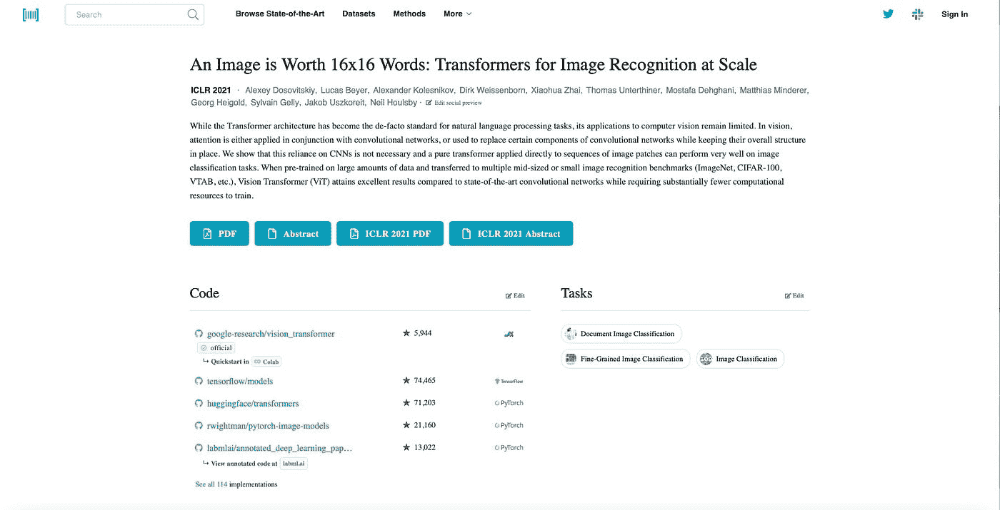
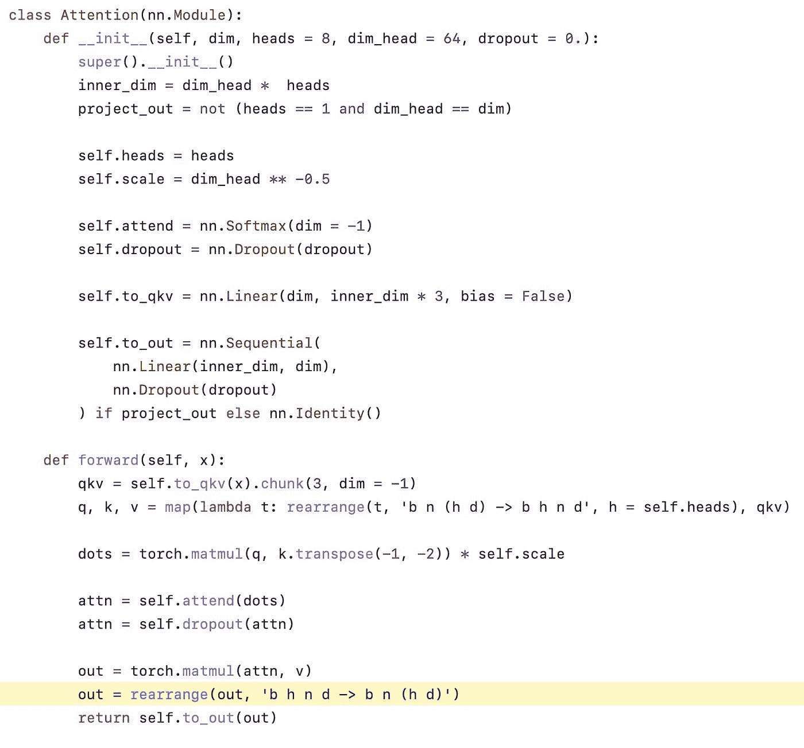

# 提高机器学习技能的最佳方式之一是:

> 原文：<https://medium.com/mlearning-ai/one-of-the-best-ways-to-improve-your-machine-learning-skills-17d7de20e80e?source=collection_archive---------1----------------------->

让我告诉你一个秘密:

> 帮助我加速学习的最有效的习惯不仅仅是阅读论文、书籍或听讲座。

它正在积极地研究其他人的代码。

我运行了其他存储库的代码审查。这让我了解了各种算法是如何实现的，并获得了在我自己的工作中使用的最佳实践。我就是这样做的(你也可以！):

# 第一步:自己实现算法

在跳进去看看别人是如何实现一个模型或算法之前，先自己做。不需要完美。只需写出你认为算法是如何工作的，并进行测试。

**一般情况:有效。最好的情况:它失败了。**

为什么那是最好的情况？你会更乐于从另一个知识库中学习。如果你和我一样，当一件事情成功了，我会立即关闭我的头脑去探索如何把它做得更好。直到很久以后，我才改变了我对写好代码是一个永无止境的过程的看法。

# 步骤 2:找到算法的好(和坏)例子

GitHub 上有 100 万个仓库实现了同样的事情。你如何找出哪些是值得学习的？我有三个简单的选择:

## 选项 1:使用官方实现

在机器学习中，很多时候你实现的算法来自一篇论文。这自然意味着这篇论文的代码很有可能是和它一起发布的。

从那里开始。

您可以直接从源代码中了解作者是如何实现算法的各个部分的。

## 选项 2:在有代码的纸上查找算法

如果你找不到一个“官方”的实现，下一个最好的选择(事实上，这应该是选项 1)是查看代码为的[文件。](https://paperswithcode.com/)

这个网站收集了大量的论文，以及实现这些论文的各种资源库。例如，如果您正在寻找第一个视觉转换器的代码，您会看到类似这样的内容:

Papers with Code

除了本文，您还可以看到实现本文的排名靠前的存储库。

## **选项 3:用星星的数量作为指导**

如果作者没有发布代码(嘘！)，而且你在有代码的论文上也找不到，那么下一个最佳选择就是用短语“在此插入算法名称 GitHub”进行搜索。然后，使用存储库的星级数作为选择起点的指南。通常，一个拥有更多星级(> 1000)的存储库是一个安全的学习选择。

这不是一个硬性规定。

有许多隐藏的宝石，只是还没有吸引眼球而已。

# 第三步:从对比中学习

现在您已经有了想要学习的存储库。下一步是了解实现中的差异。最重要的是，先关注核心实现。

例如，如果你试图学习一个新的模型架构，只需关注*实现该架构的代码部分。*

将这份文件放在身边，看看每个部分是如何被这个库实现的，并将其与您自己实现的进行对比。这并不是说你所做的是错的。相反，观察风格、惯用代码的使用、简洁和清晰的对比。

接下来，第一次尝试不明白的地方记笔记。他们为什么要这样实施呢？他们用的新语法是什么？他们是如何计算 X 的？这些都是值得思考的好问题。

我最喜欢的一个实现视觉转换器的库是由[王飞](https://github.com/lucidrains/vit-pytorch/blob/main/vit_pytorch/)开发的。在下图中，看突出显示的线。当我第一次遇到它时，我不知道它的语法是什么。原来，这是一种叫做[爱因斯坦求和的东西，简称为 einsum](https://pytorch.org/docs/stable/generated/torch.einsum.html) 。这是一种超高效的操纵张量的方法。​

现在，我在我的实现中使用它。这只是在研究一个新的存储库时可以做的许多事情之一。

## 并非所有存储库都是平等的

跟着我重复。“学习差的代码是可以的”。🧐

虽然这可能会让你感到惊讶，但让我们看看另一个领域的传奇作者对同样的事情是怎么说的:

> 你拿起的每本书都有它自己的一课或几课，而且通常坏书比好书能教给你更多的东西~斯蒂芬·金

你可以从糟糕的代码中学到很多东西。它确切地告诉你不要做什么，为什么不要做，以及如何不要做。糟糕的代码可以帮助你清楚地识别要避免的陷阱，以及如何通过编写好的代码来节省时间。

# 步骤 4:扩展你的工具箱

现在，您已经完成了研究和分析一组好的和坏的实现的所有艰苦工作。但是你的工作还没有完成。这个过程的最后一步也许是最重要的。

反思你的笔记和你的学习。扩充你的工具箱。特别是:

*   我可以使用哪些技术来继续前进？
*   如何让我的实现更具可读性和清晰性？
*   在实现这一点时，我应该避免哪些事情？

下一次你实施某件事情的时候，试着把这些经验结合起来，看看它们是如何发挥作用的。

# TL；速度三角形定位法(dead reckoning)

*   自己实施
*   找到好的(和坏的)实现来研究
*   从对比中学习
*   扩展您的工具箱

我很想听听你尝试这个想法后的体验。

# 🤖💪想要更多的想法成为一个多产的 ML 从业者？

每周，我都会发送一份时事通讯，提供实用的技巧和资源，以提升自己作为机器学习从业者的水平。 [**免费加入这里→**](https://www.newsletter.artofsaience.com)

 [## Mlearning.ai 提交建议

### 如何成为 Mlearning.ai 上的作家

medium.com](/mlearning-ai/mlearning-ai-submission-suggestions-b51e2b130bfb)