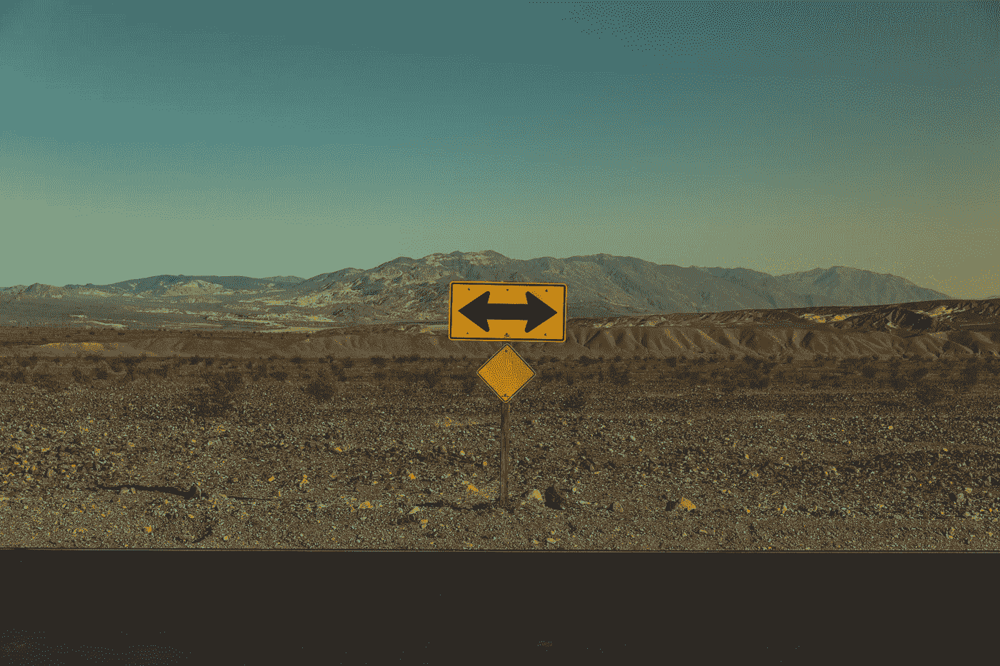

# 一个现实，两种选择。你选择

> 原文：<https://medium.com/mlearning-ai/one-reality-two-options-you-choose-f6cd7ccf0d7a?source=collection_archive---------3----------------------->

Photo by [Pablo García Saldaña](https://unsplash.com/@garciasaldana_?utm_source=unsplash&utm_medium=referral&utm_content=creditCopyText) on [Unsplash](https://unsplash.com/s/photos/ways?utm_source=unsplash&utm_medium=referral&utm_content=creditCopyText)

自创世以来，生命中的一切都在不断进化。人类、社会、法律和技术都是例子，在这些例子中，他们自身的进化是我们今天获得所有优势的关键。有时候，变化会在我们还没有准备好的时候到来，但是我们有两个选择:面对现实，适应或者让现实吞噬我们。我更喜欢第一种选择。