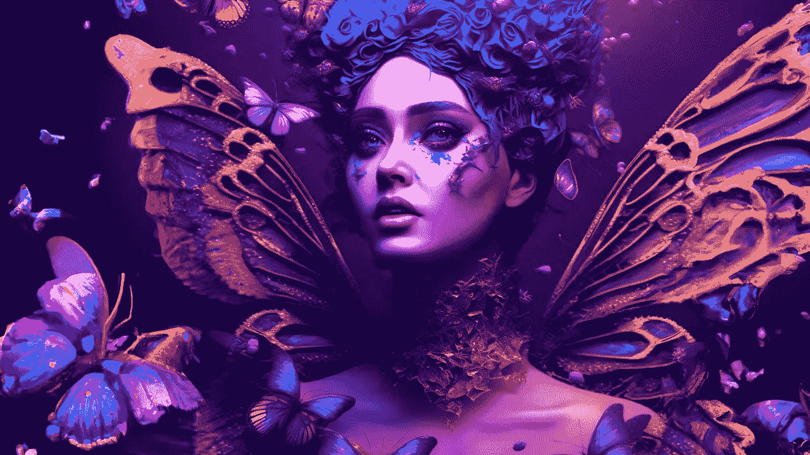

# 一次性 3D 头像

> 原文：<https://medium.com/mlearning-ai/one-shot-3d-avatars-a55fd6a55180?source=collection_archive---------2----------------------->

## [新的 3D 生成方法](https://open.substack.com/pub/mlearning/p/new-3d-generation-method-2faster?r=z7zu8&utm_campaign=post&utm_medium=webhttps://open.substack.com/pub/mlearning/p/new-3d-generation-method-2faster?r=z7zu8&utm_campaign=post&utm_medium=web)

## GANs 是 VR/AR 重建和动画的未来吗？

[Excellent AI art on the first try](https://open.substack.com/pub/evartology/p/excellent-ai-art-on-the-first-try?r=9hp4d&utm_campaign=post&utm_medium=web)

[**3D 头像**](https://open.substack.com/pub/evartology/p/generate-a-talking-photorealistic?r=9hp4d&utm_campaign=post&utm_medium=web) 对于电影后期制作、视觉特效、增强现实、虚拟现实[远程呈现](https://evartology.substack.com/p/quickly-make-a-deepfake-video-with)都至关重要。高效的 3D 肖像生成器应该能够生成各种各样的忠实肖像，并能精确控制僵硬的头部姿势、面部表情和凝视…