# K-均值聚类的一站式服务

> 原文：<https://medium.com/mlearning-ai/one-stop-for-k-means-clustering-b58fa59334e5?source=collection_archive---------3----------------------->

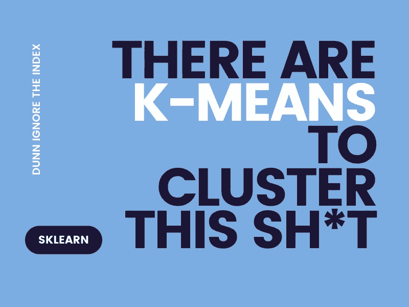

如何对相似的数据点进行聚类，使其有意义？嗯，K-Means 是答案之一。这篇文章几乎囊括了 K-Means 聚类的所有内容。嗯，也就是说，我没有写代码。

**大纲—**

1.  [什么是 K 均值聚类](/p/b58fa59334e5#5c19)
2.  [星团的属性](/p/b58fa59334e5#a46d)
3.  [K 均值聚类算法](/p/b58fa59334e5#892f)
4.  [收敛/停止标准](/p/b58fa59334e5#091b)
5.  [质心初始化:K-Means ++](/p/b58fa59334e5#b055)
6.  [选择最佳 K](/p/b58fa59334e5#9f73)
7.  [评估集群质量](/p/b58fa59334e5#497d)

***~物以类聚***

# 1.什么是 K-Means 聚类？

K-Means 聚类是一种无监督的学习算法，它可以帮助我们将数据中相似的数据点聚集成簇。这些聚类表示数据点共享的特征，这些特征标记了它们的相似性。

简单来说，K-Means 几乎就像 [KNN](/@priyanshsoni761/k-nearest-neighbors-knn-1606989b7ee0?source=user_profile---------3----------------------------) ，我们查看 K-最近点的相似性。在 K-Means 聚类中，我们形成 K 个聚类，使得被分组在一个聚类中的点是相似的并且共享共同的特征。下图将使这一点更加清楚:

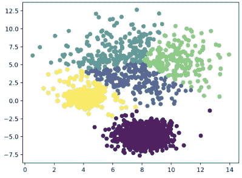

Ideal Clustering with 5 clusters

K-Means 通过将我们的数据作为输入参数来帮助我们获得如上图所示的图形。因为我们只是根据我们所拥有的数据点来形成聚类，所以我们不需要这些点的 y 标签。因此，聚类是一种无监督的学习算法，其中我们不需要数据点的标签。

***聚类的应用—***

1.客户细分
2。文档分割
3。图像分割
4。推荐系统等。

# 2.集群的属性

现在，这些集群有一些属性，遵循这些属性，它们变得有意义。

1.  **一个聚类内的所有数据点应尽可能相似—** 一个聚类内的数据点彼此非常接近。这意味着在特征空间中，数据点代表相似的特征。此外，相似的点会更好地聚集在一起。因此，一个聚类中的点应该尽可能地相似，这样该聚类才有意义。
2.  **来自不同聚类的数据点应该尽可能的不同—** 来自不同聚类的数据点彼此相距较远。这意味着在特征空间中，这些点代表非常不同的特征。此外，不同的点永远不会形成集群。因此，来自不同聚类的点应该尽可能不同，以使聚类有意义。
3.  **每个聚类都有一个质心—** 我们形成的每个聚类都有一个质心，所有的点都围绕着这个质心关联。这个质心是帮助我们形成聚类的点，并根据聚类内部点的平均值进行调整。

*~好吧，不要为属性费心了，这只是蹩脚的理论。好玩的部分是下一个*

# 3.聚类算法

这就是我们深入研究这种算法如何生成漂亮的聚类的地方。

***Algo —***

*   **【步骤 1】—选择我们想要的聚类数(K)——**现在可以任意选择，因为我们将在以后决定如何选择 K 值。通常选择 K=3 的随机值来启动算法
*   **【步骤 2】—选择 K 个随机点作为 K 个质心—** 这些点也是随机选择的，以形成每个聚类的质心。这些点可以从我们的数据或其他地方随机选择。
*   **【步骤 3】—将每个数据点分配到最近的质心—** 然后我们计算数据集中每个点到所有 K 质心的距离。该指针被分配给与该质心距离最小的质心。这可以如下图所示:

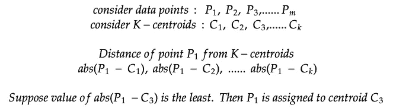

对每个点重复这一过程，最终，每个点都被分配给某个或其他质心。这样，我们就得到 K-簇。
我们通常使用[欧几里德距离](/p/1606989b7ee0#5191)来计算点和质心之间的距离。

*   **【步骤 4】—计算新的质心—** 将每个点分配给一些其他质心后，我们通过取每个聚类中所有点的平均值来计算每个聚类的新质心。可以通过分别对所有数据点的 x 坐标和 y 坐标取平均值来计算新的质心。

这里的***‘m’***是特定聚类中数据点的数量。

*   **【步骤 5】—**重复步骤 3 和 4，直到达到收敛/停止条件

## 让我们想象一下

1.**【第一步】—** 假设我们选择 k = 2
2。**【第二步】—**

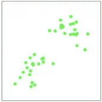

Choosing 2 random centroids

3.**【第三步】——**

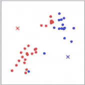

Assigning points to closest centroid

4.**【第四步】——**

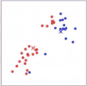

Computing new centroids

5.**【第五步】——**

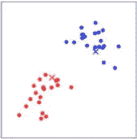

Computing new centroids

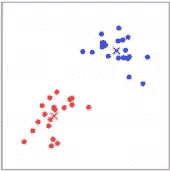

Convergence — perfect clusters

# 4.收敛/停止条件

上述算法如果不收敛，将会无限重复。因此，我们需要上述算法的一些停止标准。
有一些停止标准，遇到这些标准时算法应该停止。这些是:

1.  分配到特定聚类中的数据点保持不变，我们运行算法，直到数据点没有被分配到任何新的聚类。**这一过程非常缓慢，可能需要很长时间。**
2.  质心保持不变——我们运行算法，直到计算出的新质心与先前的质心相同。**这一过程非常缓慢，可能需要很多时间**
3.  数据点到质心的距离是最小的，我们为数据点到质心的距离设置了一个阈值。当达到这个阈值时，算法将停止。**这很快，但我们必须非常小心地选择距离阈值。**
4.  达到了固定的迭代次数—我们为迭代次数设置了一个阈值，当达到这个阈值时我们就停止。**这很快，但是不明智的阈值设置会导致糟糕的集群形成。**

我们可以在我们的算法中实现这些停止条件，以实现早期收敛和适当的聚类。

# 5.质心初始化

在 K-Means 中，我们随机初始化质心。这可能会有一些问题，并可能导致不良的集群形成。

*   如果质心是一个远点(离群点)，那么可能没有数据点被分配给这个质心。这可能会导致多个群集被指定给同一个质心。
*   如果两个或多个质心被初始化为彼此非常接近，这可能会导致多个质心被指定给同一个簇。

这两个问题都可以在下图中看到:

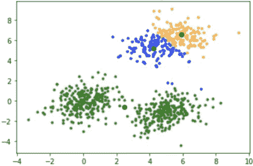

Poor Clustering

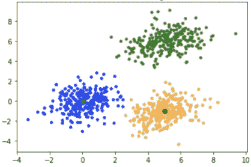

Ideal Clustering

因此，我们需要一种更好的质心初始化方法。我们可以使用上述两种方法中的一种:

1.  **重复 K-Means 多次，直到我们得到最佳聚类**
2.  **使用 K-Means ++算法**

由于显而易见的原因，前者在时间复杂度方面效率非常低。因此，我们使用 K-Means++算法进行质心初始化。

## k-表示++的意思

这只是一个初始化质心的算法，其余的过程与 K-Means 算法相同。

***算法—***

1.  随机选择第一个质心
2.  现在计算每个点到最近质心的距离(算法开始时的第一个质心)
3.  现在给每个点分配概率值。概率值与该点到先前质心的距离成比例。这意味着离质心距离最大的点将具有被选为下一个质心的最高概率值。
4.  重复这些步骤，直到我们有 K 个质心。

通过这样的初始化，确保了每个质心尽可能远离另一个质心。因此，不超过一个质心可以被分配给同一聚类，并且不超过一个聚类被分配给同一质心。

在此之后，恢复 K-Means 算法，然后将数据点分配给最近的质心，依此类推。

# 6.选择最佳 K

选择一个最佳的 K 值是非常重要的，因为这可能会导致结构优美的集群以及无组织的哑集群。

选择 K 值的方法有很多，但最佳方法是通过一种叫做**肘法的方法。**我们的目标是找到 K 的值，对于该值，类内平方和误差( **WCSSE** )最小。

WCSSE 表示相同聚类内的数据点到质心的平方距离的总和。

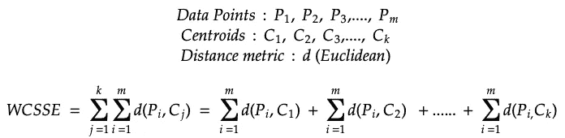

## 肘法

**肘方法**，是一种我们可以通过查看每个 K 给出的结果来选择 K 值的技术

计算所有聚类的 WCSSE，并绘制不同的 k 值。图中 WCSSE 急剧下降的点就是我们要寻找的点。这一点告诉我们，特定的 K 值，WCSSE 急剧下降，几乎成为常数。因此，在这一点之后，增加 K 值不会使 WCSSE 降低太多，因此这一点是最佳 K 值。

弯头方法的步骤如下:

*   我们在一个范围内选择一个 K(比如从 1 到 10)
*   对于这个范围中的每个 K 值，我们找到所有聚类的 WCSSE。
*   然后我们绘制 WCSSE 对 K，其中 K 在 X 轴上。
*   WCSSE 值急剧下降并形成肘状形状的 K 是我们选择的最佳 K 值。

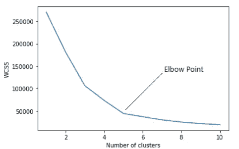

从上图中我们可以看到，对于 K 值为 5 的情况，WCSSE 急剧下降，之后几乎保持不变。因此，在 5 个集群之外，WCSSE 下降不多。因此我们选择 K= 5。

# **7。评估集群质量**

为了使聚类有意义，我们必须评估每个聚类的质量。我所说的质量是指我们的聚类如何很好地解释我们的数据。为此，我们必须回到我们的[集群属性](/p/b58fa59334e5#a46d)。符合所有属性的群集被认为是好群集。那么我们如何用数学方法来评估星团的性质呢？

有两种方式: *1。惯性
2。邓恩指数*

## 1.惯性

惯性是指特定聚类的点和聚类质心之间的距离的总和。这也可以被认为是**组内**距离，因为我们正在计算组内点之间的距离。
对于群集质心 C1，我们可以将惯性定义为:

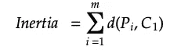

其中 ***i*** 的范围从 1 到 m(该聚类中的点数)

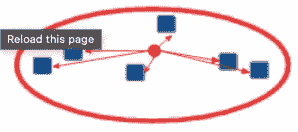

Intra-cluster distance

上图描绘了星团间的距离或*惯性。*

对于具有重要性的聚类，其点和质心之间的距离应该尽可能小。因此，该簇可以满足第一个性质。

> **因此，对于一个好的集群，惯性值应该尽可能的小。**

## 2.邓恩指数

邓恩指数是衡量集群的第二个属性。它测量聚类之间的距离，这表明两个聚类之间的属性差异。Dunn Index 通过计算簇间和簇内距离来实现。

**簇间**距离是指两个簇之间的距离。这种差异也取决于我们如何衡量它。

> —它可以是两个 c 的质心之差
> —它可以是离两个聚类最远的点之差
> —它可以是离两个聚类最近的点之差。

独立于选择用于测量聚类间距离的标准，邓恩指数可以表示为:

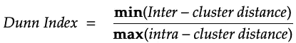

为了使两个集群尽可能地不同，分子应该很大，分母应该很小。因此，

*   任意两个聚类***【min(聚类间距离)】*** 之间的**最小**距离应该非常大，以便分子是大值。
*   点与聚类的质心之间的最大距离*****【最大(聚类内距离)】*** 应该是一个非常小的数，以便分母是一个小值。**

**为了使聚类具有显著性，聚类间的距离必须尽可能大。因此该簇可以满足第二个性质。**

> **因此，对于一个好的聚类，邓恩指数必须尽可能大。**

**这几乎是 K-均值聚类的全部内容。代码也很微妙，不需要太多的努力就能理解。**

> **最后，我想说的是，孔雀在看着你，所以你最好好好读书，嗯！**
> 
> **:)**

*****更简单的算法是这样的—*****

1.  **[KNN](/@priyanshsoni761/k-nearest-neighbors-knn-1606989b7ee0?source=user_profile---------3----------------------------)**
2.  **[逻辑回归](/@priyanshsoni761/one-stop-for-logistic-regression-ee3d0d96b48f?source=user_profile---------0----------------------------)**
3.  **[支持向量机](/@priyanshsoni761/a-one-stop-for-support-vector-machine-2b9f26b3f247?source=user_profile---------2----------------------------)**
4.  **[朴素贝叶斯](/@priyanshsoni761/one-stop-for-naive-bayes-70464fa7605c?source=user_profile---------6----------------------------)**
5.  **[评估指标—分类](/@priyanshsoni761/classification-evaluation-metrics-7c3fe3b0119b?source=user_profile---------1----------------------------)**

** [## Mlearning.ai 提交建议

### 如何成为 Mlearning.ai 上的作家

medium.com](/mlearning-ai/mlearning-ai-submission-suggestions-b51e2b130bfb)**