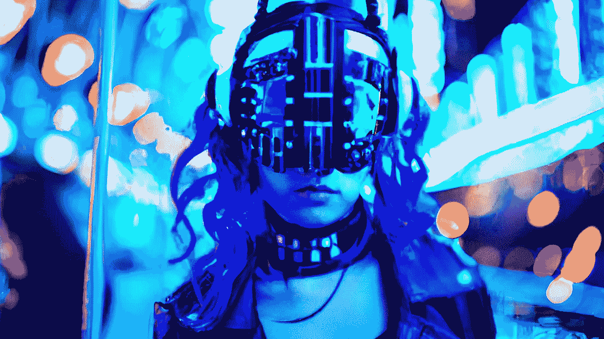

# 所有人工智能艺术资源的一站式商店

> 原文：<https://medium.com/mlearning-ai/one-stop-shop-for-all-ai-powered-artistic-resources-1413cf3f638b?source=collection_archive---------4----------------------->

## [免费且极其易于使用](https://open.substack.com/pub/evartology/p/all-ai-art-tools-in-one-place?r=9hp4d&utm_campaign=post&utm_medium=web)

图像|视频|音乐|文本| 3D

[AI-generated content production without limits.](https://open.substack.com/pub/evartology/p/all-ai-art-tools-in-one-place?r=9hp4d&utm_campaign=post&utm_medium=web)

你在寻找提高工作效率的方法吗？你没有时间使用多个平台。您是否在寻找一个一体化的解决方案？[这个](https://open.substack.com/pub/evartology/p/all-ai-art-tools-in-one-place?r=9hp4d&utm_campaign=post&utm_medium=web)方法是给你的

## [所有人工智能艺术工具都在一个地方](https://open.substack.com/pub/evartology/p/all-ai-art-tools-in-one-place?r=9hp4d&utm_campaign=post&utm_medium=web)