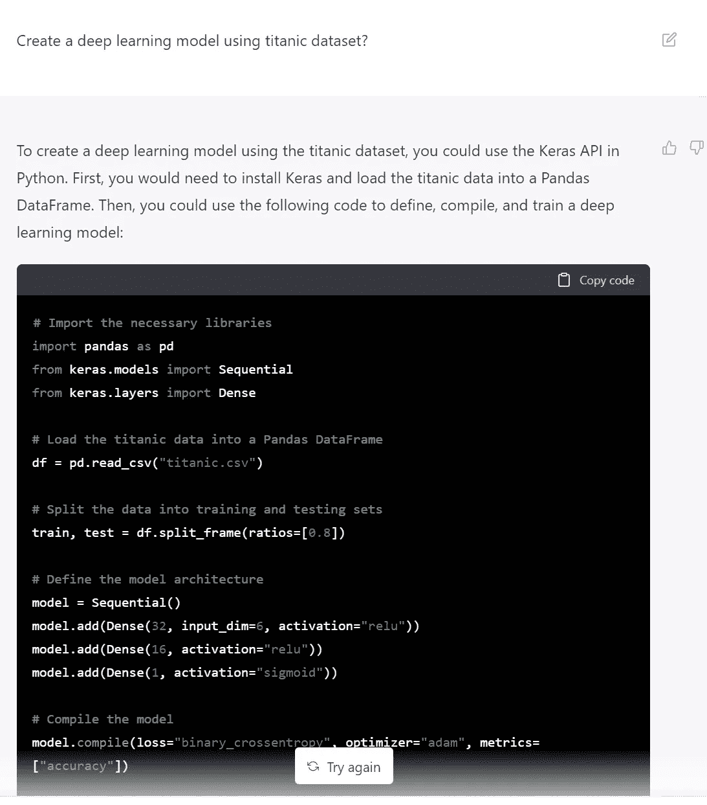

# 开启 AI 与新 GPT 聊天-3.5

> 原文：<https://medium.com/mlearning-ai/open-ai-chat-with-new-gpt-3-5-c0aa36557ad6?source=collection_archive---------3----------------------->

# 先决条件

*   打开人工智能帐户
*   [http://chat.openai.com](http://chat.openai.com/)
*   获取开发者密钥

# 什么是 GPT 3.5？

```
Models referred to as "GPT 3.5"
GPT-3.5 series is a series of models that was trained on a blend of text and code from before Q4 2021\. The following models are in the GPT-3.5 series:
```

```
code-davinci-002 is a base model, so good for pure code-completion tasks
text-davinci-002 is an InstructGPT model based on code-davinci-002
text-davinci-003 is an improvement on text-davinci-002
```

*   可在 https://beta.openai.com/docs/model-index-for-researchers[获得信息](https://beta.openai.com/docs/model-index-for-researchers)
*   请看本页关于聊天的限制和细节—【https://openai.com/blog/chatgpt/ 
*   在这里，我们将研究如何使用 GPT 3.5 编写 ML 代码

# 通过提问创建代码

*   使用 Azure 机器学习自动化 ML 为 titanic 数据集创建分类模型

```
# Import the necessary libraries
from azureml.core import Workspace, Dataset
from azureml.train.automl import AutoMLConfig
```

```
# Load the titanic data into a Dataset object
dataset = Dataset.get_by_name(workspace=workspace, name="titanic")# Split the data into training and testing sets
train, test = dataset.random_split(percentage=0.8, seed=1)# Define the AutoML configuration
automl_config = AutoMLConfig(task="classification",
                             primary_metric="AUC_weighted",
                             max_time_sec=3600,
                             n_cross_validations=5,
                             debug_log="automl_errors.log",
                             verbosity=logging.INFO,
                             X=train.drop_columns(columns=["survived"]),
                             y=train["survived"],
                             X_valid=test.drop_columns(columns=["survived"]),
                             y_valid=test["survived"])# Train the model using the AutoML configuration
automl_run = AutoMLRun(workspace=workspace, config=automl_config)
automl_run.submit(show_output=True)
automl_run.wait_for_completion(show_output=True)# Get the best model from the AutoML run
best_model = automl_run.get_output()# Evaluate the performance of the best model
perf = best_model.predict(test.drop_columns(columns=["survived"]))
print(perf.auc())
```

*   现在接下来尝试深度学习模型
*   所以我的问题是

```
# Import the necessary libraries
import pandas as pd
from keras.models import Sequential
from keras.layers import Dense
```

```
# Load the titanic data into a Pandas DataFrame
df = pd.read_csv("titanic.csv")# Split the data into training and testing sets
train, test = df.split_frame(ratios=[0.8])# Define the model architecture
model = Sequential()
model.add(Dense(32, input_dim=6, activation="relu"))
model.add(Dense(16, activation="relu"))
model.add(Dense(1, activation="sigmoid"))# Compile the model
model.compile(loss="binary_crossentropy", optimizer="adam", metrics=["accuracy"])# Train the model
model.fit(x=train.drop("survived", axis=1), y=train["survived"], epochs=10, batch_size=32)# Evaluate the performance of the model
_, acc = model.evaluate(x=test.drop("survived", axis=1), y=test["survived"])
print("Test accuracy:", acc)
```



*   这是另一个开源模型，叫做 yolov5
*   问题——你能给我创建一个 yolov5 深度学习代码吗？

```
# Import the necessary libraries
import torch
from torch import nn
import torchvision
from torchvision import models
```

```
# Define the model architecture
model = models.yolo5(num_classes=80)# Set the model to train mode
model.train()# Define the loss function
criterion = nn.BCEWithLogitsLoss()# Use Adam as the optimizer
optimizer = torch.optim.Adam(model.parameters())# Train the model
for i in range(num_epochs):
    for images, labels in train_dataloader:
        # Forward pass
        outputs = model(images) # Calculate the loss
        loss = criterion(outputs, labels) # Backward pass
        optimizer.zero_grad()
        loss.backward()
        optimizer.step()# Set the model to evaluation mode
model.eval()# Evaluate the performance of the model
for images, labels in test_dataloader:
    # Forward pass
    outputs = model(images) # Calculate the loss
    loss = criterion(outputs, labels) # Print the loss
    print("Loss:", loss.item())
```

*   这非常有趣，我确信这对开发人员和数据科学家通过提问来创建代码非常有用

*原载于*[*https://github.com*](https://github.com/balakreshnan/Samples2022/blob/main/openai/chatopenai.md)*。*

[](/mlearning-ai/mlearning-ai-submission-suggestions-b51e2b130bfb) [## Mlearning.ai 提交建议

### 如何成为 Mlearning.ai 上的作家

medium.com](/mlearning-ai/mlearning-ai-submission-suggestions-b51e2b130bfb)