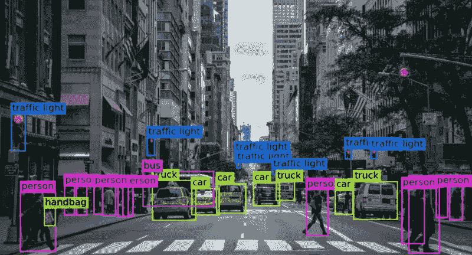

# 打开 CV，计算机视觉，AI，怎么用？

> 原文：<https://medium.com/mlearning-ai/open-cv-computer-vision-ai-how-does-it-work-801d4cdec462?source=collection_archive---------2----------------------->

# OpenCV 概述

英特尔创建了 OpenCV，这是一个开源的计算机视觉和机器学习软件库。它为计算机视觉和相关领域的应用建立了一个标准框架。它用于提高图片、对象和视频处理应用程序的实时机器识别效率。

为了更好地理解 OpenCV 的工作原理，请考虑以下主题:计算机视觉、OpenCV 的相关编程语言和 OpenCV 应用程序。

# 什么是计算机视觉？

我们的眼睛向大脑传递信息，大脑评估我们看到的东西。我们可以识别人、物体和动作，也可以评估某样东西在特定情况下是好是坏。因此，计算机视觉(CV)旨在模仿我们眼睛的行为。它涉及使用计算机和其他电子设备从数码照片或电影中获取信息。它还可以评估复杂的图片，比较它们，并确定差异。

随着计算机视觉从理论发展到现实，它对我们当前文明的技术进步非常有益。许多公司发现计算机视觉是有益的，一些公司发现它是必不可少的。OCR、视觉生物识别、对象识别、特殊效果、3D 打印和图像捕捉、体育、智能汽车、医学成像和许多其他应用都使用计算机视觉。

从 IT 专家的角度来看，他们希望自动化涉及可视化的流程。结果，它引发了巨大的发展，引起了企业家和软件开发公司的极大兴趣。这些人来自各行各业，具有不同程度的专业知识，他们共同努力减少生产和商业之间的摩擦。他们还想发现计算机视觉复杂性的正确组合，并向全世界推销。

因为计算机视觉几乎可以应用于每个领域，所以它努力让我们的生活变得更简单。由于这些应用，客户和软件开发人员成为计算机世界的英雄。寻求用创新和大胆的方式解决低级简历问题的客户。此外，令人难以置信的熟练工程师正在一起工作，为计算机和其他设备构建 CV 系统。

# OpenCV 概述

有几个主要领域与计算机视觉相关，包括图像处理、视频捕获和分析、人脸识别和对象检测，但开发实时应用程序需要跨平台的库。这就是 OpenCV 的用武之地，OpenCV 是一个基于 C++的程序，现在已经移植到 Java 和 Python 中。它可以在多种操作系统上运行，包括 Windows、macOS、Android、iOS 和 Linux。

虽然 OpenCV 是计算机视觉的优秀工具，但是系统开发没有考虑尽可能广泛的受众仍然是企业家的一个主要问题。有时，客户和开发人员都不确定他们希望达到的成功程度。因此，在处理计算机视觉时，双方都必须熟悉 OpenCV。

OpenCV 库及其附带的组件将在下一节中重点介绍。

# OpenCV 库的特性

使用 OpenCV 库，您将能够:

1.  图像读写
2.  视频捕获和存储
3.  图像的过滤和修改是图像处理的例子。
4.  检测特征
5.  检测视频或图像中的对象，如人体部位、汽车、标志等。
6.  对录像的检查

# OpenCV 库模块

OpenCV 可以从头开始创建图片，用代码绘制图像，记录和存储电影，处理图像，进行特征检测，识别特定对象和分析电影，以及确定对象的方向和运动。

以下是主要的 OpenCV 库模块:

*   核心功能

OpenCV 库的核心函数涵盖了标量、点、范围等基本数据结构。它使用多维数组来保存图片。

*   图像处理

图像过滤、几何图像变换、色彩空间转换、直方图和其他图像处理程序都将在本模块中讲述。

*   录像

本模块将介绍运动估计、背景消除和目标跟踪的原理。

*   视频输入/输出

在本课中，OpenCV 库用于演示视频捕获和视频编解码器。

*   Calib3d

基本的多视图几何技术、单个和立体摄像机校准、物体位置估计、立体对应和 3D 重建的组成部分都包含在这个主题中。

*   功能 2d

本模块将介绍特性检测和描述的原理。

*   目标检测

本模块包括检测特定类别的对象和实例，如人脸、眼睛、交通灯、人、汽车等。

*   Highgui

这是一个具有基本 UI 功能的用户友好界面。

# OpenCV 应用

机器人、医疗、工业自动化、安全和运输都使用 OpenCV。OpenCV 可以用来确定机器人在机器人学中的位置。导航、避障和人机交互都是可能的应用。

OpenCV 可以帮助患者进行细胞或肿瘤分类和检测、2D/3D 分割、3D 器官重建以及医学中的视觉引导机器人手术。

它可用于确定库存缺陷、条形码和包装、物品分拣、文档分析和其他工业自动化领域。

这可以用于安全监控和生物识别，也可以用于检测驾驶员的警惕性和制造用于运输的自动驾驶汽车。

# 结论

企业家可以通过发现客户对图像处理和计算机视觉应用的热情和远见来增强他们的能力。随着对基于图像的搜索引擎需求的增长，企业家和软件开发人员都可以从 OpenCV 这样的技术中受益。

计算机视觉不仅是一门迷人的科学，也是一个利润丰厚的行业。另一方面，费用和资源短缺是大多数企业遇到的实际问题。尽管受到广泛关注，但在计算机视觉领域仍然存在局限性。