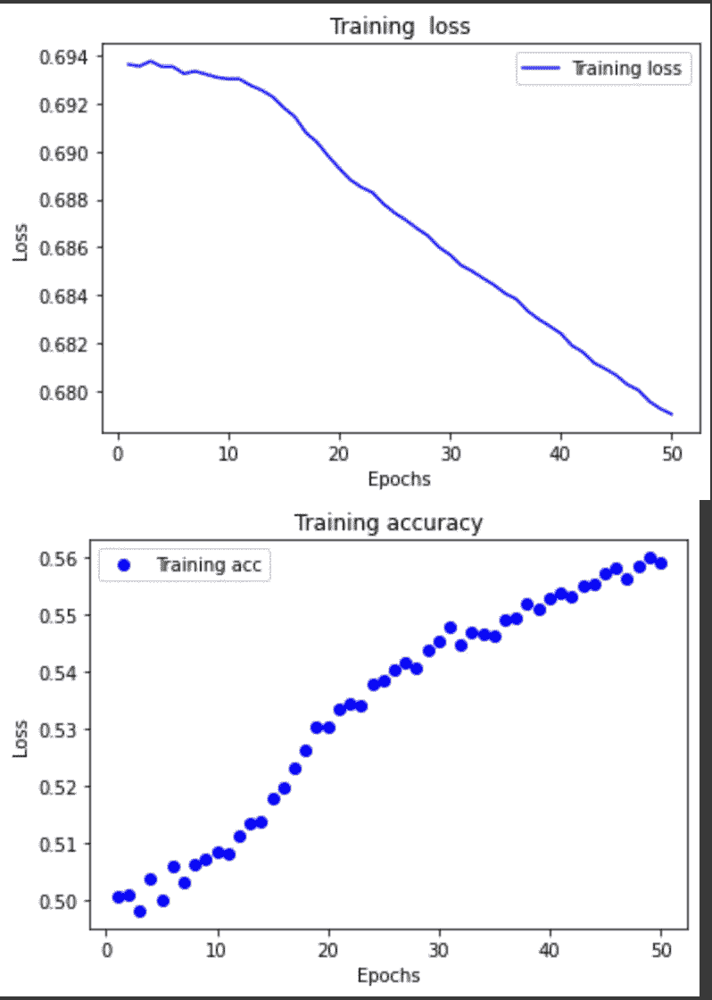
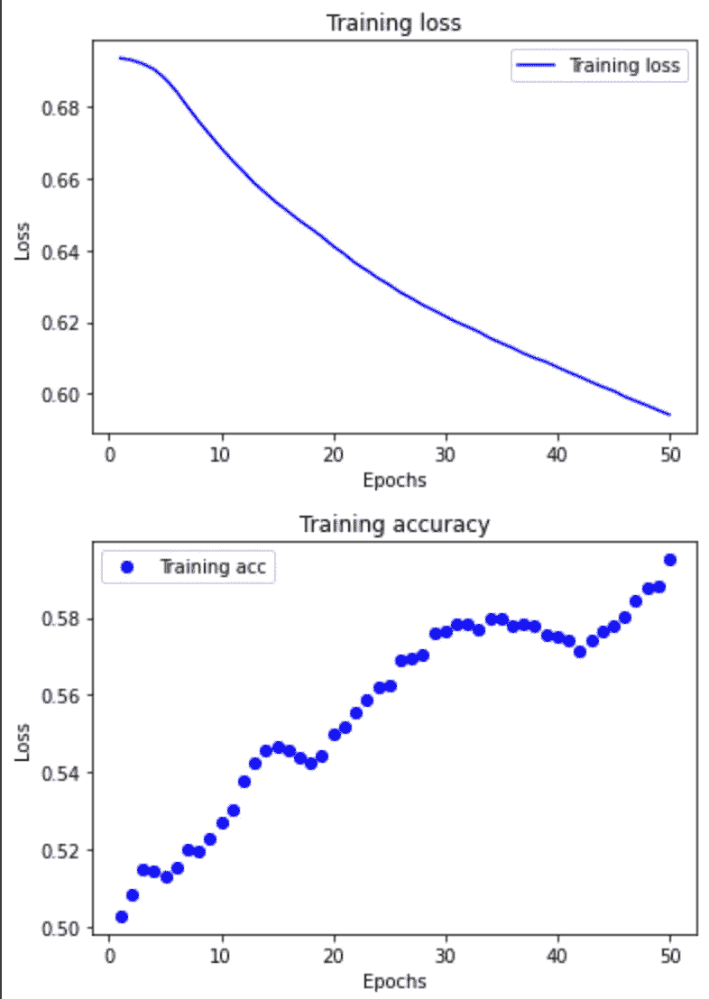

# OpenAi 请求研究异或问题

> 原文：<https://medium.com/mlearning-ai/openai-request-for-research-67d8dc58e75a?source=collection_archive---------6----------------------->

OpenAi 发布了一些他们想要解决的研究问题，作为一个机器学习的狂热学习者，我决定解决他们的热身问题。你可以在这里查看他们的其他请求[https://openai.com/blog/requests-for-research-2/](https://openai.com/blog/requests-for-research-2/)

问题是训练一个 LSTM 来解决`XOR`问题:也就是说，给定一个比特序列，确定它的奇偶性。 [LSTM](http://colah.github.io/posts/2015-08-Understanding-LSTMs/) 应该消耗序列，一次一位，然后在序列结束时输出正确的答案。测试以下两种方法:

*   生成长度为 50 的随机 100，000 个二进制字符串的数据集。训练 LSTM；你得到了什么表现？
*   生成随机 100，000 个二进制字符串的数据集，其中每个字符串的长度在 1 到 50 之间独立随机选择。训练 LSTM。它成功了吗？如何解释这种差异？

异或问题:

什么是异或问题？简单地说，这是一个二进制分类问题，其中输入数据由二进制数的向量组成，目标由 0 或 1 组成。


Image adapted from [Kevin Swingler](http://www.cs.stir.ac.uk/courses/ITNP4B/lectures/kms/2-Perceptrons.pdf).

# **问题 1:**

```
import numpy as npdef gen_len50(size=100000):X_data_1 = []Y_data_1 = []for i in range(size):length = random.randint(1, 50)data = np.random.randint(2, size=(1, length)).astype("float32")data = pad_sequences(data, maxlen=50, dtype='float32',       padding='pre')X_data_1.append(data)labels = [0 if np.sum(X_data_1[i])%2 == 0 else 1]Y_data_1.append(labels)return X_data_1, Y_data_1
```

为了生成数据集，我们导入 numpy，遍历 for 循环 100000 次，生成一个长度为 100000 的列表，每个列表由一个长度为 50 的二进制字符串组成。每个数据元素都有一个相应的标签，或者是 0，或者是 1。

然后，我们使用 Keras 定义了一个非常简单的 LSTM 网络，Keras 是一个非常流行且易于使用的机器学习库。

```
model = Sequential([LSTM(32, return_sequences=True, activation='sigmoid', input_shape=(1, 50)),LSTM(64, return_sequences=True, activation='sigmoid'),Dense(1, activation='sigmoid')])
```

我们将数据集分为训练和测试数据集，以 20%的分割大小在训练后评估模型

```
split_size = 100000 * 0.20X_train = X_data1[split_size:]X_test = X_data1[:split_size]Y_train = Y_data1[split_size:]Y_test = Y_data1[:split_size]
```

我们使用 Adam 作为优化器，使用二进制交叉熵作为由于问题是二进制分类问题引起的损失，并跟踪准确性，来编译模型。

```
model.compile('adam', loss='binary_crossentropy', metrics=['acc'])
```

我们将列表转换成 numpy 数组，并对数据进行规范化以优化训练。

```
X_train = np.asarray(X_train)norm = np.linalg.norm(X_train)
normal_array = X_train/norm
print(normal_array)
```

我们对所有的培训和测试列表都这样做

```
history = model.fit(X_train, Y_train, epochs=50, batch_size=32, shuffle=True)
```

然后，我们根据 50 个时期的标准化 X 和 y 值训练该模型。远不足以优化 LSTM 模型，该模型因训练时间过长而臭名昭著，但足以在问题 1 和 2 之间得出结论。

```
def plot_model(history):''' Plot model accuracy and lossArgs:history: Keras dictionary contatining training/validation loss/accReturns:Plots model's training/validation loss and accuracy history'''loss = history.history['loss']epochs = range(1, len(loss) + 1) plt.figure()plt.plot(epochs, loss, 'b', label='Training loss')plt.title('Training  loss')plt.xlabel('Epochs')plt.ylabel('Loss')plt.legend()plt.figure()acc = history.history['acc']plt.plot(epochs, acc, 'bo', label='Training acc')plt.title('Training accuracy')plt.xlabel('Epochs')plt.ylabel('Loss')plt.legend()plt.show()return
```

然后我们可以画出准确度和损失，并从中得出结论



Author’s Image of Loss and Accuracy for 1st model

准确度显示出持续上升的趋势，但是到最后是缓慢的曲线，导致准确度停滞不前。用测试数据评估该模型导致 51%的准确度。不算很好，但也不算太差，因为最高准确率是 56%。

# **问题二:**

问题 2 说使用相同的技术，但是将二进制字符串的长度改为从 1 到 50 的随机长度。我们通过简单地添加额外的一行来生成一个从 1 到 50 的随机整数，并使用它作为长度而不是常数 50 来促进这种变化。我们还在前面添加填充来将所有长度转换为 50

```
def gen_data(size=100000):X_data_1 = []Y_data_1 = []for i in range(size):length = random.randint(1, 50)data = np.random.randint(2, size=(1, length)).astype("float32")data = pad_sequences(data, maxlen=50, dtype='float32', padding='pre')X_data_1.append(data)labels = [0 if np.sum(X_data_1[i])%2 == 0 else 1]Y_data_1.append(labels)return X_data_1, Y_data_1
```

为了便于比较，我们使用了之前使用的相同的 LSTM 模型。

```
model = Sequential([LSTM(32, return_sequences=True, activation='sigmoid', input_shape=(1, 50)),LSTM(64, return_sequences=True, activation='sigmoid'),Dense(1, activation='sigmoid')])
```

我们用同样的技术分割数据

```
split_size = 100000 * 0.20X_train = X_data1[split_size:]X_test = X_data1[:split_size]Y_train = Y_data1[split_size:]Y_test = Y_data1[:split_size]
```

并编译模型

```
model.compile('adam', loss='binary_crossentropy', metrics=['acc'])
```

并对数据进行规范化，将其转换为 numpy 数组

```
X_train = np.asarray(X_train)norm = np.linalg.norm(X_train)
normal_array = X_train/norm
print(normal_array)
```

然后我们训练这个模型

```
history = model.fit(X_train, Y_train, epochs=50, batch_size=32, shuffle=True)
```

我们再次绘制和分析模型的性能



Author’s Image For Loss And Accuracy of 2nd model

这一次，该模型达到了近 60%的准确率，并且在评估时表现出了 57%的准确率，这太棒了！

然而，这是一种非常不切实际的解决问题的方法，使用密集神经网络甚至简单的递归神经网络，而不是更复杂的 LSTM，就可以很容易地解决这个问题，我这样解决的唯一原因是因为这是问题中特别要求的。

项目代码:[https://github.com/arnavdantuluri/XOROpenAi.git](https://github.com/arnavdantuluri/XOROpenAi.git)

[](/mlearning-ai/mlearning-ai-submission-suggestions-b51e2b130bfb) [## Mlearning.ai 提交建议

### 如何成为 Mlearning.ai 上的作家

medium.com](/mlearning-ai/mlearning-ai-submission-suggestions-b51e2b130bfb)