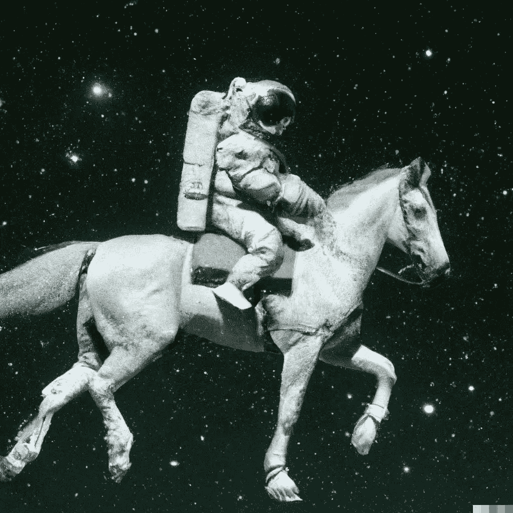

# OpenAI 的新 DALL-E 2 可以画任何你想画的东西

> 原文：<https://medium.com/mlearning-ai/openais-new-dall-e-2-can-paint-anything-you-want-4b8d3309f5cb?source=collection_archive---------5----------------------->

“An astronaut riding a horse in photorealistic style” — Image from [OpenAI](https://openai.com/dall-e-2/)

OpenAI Dall-E 是一个人工智能程序，它从文本描述中创建图像，于 2021 年初揭示。它使用 GPT-3 变压器模型的 120 亿参数训练版本来解释自然语言输入并生成相应的图像。

看看人工智能用这个提示生成了什么。

> 一碗汤是…