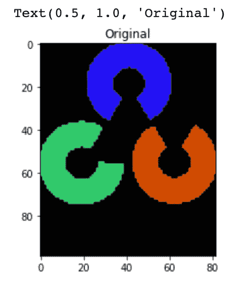
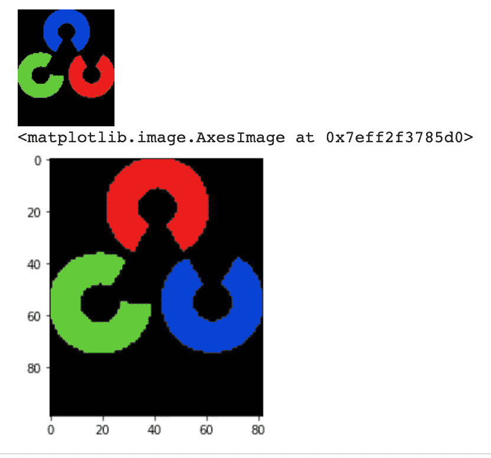
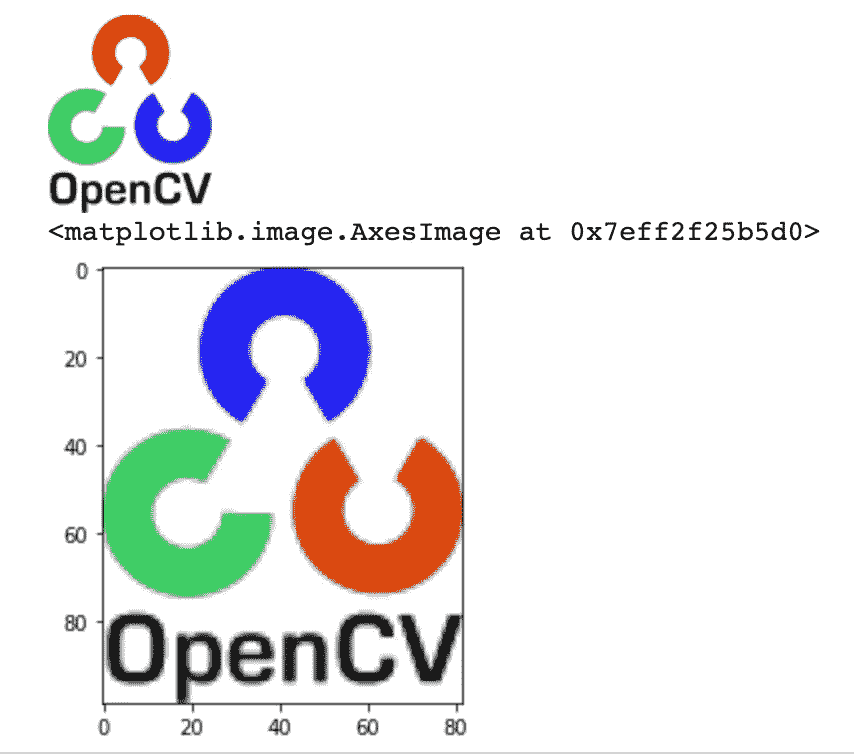
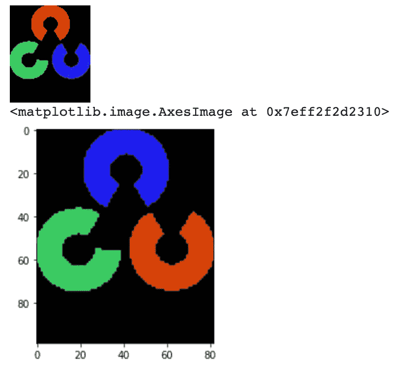
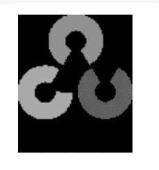
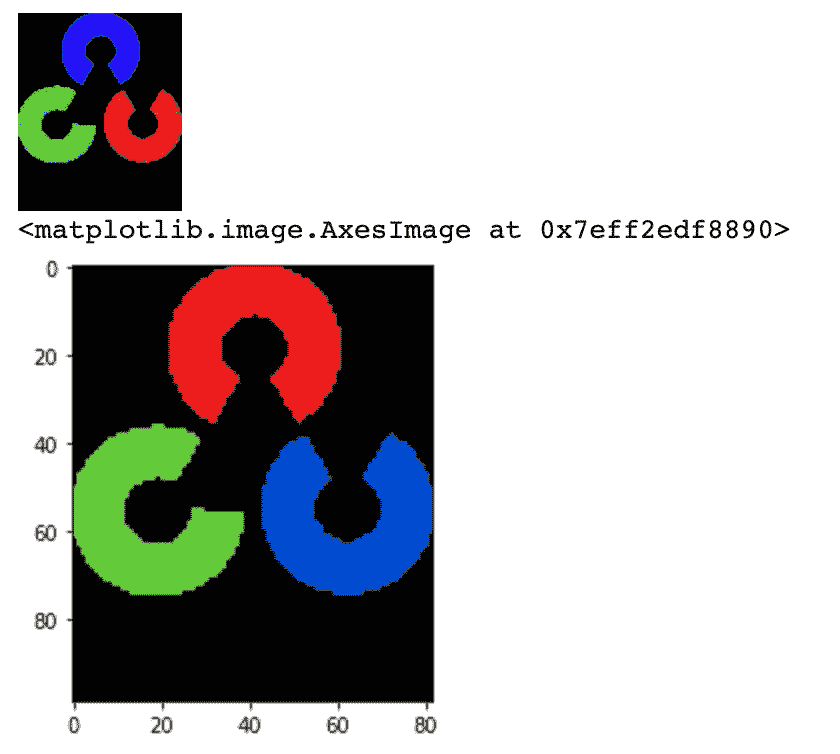

# OpenCV-颜色在 BGR 的顺序你一定知道

> 原文：<https://medium.com/mlearning-ai/opencv-color-in-bgr-order-you-must-know-53470396d18c?source=collection_archive---------2----------------------->

想玩玩代码吗？[链接](https://github.com/SueGK/Courses/blob/main/pyimagesearch-opencv-17-day-course/OpenCV-Mynotes/opencv_BGR_color.ipynb)

```
import os
import numpy as np
import argparse
import cv2
import matplotlib.pyplot as plt
```

原图是这样的:


OpenCV 假设图像处于 BGR 通道顺序。OpenCV imread、imwrite 和 imshow 都使用 BGR 顺序，所以如果我们使用 cv2.imshow 来显示图像，图像不会改变。但在 matplotlib 上不起作用。

大多数图像处理库使用 RGB 排序，如 matplotlib，所以如果使用`plt.imshow`，标志的颜色会改变。

```
img = cv2.imread("logo.png")# show the image by cv2
# The cv2.imshow() and cv.imshow() functions from the opencv-python package are incompatible with Jupyter notebook; 
# see https://github.com/jupyter/notebook/issues/3935\. 
# As a replacement, you can use the following function:
from google.colab.patches import cv2_imshow
cv2_imshow(img)
```


```
# show the image by matplotlib
plt.subplot(111)
plt.imshow(img)
plt.title("Original")
```



如果我们想在 OpenCV 中以 RGB 顺序读取图像，我们可以使用:

`img = cv2.cvtColor(img, cv2.COLOR_BGR2RGB)`

```
# read images in RGB order in OpenCV
img_rgb = cv2.cvtColor(img, cv2.COLOR_BGR2RGB)
from google.colab.patches import cv2_imshow
cv2_imshow(img_rgb)
plt.imshow(img_rgb)
```



**cv2.imread(文件名，标志)**

有一些标志:

**cv2。IMREAD_UNCHANGED:** 从源(带 alpha 通道)按原样读取图像。如果源图像是 RGB，它将图像加载到具有红色、绿色和蓝色通道的数组中。

**cv2。IMREAD_COLOR:** 将图像转换为 3 通道 BGR 彩色图像，但不转换为透明通道

**cv2。im read _ gray:**将图像转换为单通道灰度图像

查看更多标志: [OpenCV:用于图像文件读写的标志](https://docs.opencv.org/3.4/d8/d6a/group__imgcodecs__flags.html#ga61d9b0126a3e57d9277ac48327799c80)

```
img = cv2.imread('logo.png', cv2.IMREAD_UNCHANGED)
cv2_imshow(img)
plt.imshow(img)
```



```
img = cv2.imread('logo.png', cv2.IMREAD_COLOR)
cv2_imshow(img)
plt.imshow(img)
```



```
​img = cv2.imread('logo.png', cv2.IMREAD_GRAYSCALE)
cv2_imshow(img)
```



让我们看看 BGR 频道。如果我们想打印整个数组，那么设置`np.set_printoptions(threshold=np.inf)`并在打印完数组后将其设置回默认值。`np.set_printoptions(threshold=1000`

```
img = cv2.imread('logo.png', cv2.IMREAD_COLOR)
cv2_imshow(img)
b = img[:,:,0] # get blue channel
g = img[:,:,1] # get green channel
r = img[:,:,2] # get red channel

print(b)
```


```
np.set_printoptions(threshold=np.inf)
print(b)
np.set_printoptions(threshold=1000)# the output is really long so I won't print it here.
```

现在让我们将其转换为 **RGB** 通道。即使我们以 RGB 顺序读取图像，但如果我们使用`cv2.imshow`显示图像，标志颜色会改变，因为它与 **BGR** 顺序配合使用。`plt.imshow`显示图像的原始颜色，因为它也适用于 **RGB** 顺序。

```
# read images in RGB order in OpenCV
img_rgb = cv2.cvtColor(img, cv2.COLOR_BGR2RGB)
from google.colab.patches import cv2_imshow
cv2_imshow(img_rgb)
plt.imshow(img_rgb)
```



```
r1 = img_rgb[:,:,0] # get blue channel
g1 = img_rgb[:,:,1] # get green channel
b1 = img_rgb[:,:,2] # get red channel(img[:,:,0] == img_rgb[:,:,2]).all()Output: True
```

当你试图在 OpenCV 中绘制一个矩形框时，注意矩形的颜色也是按照 **BGR** 的顺序。

```
# read the image
image = cv2.imread('logo.png')

# represents the top left corner of rectangle
start_point = (5, 5)

# represents the bottom right corner of rectangle
end_point = (20, 20)

# choose the rectangle color in BGR
color = (0, 0, 255) # red

# thickness of lines that make up the rectangle is 2 px
thickness = 2

# draw a rectangle with red line borders of thickness of 2 px
image = cv2.rectangle(image, start_point, end_point, color, thickness)

# Displaying the image 
cv2_imshow(image)
```

[](/mlearning-ai/mlearning-ai-submission-suggestions-b51e2b130bfb) [## Mlearning.ai 提交建议

### 如何成为 Mlearning.ai 上的作家

medium.com](/mlearning-ai/mlearning-ai-submission-suggestions-b51e2b130bfb)