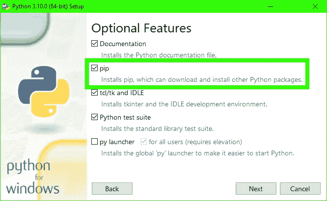
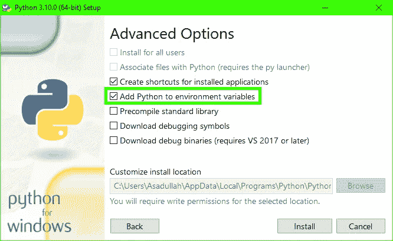
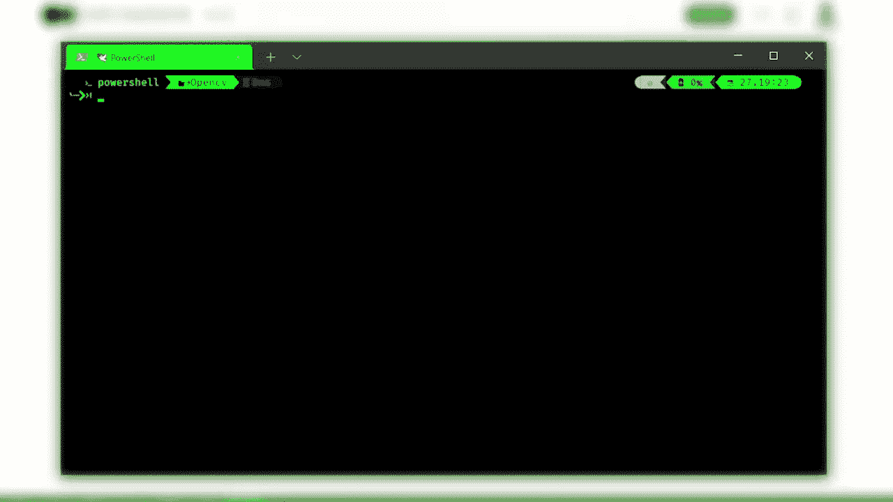
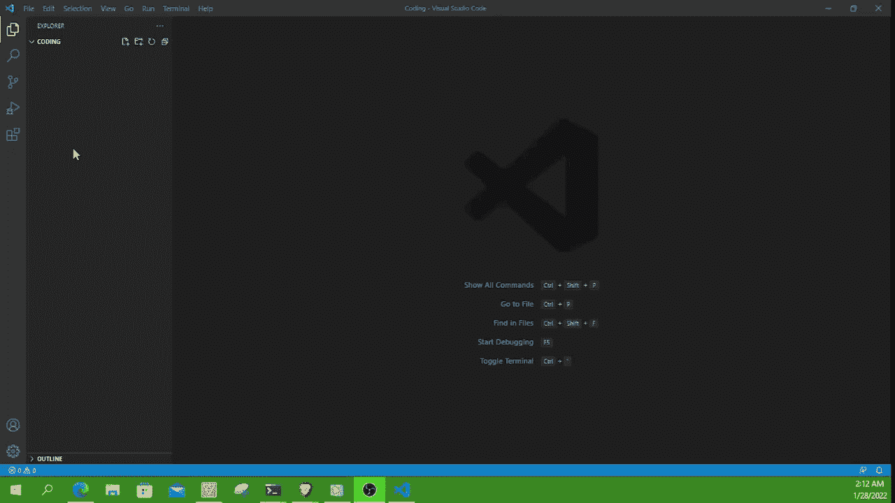
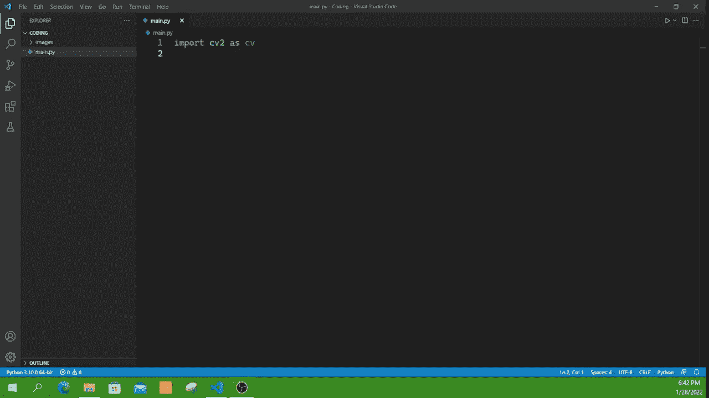
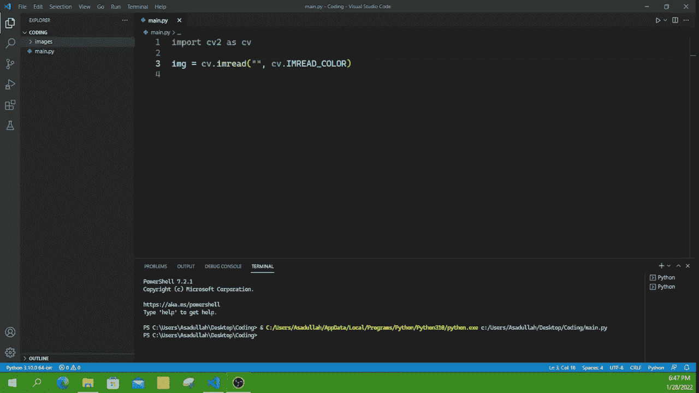
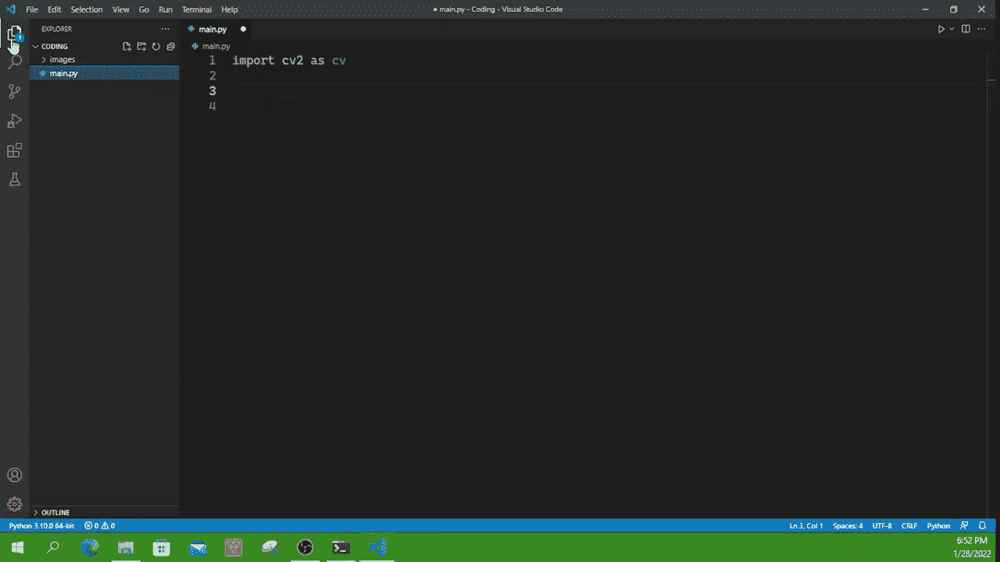
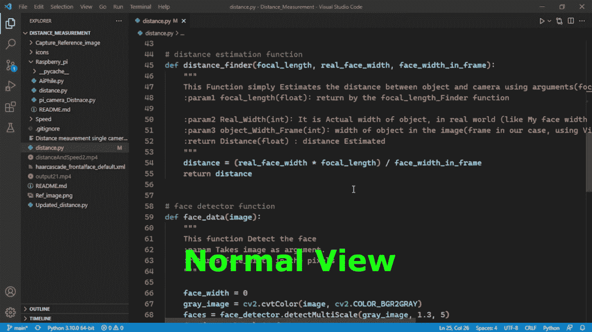

# 为 OpenCV Python 设置 Visual Studio 代码

> 原文：<https://medium.com/mlearning-ai/opencv-python-devemplement-environment-with-vs-code-afaf148843e3?source=collection_archive---------0----------------------->

> 如何在，Visual Studio 代码中设置 OpenCV python 的开发环境？我们将在这里讨论什么是开始做事情所需要的工具，我的一些小技巧，能让事情变得更容易和更快的窍门。

## 关于 OpenCV 的一点

OpenCV 是一个开源库，它包含超过 2500 种计算机视觉和机器学习算法，支持 Python、C++、Java、JavaScript 等语言。因为它是最著名的计算机视觉库之一，你会从 OpenCV 开发社区找到很多资源和指导，在这里可以找到来自 [***的 OpenCV 教程，阅读文档***](https://opencv24-python-tutorials.readthedocs.io/en/latest/py_tutorials/py_gui/py_table_of_contents_gui/py_table_of_contents_gui.html) ，开始使用。

## 要求

1.  计算机编程语言
2.  Opencv-python
3.  Visual Studio 代码

# 装置

## Python (python 解释器)

首先，你需要 python，你可以从[官方网站](https://www.python.org/downloads/)得到这个如果你在 windows 上，但是对于 mac🍎或者 Linux🐧你，可能已经有了，确保 python 的⚠版本必须高于 3.6，这是强烈推荐的。

在 Windows 上安装 python 时，请确保安装 PIP(Python 包管理器)并添加环境变量的路径，这样 PIP 将允许从互联网下载和安装不同的包(模块)，如 OpenCV-python、NumPy、pygame 等。

只需在安装 Python 时勾选✅的 pip 框，这是包含在可选功能中的。



install PIP Screenshot

Linux 的 Pip 安装🐧

```
sudo apt install python3-pip python-dev
```

将 Path Python 添加到环境变量中，以便您的计算机能够识别它，以及 Visual Studio 代码。



Adding Path to environment Variables

现在您已经完成了 Python 的安装。

## 用 PIP 安装包(库)

现在非常简单，只需打开终端并键入 ***pip 安装包-名称***

```
pip install opencv-contrib-python
```



Installation Opencv python

# Visual Studio 代码(Vs 代码)

Visual studio 代码是一个简单的文本(代码)编辑器，由在线(Vs 代码市场)可用的扩展提供支持，其中大部分是免费和开源的。

Vs 代码附带 Git 源代码控制、调试器和扩展管理器，更多[官方指南 Vs 代码](https://code.visualstudio.com/docs/python/python-tutorial)，

## 要求

1.  Python 解释器(之前安装的)
2.  Python 扩展
3.  挂架延伸
4.  路径智能感知
5.  Visual Studio 智能代码

可用于 Linux 的 VS 代码🐧，mac🍎而 Windows，[在这里](https://code.visualstudio.com/)下载，安装，对于每个 OS 都相当简单。

***在 Vs 上安装扩展代码***

下面是如何在 VS 代码中安装扩展。



Extension Installation

当你进行 python 扩展时，默认情况下其他扩展也被安装， **Pylance** 和 **Jupyter，Pylance** 为 Python 代码提供了智能感知体验和丰富的类型信息，这对编写更好更快的代码有很大帮助。你会看到在下一个 GIF 中， **Jupyter** 扩展允许在 VS 代码中使用 Jupyter 笔记本。

**通孔**

Pylance 提供了很多帮助，显示文档，比如参数、标志、函数，这将有助于编写更快的代码，如图所示👇



Pylance

***路径智能感知***

该扩展增加了抓取文件更容易的功能，而不是键入它，它为文件产生智能感知📁路径，如图所示👇



Path Intellisense

***Visual Studio IntelliCode***

这个扩展是你最近使用的 favourite(star⭐)the 功能，当你工作的时候可以在顶部看到它们。显示👇



*Visual Studio IntelliCode*

## Raspberry Pi 开发者

如果你是一个使用 ***树莓派*** 的人，那么我强烈推荐你安装 [**远程开发**](https://marketplace.visualstudio.com/items?itemName=ms-vscode-remote.vscode-remote-extensionpack) 扩展，它是一个多扩展包，其中一个 [***远程 SSH 扩展***](https://code.visualstudio.com/docs/remote/ssh?WT.mc_id=academic-11397-jabenn)*这个扩展允许你通过 SSH 连接到一个远程设备，并运行 VS 代码，就像你在那个远程设备上运行一样您可以看到远程文件系统，VS 代码终端在远程设备上运行，并且您可以访问远程设备的硬件。当你在调试时，调试会话在远程设备上运行，但是 VS 代码在主机上运行，但是当你使用 OpenCV 时有一个问题，因为当你使用 Opencv 窗口显示图像时，SSH 不允许显示(查看)窗口，但是我仍然喜欢在 Pi ❤上工作*

*这里是 VS 代码键盘快捷键， [**PDF 文件**](https://code.visualstudio.com/shortcuts/keyboard-shortcuts-windows.pdf) 。*

*最后要提到的是，喜欢在一个干净的环境中工作，我的意思是喜欢，不希望看到这些 GUI 菜单到处出现，然后在 VS 代码中用 **Zen 模式** (CRT + K Z)来避免*

**

*Zend Mode*

*vs 代码的所有设置都存储在一个 JSON 文件中，我在这里使用的是 settings.json*

****遗言****

*我们正在进行 python、OpenCV 和 VS 代码的安装，我们已经废弃了一些重要的扩展，这对于在 VS 代码中进行 python 开发非常重要，如果你认为我错过了什么，请在评论中提及。*

*这里有一个视频教程，你也可以看看。*

*Video Tutorial*

# *参考:*

*[](https://opencv24-python-tutorials.readthedocs.io/en/latest/py_tutorials/py_gui/py_table_of_contents_gui/py_table_of_contents_gui.html) [## OpenCV - OpenCV-Python 教程 beta 文档中的 Gui 特性

### 编辑描述

opencv 24-python-tutorials . readthedocs . io](https://opencv24-python-tutorials.readthedocs.io/en/latest/py_tutorials/py_gui/py_table_of_contents_gui/py_table_of_contents_gui.html) [](https://code.visualstudio.com/docs/python/python-tutorial) [## Visual Studio 代码 Python 入门教程

### 在本教程中，您将使用 Python 3 在 Visual Studio 代码中创建最简单的 Python“Hello World”应用程序。由…

code.visualstudio.com](https://code.visualstudio.com/docs/python/python-tutorial) [](/mlearning-ai/mlearning-ai-submission-suggestions-b51e2b130bfb) [## Mlearning.ai 提交建议

### 如何成为 Mlearning.ai 上的作家

medium.com](/mlearning-ai/mlearning-ai-submission-suggestions-b51e2b130bfb)*