# 利用步行交通数据开设供室内使用的咖啡馆

> 原文：<https://medium.com/mlearning-ai/opening-cafes-for-indoor-use-using-foot-traffic-data-d62562f0655f?source=collection_archive---------4----------------------->

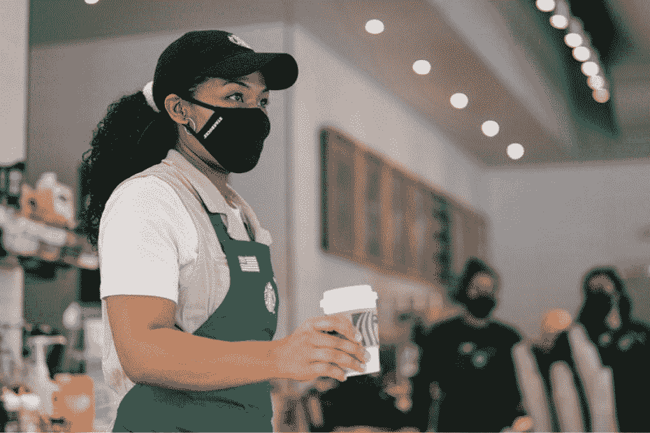

最初开门后，利润可能会增加 300%，而客户和员工都可能会因为不再需要通过尴尬的开门来谈判交易而感到宽慰。但是重新培训员工、补充库存和准备室内使用的空间是昂贵的:时间、金钱和耐心都是可以考验的。

因此，在 2021 年年中，当务之急是确定哪些零售和食品场所最适合提供 Grab N' Go 室内服务，哪些可以暂时不对公众开放。对于在曼哈顿拥有 240 多家分店的星巴克来说，这个问题至关重要。

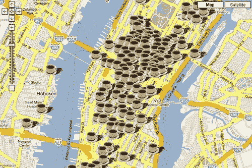

这就是为什么我选择使用纽约地铁系统的客流量数据来确定哪些曼哈顿地铁站 1)整体客流量更大，以及 2)客流量恢复增长更大，以便专注于可能直接受益于再次乘坐地铁的人数增加的星巴克地点。

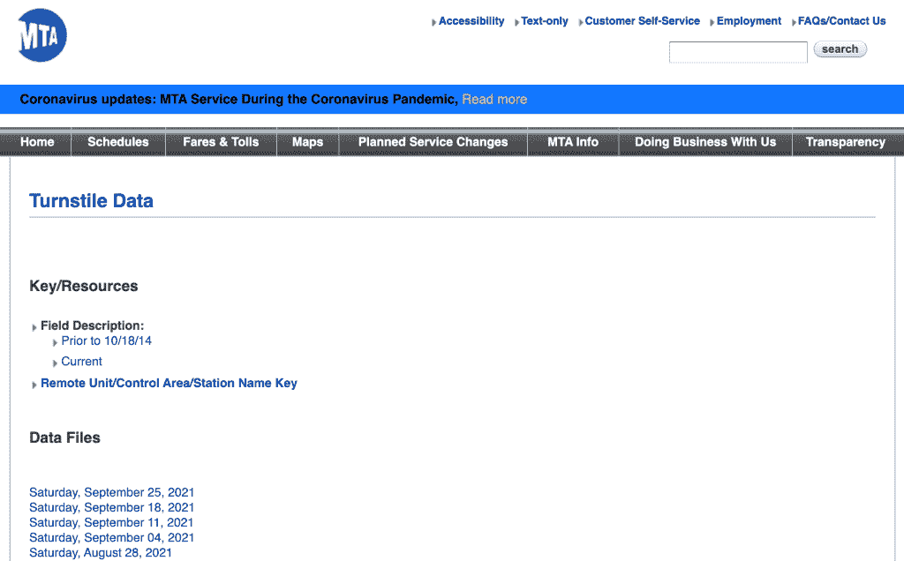

数据是从纽约开放数据项目收集的，该项目每周从 MTA 网络的每个站点上传步行交通数据。

出于本项目的目的，我们需要截至该日期的所有 2021 年交通数据，以及同期的相应 2019 年交通数据。

这些数据非常杂乱，在用于模拟当前交通模式并与前几年进行比较之前，需要进行相当多的清理。

在发现的错误中，有一个计数器在倒数通过十字转门的人数，而不是在向上计数，以及需要在每个车站的基础上调查缺失数据的缺口。

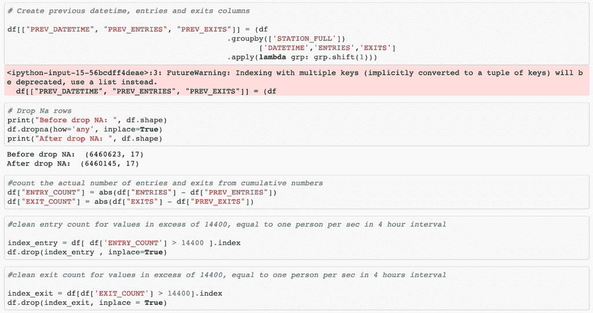

使用 python 的 datetime 函数从每日交通模式行中生成每周时间窗，通过从时间窗结束时的累积十字转门计数器数字中减去时间窗开始时的累积十字转门计数器数字来生成步行交通数据。

相同的清理模式可应用于 2019 年和 2021 年的交通数据，并对交通模式中的异常进行了调查。

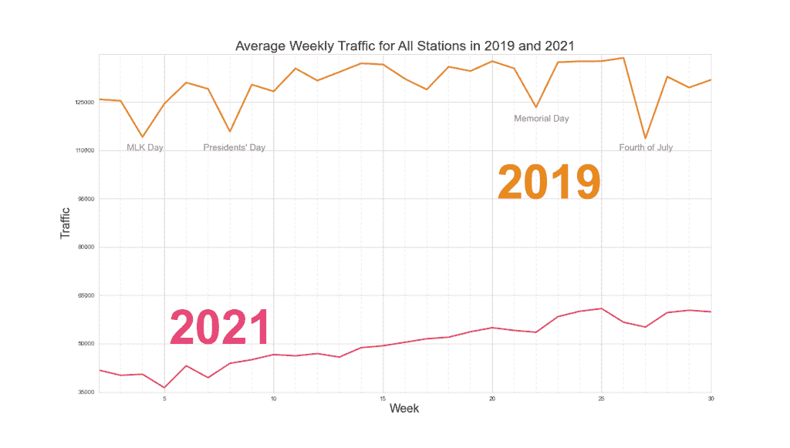

2019 年与 2021 年在同一周内的流量对比显示了 Covid 对纽约的打击有多严重。虽然在相同的假期前后，两个时间段的流量都出现了相同的下降，但 2021 年的流量明显低于疫情之前的水平。

确定我选择用来比较数据的第一个指标，即特定车站的更大交通量，相当简单:2021 年的交通趋势向我们显示了今年哪些车站的表现高于曼哈顿所有车站的平均水平。

我首先取了 2021 年的平均值，然后确定了 MTA 网络中所有站点交通量排名前 10 的站点。

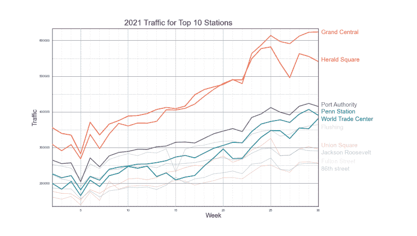

对于第二个指标，更大的流量恢复，我选择根据恢复的百分比比较 2021 年和 2019 年的流量模式。

我将每个车站的当前流量与 2019 年相同车站的客流量进行了比较。我们的想法是，最终，所有电视台都将在疫情之前以 100%或接近 100%的流量运行，但目前，我们希望找出与其他电视台相比更接近 100%恢复的电视台，尤其是我们网络中表现最好的电视台。

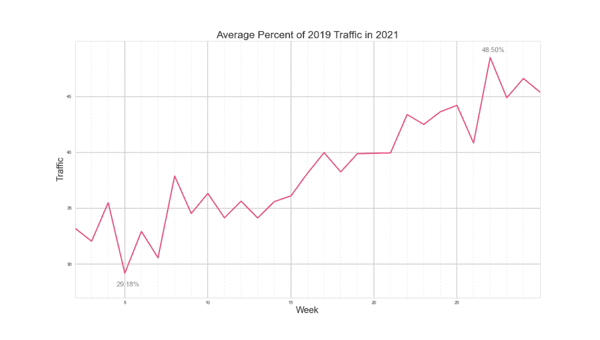

取 MTA 网络中所有站点的平均值，我发现在这个时间点，平均百分比恢复率目前为 48.5%，高于年初的 29.18%。我们要完全恢复还有很长的路要走。

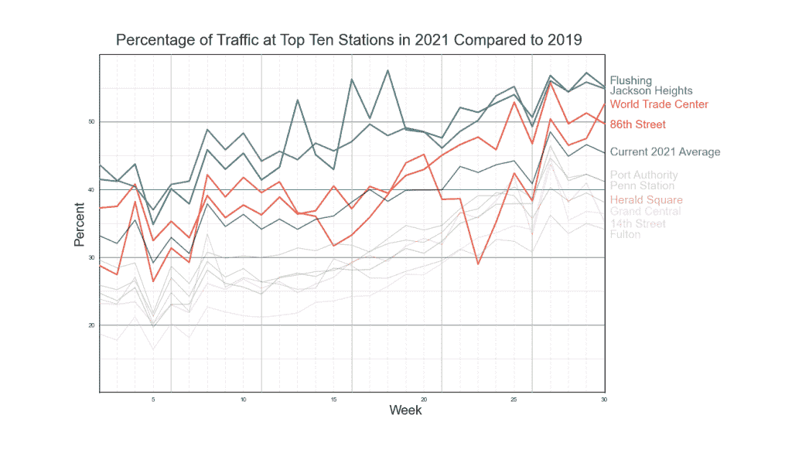

在运量表现最好的车站中，有四个车站在交通恢复方面的表现高于平均水平，目前只有一个车站表现出上升趋势——世贸中心站。

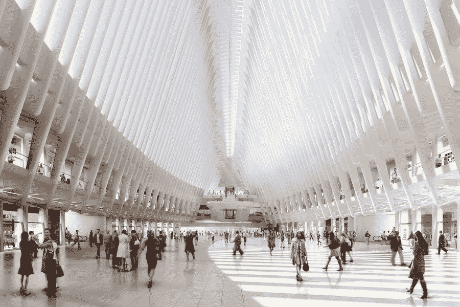

这是纽约最新的车站，是对一段艰难过去的纪念，即将迎来一个重大的周年纪念，也是曼哈顿的金融办公中心。这种上升趋势是有道理的。

在该地区开设星巴克门店以获取 N' Go 室内订单也是有意义的，因为我们在该地区有最大的投资回报机会。

通过使用 Google API 查找每个 MTA 站点的纬度和经度坐标，我们可以调用与我们排名前十的站点直接相邻的星巴克位置列表，然后根据交通优先级对它们进行排序。

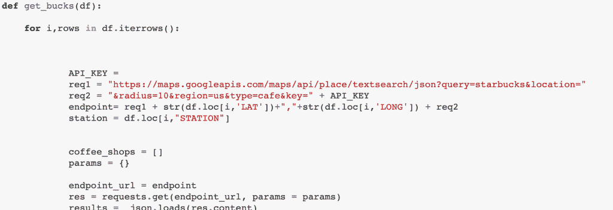

不幸的是，Google API 并没有给出我们所需要的精确的搜索结果。我希望星巴克的位置在任何一个车站的 4 个街区左右的范围内，但是 Google API 返回十个街区半径内的星巴克位置，而不管原始 API 调用中的半径指令。

因此，在接收到每个车站的星巴克位置列表后，对从 Google API 接收的星巴克位置列表执行 KDTree 搜索，并且保存了与每个 MTA 车站最近的前 3 个位置。

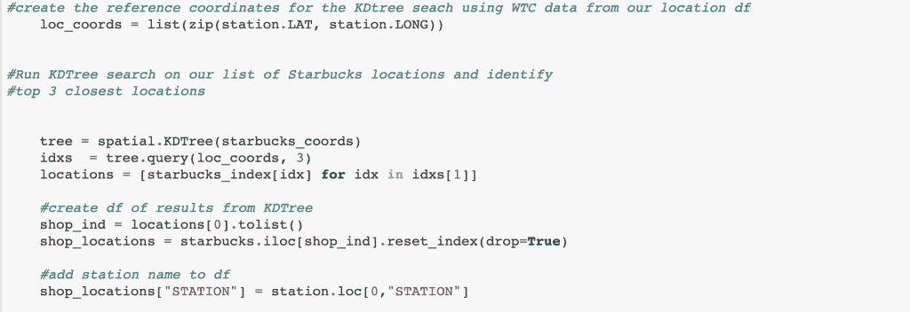

最后，星巴克的位置列表根据客流量和客流量的恢复情况进行排序，优先考虑那些在这两个领域都有前景的站点。然后，这个最高优先级列表被可视化在曼哈顿的地图上，每个点都标识了其打开 Grab N' Go 的优先级。

现在我们准备提供一些咖啡。

在我的 [GitHub](https://github.com/CeliaSagas) 上查看完整的项目和代码[这里](https://github.com/CeliaSagas/Coffee-Time)。

【https://celiasagastume.com】最初发表于**。**